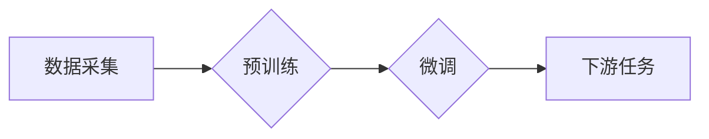

> 基础模型、技术标准、规范、可解释性、可控性、可扩展性、安全、隐私、伦理

## 1. 背景介绍

基础模型（Foundation Model）近年来成为人工智能领域的研究热点，其强大的泛化能力和适应性使其在自然语言处理、计算机视觉、语音识别等多个领域取得了突破性进展。然而，随着基础模型规模的不断扩大和应用场景的不断拓展，其技术标准和规范的缺失也日益凸显。缺乏统一的标准和规范，将导致基础模型的互操作性差、可复现性低、安全性和隐私性难以保障，从而阻碍基础模型的健康发展和广泛应用。

## 2. 核心概念与联系

基础模型是指在海量数据上预训练的强大通用模型，能够在多种下游任务中进行微调，并取得优异的性能。其核心概念包括：

* **预训练:** 基于大量无标注数据进行训练，学习到通用的语言表示或特征。
* **泛化能力:**  能够在不同任务和领域中表现良好，无需针对性地进行训练。
* **可微调性:**  能够根据特定任务进行微调，提升在该任务上的性能。

基础模型的架构通常基于深度学习，例如 Transformer、BERT、GPT 等。这些模型通过多层神经网络结构，学习到复杂的语义表示和关系。

**Mermaid 流程图:**



## 3. 核心算法原理 & 具体操作步骤

### 3.1  算法原理概述

基础模型的训练主要基于自监督学习和迁移学习的原理。

* **自监督学习:** 通过设计特殊的预训练任务，例如语言建模、掩码语言模型等，从无标注数据中学习到语言的结构和语义。
* **迁移学习:** 将预训练模型在特定任务上进行微调，利用预先学习到的知识提升任务的性能。

### 3.2  算法步骤详解

1. **数据预处理:** 收集海量文本数据，进行清洗、分词、词向量化等预处理操作。
2. **模型选择:** 选择合适的深度学习模型架构，例如 Transformer、BERT 等。
3. **预训练:** 使用自监督学习任务，在预处理后的数据上训练模型，学习到通用的语言表示。
4. **微调:** 将预训练模型在特定下游任务上进行微调，调整模型参数，提升在该任务上的性能。
5. **评估:** 使用测试集评估模型的性能，并根据结果进行模型优化和调整。

### 3.3  算法优缺点

**优点:**

* 强大的泛化能力，能够在多种任务中取得优异的性能。
* 训练效率高，可以利用预训练模型进行快速微调。
* 能够学习到复杂的语义表示和关系。

**缺点:**

* 训练成本高，需要海量数据和强大的计算资源。
* 模型规模大，部署和推理成本较高。
* 缺乏可解释性，难以理解模型的决策过程。

### 3.4  算法应用领域

基础模型在自然语言处理、计算机视觉、语音识别、机器翻译、问答系统等多个领域都有广泛的应用。

## 4. 数学模型和公式 & 详细讲解 & 举例说明

### 4.1  数学模型构建

基础模型的训练通常基于最大似然估计（Maximum Likelihood Estimation，MLE）的原理。目标函数是模型输出与真实标签之间的差异，通过优化目标函数，使得模型能够更好地预测真实标签。

### 4.2  公式推导过程

假设模型输出为 $p(y|x)$，真实标签为 $y$，输入为 $x$。则目标函数为：

$$
\mathcal{L} = -\sum_{i=1}^{N} \log p(y_i|x_i)
$$

其中 $N$ 为样本数量。

通过优化目标函数，使得模型输出与真实标签之间的差异最小化。

### 4.3  案例分析与讲解

例如，在语言建模任务中，模型需要预测下一个词。假设模型输出每个词的概率为 $p(w_t|w_{1:t-1})$，其中 $w_t$ 为预测的词，$w_{1:t-1}$ 为前 $t-1$ 个词。则目标函数为：

$$
\mathcal{L} = -\sum_{t=1}^{T} \log p(w_t|w_{1:t-1})
$$

其中 $T$ 为句子长度。

通过优化目标函数，使得模型能够更好地预测下一个词。

## 5. 项目实践：代码实例和详细解释说明

### 5.1  开发环境搭建

使用 Python 语言和深度学习框架 TensorFlow 或 PyTorch 进行开发。

### 5.2  源代码详细实现

```python
# 使用 TensorFlow 框架进行基础模型训练

import tensorflow as tf

# 定义模型架构
model = tf.keras.Sequential([
    tf.keras.layers.Embedding(vocab_size, embedding_dim),
    tf.keras.layers.LSTM(units),
    tf.keras.layers.Dense(vocab_size, activation='softmax')
])

# 定义损失函数和优化器
loss_fn = tf.keras.losses.SparseCategoricalCrossentropy()
optimizer = tf.keras.optimizers.Adam()

# 训练模型
model.compile(loss=loss_fn, optimizer=optimizer)
model.fit(train_data, epochs=num_epochs)

# 微调模型
model.fit(task_specific_data, epochs=num_epochs)
```

### 5.3  代码解读与分析

* 代码首先定义了模型架构，包括嵌入层、LSTM 层和全连接层。
* 然后定义了损失函数和优化器，用于训练模型。
* 接着使用 `model.fit()` 方法训练模型，并使用 `task_specific_data` 进行微调。

### 5.4  运行结果展示

训练完成后，可以使用测试集评估模型的性能，例如计算准确率、困惑度等指标。

## 6. 实际应用场景

基础模型在多个领域都有广泛的应用，例如：

* **自然语言处理:** 文本分类、情感分析、机器翻译、问答系统等。
* **计算机视觉:** 图像识别、物体检测、图像生成等。
* **语音识别:** 语音转文本、语音合成等。

### 6.4  未来应用展望

随着基础模型的不断发展，其应用场景将更加广泛，例如：

* **个性化推荐:** 基于用户行为和偏好，提供个性化的商品推荐、内容推荐等。
* **自动驾驶:** 基于图像和传感器数据，实现自动驾驶功能。
* **医疗诊断:** 基于病历和医学图像，辅助医生进行诊断。

## 7. 工具和资源推荐

### 7.1  学习资源推荐

* **书籍:**
    * 《深度学习》
    * 《自然语言处理》
* **在线课程:**
    * Coursera
    * edX
* **博客和论坛:**
    * TensorFlow Blog
    * PyTorch Forum

### 7.2  开发工具推荐

* **深度学习框架:** TensorFlow, PyTorch
* **编程语言:** Python
* **云计算平台:** AWS, Azure, GCP

### 7.3  相关论文推荐

* BERT: Pre-training of Deep Bidirectional Transformers for Language Understanding
* GPT-3: Language Models are Few-Shot Learners
* DALL-E: Creating Images from Text

## 8. 总结：未来发展趋势与挑战

### 8.1  研究成果总结

基础模型在人工智能领域取得了显著的进展，其强大的泛化能力和适应性使其在多个领域取得了突破性进展。

### 8.2  未来发展趋势

* **模型规模的进一步扩大:** 随着计算资源的不断提升，基础模型的规模将进一步扩大，从而提升其性能。
* **多模态学习:** 将文本、图像、音频等多种模态数据融合在一起，训练更强大的多模态基础模型。
* **可解释性和可控性:** 研究基础模型的决策过程，提高其可解释性和可控性。

### 8.3  面临的挑战

* **数据安全和隐私:** 基础模型的训练需要海量数据，如何保障数据安全和隐私是一个重要的挑战。
* **模型偏见和公平性:** 基础模型可能存在偏见和不公平性，需要研究如何 mitigate 这些问题。
* **伦理问题:** 基础模型的应用可能带来伦理问题，例如自动决策、深度伪造等，需要进行深入的伦理探讨。

### 8.4  研究展望

未来，基础模型的研究将更加注重可解释性、可控性和伦理问题，并朝着更安全、更公平、更可持续的方向发展。

## 9. 附录：常见问题与解答

* **Q1: 基础模型的训练成本很高吗？**

* **A1:** 是的，基础模型的训练成本很高，需要海量数据和强大的计算资源。

* **Q2: 如何评估基础模型的性能？**

* **A2:** 可以使用测试集评估模型的性能，例如计算准确率、困惑度等指标。

* **Q3: 基础模型的应用场景有哪些？**

* **A3:** 基础模型在自然语言处理、计算机视觉、语音识别等多个领域都有广泛的应用。


作者：禅与计算机程序设计艺术 / Zen and the Art of Computer Programming 
<end_of_turn>