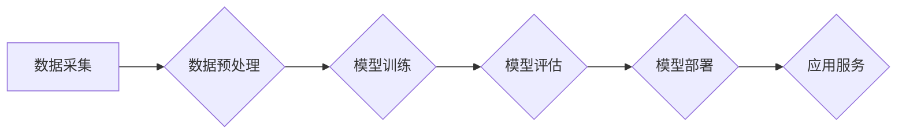

> 大模型、人工智能、自然语言处理、计算机视觉、机器学习、深度学习、应用场景

## 1. 背景介绍

近年来，人工智能（AI）技术取得了飞速发展，其中大模型作为AI领域的重要突破口，展现出强大的学习和推理能力，正在深刻地改变着我们生活和工作方式。大模型是指参数规模庞大、训练数据海量的人工智能模型，其强大的能力使其能够处理复杂的任务，并生成高质量的输出。

大模型的出现，标志着人工智能技术迈入了一个新的时代。与传统机器学习模型相比，大模型具有以下显著优势：

* **更强的泛化能力:** 大模型通过学习海量数据，能够更好地理解和概括数据中的规律，从而在面对新的数据时也能表现出较好的预测和处理能力。
* **更丰富的表达能力:** 大模型拥有更复杂的结构和更多的参数，能够学习和表达更丰富的知识和信息。
* **更强的适应性:** 大模型可以根据不同的任务和场景进行微调，从而适应不同的应用需求。

## 2. 核心概念与联系

大模型的核心概念包括：

* **深度学习:** 大模型的训练基于深度学习算法，通过多层神经网络结构，学习数据中的复杂特征。
* **Transformer:** Transformer是一种新型的神经网络架构，其自注意力机制能够有效地捕捉文本中的长距离依赖关系，是构建大模型的关键技术之一。
* **预训练:** 大模型通常采用预训练的方式进行训练，即先在大量通用数据上进行预训练，然后在特定任务数据上进行微调。

**大模型架构流程图:**

## 3. 核心算法原理 & 具体操作步骤

### 3.1  算法原理概述

大模型的训练主要基于深度学习算法，其中Transformer架构是目前最流行的模型架构之一。Transformer模型的核心是自注意力机制，它能够有效地捕捉文本中的长距离依赖关系，从而提高模型的理解和生成能力。

### 3.2  算法步骤详解

大模型的训练过程可以概括为以下步骤：

1. **数据采集和预处理:** 收集大量文本数据，并进行清洗、格式化等预处理操作。
2. **模型构建:** 根据任务需求选择合适的模型架构，例如Transformer模型。
3. **模型训练:** 使用训练数据训练模型，通过反向传播算法不断调整模型参数，使模型的预测结果与真实值尽可能接近。
4. **模型评估:** 使用测试数据评估模型的性能，例如准确率、召回率等指标。
5. **模型部署:** 将训练好的模型部署到服务器或云平台，以便进行实际应用。

### 3.3  算法优缺点

**优点:**

* 强大的泛化能力
* 丰富的表达能力
* 较强的适应性

**缺点:**

* 训练成本高
* 硬件资源要求高
* 训练时间长

### 3.4  算法应用领域

大模型在各个领域都有广泛的应用，例如：

* **自然语言处理:** 文本生成、机器翻译、问答系统、情感分析等。
* **计算机视觉:** 图像识别、物体检测、图像生成等。
* **语音识别:** 语音转文本、语音合成等。
* **推荐系统:** 商品推荐、内容推荐等。

## 4. 数学模型和公式 & 详细讲解 & 举例说明

### 4.1  数学模型构建

大模型的训练过程本质上是一个优化问题，目标是找到模型参数，使得模型的预测结果与真实值之间的误差最小。常用的损失函数包括交叉熵损失函数、均方误差损失函数等。

### 4.2  公式推导过程

例如，对于文本分类任务，可以使用交叉熵损失函数来衡量模型的预测结果与真实标签之间的差异。交叉熵损失函数的公式如下：

$$
L = -\sum_{i=1}^{N} y_i \log(\hat{y}_i)
$$

其中：

* $L$ 表示损失函数值
* $N$ 表示样本数量
* $y_i$ 表示真实标签
* $\hat{y}_i$ 表示模型预测的概率

### 4.3  案例分析与讲解

假设我们有一个文本分类任务，需要将文本分类为正类或负类。模型预测的概率为0.8，真实标签为正类。则损失函数值为：

$$
L = -1 \log(0.8) \approx 0.22
$$

## 5. 项目实践：代码实例和详细解释说明

### 5.1  开发环境搭建

大模型的开发环境通常需要强大的计算资源，例如GPU。可以使用云平台提供的GPU实例进行开发。

### 5.2  源代码详细实现

大模型的源代码通常开源，例如BERT、GPT等模型。可以使用这些开源代码进行修改和训练。

### 5.3  代码解读与分析

需要对模型的代码进行详细解读，理解模型的结构、参数和训练过程。

### 5.4  运行结果展示

训练完成后，需要对模型的运行结果进行展示和分析，例如准确率、召回率等指标。

## 6. 实际应用场景

大模型在各个领域都有广泛的应用场景，例如：

* **医疗领域:** 辅助诊断、药物研发、患者个性化治疗等。
* **金融领域:** 风险评估、欺诈检测、投资决策等。
* **教育领域:** 个性化学习、智能辅导、自动批改等。

### 6.4  未来应用展望

随着大模型技术的不断发展，其应用场景将更加广泛，例如：

* **智能客服:** 提供更加智能和人性化的客服服务。
* **自动写作:** 自动生成新闻报道、小说、诗歌等文本。
* **虚拟助手:** 提供更加智能和便捷的虚拟助手服务。

## 7. 工具和资源推荐

### 7.1  学习资源推荐

* **书籍:** 《深度学习》、《自然语言处理》
* **在线课程:** Coursera、edX、Udacity等平台提供深度学习和自然语言处理相关的课程。
* **开源项目:** TensorFlow、PyTorch、HuggingFace等开源项目提供大模型的代码和训练工具。

### 7.2  开发工具推荐

* **编程语言:** Python
* **深度学习框架:** TensorFlow、PyTorch
* **云平台:** AWS、Google Cloud、Azure等云平台提供GPU实例和大数据处理工具。

### 7.3  相关论文推荐

* **Attention Is All You Need:** https://arxiv.org/abs/1706.03762
* **BERT: Pre-training of Deep Bidirectional Transformers for Language Understanding:** https://arxiv.org/abs/1810.04805

## 8. 总结：未来发展趋势与挑战

### 8.1  研究成果总结

大模型技术取得了显著的进展，在各个领域都有广泛的应用。

### 8.2  未来发展趋势

* **模型规模进一步扩大:** 随着计算资源的不断提升，大模型的规模将进一步扩大，从而提升模型的性能。
* **多模态大模型:** 将文本、图像、音频等多种模态信息融合到一起，构建更加智能和全面的大模型。
* **可解释性增强:** 研究大模型的决策过程，提高模型的可解释性和透明度。

### 8.3  面临的挑战

* **训练成本高:** 大模型的训练成本非常高，需要大量的计算资源和时间。
* **数据安全和隐私:** 大模型的训练需要海量数据，如何保证数据安全和隐私是一个重要的挑战。
* **伦理问题:** 大模型的应用可能会带来一些伦理问题，例如算法偏见、信息操纵等。

### 8.4  研究展望

未来，大模型技术将继续发展，并应用于更多领域，为人类社会带来更多福祉。

## 9. 附录：常见问题与解答

### 9.1  常见问题

* **什么是大模型？**
* **大模型有哪些应用场景？**
* **如何训练大模型？**

### 9.2  解答

...

作者：禅与计算机程序设计艺术 / Zen and the Art of Computer Programming

<end_of_turn>