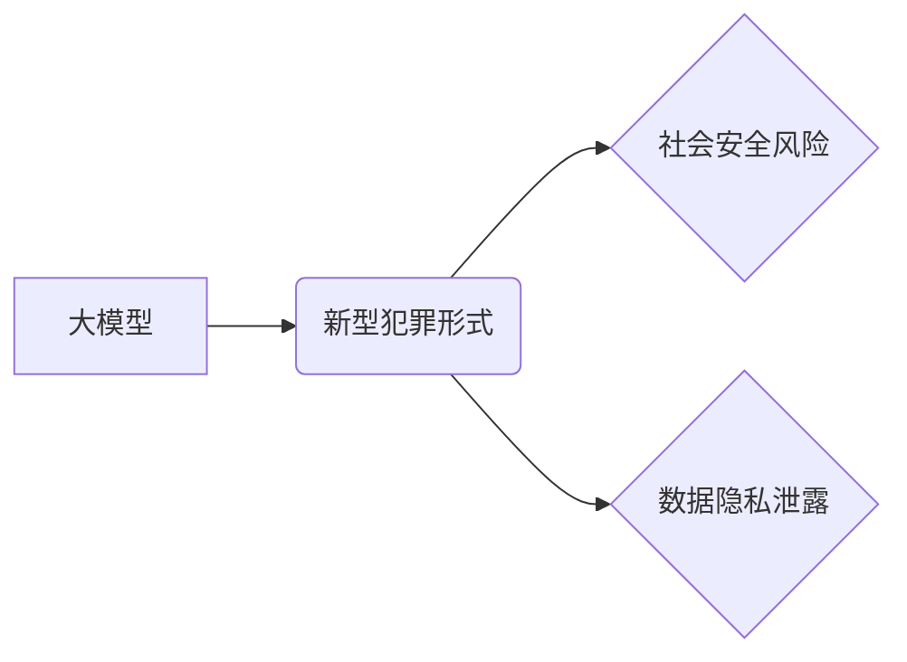

> 大模型、人工智能、新型犯罪、网络安全、数据隐私、法律法规、技术防控

## 1. 背景介绍

近年来，人工智能（AI）技术，特别是大模型的快速发展，为社会带来了前所未有的机遇和挑战。大模型凭借其强大的学习能力和泛化能力，在自然语言处理、图像识别、语音合成等领域取得了突破性进展，广泛应用于各个行业。然而，大模型的强大能力也为新型犯罪提供了新的工具和手段，给社会安全和数据隐私带来了新的威胁。

大模型时代，新型犯罪形式呈现出以下特点：

* **技术门槛降低:** 大模型的开源和易用性使得即使没有专业技术背景的人也能利用其进行犯罪活动。
* **攻击手段多样化:** 大模型可以被用于生成虚假信息、进行网络钓鱼攻击、操纵舆论、窃取个人信息等多种犯罪行为。
* **攻击范围广泛:** 大模型的应用场景广泛，其带来的安全风险也涵盖了各个领域，包括金融、医疗、教育、政府等。
* **溯源难度高:** 大模型生成的虚假信息难以识别，犯罪行为的溯源和追责难度加大。

## 2. 核心概念与联系

**2.1 大模型概述**

大模型是指参数量巨大、训练数据海量的人工智能模型。其强大的学习能力和泛化能力使其能够在各种任务中表现出色。常见的代表性大模型包括GPT-3、BERT、LaMDA等。

**2.2 新型犯罪形式**

新型犯罪是指利用新兴技术手段，采取新的犯罪模式和手段，对社会造成新的危害的犯罪行为。大模型时代，新型犯罪形式包括但不限于：

* **深度伪造:** 利用大模型生成逼真的虚假图像、视频、音频等，用于欺诈、散播谣言、破坏社会稳定等。
* **网络钓鱼攻击:** 利用大模型生成个性化邮件、短信等，诱骗用户泄露个人信息。
* **舆论操纵:** 利用大模型生成大量虚假信息，进行舆论引导和操控。
* **智能犯罪:** 利用大模型自动执行犯罪行为，例如自动交易、自动刷单等。

**2.3 核心概念关系图**



## 3. 核心算法原理 & 具体操作步骤

**3.1 算法原理概述**

大模型的训练主要基于深度学习算法，例如Transformer网络。这些算法通过大量的训练数据学习语言模式和知识，从而能够生成逼真的文本、图像、音频等。

**3.2 算法步骤详解**

1. **数据收集和预处理:** 收集大量文本、图像、音频等数据，并进行清洗、格式化等预处理。
2. **模型构建:** 选择合适的深度学习模型架构，例如Transformer网络。
3. **模型训练:** 使用训练数据训练模型，调整模型参数，使其能够生成符合要求的输出。
4. **模型评估:** 使用测试数据评估模型的性能，例如准确率、流畅度等。
5. **模型部署:** 将训练好的模型部署到实际应用场景中。

**3.3 算法优缺点**

**优点:**

* 强大的学习能力和泛化能力
* 可以处理复杂的任务，例如文本生成、图像识别等
* 能够不断学习和改进

**缺点:**

* 训练成本高，需要大量的计算资源和数据
* 容易受到训练数据的影响，可能生成偏见或错误的信息
* 缺乏可解释性，难以理解模型的决策过程

**3.4 算法应用领域**

* 自然语言处理：文本生成、机器翻译、问答系统等
* 图像识别：物体检测、图像分类、图像生成等
* 语音合成：语音识别、语音合成、语音翻译等
* 其他领域：医疗诊断、金融风险评估、自动驾驶等

## 4. 数学模型和公式 & 详细讲解 & 举例说明

**4.1 数学模型构建**

大模型的训练过程可以看作是一个优化问题，目标是找到模型参数，使得模型的输出与真实值之间的误差最小。常用的损失函数包括交叉熵损失函数、均方误差损失函数等。

**4.2 公式推导过程**

假设模型的输出为y，真实值 为t，损失函数为L(y,t)。模型参数为θ。则模型训练的目标函数为：

$$
J(\theta) = \sum_{i=1}^{N} L(y_i, t_i)
$$

其中N为样本数量。

通过梯度下降算法，不断更新模型参数θ，使得目标函数J(θ)最小化。

**4.3 案例分析与讲解**

例如，在文本生成任务中，可以使用交叉熵损失函数来衡量模型生成的文本与真实文本之间的差异。

$$
L(y, t) = -\sum_{i=1}^{M} t_i \log(y_i)
$$

其中M为文本长度，$t_i$为真实文本的第i个词的概率，$y_i$为模型生成的第i个词的概率。

## 5. 项目实践：代码实例和详细解释说明

**5.1 开发环境搭建**

使用Python语言和深度学习框架TensorFlow或PyTorch搭建开发环境。

**5.2 源代码详细实现**

```python
import tensorflow as tf

# 定义模型结构
model = tf.keras.Sequential([
    tf.keras.layers.Embedding(input_dim=vocab_size, output_dim=embedding_dim),
    tf.keras.layers.LSTM(units=hidden_size),
    tf.keras.layers.Dense(units=vocab_size, activation='softmax')
])

# 编译模型
model.compile(optimizer='adam', loss='sparse_categorical_crossentropy', metrics=['accuracy'])

# 训练模型
model.fit(x_train, y_train, epochs=epochs)

# 保存模型
model.save('text_generator_model.h5')
```

**5.3 代码解读与分析**

这段代码定义了一个文本生成模型，使用LSTM网络结构。模型输入是词嵌入向量，输出是下一个词的概率分布。

**5.4 运行结果展示**

训练完成后，可以使用模型生成新的文本。

## 6. 实际应用场景

**6.1 文本生成:**

* 自动生成新闻报道、小说、诗歌等
* 自动回复聊天机器人

**6.2 语言翻译:**

* 自动翻译文本、语音、视频

**6.3 聊天机器人:**

* 开发更智能、更自然的聊天机器人

**6.4 未来应用展望**

* 更智能的虚拟助手
* 个性化的教育和培训
* 更逼真的虚拟现实和增强现实体验

## 7. 工具和资源推荐

**7.1 学习资源推荐**

* TensorFlow官方文档: https://www.tensorflow.org/
* PyTorch官方文档: https://pytorch.org/
* Deep Learning Specialization (Coursera): https://www.coursera.org/specializations/deep-learning

**7.2 开发工具推荐**

* Jupyter Notebook: https://jupyter.org/
* Google Colab: https://colab.research.google.com/

**7.3 相关论文推荐**

* Attention Is All You Need (Vaswani et al., 2017)
* BERT: Pre-training of Deep Bidirectional Transformers for Language Understanding (Devlin et al., 2018)
* GPT-3: Language Models are Few-Shot Learners (Brown et al., 2020)

## 8. 总结：未来发展趋势与挑战

**8.1 研究成果总结**

大模型技术取得了显著进展，在各个领域展现出巨大的应用潜力。

**8.2 未来发展趋势**

* 模型规模和能力将继续提升
* 模型训练效率和成本将得到降低
* 模型的解释性和可控性将得到加强
* 大模型将与其他技术融合，例如边缘计算、量子计算等

**8.3 面临的挑战**

* 数据安全和隐私保护
* 模型的偏见和误导性
* 模型的安全性与可信度
* 伦理和社会影响

**8.4 研究展望**

未来研究将重点关注大模型的安全性、可解释性和伦理问题，以及大模型与其他技术的融合应用。

## 9. 附录：常见问题与解答

**9.1 如何评估大模型的性能？**

常用的评估指标包括准确率、召回率、F1-score、BLEU等。

**9.2 如何防止大模型被用于恶意目的？**

可以通过以下措施来防止大模型被用于恶意目的：

* 加强模型的安全性测试和评估
* 开发对抗训练方法，提高模型的鲁棒性
* 建立完善的法律法规和监管机制

**9.3 大模型的未来发展方向？**

大模型的未来发展方向包括：

* 模型规模和能力的提升
* 模型训练效率和成本的降低
* 模型的解释性和可控性的增强
* 大模型与其他技术的融合应用


作者：禅与计算机程序设计艺术 / Zen and the Art of Computer Programming 
<end_of_turn>