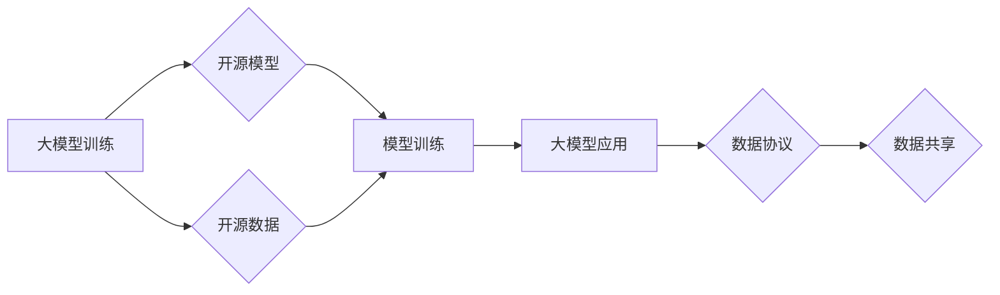

> 大模型、开源、数据协议、数据共享、模型训练、伦理问题、法律问题、未来趋势

## 1. 背景介绍

近年来，深度学习技术取得了飞速发展，大模型的出现更是掀起了人工智能领域的革命浪潮。大模型，是指参数规模庞大、训练数据海量的人工智能模型，其强大的学习能力和泛化能力使其在自然语言处理、计算机视觉、语音识别等领域展现出令人瞩目的应用潜力。

然而，大模型的训练和应用也面临着诸多挑战，其中最为关键的是数据和模型的开源问题。大模型的训练需要海量的数据支撑，而这些数据往往分散在不同的机构和平台，难以进行有效共享。同时，大模型的训练成本高昂，对于个人开发者和小型研究机构来说，难以负担。

开源和数据协议的出现，为解决这些问题提供了新的思路。开源不仅可以促进技术进步和创新，还可以降低大模型的开发门槛，让更多人能够参与到大模型的建设和应用中。数据协议则可以规范数据共享的方式，保障数据安全和隐私，促进数据资源的有效利用。

## 2. 核心概念与联系

### 2.1 开源

开源是指软件、硬件或其他知识产权的代码、文档和设计图纸等公开发布，允许任何人免费使用、修改和分发。开源软件的优势在于：

* **透明度高:** 代码公开透明，任何人都可以查看和理解，提高软件的可靠性和安全性。
* **社区驱动:** 开源软件由全球开发者社区共同维护和改进，不断完善和优化。
* **成本低:** 开源软件免费使用，降低了开发成本。

### 2.2 数据协议

数据协议是指规范数据共享的方式，包括数据格式、数据结构、数据访问权限等方面的规则。数据协议的目的是：

* **保障数据安全:** 通过加密、授权等机制，防止数据泄露和滥用。
* **保证数据一致性:** 规范数据格式和结构，确保数据在不同平台和系统之间能够互操作。
* **促进数据共享:** 建立数据共享机制，方便不同机构和平台之间进行数据交换。

### 2.3 核心概念联系

大模型的训练和应用需要海量的数据和强大的计算资源。开源和数据协议可以有效解决这些问题。

* **开源模型:** 开源大模型可以降低开发门槛，让更多人能够参与到大模型的建设和应用中。
* **开源数据:** 开源数据可以为大模型的训练提供充足的数据支撑，促进大模型的性能提升。
* **数据协议:** 数据协议可以规范数据共享的方式，保障数据安全和隐私，促进数据资源的有效利用。

**Mermaid 流程图**



## 3. 核心算法原理 & 具体操作步骤

### 3.1 算法原理概述

大模型的训练主要基于深度学习算法，其中最常用的算法是Transformer。Transformer是一种基于注意力机制的神经网络架构，能够有效捕捉文本序列中的长距离依赖关系。

Transformer的结构主要包括以下几个部分：

* **编码器:** 将输入文本序列编码成向量表示。
* **解码器:** 根据编码后的向量表示生成输出文本序列。
* **注意力机制:** 用于捕捉文本序列中不同词之间的关系。

### 3.2 算法步骤详解

大模型的训练过程可以概括为以下几个步骤：

1. **数据预处理:** 将原始数据进行清洗、格式化和分词等处理，使其能够被模型理解。
2. **模型构建:** 根据预定的模型架构，搭建模型结构。
3. **模型训练:** 使用训练数据对模型进行训练，调整模型参数，使其能够准确地预测输出。
4. **模型评估:** 使用测试数据对模型进行评估，衡量模型的性能。
5. **模型部署:** 将训练好的模型部署到实际应用场景中。

### 3.3 算法优缺点

**优点:**

* **强大的学习能力:** Transformer能够有效捕捉文本序列中的长距离依赖关系，具有强大的学习能力。
* **可并行训练:** Transformer的结构可以并行训练，提高训练效率。
* **广泛应用:** Transformer在自然语言处理、计算机视觉、语音识别等领域都有广泛的应用。

**缺点:**

* **训练成本高:** Transformer模型参数规模庞大，训练成本高昂。
* **数据依赖性强:** Transformer模型的性能依赖于训练数据的质量和数量。
* **可解释性差:** Transformer模型的内部机制复杂，难以解释其决策过程。

### 3.4 算法应用领域

Transformer算法在以下领域有广泛的应用:

* **自然语言处理:** 机器翻译、文本摘要、问答系统、情感分析等。
* **计算机视觉:** 图像分类、目标检测、图像生成等。
* **语音识别:** 语音转文本、语音合成等。

## 4. 数学模型和公式 & 详细讲解 & 举例说明

### 4.1 数学模型构建

Transformer模型的核心是注意力机制，其数学模型可以表示为：

$$
Attention(Q, K, V) = softmax(\frac{QK^T}{\sqrt{d_k}})V
$$

其中：

* $Q$：查询矩阵
* $K$：键矩阵
* $V$：值矩阵
* $d_k$：键向量的维度
* $softmax$：softmax函数

### 4.2 公式推导过程

注意力机制的目的是计算每个词与其他词之间的相关性，并根据相关性权重来加权求和，得到最终的输出。

公式推导过程如下：

1. 计算查询矩阵 $Q$ 与键矩阵 $K$ 的点积，并除以 $\sqrt{d_k}$。
2. 对点积结果应用 softmax 函数，得到每个词与其他词之间的相关性权重。
3. 将相关性权重与值矩阵 $V$ 进行加权求和，得到最终的输出。

### 4.3 案例分析与讲解

假设我们有一个句子 "The cat sat on the mat"，其词向量表示为：

* The: [0.1, 0.2, 0.3]
* cat: [0.4, 0.5, 0.6]
* sat: [0.7, 0.8, 0.9]
* on: [0.2, 0.3, 0.4]
* the: [0.1, 0.2, 0.3]
* mat: [0.5, 0.6, 0.7]

我们可以使用注意力机制计算每个词与其他词之间的相关性，例如，计算 "cat" 与 "sat" 之间的相关性：

$$
Attention(Q_{cat}, K_{sat}, V_{sat}) = softmax(\frac{Q_{cat}K_{sat}^T}{\sqrt{d_k}})V_{sat}
$$

通过计算，我们可以得到 "cat" 与 "sat" 之间的相关性权重，并根据权重加权求和，得到最终的输出。

## 5. 项目实践：代码实例和详细解释说明

### 5.1 开发环境搭建

* Python 3.7+
* PyTorch 1.7+
* CUDA 10.2+

### 5.2 源代码详细实现

```python
import torch
import torch.nn as nn

class Transformer(nn.Module):
    def __init__(self, vocab_size, embedding_dim, num_heads, num_layers):
        super(Transformer, self).__init__()
        self.embedding = nn.Embedding(vocab_size, embedding_dim)
        self.transformer_layers = nn.ModuleList([
            nn.TransformerEncoderLayer(embedding_dim, num_heads)
            for _ in range(num_layers)
        ])
        self.linear = nn.Linear(embedding_dim, vocab_size)

    def forward(self, x):
        x = self.embedding(x)
        for layer in self.transformer_layers:
            x = layer(x)
        x = self.linear(x)
        return x
```

### 5.3 代码解读与分析

* `__init__` 方法：初始化模型参数，包括词嵌入层、Transformer编码器层和输出层。
* `forward` 方法：定义模型的正向传播过程，将输入序列经过词嵌入层、Transformer编码器层和输出层，最终得到输出序列。

### 5.4 运行结果展示

训练好的模型可以用于各种自然语言处理任务，例如机器翻译、文本摘要、问答系统等。

## 6. 实际应用场景

### 6.1 机器翻译

大模型可以用于构建高精度机器翻译系统，例如 Google Translate、DeepL 等。

### 6.2 文本摘要

大模型可以用于自动生成文本摘要，例如新闻摘要、会议纪要等。

### 6.3 问答系统

大模型可以用于构建问答系统，例如智能客服、搜索引擎等。

### 6.4 未来应用展望

大模型的应用场景还在不断扩展，未来可能应用于：

* **代码生成:** 自动生成代码，提高开发效率。
* **药物研发:** 预测药物的活性，加速药物研发过程。
* **个性化教育:** 提供个性化的学习方案，提高学习效果。

## 7. 工具和资源推荐

### 7.1 学习资源推荐

* **论文:** "Attention Is All You Need"
* **书籍:** "Deep Learning"
* **在线课程:** Coursera、edX

### 7.2 开发工具推荐

* **PyTorch:** 深度学习框架
* **TensorFlow:** 深度学习框架
* **Hugging Face:** 大模型库

### 7.3 相关论文推荐

* "BERT: Pre-training of Deep Bidirectional Transformers for Language Understanding"
* "GPT-3: Language Models are Few-Shot Learners"
* "T5: Text-to-Text Transfer Transformer"

## 8. 总结：未来发展趋势与挑战

### 8.1 研究成果总结

大模型的出现，标志着人工智能领域迈入了新的时代。大模型的强大能力和广泛应用前景，为解决人类面临的各种挑战提供了新的思路和方法。

### 8.2 未来发展趋势

* **模型规模更大:** 模型参数规模将继续扩大，提升模型的性能和泛化能力。
* **训练效率更高:** 训练算法和硬件技术将不断改进，降低模型训练成本。
* **应用场景更广泛:** 大模型将应用于更多领域，例如医疗、教育、金融等。

### 8.3 面临的挑战

* **数据安全和隐私:** 大模型的训练需要海量数据，如何保障数据安全和隐私是一个重要挑战。
* **算法可解释性:** 大模型的内部机制复杂，难以解释其决策过程，这可能会导致模型的不可信和不可控。
* **伦理问题:** 大模型的应用可能会带来一些伦理问题，例如算法偏见、信息操纵等，需要引起重视和探讨。

### 8.4 研究展望

未来，大模型研究将继续朝着更强大、更安全、更可解释的方向发展。我们需要加强与其他学科的交叉研究，例如伦理学、社会学等，确保大模型的健康发展和可持续应用。

## 9. 附录：常见问题与解答

### 9.1 什么是Transformer模型？

Transformer模型是一种基于注意力机制的神经网络架构，能够有效捕捉文本序列中的长距离依赖关系。

### 9.2 大模型的训练成本高昂吗？

是的，大模型的训练成本很高，需要大量的计算资源和训练数据。

### 9.3 如何解决大模型的算法可解释性问题？

目前，解决大模型可解释性问题的方法还比较有限，需要进一步的研究和探索。

### 9.4 大模型的应用会带来哪些伦理问题？

大模型的应用可能会带来一些伦理问题，例如算法偏见、信息操纵等，需要引起重视和探讨。


作者