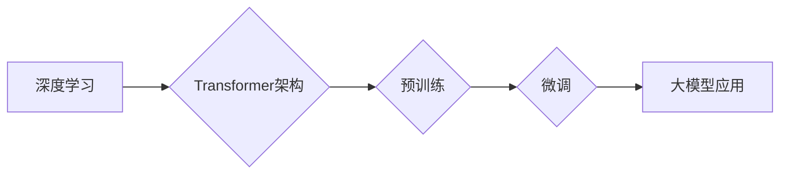

> 大模型、深度学习、Transformer、自然语言处理、计算机视觉、生成式模型、伦理问题

## 1. 背景介绍

人工智能（AI）技术近年来取得了飞速发展，其中大模型作为其重要组成部分，正在深刻地改变着我们生活和工作方式。大模型是指参数规模庞大、训练数据海量的人工智能模型，其强大的学习能力和泛化能力使其能够在各种复杂任务中展现出卓越的性能。

从早期的小规模模型到如今的数十亿甚至千亿参数的大模型，大模型的发展经历了几个关键阶段：

* **早期阶段：** 模型规模有限，主要应用于特定领域，例如语音识别和图像分类。
* **突破阶段：** 深度学习技术的兴起，以及GPU计算能力的提升，使得大规模模型训练成为可能。
* **爆发阶段：** Transformer架构的提出，以及预训练和微调技术的应用，推动了大模型的快速发展和应用。

大模型的出现，标志着人工智能技术进入了一个新的时代，其强大的能力和广泛的应用前景，也引发了人们对未来科技发展趋势的思考。

## 2. 核心概念与联系

大模型的核心概念包括：

* **深度学习：** 大模型的训练基于深度学习算法，通过多层神经网络学习数据中的复杂模式和关系。
* **Transformer架构：** Transformer是一种新型的神经网络架构，其自注意力机制能够有效捕捉长距离依赖关系，为大模型的训练和应用提供了强大的支持。
* **预训练和微调：** 预训练是指在大量通用数据上训练模型，学习通用知识和表示；微调是指在特定任务数据上对预训练模型进行调整，使其能够更好地完成特定任务。

**Mermaid 流程图：**



## 3. 核心算法原理 & 具体操作步骤

### 3.1  算法原理概述

大模型的训练主要基于深度学习算法，其中Transformer架构是其核心组成部分。Transformer架构通过自注意力机制，能够有效捕捉文本序列中的长距离依赖关系，从而实现更准确的理解和生成文本。

### 3.2  算法步骤详解

大模型的训练过程可以概括为以下步骤：

1. **数据预处理：** 将原始数据进行清洗、格式化和编码，使其能够被模型理解。
2. **模型构建：** 根据任务需求，选择合适的Transformer架构，并设置模型参数。
3. **预训练：** 在大量通用数据上训练模型，学习语言的语法和语义知识。
4. **微调：** 在特定任务数据上对预训练模型进行调整，使其能够更好地完成特定任务。
5. **模型评估：** 使用测试数据评估模型的性能，并根据评估结果进行模型优化。

### 3.3  算法优缺点

**优点：**

* 强大的学习能力：大模型能够学习到大量数据的复杂模式和关系，从而实现更准确的预测和生成。
* 泛化能力强：预训练模型在不同任务上的泛化能力强，能够应用于多种领域。
* 持续改进：随着训练数据的增加和算法的改进，大模型的性能将不断提升。

**缺点：**

* 训练成本高：大模型的训练需要大量的计算资源和时间。
* 数据依赖性强：大模型的性能取决于训练数据的质量和数量。
* 缺乏可解释性：大模型的决策过程复杂，难以解释其背后的逻辑。

### 3.4  算法应用领域

大模型在各个领域都有广泛的应用，例如：

* **自然语言处理：** 文本生成、机器翻译、问答系统、情感分析等。
* **计算机视觉：** 图像识别、物体检测、图像生成等。
* **语音识别：** 语音转文本、语音合成等。
* **推荐系统：** 商品推荐、内容推荐等。

## 4. 数学模型和公式 & 详细讲解 & 举例说明

### 4.1  数学模型构建

大模型的训练基于深度学习算法，其核心是神经网络模型。神经网络模型由多个层组成，每一层包含多个神经元。神经元之间通过权重连接，并将输入数据进行处理和传递。

**公式：**

$$
y = f(W x + b)
$$

其中：

* $y$：输出值
* $x$：输入值
* $W$：权重矩阵
* $b$：偏置向量
* $f$：激活函数

### 4.2  公式推导过程

激活函数的作用是将神经元的输出值映射到一个特定的范围，例如 sigmoid 函数将输出值映射到 0 到 1 之间，ReLU 函数将负值映射到 0，正值保持不变。

**公式：**

$$
f(x) = \begin{cases}
0 & \text{if } x < 0 \\
x & \text{if } x \ge 0
\end{cases}
$$

### 4.3  案例分析与讲解

例如，在图像分类任务中，大模型会将图像输入到神经网络模型中，经过多个层的处理，最终输出每个类别的概率。

**举例说明：**

假设我们有一个图像分类模型，需要识别猫和狗的图片。模型的输出层包含两个神经元，分别对应猫和狗的类别。当输入一张猫的图片时，模型的输出结果会是 [0.9, 0.1]，表示模型预测该图片为猫的概率为 90%，为狗的概率为 10%。

## 5. 项目实践：代码实例和详细解释说明

### 5.1  开发环境搭建

大模型的开发需要强大的计算资源和软件环境。常用的开发环境包括：

* **CUDA和cuDNN：** 用于加速深度学习模型的训练和推理。
* **PyTorch或TensorFlow：** 深度学习框架，提供丰富的工具和库，用于构建和训练大模型。
* **云计算平台：** 例如 Google Cloud Platform、Amazon Web Services 和 Microsoft Azure，提供强大的计算资源和存储服务。

### 5.2  源代码详细实现

由于大模型的代码实现非常复杂，这里只提供一个简单的示例代码，用于演示模型的训练过程。

```python
import torch
import torch.nn as nn

# 定义一个简单的 Transformer 模型
class SimpleTransformer(nn.Module):
    def __init__(self, input_size, hidden_size, num_layers):
        super(SimpleTransformer, self).__init__()
        self.encoder = nn.TransformerEncoder(nn.TransformerEncoderLayer(d_model=hidden_size, nhead=8), num_layers)
        self.decoder = nn.TransformerDecoder(nn.TransformerDecoderLayer(d_model=hidden_size, nhead=8), num_layers)
        self.linear = nn.Linear(hidden_size, input_size)

    def forward(self, src, tgt):
        src = self.encoder(src)
        tgt = self.decoder(tgt, src)
        output = self.linear(tgt)
        return output

# 实例化模型
model = SimpleTransformer(input_size=10, hidden_size=512, num_layers=6)

# 定义损失函数和优化器
criterion = nn.CrossEntropyLoss()
optimizer = torch.optim.Adam(model.parameters(), lr=0.001)

# 训练模型
for epoch in range(10):
    # 训练数据
    input_data = torch.randn(100, 5, 10)
    target_data = torch.randn(100, 5, 10)

    # 前向传播
    output = model(input_data, target_data)

    # 计算损失
    loss = criterion(output, target_data)

    # 反向传播
    optimizer.zero_grad()
    loss.backward()

    # 更新参数
    optimizer.step()

    # 打印损失
    print(f'Epoch {epoch+1}, Loss: {loss.item()}')
```

### 5.3  代码解读与分析

这段代码演示了如何使用 PyTorch 框架构建和训练一个简单的 Transformer 模型。

* **模型定义：** `SimpleTransformer` 类定义了一个简单的 Transformer 模型，包含编码器和解码器，以及一个线性层用于输出结果。
* **数据准备：** 训练数据使用随机数生成，实际应用中需要使用真实的数据集。
* **损失函数和优化器：** 使用交叉熵损失函数和 Adam 优化器进行模型训练。
* **训练循环：** 训练循环迭代多次，每次迭代进行一次前向传播、损失计算、反向传播和参数更新。

### 5.4  运行结果展示

训练完成后，模型能够对输入数据进行预测，例如，可以将一段文本作为输入，模型可以预测其下一个词。

## 6. 实际应用场景

大模型在各个领域都有广泛的应用，例如：

### 6.1 自然语言处理

* **机器翻译：** 大模型能够实现更高质量的机器翻译，例如 Google Translate 使用大模型进行翻译，能够更准确地理解和转换语言。
* **文本生成：** 大模型能够生成高质量的文本，例如 ChatGPT 使用大模型进行对话，能够与人类进行自然流畅的对话。
* **问答系统：** 大模型能够理解用户的问题，并从知识库中找到答案，例如百度大脑使用大模型构建问答系统，能够回答用户各种问题。

### 6.2 计算机视觉

* **图像识别：** 大模型能够识别图像中的物体，例如 Google Photos 使用大模型进行图像识别，能够自动识别照片中的内容。
* **物体检测：** 大模型能够检测图像中物体的位置和类别，例如自动驾驶汽车使用大模型进行物体检测，能够识别道路上的车辆和行人。
* **图像生成：** 大模型能够生成逼真的图像，例如 DALL-E 使用大模型生成图像，能够根据文本描述生成相应的图像。

### 6.3 其他领域

* **语音识别：** 大模型能够将语音转换为文本，例如 Siri 和 Alexa 使用大模型进行语音识别，能够理解用户的语音指令。
* **推荐系统：** 大模型能够根据用户的历史行为和偏好，推荐相关的商品或内容，例如 Netflix 使用大模型进行推荐，能够推荐用户喜欢的电影和电视剧。

### 6.4 未来应用展望

随着大模型技术的不断发展，其应用场景将更加广泛，例如：

* **个性化教育：** 大模型能够根据学生的学习情况，提供个性化的学习方案。
* **医疗诊断：** 大模型能够辅助医生进行疾病诊断，提高诊断准确率。
* **科学研究：** 大模型能够帮助科学家分析海量数据，发现新的科学规律。

## 7. 工具和资源推荐

### 7.1 学习资源推荐

* **书籍：**
    * 《深度学习》
    * 《Transformer 详解》
* **在线课程：**
    * Coursera 深度学习课程
    * fast.ai 深度学习课程
* **博客和网站：**
    * TensorFlow 官方博客
    * PyTorch 官方博客
    * Hugging Face

### 7.2 开发工具推荐

* **深度学习框架：**
    * TensorFlow
    * PyTorch
* **云计算平台：**
    * Google Cloud Platform
    * Amazon Web Services
    * Microsoft Azure
* **代码编辑器：**
    * VS Code
    * PyCharm

### 7.3 相关论文推荐

* **Attention Is All You Need**
* **BERT: Pre-training of Deep Bidirectional Transformers for Language Understanding**
* **GPT-3: Language Models are Few-Shot Learners**

## 8. 总结：未来发展趋势与挑战

### 8.1 研究成果总结

大模型技术取得了显著的进展，在自然语言处理、计算机视觉等领域取得了突破性成果。大模型的出现，标志着人工智能技术进入了一个新的时代，其强大的能力和广泛的应用前景，也引发了人们对未来科技发展趋势的思考。

### 8.2 未来发展趋势

* **模型规模继续扩大