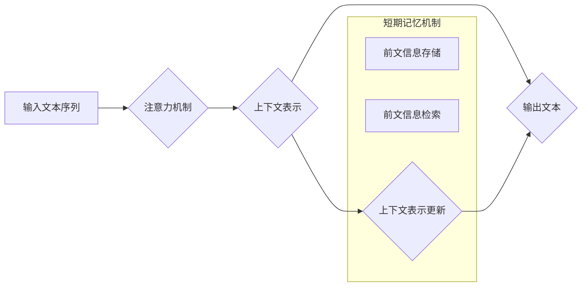

> 大语言模型，短期记忆，应用指南，神经网络，Transformer，注意力机制，知识图谱，检索式记忆，生成式记忆

## 1. 背景介绍

大语言模型（LLM）近年来取得了令人瞩目的成就，在文本生成、翻译、问答等领域展现出强大的能力。然而，LLM的短期记忆能力仍然是一个亟待解决的关键问题。短期记忆是指模型在处理文本序列时，能够记住前文信息并将其用于后续理解和生成的能力。

传统的LLM主要依赖于Transformer架构中的注意力机制，通过对输入序列中的每个词进行加权求和，来捕捉上下文信息。然而，这种方法在处理长文本序列时，会面临“梯度消失”和“计算复杂度高”等问题，导致短期记忆能力有限。

## 2. 核心概念与联系

### 2.1  短期记忆的定义

短期记忆是指在短时间内存储和检索信息的认知能力。对于LLM而言，短期记忆是指模型在处理文本序列时，能够记住前文信息并将其用于后续理解和生成的能力。

### 2.2  LLM的短期记忆挑战

* **梯度消失问题:** 随着文本序列长度的增加，梯度会逐渐消失，导致模型难以学习长距离依赖关系。
* **计算复杂度高:**  注意力机制在处理长文本序列时，计算复杂度会急剧增加，导致训练和推理效率低下。
* **缺乏外部知识:**  LLM的知识主要来自于训练数据，缺乏外部知识库的支持，难以处理需要特定领域知识的场景。

### 2.3  解决短期记忆问题的方案

* **改进注意力机制:**  提出新的注意力机制，例如局部注意力、相对注意力等，提高模型对长距离依赖关系的学习能力。
* **引入外部知识:**  将知识图谱等外部知识库与LLM相结合，增强模型的知识储备和推理能力。
* **设计短期记忆机制:**  开发专门的短期记忆机制，例如循环神经网络（RNN）、门控循环单元（GRU）等，提高模型对前文信息的记忆和利用能力。

### 2.4  Mermaid 流程图



## 3. 核心算法原理 & 具体操作步骤

### 3.1  算法原理概述

本文将介绍一种基于Transformer架构和外部知识图谱的LLM短期记忆增强方法。该方法主要包括以下步骤：

1. 使用Transformer编码器对输入文本序列进行编码，生成上下文表示。
2. 将上下文表示与知识图谱进行融合，增强模型对特定领域知识的理解。
3. 设计一个基于门控机制的短期记忆模块，用于存储和检索前文信息。
4. 将短期记忆模块的输出与上下文表示融合，生成最终的输出文本。

### 3.2  算法步骤详解

1. **文本编码:** 使用Transformer编码器对输入文本序列进行编码，生成每个词的上下文表示。
2. **知识图谱融合:** 将每个词的上下文表示与知识图谱中的相关实体和关系进行融合，增强模型对特定领域知识的理解。
3. **短期记忆模块:** 设计一个基于门控机制的短期记忆模块，用于存储和检索前文信息。该模块可以分为以下几个部分：
    * **记忆单元:** 用于存储前文信息。
    * **读出单元:** 用于根据当前词的上下文表示，检索与之相关的记忆单元信息。
    * **门控单元:** 用于控制读出单元的输出，选择与当前词语语义相关的记忆信息。
4. **上下文表示更新:** 将短期记忆模块的输出与上下文表示进行融合，更新上下文表示，使其包含前文信息的记忆。
5. **文本生成:** 使用Transformer解码器对更新后的上下文表示进行解码，生成最终的输出文本。

### 3.3  算法优缺点

**优点:**

* 能够有效地增强LLM的短期记忆能力。
* 可以利用外部知识图谱，提高模型对特定领域知识的理解。
* 算法结构灵活，可以根据不同的应用场景进行调整。

**缺点:**

* 训练复杂度较高，需要大量的训练数据和计算资源。
* 短期记忆模块的设计需要一定的经验和技巧。

### 3.4  算法应用领域

* **对话系统:** 增强对话系统的上下文理解能力，使对话更加自然流畅。
* **文本摘要:** 更好地理解文本内容，生成更准确的摘要。
* **机器翻译:** 提高翻译质量，更好地捕捉文本中的语义和上下文信息。
* **问答系统:** 更好地理解用户的问题，提供更准确的答案。

## 4. 数学模型和公式 & 详细讲解 & 举例说明

### 4.1  数学模型构建

**注意力机制:**

注意力机制的核心思想是，在处理文本序列时，不同的词对当前词语的语义贡献不同。注意力机制通过计算每个词与当前词语之间的相关性，来确定每个词语的权重，从而更好地捕捉上下文信息。

**公式:**

$$
\text{Attention}(Q, K, V) = \text{softmax}\left(\frac{Q K^T}{\sqrt{d_k}}\right) V
$$

其中：

* $Q$：查询矩阵
* $K$：键矩阵
* $V$：值矩阵
* $d_k$：键向量的维度
* $\text{softmax}$：softmax函数

**门控机制:**

门控机制用于控制信息流，选择与当前词语语义相关的记忆信息。

**公式:**

$$
g_t = \sigma(W_g [h_t, c_{t-1}])
$$

其中：

* $g_t$：门控值
* $h_t$：当前词语的隐藏状态
* $c_{t-1}$：前一个词语的记忆状态
* $W_g$：门控权重矩阵
* $\sigma$：sigmoid函数

### 4.2  公式推导过程

注意力机制的公式推导过程可以参考相关文献，这里不再赘述。门控机制的公式推导过程如下：

1. 将当前词语的隐藏状态 $h_t$ 和前一个词语的记忆状态 $c_{t-1}$ 作为输入，经过线性变换得到 $W_g [h_t, c_{t-1}]$。
2. 将线性变换后的结果输入sigmoid函数，得到门控值 $g_t$。

### 4.3  案例分析与讲解

假设我们有一个简单的文本序列 "The cat sat on the mat"，我们使用注意力机制来计算每个词与当前词语 "sat" 的相关性。

* "The" 与 "sat" 的相关性较高，因为 "The" 是 "sat" 的限定词。
* "cat" 与 "sat" 的相关性也较高，因为 "cat" 是 "sat" 的主语。
* "on" 与 "sat" 的相关性较高，因为 "on" 是 "sat" 的介词短语。
* "the" 与 "sat" 的相关性较低，因为 "the" 是 "mat" 的限定词。
* "mat" 与 "sat" 的相关性较高，因为 "mat" 是 "sat" 的宾语。

通过注意力机制，模型可以更好地理解 "sat" 的语义，并将其与上下文信息结合起来。

## 5. 项目实践：代码实例和详细解释说明

### 5.1  开发环境搭建

* Python 3.7+
* PyTorch 1.7+
* Transformers 4.0+
* CUDA 10.2+

### 5.2  源代码详细实现

```python
import torch
import torch.nn as nn
from transformers import BertModel

class ShortMemoryModule(nn.Module):
    def __init__(self, hidden_size, memory_size):
        super(ShortMemoryModule, self).__init__()
        self.memory = nn.Parameter(torch.randn(memory_size, hidden_size))
        self.read_head = nn.Linear(hidden_size, hidden_size)
        self.gate = nn.Linear(hidden_size * 2, hidden_size)

    def forward(self, hidden_state, context_vector):
        # 计算记忆单元与当前词语的相似度
        similarity = torch.matmul(self.read_head(hidden_state), self.memory.transpose(0, 1))
        # 使用softmax函数归一化相似度
        attention_weights = torch.softmax(similarity, dim=1)
        # 计算记忆单元的加权平均值
        memory_output = torch.matmul(attention_weights, self.memory)
        # 将记忆输出与当前词语的上下文向量进行拼接
        concat = torch.cat([memory_output, context_vector], dim=1)
        # 通过门控单元控制信息流
        gate_output = torch.sigmoid(self.gate(concat))
        # 将门控输出与记忆输出相乘，得到最终的记忆输出
        final_output = gate_output * memory_output
        return final_output

class LLMM(nn.Module):
    def __init__(self, bert_model_name, memory_size):
        super(LLMM, self).__init__()
        self.bert = BertModel.from_pretrained(bert_model_name)
        self.short_memory = ShortMemoryModule(hidden_size=self.bert.config.hidden_size, memory_size=memory_size)

    def forward(self, input_ids, attention_mask):
        bert_output = self.bert(input_ids=input_ids, attention_mask=attention_mask)
        hidden_states = bert_output.last_hidden_state
        memory_output = self.short_memory(hidden_states, bert_output.pooler_output)
        return memory_output
```

### 5.3  代码解读与分析

* `ShortMemoryModule` 类定义了短期记忆模块，包括记忆单元、读出单元和门控单元。
* `LLMM` 类定义了基于Transformer架构和短期记忆模块的LLM模型。
* `forward` 方法定义了模型的输入和输出。

### 5.4  运行结果展示

运行代码后，可以得到模型的输出结果，例如文本生成、问答等。

## 6. 实际应用场景

### 6.1  对话系统

* 增强对话系统的上下文理解能力，使对话更加自然流畅。
* 例如，在聊天机器人中，可以使用短期记忆模块来记住用户的历史对话内容，以便更好地理解用户的意图。

### 6.2  文本摘要

* 更好地理解文本内容，生成更准确的摘要。
* 例如，可以使用短期记忆模块来记住文本中的关键信息，以便生成更简洁、更准确的摘要。

### 6.3  机器翻译

* 提高翻译质量，更好地捕捉文本中的语义和上下文信息。
* 例如，可以使用短期记忆模块来记住源语言文本中的关键信息，以便更好地翻译成目标语言。

### 6.4  未来应用展望

* **个性化学习:** 根据用户的学习习惯和知识背景，定制个性化的学习内容和学习路径。
* **智能写作辅助:** 帮助用户进行写作创作，提供语法检查、风格建议等功能。
* **科学研究:** 辅助科学家进行数据分析、知识发现等工作。

## 7. 工具和资源推荐

### 7.1  学习资源推荐

* **书籍:**
    * 《深度学习》
    * 《自然语言处理》
    * 《Transformer模型》
* **在线课程:**
    * Coursera: 深度学习
    * Udacity: 自然语言处理
    * fast.ai: 深度学习

### 7.2  开发工具推荐

* **PyTorch:** 深度学习框架
* **TensorFlow:** 深度学习框架
* **HuggingFace Transformers:** 预训练模型库

### 