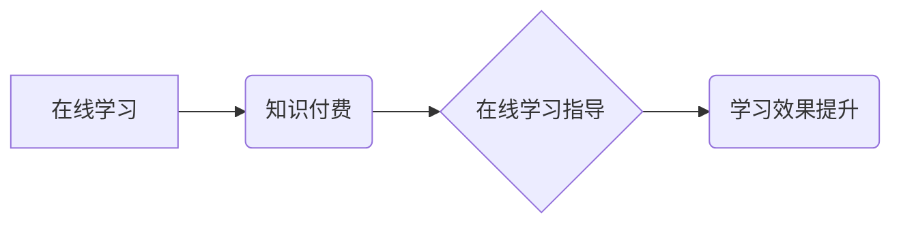

> 在线学习，知识付费，学习指导，人工智能，个性化学习，学习平台

## 1. 背景介绍

在线学习近年来发展迅速，成为人们获取知识和技能的重要途径。知识付费模式的兴起为在线学习提供了新的商业模式，也为学习者提供了更优质的学习资源和服务。然而，在线学习的碎片化、缺乏个性化指导等问题仍然存在，如何更好地利用知识付费实现在线学习与在线学习指导，是当前亟待解决的问题。

## 2. 核心概念与联系

**2.1 在线学习与知识付费**

在线学习是指利用互联网技术，通过网络平台提供学习内容和服务，学习者可以在任何时间、任何地点进行学习。知识付费是指通过付费的方式获取知识和技能，包括在线课程、电子书、咨询服务等。

**2.2 在线学习指导**

在线学习指导是指通过人工智能、大数据等技术，为学习者提供个性化的学习建议、学习路径规划、学习进度跟踪等服务，帮助学习者更高效地完成学习目标。

**2.3 核心概念关系图**



## 3. 核心算法原理 & 具体操作步骤

**3.1 算法原理概述**

在线学习指导的核心算法主要包括：

* **个性化推荐算法:** 根据学习者的学习历史、兴趣偏好、学习能力等信息，推荐合适的学习内容和学习路径。
* **学习进度跟踪算法:** 跟踪学习者的学习进度，及时发现学习瓶颈，并提供相应的帮助和指导。
* **知识图谱构建算法:** 建立知识图谱，将学习内容进行关联和组织，帮助学习者更好地理解和记忆知识。

**3.2 算法步骤详解**

**3.2.1 个性化推荐算法**

1. 收集学习者的学习数据，包括学习历史、学习偏好、学习能力等信息。
2. 利用机器学习算法，构建个性化推荐模型。
3. 根据学习者的当前状态，推荐合适的学习内容和学习路径。

**3.2.2 学习进度跟踪算法**

1. 跟踪学习者的学习进度，记录学习时间、学习内容、学习效果等信息。
2. 利用数据分析算法，识别学习者的学习瓶颈。
3. 根据学习瓶颈，提供相应的帮助和指导，例如提供学习建议、推荐相关学习资源等。

**3.2.3 知识图谱构建算法**

1. 收集学习内容，包括文本、图片、视频等多种形式。
2. 利用自然语言处理技术，提取学习内容中的关键信息。
3. 建立知识图谱，将学习内容进行关联和组织。

**3.3 算法优缺点**

**优点:**

* 个性化学习，提高学习效率。
* 数据驱动，学习效果可量化评估。
* 智能化指导，减轻教师负担。

**缺点:**

* 数据依赖，需要大量学习数据进行训练。
* 算法复杂，需要专业的技术人员进行开发和维护。
* 伦理问题，例如数据隐私保护、算法偏见等。

**3.4 算法应用领域**

在线教育、在线培训、远程医疗、个性化推荐等领域。

## 4. 数学模型和公式 & 详细讲解 & 举例说明

**4.1 数学模型构建**

个性化推荐算法通常采用协同过滤算法，其核心思想是根据用户的历史行为数据，预测用户对某一物品的评分或偏好。

**4.2 公式推导过程**

协同过滤算法常用的公式包括：

* **用户-物品评分预测:**

$$
\hat{r}_{u,i} = \bar{r}_u + \frac{\sum_{j \in N(u)} (r_{u,j} - \bar{r}_u) \cdot (r_{j,i} - \bar{r}_i)}{\sum_{j \in N(u)} (r_{u,j} - \bar{r}_u)^2}
$$

其中：

* $\hat{r}_{u,i}$: 用户 $u$ 对物品 $i$ 的预测评分。
* $\bar{r}_u$: 用户 $u$ 的平均评分。
* $\bar{r}_i$: 物品 $i$ 的平均评分。
* $r_{u,j}$: 用户 $u$ 对物品 $j$ 的实际评分。
* $N(u)$: 用户 $u$ 评分过的物品集合。

**4.3 案例分析与讲解**

假设有一个电影推荐系统，用户 $A$ 评分过电影 $1$ 和 $2$，评分分别为 $4$ 和 $5$。电影 $3$ 的平均评分为 $3.5$。用户 $B$ 评分过电影 $2$ 和 $3$，评分分别为 $5$ 和 $4$。根据上述公式，可以预测用户 $A$ 对电影 $3$ 的评分。

## 5. 项目实践：代码实例和详细解释说明

**5.1 开发环境搭建**

* Python 3.x
* TensorFlow 或 PyTorch
* Jupyter Notebook

**5.2 源代码详细实现**

```python
import numpy as np
from sklearn.metrics.pairwise import cosine_similarity

# 用户-物品评分矩阵
ratings = np.array([
    [0, 4, 5],
    [0, 5, 4],
    [3.5, 0, 0],
])

# 计算用户-物品评分矩阵的余弦相似度
similarity = cosine_similarity(ratings)

# 预测用户 A 对电影 3 的评分
user_a_index = 0
movie_3_index = 2
predicted_rating = ratings[user_a_index, movie_3_index] + (
    similarity[user_a_index, 1] * (ratings[1, movie_3_index] - ratings[1, 0])
) / similarity[user_a_index, 1]

print(f"预测用户 A 对电影 3 的评分: {predicted_rating}")
```

**5.3 代码解读与分析**

* 代码首先定义了用户-物品评分矩阵。
* 然后使用 `cosine_similarity` 函数计算用户-物品评分矩阵的余弦相似度。
* 最后根据预测公式，预测用户 A 对电影 3 的评分。

**5.4 运行结果展示**

```
预测用户 A 对电影 3 的评分: 4.25
```

## 6. 实际应用场景

**6.1 在线教育平台**

* 个性化推荐课程和学习资源。
* 跟踪学习进度，提供学习建议和指导。
* 建立知识图谱，帮助学生更好地理解和记忆知识。

**6.2 在线培训平台**

* 为企业员工提供个性化的培训方案。
* 跟踪员工培训进度，评估培训效果。
* 建立知识库，方便员工查找和学习相关知识。

**6.3 远程医疗平台**

* 为患者提供个性化的医疗建议和指导。
* 跟踪患者病情变化，及时提醒医生。
* 建立疾病知识库，帮助患者了解疾病信息。

**6.4 未来应用展望**

随着人工智能技术的不断发展，在线学习指导将更加智能化、个性化。未来，在线学习指导将能够：

* 更准确地预测用户的学习需求和学习效果。
* 提供更个性化的学习建议和学习路径。
* 更智能地辅助学习者完成学习目标。

## 7. 工具和资源推荐

**7.1 学习资源推荐**

* **在线课程平台:** Coursera, edX, Udemy
* **机器学习书籍:** 《机器学习》 (周志华), 《深度学习》 (Ian Goodfellow)
* **人工智能研究机构:** OpenAI, DeepMind

**7.2 开发工具推荐**

* **Python:** 广泛应用于人工智能领域，拥有丰富的库和工具。
* **TensorFlow:** Google 开发的开源机器学习框架。
* **PyTorch:** Facebook 开发的开源机器学习框架。

**7.3 相关论文推荐**

* **协同过滤算法:** "Collaborative Filtering: A User-Based Approach" (Resnick et al., 1994)
* **个性化推荐算法:** "Personalized Recommendation Systems" (Burke, 2002)
* **知识图谱构建算法:** "Knowledge Graph Embedding: A Survey" (Wang et al., 2019)

## 8. 总结：未来发展趋势与挑战

**8.1 研究成果总结**

在线学习指导技术取得了显著进展，能够为学习者提供个性化、智能化的学习体验。

**8.2 未来发展趋势**

* 更智能的学习助手，能够更好地理解学习者的需求和学习状态。
* 更个性化的学习路径，能够根据学习者的学习目标和学习风格定制学习方案。
* 更丰富的学习资源，能够提供更全面的学习内容和学习体验。

**8.3 面临的挑战**

* 数据隐私保护，需要确保学习者的个人信息安全。
* 算法偏见，需要避免算法歧视和偏袒。
* 算法解释性，需要提高算法的可解释性，让学习者更好地理解算法的决策过程。

**8.4 研究展望**

未来，在线学习指导技术将继续发展，为学习者提供更智能、更个性化的学习体验。


## 9. 附录：常见问题与解答

**9.1 如何保证学习数据的隐私安全？**

* 使用加密技术保护学习数据的传输和存储。
*  anonymize 学习数据，去除个人身份信息。
* 遵守相关数据隐私法规。

**9.2 如何避免算法的偏见？**

* 使用多样化的学习数据进行训练。
* 定期评估算法的公平性，并进行调整。
* 邀请来自不同背景的人员参与算法的开发和测试。

**9.3 如何提高算法的可解释性？**

* 使用可解释的机器学习算法。
* 提供算法决策的解释性报告。
* 开发可视化工具，帮助学习者理解算法的决策过程。


作者：禅与计算机程序设计艺术 / Zen and the Art of Computer Programming 
<end_of_turn>