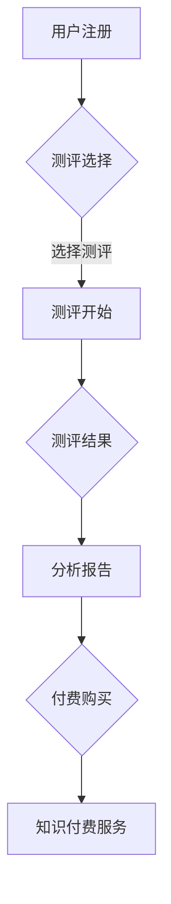

> 在线心理测评，性格分析，知识付费，机器学习，自然语言处理，深度学习，心理评估，数据分析

## 1. 背景介绍

近年来，随着互联网技术的快速发展和移动互联网的普及，人们对心理健康和自我认知的需求日益增长。在线心理测评和性格分析作为一种便捷、高效、个性化的服务，逐渐成为人们关注的焦点。知识付费模式的兴起为在线心理测评和性格分析提供了新的商业模式和发展机遇。

传统的心理测评通常需要专业的评估师进行线下测试和解读，成本较高，时间也相对较长。而在线心理测评则通过网络平台，利用问卷调查、心理测试、图像识别等技术，为用户提供便捷、高效的心理评估服务。

知识付费模式是指通过付费获取知识、技能和服务的商业模式。在线心理测评和性格分析平台可以通过知识付费的方式，提供更专业的测评内容、个性化的分析报告、心理咨询服务等，满足用户多样化的需求。

## 2. 核心概念与联系

**2.1 在线心理测评与性格分析**

在线心理测评是指通过网络平台，利用问卷调查、心理测试、图像识别等技术，为用户提供便捷、高效的心理评估服务的过程。

性格分析是指通过对个体行为、思维、情感等方面的观察和分析，来揭示其性格特点和心理特征的过程。

**2.2 知识付费模式**

知识付费模式是指通过付费获取知识、技能和服务的商业模式。在线心理测评和性格分析平台可以通过知识付费的方式，提供更专业的测评内容、个性化的分析报告、心理咨询服务等，满足用户多样化的需求。

**2.3 技术架构**

在线心理测评和性格分析平台的架构通常包括以下几个模块：

* **用户模块:** 用户注册、登录、个人信息管理等功能。
* **测评模块:** 提供各种类型的在线心理测评和性格分析工具。
* **数据分析模块:** 对用户测评数据进行分析和处理，生成个性化的分析报告。
* **知识库模块:** 存储心理学知识、测评内容、分析模型等数据。
* **支付模块:** 处理用户付费和订单管理。

**2.4 Mermaid 流程图**



## 3. 核心算法原理 & 具体操作步骤

**3.1 算法原理概述**

在线心理测评和性格分析通常采用机器学习和自然语言处理等算法，对用户测评数据进行分析和预测。

* **机器学习:** 利用算法从数据中学习规律，对用户行为、心理特征进行预测。常见的机器学习算法包括支持向量机、决策树、随机森林、神经网络等。
* **自然语言处理:** 对用户文本输入进行分析和理解，提取情感、态度、主题等信息，用于性格分析和心理评估。

**3.2 算法步骤详解**

1. **数据收集:** 收集用户测评数据、个人信息、行为数据等。
2. **数据预处理:** 对数据进行清洗、转换、编码等处理，使其适合算法训练。
3. **模型训练:** 利用机器学习算法，对数据进行训练，建立心理测评和性格分析模型。
4. **模型评估:** 对模型的准确率、召回率、F1-score等指标进行评估，优化模型参数。
5. **模型部署:** 将训练好的模型部署到线上平台，为用户提供心理测评和性格分析服务。

**3.3 算法优缺点**

* **优点:**

    * 自动化程度高，效率高。
    * 可处理海量数据，发现隐藏规律。
    * 个性化程度高，提供定制化服务。

* **缺点:**

    * 数据质量对算法效果影响较大。
    * 模型解释性较差，难以理解算法决策。
    * 存在算法偏差和公平性问题。

**3.4 算法应用领域**

* **心理健康评估:** 识别抑郁、焦虑、压力等心理问题。
* **性格分析:** 了解个体性格特点，提供个性化建议。
* **人才招聘:** 评估候选人的性格和能力，提高招聘效率。
* **教育辅导:** 了解学生的学习风格和心理状态，提供个性化辅导。

## 4. 数学模型和公式 & 详细讲解 & 举例说明

**4.1 数学模型构建**

在线心理测评和性格分析通常采用统计模型和机器学习模型。

* **统计模型:** 例如，使用多项Logistic回归模型预测用户是否患有抑郁症。
* **机器学习模型:** 例如，使用支持向量机模型对用户性格进行分类。

**4.2 公式推导过程**

* **Logistic回归模型:**

$$
P(Y=1|X) = \frac{1}{1 + e^{-(w^T X + b)}}
$$

其中：

* $P(Y=1|X)$ 是用户患有抑郁症的概率。
* $X$ 是用户的特征向量。
* $w$ 是模型参数向量。
* $b$ 是模型偏置项。

**4.3 案例分析与讲解**

假设我们有一个包含用户年龄、性别、睡眠时间等特征的数据库，以及用户是否患有抑郁症的标签。我们可以使用Logistic回归模型训练一个预测模型，将用户的特征输入模型，输出用户患有抑郁症的概率。

## 5. 项目实践：代码实例和详细解释说明

**5.1 开发环境搭建**

* Python 3.x
* Jupyter Notebook
* scikit-learn
* TensorFlow/PyTorch

**5.2 源代码详细实现**

```python
# 导入必要的库
import pandas as pd
from sklearn.model_selection import train_test_split
from sklearn.linear_model import LogisticRegression
from sklearn.metrics import accuracy_score

# 加载数据
data = pd.read_csv('depression_data.csv')

# 分割数据
X = data.drop('depression', axis=1)
y = data['depression']
X_train, X_test, y_train, y_test = train_test_split(X, y, test_size=0.2, random_state=42)

# 训练模型
model = LogisticRegression()
model.fit(X_train, y_train)

# 预测结果
y_pred = model.predict(X_test)

# 计算准确率
accuracy = accuracy_score(y_test, y_pred)
print(f'准确率: {accuracy}')
```

**5.3 代码解读与分析**

* 首先，导入必要的库，包括 pandas 用于数据处理， scikit-learn 用于机器学习模型训练和评估。
* 然后，加载数据，并将数据分割成训练集和测试集。
* 接下来，训练 LogisticRegression 模型，并使用测试集评估模型的准确率。

**5.4 运行结果展示**

运行代码后，会输出模型的准确率。

## 6. 实际应用场景

**6.1 在线心理测评平台**

在线心理测评平台可以利用知识付费模式，提供各种类型的在线心理测评和性格分析服务，例如：

* **性格测试:** 了解个体性格特点，提供个性化建议。
* **压力测试:** 评估用户压力水平，提供压力管理建议。
* **情绪测试:** 识别用户情绪状态，提供情绪调节建议。

**6.2 企业人才招聘**

企业可以利用在线心理测评和性格分析工具，对候选人进行评估，提高招聘效率和准确率。

**6.3 教育辅导机构**

教育辅导机构可以利用在线心理测评工具，了解学生的学习风格和心理状态，提供个性化辅导。

**6.4 未来应用展望**

在线心理测评和性格分析技术将继续发展，应用场景将更加广泛，例如：

* **智能医疗:** 用于辅助诊断和治疗心理疾病。
* **个性化教育:** 提供个性化学习方案和辅导。
* **人机交互:** 用于开发更智能、更人性化的交互系统。

## 7. 工具和资源推荐

**7.1 学习资源推荐**

* **书籍:**

    * 《机器学习》 - 周志华
    * 《深度学习》 - Ian Goodfellow

* **在线课程:**

    * Coursera: Machine Learning
    * edX: Deep Learning

**7.2 开发工具推荐**

* **Python:** 广泛应用于机器学习和数据分析。
* **Jupyter Notebook:** 用于编写和运行 Python 代码，可视化数据分析结果。
* **scikit-learn:** Python 机器学习库，提供各种算法和工具。
* **TensorFlow/PyTorch:** 深度学习框架，用于训练复杂的神经网络模型。

**7.3 相关论文推荐**

* **Personality Prediction Using Deep Learning**
* **A Survey of Online Psychological Assessment**

## 8. 总结：未来发展趋势与挑战

**8.1 研究成果总结**

在线心理测评和性格分析技术取得了显著进展，能够有效地评估用户的心理状态和性格特点。

**8.2 未来发展趋势**

* **模型精度提升:** 利用更先进的机器学习算法和深度学习模型，提高模型预测精度。
* **数据隐私保护:** 加强数据安全和隐私保护措施，确保用户数据安全。
* **个性化服务:** 提供更个性化的测评内容和分析报告，满足用户多样化需求。

**8.3 面临的挑战**

* **数据质量问题:** 在线心理测评数据质量参差不齐，需要加强数据清洗和标注工作。
* **算法解释性问题:** 许多机器学习模型的决策过程难以解释，需要开发更可解释的算法。
* **伦理问题:** 在线心理测评和性格分析技术可能存在伦理风险，需要制定相应的规范和政策。

**8.4 研究展望**

未来，在线心理测评和性格分析技术将继续发展，应用场景将更加广泛，为人们提供更便捷、高效、个性化的心理健康服务。


## 9. 附录：常见问题与解答

**9.1 问:** 在线心理测评结果准确吗？

**答:** 在线心理测评结果有一定的参考价值，但不能完全替代专业的心理评估。

**9.2 问:** 在线心理测评数据安全吗？

**答:**  reputable 在线心理测评平台会采取严格的安全措施保护用户数据隐私。

**9.3 问:** 在线心理测评可以替代线下心理咨询吗？

**答:** 在线心理测评可以作为心理咨询的辅助工具，但不能完全替代线下心理咨询。


作者：禅与计算机程序设计艺术 / Zen and the Art of Computer Programming 
<end_of_turn>