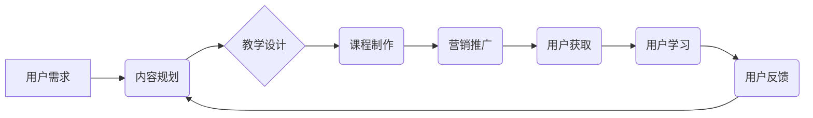

> 知识付费、课程体系、内容规划、教学设计、营销推广、用户运营、技术架构、数据分析

## 1. 背景介绍

知识经济时代，信息爆炸，学习需求日益增长。传统教育模式面临着挑战，知识付费模式应运而生，成为新兴的教育产业趋势。知识付费是指通过付费的方式获取知识、技能和服务的商业模式。它打破了传统教育的时空限制，为用户提供了更加灵活、个性化的学习体验。

知识付费课程体系的打造，需要从内容规划、教学设计、营销推广、用户运营等多个方面进行全方位考虑。

## 2. 核心概念与联系

**2.1 知识付费课程体系的核心概念**

* **知识付费:** 通过付费获取知识、技能和服务的商业模式。
* **课程体系:**  多个主题相关的课程按照一定的逻辑顺序和层次结构组合而成的学习体系。
* **内容规划:**  根据目标用户需求和市场趋势，制定课程内容框架和学习路径。
* **教学设计:**  根据课程目标和用户特点，设计课程内容、教学方法和评估方式。
* **营销推广:**  通过线上线下渠道，推广课程体系，吸引目标用户。
* **用户运营:**  提供优质的学习体验，建立用户粘性，促进用户复购。

**2.2 知识付费课程体系的架构**



## 3. 核心算法原理 & 具体操作步骤

**3.1 算法原理概述**

知识付费课程体系的打造，本质上是一个内容生产和用户运营的系统工程。需要运用数据分析、用户画像、内容推荐等算法，实现精准内容推送和个性化学习体验。

**3.2 算法步骤详解**

1. **用户画像分析:** 收集用户数据，分析用户兴趣、学习习惯、知识水平等，构建用户画像。
2. **内容推荐算法:** 基于用户画像，推荐相关课程和学习资源。
3. **学习路径规划:** 根据用户学习目标和进度，规划个性化学习路径。
4. **用户反馈收集:** 收集用户对课程的评价和建议，用于改进课程内容和教学设计。
5. **数据分析与优化:**  分析用户行为数据，优化课程体系结构和运营策略。

**3.3 算法优缺点**

* **优点:** 能够实现精准内容推送、个性化学习体验，提高用户学习效率和满意度。
* **缺点:** 需要大量的数据支撑，算法模型需要不断优化，才能保证推荐效果和用户体验。

**3.4 算法应用领域**

* 在线教育平台
* 知识付费网站
* 企业培训系统
* 个人学习工具

## 4. 数学模型和公式 & 详细讲解 & 举例说明

**4.1 数学模型构建**

用户学习兴趣模型可以采用基于协同过滤的推荐算法，其核心思想是：

*  如果用户A和用户B对相似的课程感兴趣，那么用户A可能也对用户B喜欢的课程感兴趣。

**4.2 公式推导过程**

协同过滤算法的推荐公式可以表示为：

$$
r_{ui} = \frac{\sum_{j \in N(u)} s_{uj} \cdot s_{uj} }{\sum_{j \in N(u)} s_{uj}^2}
$$

其中：

* $r_{ui}$: 用户u对课程i的评分
* $s_{uj}$: 用户u对课程j的评分
* $N(u)$: 用户u喜欢的课程集合

**4.3 案例分析与讲解**

假设有两个用户A和B，他们都喜欢编程课程。用户A对Python课程评分为5，对Java课程评分为4，用户B对Python课程评分为4，对Java课程评分为5。

根据公式，我们可以计算出用户A对Java课程的推荐评分：

$$
r_{A,Java} = \frac{5 \cdot 4}{5^2 + 4^2} = 0.8
$$

## 5. 项目实践：代码实例和详细解释说明

**5.1 开发环境搭建**

* Python 3.x
* Flask 或 Django 框架
* 数据库 (MySQL, PostgreSQL)

**5.2 源代码详细实现**

```python
from flask import Flask, request, jsonify

app = Flask(__name__)

# 用户数据
users = {
    1: {'name': 'Alice', 'interests': ['Python', 'Java']},
    2: {'name': 'Bob', 'interests': ['Java', 'C++']}
}

# 课程数据
courses = {
    1: {'name': 'Python', 'rating': 4.5},
    2: {'name': 'Java', 'rating': 4.2},
    3: {'name': 'C++', 'rating': 3.8}
}

@app.route('/recommend', methods=['POST'])
def recommend():
    user_id = request.json.get('user_id')
    if user_id:
        user = users.get(user_id)
        if user:
            recommendations = []
            for course_id, course in courses.items():
                if course['name'] in user['interests']:
                    recommendations.append(course)
            return jsonify({'recommendations': recommendations})
    return jsonify({'error': 'User not found'}), 404

if __name__ == '__main__':
    app.run(debug=True)
```

**5.3 代码解读与分析**

* 该代码实现了一个简单的课程推荐系统。
* 用户数据和课程数据存储在字典中。
* `/recommend` 路由接收用户ID，根据用户兴趣推荐相关课程。

**5.4 运行结果展示**

* 发送 POST 请求到 `/recommend` 路由，传入用户ID，例如：

```json
{
  "user_id": 1
}
```

* 服务器会返回包含推荐课程信息的 JSON 数据。

## 6. 实际应用场景

**6.1 在线教育平台**

* 推荐个性化学习课程
* 提供学习进度跟踪和反馈

**6.2 知识付费网站**

* 推广相关课程和付费内容
* 建立用户付费意愿

**6.3 企业培训系统**

* 根据员工技能和岗位需求，推荐培训课程
* 提升员工技能水平和工作效率

**6.4 个人学习工具**

* 根据用户学习目标和兴趣，推荐学习资源
* 帮助用户高效学习和提升自我

**6.5 未来应用展望**

* 基于人工智能和大数据技术的深度学习，实现更精准的课程推荐和个性化学习体验。
* 与虚拟现实、增强现实等技术结合，打造沉浸式学习环境。
* 将知识付费课程体系与元宇宙等新兴技术融合，构建虚拟学习社区。

## 7. 工具和资源推荐

**7.1 学习资源推荐**

* 在线课程平台：Coursera, edX, Udemy
* 技术博客和论坛：Stack Overflow, GitHub
* 书籍和论文：计算机科学相关书籍和论文

**7.2 开发工具推荐**

* Python 编程语言
* Flask 或 Django 框架
* 数据库管理系统 (MySQL, PostgreSQL)
* 数据可视化工具 (Tableau, Power BI)

**7.3 相关论文推荐**

* Collaborative Filtering for Implicit Feedback Datasets
* Deep Learning for Recommender Systems
* Personalized Learning Paths in MOOCs

## 8. 总结：未来发展趋势与挑战

**8.1 研究成果总结**

知识付费课程体系的打造，取得了显著成果，为用户提供了更加便捷、高效的学习体验。

**8.2 未来发展趋势**

* 人工智能和大数据技术的应用将进一步提升课程推荐的精准度和个性化程度。
* 虚拟现实、增强现实等技术将打造更加沉浸式的学习环境。
* 知识付费课程体系将与元宇宙等新兴技术融合，构建虚拟学习社区。

**8.3 面临的挑战**

* 内容质量的保证
* 用户隐私保护
* 平台运营成本

**8.4 研究展望**

* 研究更有效的课程推荐算法和个性化学习路径规划方法。
* 开发更加安全、可靠的知识付费平台。
* 探索知识付费模式与其他教育模式的融合发展。

## 9. 附录：常见问题与解答

**9.1 如何选择合适的课程体系？**

* 确定自己的学习目标和兴趣。
* 了解不同课程体系的课程内容、教学方法和评价方式。
* 阅读用户评价和反馈，选择口碑较好的课程体系。

**9.2 如何提高学习效率？**

* 制定学习计划，并坚持执行。
* 积极参与课程互动，与老师和同学交流学习心得。
* 利用碎片化时间进行学习，例如通勤时间、午休时间等。

**9.3 如何解决学习过程中遇到的问题？**

* 咨询老师或课程客服。
* 在课程论坛或社区寻求帮助。
* 通过网络搜索查找相关资料。


作者：禅与计算机程序设计艺术 / Zen and the Art of Computer Programming 
<end_of_turn>