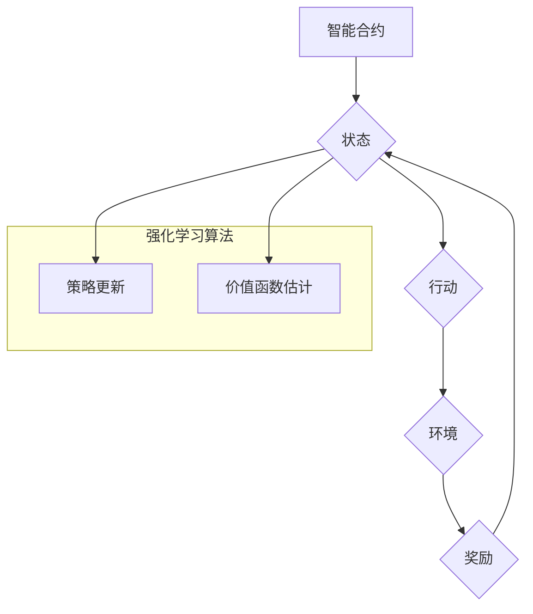

> 强化学习，区块链，智能合约，去中心化，安全，可信

## 1. 背景介绍

区块链技术以其去中心化、透明、安全等特性，在金融、供应链管理、医疗保健等领域展现出巨大的应用潜力。然而，传统的区块链系统在智能合约执行、网络安全、资源分配等方面存在一些局限性。强化学习（Reinforcement Learning，RL）作为一种机器学习范式，能够通过智能体与环境的交互学习最优策略，为解决区块链技术中的挑战提供新的思路。

## 2. 核心概念与联系

**2.1 强化学习概述**

强化学习是一种基于交互学习的机器学习方法，其核心在于智能体通过与环境的交互，不断学习并优化其行为策略，以最大化累积的奖励。

* **智能体 (Agent):**  执行行动并接收环境反馈的实体。
* **环境 (Environment):** 智能体所处的外部世界，会根据智能体的行动产生相应的状态变化和奖励信号。
* **状态 (State):** 环境在特定时刻的描述，反映了环境的当前状况。
* **行动 (Action):** 智能体在特定状态下可以执行的可选操作。
* **奖励 (Reward):** 环境对智能体行动的反馈，可以是正向奖励或负向惩罚。
* **策略 (Policy):** 智能体在不同状态下选择行动的规则，即智能体行为的决策策略。

**2.2 区块链与强化学习的结合**

将强化学习应用于区块链技术，可以实现以下目标：

* **智能合约优化:** 通过强化学习，可以训练智能合约自动执行更优的交易策略，提高交易效率和安全性。
* **网络安全增强:**  强化学习可以用于训练网络安全模型，识别和防御攻击行为，提升区块链网络的安全性。
* **资源分配优化:**  强化学习可以帮助区块链网络更有效地分配资源，例如算力、存储空间等，提高网络性能和可扩展性。

**2.3  核心架构**



## 3. 核心算法原理 & 具体操作步骤

**3.1 算法原理概述**

强化学习算法的核心是通过不断地与环境交互，学习最优策略。常见的强化学习算法包括：

* **Q-学习:**  通过学习状态-行动值函数 (Q-value)，选择最大Q值的行动。
* **SARSA:**  与Q-学习类似，但更新Q值时使用当前策略的行动。
* **Deep Q-Network (DQN):**  使用深度神经网络来估计Q值，能够处理高维状态空间。

**3.2 算法步骤详解**

1. **初始化:**  初始化智能体策略、价值函数和学习参数。
2. **环境交互:**  智能体从环境中获取当前状态，根据策略选择行动。
3. **奖励获取:**  环境根据智能体的行动产生奖励信号。
4. **状态更新:**  环境根据智能体的行动进入新的状态。
5. **策略更新:**  根据奖励信号和价值函数，更新智能体的策略。
6. **价值函数估计:**  根据奖励信号和策略更新，估计价值函数。
7. **重复步骤2-6:**  重复以上步骤，直到智能体学习到最优策略。

**3.3 算法优缺点**

* **优点:**  能够学习复杂决策策略，适应动态环境。
* **缺点:**  训练过程可能需要大量数据和计算资源，容易陷入局部最优。

**3.4 算法应用领域**

* **游戏:**  训练游戏AI，例如AlphaGo。
* **机器人:**  训练机器人控制策略，例如自动驾驶。
* **金融:**  优化投资策略，预测市场趋势。
* **医疗:**  辅助医生诊断疾病，制定治疗方案。

## 4. 数学模型和公式 & 详细讲解 & 举例说明

**4.1 数学模型构建**

强化学习的数学模型主要包括状态空间、行动空间、奖励函数和策略函数。

* **状态空间 (S):**  所有可能的系统状态的集合。
* **行动空间 (A):**  智能体在每个状态下可以执行的所有行动的集合。
* **奖励函数 (R):**  描述智能体在特定状态执行特定行动后获得的奖励。
* **策略函数 (π):**  描述智能体在特定状态下选择行动的概率分布。

**4.2 公式推导过程**

Q-学习算法的核心公式是：

$$Q(s, a) = Q(s, a) + \alpha [r + \gamma \max_{a'} Q(s', a') - Q(s, a)]$$

其中：

* $Q(s, a)$:  状态 $s$ 下执行行动 $a$ 的价值函数。
* $\alpha$:  学习率，控制学习速度。
* $r$:  在状态 $s$ 执行行动 $a$ 后获得的奖励。
* $\gamma$:  折扣因子，控制未来奖励的权重。
* $s'$:  执行行动 $a$ 后进入的下一个状态。
* $a'$:  在下一个状态 $s'$ 下选择执行的最佳行动。

**4.3 案例分析与讲解**

假设一个智能体在玩一个简单的游戏，目标是到达终点。游戏环境的状态包括智能体的当前位置，行动包括向上、向下、向左、向右移动。奖励函数定义为：到达终点获得最大奖励，其他状态获得较小的奖励。

使用Q-学习算法，智能体可以学习到到达终点的最佳策略。通过不断地与环境交互，更新Q值，最终找到最优的行动序列，从而达到游戏目标。

## 5. 项目实践：代码实例和详细解释说明

**5.1 开发环境搭建**

* Python 3.x
* TensorFlow 或 PyTorch 深度学习框架
* OpenAI Gym 或其他强化学习环境

**5.2 源代码详细实现**

```python
import gym
import numpy as np
from tensorflow.keras.models import Sequential
from tensorflow.keras.layers import Dense

# 创建强化学习环境
env = gym.make('CartPole-v1')

# 定义神经网络模型
model = Sequential()
model.add(Dense(128, activation='relu', input_shape=(4,)))
model.add(Dense(64, activation='relu'))
model.add(Dense(2, activation='softmax'))

# 定义损失函数和优化器
loss_fn = tf.keras.losses.CategoricalCrossentropy()
optimizer = tf.keras.optimizers.Adam()

# 训练循环
for episode in range(1000):
    state = env.reset()
    done = False
    total_reward = 0

    while not done:
        # 选择行动
        action = np.argmax(model.predict(state.reshape(1, -1)))

        # 执行行动
        next_state, reward, done, _ = env.step(action)

        # 更新状态
        state = next_state

        # 计算奖励
        total_reward += reward

    # 更新模型参数
    with tf.GradientTape() as tape:
        loss = loss_fn(y_true, model.predict(state.reshape(1, -1)))
    gradients = tape.gradient(loss, model.trainable_variables)
    optimizer.apply_gradients(zip(gradients, model.trainable_variables))

    # 打印训练进度
    print(f'Episode: {episode}, Total Reward: {total_reward}')

# 保存模型
model.save('cartpole_model.h5')
```

**5.3 代码解读与分析**

* 代码首先创建强化学习环境，例如OpenAI Gym中的CartPole-v1环境。
* 然后定义一个神经网络模型，用于估计状态-行动值函数。
* 训练循环中，智能体与环境交互，根据策略选择行动，执行行动并获得奖励。
* 使用梯度下降算法更新模型参数，使模型能够学习到最优策略。
* 最后保存训练好的模型。

**5.4 运行结果展示**

训练完成后，可以加载模型并测试其性能。如果模型训练成功，智能体应该能够在CartPole环境中保持平衡较长时间。

## 6. 实际应用场景

**6.1 智能合约优化**

* **自动交易策略:**  训练智能合约自动执行交易策略，例如市场波动时自动买入或卖出资产。
* **供应链管理:**  训练智能合约自动管理供应链中的商品流转，提高效率和透明度。
* **去中心化金融 (DeFi):**  训练智能合约自动执行贷款、借贷、保险等金融服务，降低成本和风险。

**6.2 网络安全增强**

* **攻击检测:**  训练模型识别区块链网络中的异常行为，例如恶意交易或攻击尝试。
* **漏洞修复:**  训练模型自动发现和修复区块链智能合约中的漏洞。
* **身份验证:**  训练模型进行身份验证，提高区块链网络的安全性。

**6.3 资源分配优化**

* **算力分配:**  训练模型根据需求动态分配区块链网络的算力资源，提高网络性能。
* **存储空间分配:**  训练模型根据数据大小和访问频率动态分配区块链网络的存储空间资源，提高存储效率。

**6.4 未来应用展望**

* **更复杂的强化学习算法:**  例如深度强化学习，能够处理更复杂的区块链系统。
* **联邦学习:**  训练模型时，无需将数据集中到一个中心服务器，提高隐私保护。
* **跨链强化学习:**  训练模型能够跨越不同的区块链网络进行交互，实现更广泛的应用。

## 7. 工具和资源推荐

**7.1 学习资源推荐**

* **书籍:**
    * 《强化学习：原理、算法和应用》
    * 《深度强化学习》
* **在线课程:**
    * Coursera: 强化学习
    * Udacity: 深度强化学习
* **博客和网站:**
    * OpenAI Blog
    * DeepMind Blog

**7.2 开发工具推荐**

* **Python:**  强化学习开发的主要编程语言。
* **TensorFlow:**  流行的深度学习框架。
* **PyTorch:**  另一种流行的深度学习框架。
* **OpenAI Gym:**  强化学习环境库。

**7.3 相关论文推荐**

* **DQN:**  Mnih et al. (2015)
* **Policy Gradient:**  Sutton et al. (2000)
* **Actor-Critic:**  Mnih et al. (2016)

## 8. 总结：未来发展趋势与挑战

**8.1 研究成果总结**

近年来，强化学习在区块链技术领域取得了显著进展，例如智能合约优化、网络安全增强、资源分配优化等。

**8.2 未来发展趋势**

* **更复杂的强化学习算法:**  例如深度强化学习，能够处理更复杂的区块链系统。
* **联邦学习:**  训练模型时，无需将数据集中到一个中心服务器，提高隐私保护。
* **跨链强化学习:**  训练模型能够跨越不同的区块链网络进行交互，实现更广泛的应用。

**8.3 面临的挑战**

* **数据稀缺:**  区块链数据通常稀缺，难以训练有效的强化学习模型。
* **环境复杂性:**  区块链系统环境复杂，难以建模和预测。
* **安全性和可信度:**  强化学习模型的安全性、可信度和鲁棒性需要进一步研究。

**8.4 研究展望**

未来，强化学习在区块链技术领域的应用将更加广泛和深入，需要进一步研究解决上述挑战，推动区块链技术的发展。

## 9. 附录：常见问题与解答

**9.1 如何选择合适的强化学习算法？**

选择合适的强化学习算法取决于具体的应用场景和系统特点。例如