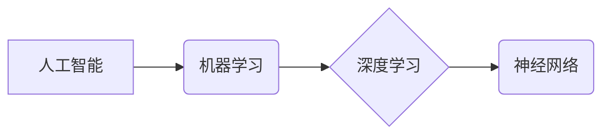

> 人工智能、机器学习、深度学习、神经网络、算法、模型、应用

## 1. 背景介绍

人工智能（Artificial Intelligence，简称AI）作为21世纪最具颠覆性的科技之一，正在深刻地改变着我们的生活和工作方式。从自动驾驶汽车到智能语音助手，从医疗诊断到金融风险评估，AI技术的应用领域日益广泛。然而，对于许多人来说，AI仍然是一个充满神秘和未知的领域。

本篇文章将从基础原理出发，以清晰易懂的语言，深入浅出地探索人工智能的基本框架，帮助读者理解AI的本质、核心概念和发展趋势。

## 2. 核心概念与联系

人工智能的核心概念包括：

* **机器学习（Machine Learning，简称ML）：** 是一种使计算机能够从数据中学习并改进性能的算法。
* **深度学习（Deep Learning，简称DL）：** 是一种基于多层神经网络的机器学习方法，能够学习更复杂的模式和特征。
* **神经网络（Neural Network，简称NN）：** 是一种模仿人脑神经元结构和功能的计算模型。

这些概念之间存在着密切的联系：

* 机器学习是人工智能的核心技术之一，深度学习是机器学习的一种特殊形式。
* 深度学习算法通常使用多层神经网络进行训练，从而能够学习更复杂的模式和特征。

**核心概念与联系流程图：**



## 3. 核心算法原理 & 具体操作步骤

### 3.1  算法原理概述

机器学习算法的核心原理是通过训练模型来学习数据中的模式和规律。训练过程通常包括以下步骤：

1. **数据收集和预处理：** 收集相关数据并进行清洗、转换和特征工程等预处理操作。
2. **模型选择：** 根据具体任务选择合适的机器学习算法模型。
3. **模型训练：** 使用训练数据训练模型，调整模型参数以最小化预测误差。
4. **模型评估：** 使用测试数据评估模型的性能，并进行调参优化。
5. **模型部署：** 将训练好的模型部署到实际应用场景中。

### 3.2  算法步骤详解

以线性回归算法为例，详细说明其训练步骤：

1. **数据准备：** 准备包含输入特征和目标变量的数据集。
2. **模型初始化：** 初始化模型参数，例如权重和偏差。
3. **损失函数计算：** 计算模型预测值与真实值之间的误差，使用损失函数衡量误差大小。
4. **梯度下降：** 计算模型参数的梯度，并根据梯度更新模型参数，以减小损失函数值。
5. **迭代训练：** 重复步骤3和4，直到损失函数收敛或达到预设的训练次数。

### 3.3  算法优缺点

**线性回归算法的优点：**

* 算法简单易懂，易于实现。
* 计算效率高，适合处理大规模数据。

**线性回归算法的缺点：**

* 只能处理线性关系的数据，对于非线性关系的数据拟合效果较差。
* 对异常值敏感，容易受到异常值的影响。

### 3.4  算法应用领域

线性回归算法广泛应用于以下领域：

* 房价预测
* 股票价格预测
* 销售预测
* 医疗诊断

## 4. 数学模型和公式 & 详细讲解 & 举例说明

### 4.1  数学模型构建

线性回归模型的数学模型如下：

$$
y = w_0 + w_1x_1 + w_2x_2 + ... + w_nx_n + \epsilon
$$

其中：

* $y$ 是目标变量
* $x_1, x_2, ..., x_n$ 是输入特征
* $w_0, w_1, w_2, ..., w_n$ 是模型参数（权重）
* $\epsilon$ 是误差项

### 4.2  公式推导过程

线性回归模型的目标是找到最优的权重参数，使得模型预测值与真实值之间的误差最小。常用的损失函数是均方误差（Mean Squared Error，MSE）：

$$
MSE = \frac{1}{n} \sum_{i=1}^{n} (y_i - \hat{y}_i)^2
$$

其中：

* $n$ 是样本数量
* $y_i$ 是第 $i$ 个样本的真实值
* $\hat{y}_i$ 是模型预测的第 $i$ 个样本的值

通过梯度下降算法，可以迭代更新权重参数，以最小化MSE。

### 4.3  案例分析与讲解

假设我们想要预测房屋价格，输入特征包括房屋面积、房间数量、地理位置等。我们可以使用线性回归模型来建立房屋价格预测模型。

通过训练数据，模型会学习到房屋面积、房间数量等特征与房屋价格之间的关系，并找到最优的权重参数。

## 5. 项目实践：代码实例和详细解释说明

### 5.1  开发环境搭建

本项目使用Python语言进行开发，需要安装以下软件包：

* NumPy
* Pandas
* Scikit-learn

### 5.2  源代码详细实现

```python
import numpy as np
from sklearn.linear_model import LinearRegression
from sklearn.model_selection import train_test_split

# 准备数据
data = np.array([[100, 2], [150, 3], [200, 4], [250, 5]])
X = data[:, 0].reshape(-1, 1)  # 特征
y = data[:, 1]  # 目标变量

# 将数据划分为训练集和测试集
X_train, X_test, y_train, y_test = train_test_split(X, y, test_size=0.2, random_state=42)

# 创建线性回归模型
model = LinearRegression()

# 训练模型
model.fit(X_train, y_train)

# 预测测试集数据
y_pred = model.predict(X_test)

# 评估模型性能
print('Coefficients:', model.coef_)
print('Intercept:', model.intercept_)
print('R-squared:', model.score(X_test, y_test))
```

### 5.3  代码解读与分析

* 代码首先准备数据，并将其转换为NumPy数组。
* 然后使用`train_test_split`函数将数据划分为训练集和测试集。
* 创建线性回归模型实例，并使用`fit`方法训练模型。
* 使用`predict`方法预测测试集数据，并使用`score`方法评估模型性能。

### 5.4  运行结果展示

运行代码后，会输出模型的权重、截距和R-squared值，用于评估模型的拟合效果。

## 6. 实际应用场景

### 6.1  医疗诊断

AI技术可以辅助医生进行疾病诊断，例如通过分析医学影像数据识别肿瘤、肺炎等疾病。

### 6.2  金融风险评估

AI算法可以分析金融数据，识别潜在的风险，例如欺诈交易、信用风险等。

### 6.3  个性化推荐

AI技术可以根据用户的行为数据，推荐个性化的商品、服务和内容。

### 6.4  未来应用展望

随着人工智能技术的不断发展，其应用场景将更加广泛，例如：

* 自动驾驶汽车
* 智能机器人
* 人机交互
* 药物研发

## 7. 工具和资源推荐

### 7.1  学习资源推荐

* **书籍:**
    * 《深度学习》
    * 《机器学习实战》
    * 《人工智能：一种现代方法》
* **在线课程:**
    * Coursera
    * edX
    * Udacity

### 7.2  开发工具推荐

* **Python:** 
    * TensorFlow
    * PyTorch
    * scikit-learn

### 7.3  相关论文推荐

* **《ImageNet Classification with Deep Convolutional Neural Networks》**
* **《Attention Is All You Need》**
* **《BERT: Pre-training of Deep Bidirectional Transformers for Language Understanding》**

## 8. 总结：未来发展趋势与挑战

### 8.1  研究成果总结

人工智能技术取得了长足的进步，在多个领域取得了突破性进展。

### 8.2  未来发展趋势

* **模型规模和复杂度提升:** 
    * 更大的模型参数量和更复杂的模型架构，例如Transformer模型。
* **数据驱动的发展:** 
    * 更大规模、更高质量的数据集，推动模型性能的提升。
* **跨模态学习:** 
    * 融合文本、图像、音频等多种模态数据，实现更智能的应用。
* **可解释性增强:** 
    * 研究更可解释的AI模型，提高模型的透明度和可信度。

### 8.3  面临的挑战

* **数据安全和隐私保护:** 
    * AI模型训练需要大量数据，如何保证数据安全和隐私保护是一个重要挑战。
* **算法偏见和公平性:** 
    * AI模型可能存在算法偏见，导致不公平的结果，需要研究如何解决算法偏见问题。
* **伦理道德问题:** 
    * AI技术的应用引发了伦理道德问题，例如自动驾驶汽车的责任归属，需要进行深入的伦理思考和规范。

### 8.4  研究展望

未来，人工智能研究将继续朝着更智能、更安全、更可解释的方向发展，为人类社会带来更多福祉。

## 9. 附录：常见问题与解答

**Q1: 什么是机器学习？**

**A1:** 机器学习是一种人工智能技术，通过训练模型来学习数据中的模式和规律，从而能够对新数据进行预测或分类。

**Q2: 深度学习和机器学习有什么区别？**

**A2:** 深度学习是一种基于多层神经网络的机器学习方法，能够学习更复杂的模式和特征。

**Q3: 如何评估机器学习模型的性能？**

**A3:** 常用的评估指标包括准确率、召回率、F1-score、AUC等。

**Q4: 如何选择合适的机器学习算法？**

**A4:** 选择合适的算法需要根据具体任务和数据特点进行选择。

**Q5: 人工智能技术有哪些伦理道德问题？**

**A5:** 人工智能技术的应用引发了伦理道德问题，例如算法偏见、隐私保护、责任归属等。


作者：禅与计算机程序设计艺术 / Zen and the Art of Computer Programming 
<end_of_turn>