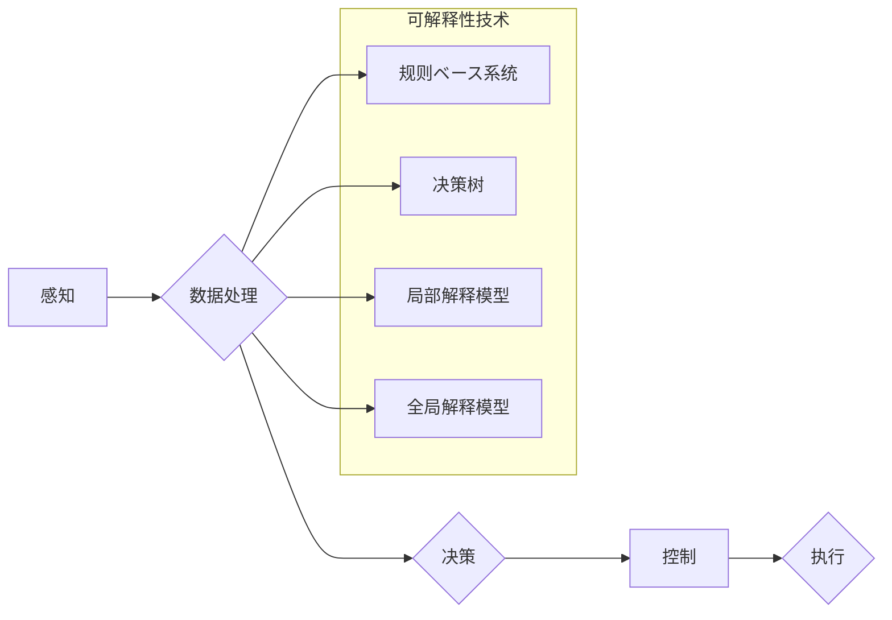

> 自动驾驶, 可解释性, 决策树, 深度学习, 图神经网络, 模型解释, 案例分析

## 1. 背景介绍

自动驾驶技术作为人工智能领域的重要分支，近年来取得了显著进展，但其决策过程的复杂性和黑盒效应仍然是阻碍其广泛应用的关键问题之一。当自动驾驶系统发生事故时，难以追溯决策的具体原因，这不仅影响事故调查和责任划分，也阻碍公众对自动驾驶技术的信任。因此，提升自动驾驶决策的可解释性成为一个至关重要的研究方向。

可解释性是指人工智能模型决策过程的透明度和可理解性。对于自动驾驶系统而言，可解释性意味着能够清晰地解释驾驶决策背后的逻辑和依据，让人类能够理解和信任自动驾驶系统的行为。

## 2. 核心概念与联系

**2.1 自动驾驶决策过程**

自动驾驶决策过程通常包括以下几个步骤：

1. **感知:** 利用传感器获取周围环境信息，如道路状况、车辆位置、行人信息等。
2. **感知数据处理:** 对获取到的感知数据进行预处理、特征提取和融合，生成驾驶决策所需的输入信息。
3. **决策:** 根据感知数据和预先设定的驾驶策略，做出驾驶决策，如加速、减速、转向等。
4. **控制:** 将驾驶决策转化为车辆控制指令，控制车辆执行决策。

**2.2 可解释性与自动驾驶决策**

可解释性在自动驾驶决策中至关重要，因为它可以帮助：

1. **提高信任度:** 当人类能够理解自动驾驶系统的决策逻辑时，会更加信任其行为。
2. **辅助故障诊断:** 当自动驾驶系统发生错误时，可解释性可以帮助工程师快速定位问题所在。
3. **改进系统设计:** 通过分析可解释性结果，可以发现系统决策中的潜在问题，并改进系统设计。

**2.3 可解释性技术**

目前，提升自动驾驶决策可解释性的技术主要包括以下几种：

1. **规则ベースシステム:** 基于预先定义的规则和逻辑进行决策，决策过程透明易懂。
2. **决策树:** 将决策过程表示为树形结构，每个节点代表一个决策条件，每个分支代表一个决策结果，决策过程可视化清晰。
3. **局部解释模型:** 通过分析模型输入特征对输出的影响，解释模型对特定输入的决策结果。
4. **全局解释模型:** 通过分析模型整体结构和参数，解释模型的决策机制。

**2.4 Mermaid 流程图**



## 3. 核心算法原理 & 具体操作步骤

### 3.1  算法原理概述

本节将详细介绍决策树算法及其在自动驾驶决策可解释性中的应用。

决策树是一种树形结构的机器学习模型，用于分类或回归任务。它通过一系列的决策节点和分支，将数据逐步分类或预测目标值。每个决策节点代表一个特征或条件，每个分支代表一个可能的决策结果。决策树的构建过程称为决策树学习，它通常使用ID3、C4.5或CART等算法。

### 3.2  算法步骤详解

1. **选择最优特征:** 首先，需要选择一个最优特征作为决策节点，该特征应该能够最大程度地将数据分割成不同的类别或子集。常用的选择特征的标准包括信息增益、Gini系数等。
2. **构建决策树:** 根据选择的特征，将数据分割成不同的子集，然后对每个子集重复步骤1，直到满足停止条件，例如达到最大树深度或每个子集包含的样本数量低于阈值。
3. **剪枝:** 为了避免过拟合，需要对构建好的决策树进行剪枝，即删除一些不必要的节点和分支。剪枝算法通常使用正则化技术，例如最小化决策树的复杂度。

### 3.3  算法优缺点

**优点:**

* **易于理解和解释:** 决策树的结构清晰直观，决策过程易于理解和解释。
* **可处理多种数据类型:** 决策树可以处理数值型、分类型和混合型数据。
* **训练速度快:** 决策树的训练速度相对较快。

**缺点:**

* **容易过拟合:** 如果决策树过于复杂，容易过拟合训练数据，导致泛化性能下降。
* **对数据噪声敏感:** 决策树对数据噪声敏感，容易受到异常值的影响。
* **可解释性有限:** 对于复杂的决策树，解释其决策过程仍然可能比较困难。

### 3.4  算法应用领域

决策树算法广泛应用于各种领域，例如：

* **医疗诊断:** 根据患者的症状和病史，预测疾病类型。
* **金融风险评估:** 根据客户的信用记录和财务状况，评估贷款风险。
* **市场营销:** 根据客户的购买行为和偏好，预测客户购买意愿。

## 4. 数学模型和公式 & 详细讲解 & 举例说明

### 4.1  数学模型构建

决策树学习的目标是找到一个最佳的决策树，该树能够最大程度地分类或预测目标值。常用的数学模型包括信息增益和Gini系数。

**信息增益:**

信息增益度量了特征对数据分类的帮助程度。

$$
Gain(S,A) = Entropy(S) - \sum_{v \in Values(A)} \frac{|S_v|}{|S|} Entropy(S_v)
$$

其中：

* $S$ 是训练数据集
* $A$ 是特征
* $Values(A)$ 是特征 $A$ 的所有取值
* $S_v$ 是特征 $A$ 取值为 $v$ 的子集
* $Entropy(S)$ 是数据集 $S$ 的熵

**Gini系数:**

Gini系数度量了数据集的不纯度。

$$
Gini(S) = 1 - \prod_{i=1}^{k} p_i^2
$$

其中：

* $k$ 是数据集 $S$ 中的类别数
* $p_i$ 是类别 $i$ 在数据集 $S$ 中的比例

### 4.2  公式推导过程

信息增益和Gini系数的推导过程可以参考相关机器学习教材。

### 4.3  案例分析与讲解

假设我们有一个数据集，包含关于水果的特征，如颜色、形状和大小，以及目标类别，如苹果、香蕉和橙子。

我们可以使用决策树算法构建一个模型，根据这些特征预测水果的类别。

例如，我们可以选择颜色作为第一个决策节点，将数据分割成红色、黄色和绿色三种子集。然后，我们可以根据形状和大小进一步分割这些子集，直到每个子集都包含同一类水果。

通过分析决策树的结构，我们可以了解哪些特征对水果分类起到了重要作用，以及决策过程是如何进行的。

## 5. 项目实践：代码实例和详细解释说明

### 5.1  开发环境搭建

本项目使用Python语言进行开发，需要安装以下软件包：

* scikit-learn: 机器学习库
* pandas: 数据处理库
* matplotlib: 数据可视化库

### 5.2  源代码详细实现

```python
from sklearn.tree import DecisionTreeClassifier
from sklearn.datasets import load_iris
from sklearn.model_selection import train_test_split
from sklearn.metrics import accuracy_score
import matplotlib.pyplot as plt
from sklearn import tree

# 加载iris数据集
iris = load_iris()
X = iris.data
y = iris.target

# 将数据分割为训练集和测试集
X_train, X_test, y_train, y_test = train_test_split(X, y, test_size=0.2, random_state=42)

# 创建决策树模型
clf = DecisionTreeClassifier()

# 训练模型
clf.fit(X_train, y_train)

# 对测试集进行预测
y_pred = clf.predict(X_test)

# 计算模型准确率
accuracy = accuracy_score(y_test, y_pred)
print(f"模型准确率: {accuracy}")

# 可视化决策树
plt.figure(figsize=(12, 8))
tree.plot_tree(clf, feature_names=iris.feature_names, class_names=iris.target_names, filled=True)
plt.show()
```

### 5.3  代码解读与分析

这段代码首先加载了iris数据集，然后将数据分割为训练集和测试集。接着，创建了一个决策树模型，并使用训练集训练模型。最后，对测试集进行预测，并计算模型的准确率。

代码还包含了可视化决策树的代码，可以直观地看到决策树的结构和决策过程。

### 5.4  运行结果展示

运行代码后，会输出模型的准确率，以及决策树的可视化图。

## 6. 实际应用场景

### 6.1 自动驾驶决策辅助

决策树算法可以用于辅助自动驾驶系统做出决策，例如：

* **行人识别和避让:** 根据行人的位置、速度和方向，预测行人的行为，并做出避让决策。
* **交通信号灯识别和处理:** 根据交通信号灯的颜色和状态，做出加速、减速或停车的决策。
* **道路状况判断:** 根据道路的形状、坡度和路况，判断道路的安全性，并做出相应的驾驶决策。

### 6.2 事故原因分析

当自动驾驶系统发生事故时，决策树算法可以帮助分析事故原因，例如：

* **识别决策错误:** 分析决策树的决策过程，找出导致事故的决策错误。
* **确定故障部件:** 分析决策树中使用的传感器数据，确定可能导致决策错误的传感器故障。
* **评估驾驶员责任:** 分析驾驶员的输入和决策，评估驾驶员在事故中的责任。

### 6.3 系统优化

决策树算法可以用于优化自动驾驶系统的性能，例如：

* **调整驾驶策略:** 根据决策树分析的结果，调整自动驾驶系统的驾驶策略，提高安全性、效率和舒适度。
* **改进传感器配置:** 分析决策树中使用的传感器数据，优化传感器配置，提高感知精度。
* **开发新的功能:** 基于决策树的决策机制，开发新的自动驾驶功能，例如自动泊车、自动换道等。

### 6.4 未来应用展望

随着自动驾驶技术的不断发展，决策树算法在自动驾驶领域的应用前景广阔。未来，决策树算法可能会被应用于更复杂的场景，例如：

* **复杂路况下的决策:** 在拥堵路况、复杂天气条件下，决策树算法可以帮助自动驾驶系统做出更合理的决策。
* **多车协同决策:** 在多车协同驾驶场景下，决策树算法可以帮助车辆之间进行协同决策，提高交通效率和安全性。
* **人机交互:** 决策树算法可以用于分析驾驶员的行为模式，并提供个性化的驾驶建议，实现人机交互。

## 7. 工具和资源推荐

### 7.1  学习资源推荐

* **书籍:**
    * 《机器学习》 - 周志华
    * 《Python机器学习实战》 - 塞缪尔·阿布拉姆斯
* **在线课程:**
    * Coursera: 机器学习
    * edX: 机器学习
* **博客和网站:**
    * Towards Data Science
    * Machine Learning Mastery

### 7.2  开发工具推荐

* **Python:** 
    * scikit-learn: 机器学习库
    * pandas: 数据处理库
    * matplotlib: 数据可视化库
* **IDE:**
    * PyCharm
    * VS Code

### 7.3  相关论文推荐

* **Decision Trees** - J. Ross Quinlan