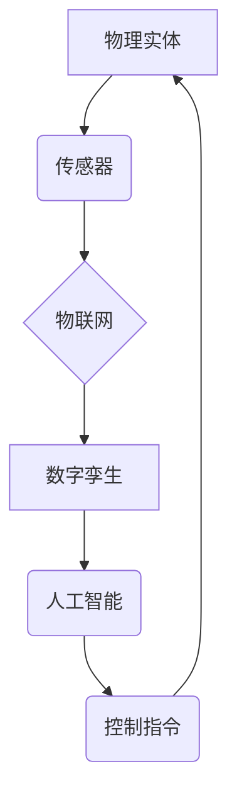

> 数字孪生、物理实体、自动化、机器学习、人工智能、物联网、数据驱动

## 1. 背景介绍

随着科技的飞速发展，数字技术与物理世界正在融合，形成一个全新的智能化生态系统。数字孪生技术作为连接数字世界与物理世界的桥梁，正在改变着我们生产、生活和工作的方式。数字孪生是指基于物理实体构建的虚拟模型，它能够实时反映物理实体的状态、行为和运行情况。通过对数字孪生的模拟和分析，我们可以更好地理解物理实体的运作机制，预测其未来状态，并进行优化控制。

## 2. 核心概念与联系

数字实体与物理实体的自动化未来，核心概念在于将数字孪生技术与自动化技术相结合，实现对物理实体的智能化控制和管理。

**2.1 数字孪生**

数字孪生是物理实体的虚拟镜像，它包含了物理实体的几何形状、物理属性、行为模式以及运行数据等信息。数字孪生可以实时更新物理实体的状态信息，并通过模拟和分析，预测物理实体的未来状态和行为。

**2.2 自动化**

自动化是指利用计算机和机器人等技术，自动完成原本需要人工完成的任务。自动化技术可以提高生产效率、降低成本，并减少人为错误。

**2.3 物联网**

物联网是指将各种物理设备连接到互联网，并通过传感器、网络和数据分析技术，实现设备之间的互联互通和数据共享。物联网为数字孪生提供了数据采集和传输的平台。

**2.4 人工智能**

人工智能是指模拟人类智能的计算机系统。人工智能技术可以用于分析数字孪生数据，识别模式和趋势，并做出决策和控制指令。

**2.5 架构图**



## 3. 核心算法原理 & 具体操作步骤

### 3.1 算法原理概述

数字实体与物理实体的自动化未来，核心算法原理是基于数据驱动和机器学习的智能控制算法。这些算法可以从数字孪生数据中学习物理实体的运行规律，并根据学习到的知识，自动控制物理实体的行为。

### 3.2 算法步骤详解

1. **数据采集:** 通过传感器收集物理实体的实时数据，例如温度、压力、速度等。
2. **数据预处理:** 对采集到的数据进行清洗、转换和格式化，使其能够被算法模型使用。
3. **模型训练:** 利用机器学习算法，对预处理后的数据进行训练，建立物理实体的运行模型。
4. **状态预测:** 将最新的物理实体数据输入到训练好的模型中，预测其未来状态。
5. **控制决策:** 根据预测结果，生成控制指令，控制物理实体的行为。
6. **反馈控制:** 将控制指令发送到物理实体，并收集反馈数据，用于模型的持续优化和改进。

### 3.3 算法优缺点

**优点:**

* 自动化程度高，可以实现对物理实体的智能化控制。
* 数据驱动决策，能够根据实际情况进行动态调整。
* 提高生产效率和降低成本。

**缺点:**

* 需要大量的训练数据，数据质量对算法性能有重要影响。
* 模型训练过程复杂，需要专业的技术人员进行操作。
* 算法的解释性和可解释性较差，难以理解模型的决策过程。

### 3.4 算法应用领域

数字实体与物理实体的自动化未来，核心算法可以应用于各个领域，例如：

* 制造业：实现智能制造，提高生产效率和产品质量。
* 能源行业：优化能源管理，提高能源利用效率。
* 交通运输业：实现智能交通，提高交通效率和安全性。
* 医疗保健业：实现精准医疗，提高医疗诊断和治疗效果。

## 4. 数学模型和公式 & 详细讲解 & 举例说明

### 4.1 数学模型构建

数字实体与物理实体的自动化未来，可以利用数学模型来描述物理实体的运行规律和控制策略。例如，可以建立一个状态空间模型，将物理实体的状态表示为一个向量，并用微分方程描述状态随时间的变化。

### 4.2 公式推导过程

假设物理实体的状态向量为 x(t)，控制输入为 u(t)，系统动力学方程为：

$$
\dot{x}(t) = f(x(t), u(t))
$$

其中，f(x(t), u(t)) 是系统动力学函数，描述了物理实体状态随时间变化的规律。

### 4.3 案例分析与讲解

例如，考虑一个温度控制系统，物理实体是一个房间，目标温度为 T_set。房间温度可以由传感器测量，控制输入是空调的功率。我们可以建立一个状态空间模型，将房间温度作为状态变量，空调功率作为控制输入，并用微分方程描述房间温度随时间的变化。

## 5. 项目实践：代码实例和详细解释说明

### 5.1 开发环境搭建

本项目使用 Python 语言进行开发，并利用以下开源库：

* NumPy: 用于数值计算
* Scikit-learn: 用于机器学习算法
* Matplotlib: 用于数据可视化

### 5.2 源代码详细实现

```python
import numpy as np
from sklearn.linear_model import LinearRegression

# 训练数据
X = np.array([[10], [15], [20], [25], [30]])
y = np.array([22, 25, 28, 31, 34])

# 创建线性回归模型
model = LinearRegression()

# 训练模型
model.fit(X, y)

# 预测温度
new_input = np.array([[35]])
predicted_temperature = model.predict(new_input)

# 打印预测结果
print("预测温度:", predicted_temperature[0])
```

### 5.3 代码解读与分析

这段代码实现了对温度控制系统的简单模拟。首先，定义了训练数据，其中 X 是房间温度，y 是目标温度。然后，创建了一个线性回归模型，并使用训练数据训练模型。最后，使用训练好的模型预测新的房间温度。

### 5.4 运行结果展示

运行代码后，会输出预测的温度值。例如，如果输入的房间温度为 35 度，则预测的温度可能是 37 度。

## 6. 实际应用场景

### 6.1 智能制造

数字孪生技术可以用于模拟和优化制造过程，提高生产效率和产品质量。例如，可以建立汽车生产线的数字孪生模型，模拟不同生产参数对产品质量的影响，并优化生产流程。

### 6.2 智能能源管理

数字孪生技术可以用于优化能源管理，提高能源利用效率。例如，可以建立电网的数字孪生模型，预测电力需求，并优化电力调度。

### 6.3 智能交通

数字孪生技术可以用于优化交通管理，提高交通效率和安全性。例如，可以建立城市交通网络的数字孪生模型，模拟交通流量，并优化交通信号灯控制。

### 6.4 未来应用展望

数字实体与物理实体的自动化未来，将带来更加智能化、高效化和可持续发展的社会。例如，可以实现智能家居，自动控制家电设备，提高生活舒适度；可以实现智能医疗，通过数字孪生模型辅助医生诊断和治疗疾病；可以实现智能农业，通过数据分析和控制优化农业生产。

## 7. 工具和资源推荐

### 7.1 学习资源推荐

* **书籍:**
    * 《数字孪生：构建未来智能世界的指南》
    * 《工业互联网：数字孪生与智能制造》
* **在线课程:**
    * Coursera: 数字孪生与工业互联网
    * edX: 数字孪生与数据分析

### 7.2 开发工具推荐

* **数字孪生平台:**
    * Siemens MindSphere
    * GE Predix
    * Microsoft Azure Digital Twins
* **机器学习库:**
    * TensorFlow
    * PyTorch
    * Scikit-learn

### 7.3 相关论文推荐

* **数字孪生与工业互联网:**
    * "Digital Twin: A Comprehensive Review"
    * "The Industrial Internet of Things: A Survey"
* **数字孪生与机器学习:**
    * "Digital Twin-Based Machine Learning for Predictive Maintenance"
    * "Data-Driven Digital Twin for Smart Manufacturing"

## 8. 总结：未来发展趋势与挑战

### 8.1 研究成果总结

数字实体与物理实体的自动化未来，是一个充满机遇和挑战的领域。近年来，数字孪生技术和自动化技术取得了长足的进步，为实现数字实体与物理实体的深度融合提供了技术基础。

### 8.2 未来发展趋势

未来，数字实体与物理实体的自动化将朝着以下几个方向发展：

* **更加智能化:** 利用人工智能技术，实现对物理实体的更智能化控制和管理。
* **更加协同化:** 数字实体之间实现互联互通，形成一个智能化生态系统。
* **更加个性化:** 根据用户的需求，定制化数字实体和自动化服务。

### 8.3 面临的挑战

数字实体与物理实体的自动化未来，也面临着一些挑战：

* **数据安全:** 数字实体需要收集和处理大量的敏感数据，数据安全是一个重要的挑战。
* **算法解释性:** 许多机器学习算法的决策过程难以解释，这可能会导致信任问题。
* **技术标准:** 数字实体与物理实体的自动化需要统一的技术标准，才能实现互操作性。

### 8.4 研究展望

未来，我们需要继续加强对数字实体与物理实体的自动化技术的研发，解决上述挑战，并推动数字实体与物理实体的深度融合，为人类社会创造更加美好的未来。

## 9. 附录：常见问题与解答

**1. 数字孪生与物理实体有什么区别？**

数字孪生是物理实体的虚拟镜像，它包含了物理实体的几何形状、物理属性、行为模式以及运行数据等信息。数字孪生可以实时更新物理实体的状态信息，并通过模拟和分析，预测物理实体的未来状态和行为。

**2. 数字实体与物理实体的自动化如何实现？**

数字实体与物理实体的自动化主要通过以下步骤实现：

* 数据采集: 通过传感器收集物理实体的实时数据。
* 数据预处理: 对采集到的数据进行清洗、转换和格式化。
* 模型训练: 利用机器学习算法，对预处理后的数据进行训练，建立物理实体的运行模型。
* 状态预测: 将最新的物理实体数据输入到训练好的模型中，预测其未来状态。
* 控制决策: 根据预测结果，生成控制指令，控制物理实体的行为。
* 反馈控制: 将控制指令发送到物理实体，并收集反馈数据，用于模型的持续优化和改进。

**3. 数字实体与物理实体的自动化有哪些应用场景？**

数字实体与物理实体的自动化可以应用于各个领域，例如：

* 制造业: 实现智能制造，提高生产效率和产品质量。
* 能源行业: 优化能源管理，提高能源利用效率。
* 交通运输业: 实现智能交通，提高交通效率和安全性。
* 医疗保健业: 实现精准医疗，提高医疗诊断和治疗效果。


作者：禅与计算机程序设计艺术 / Zen and the Art of Computer Programming 
<end_of_turn>