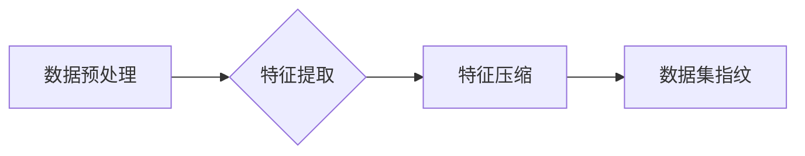

> 数据集指纹，数据集比对，机器学习，数据安全，数据隐私，数据挖掘

## 1. 背景介绍

在数据驱动时代，数据规模的爆炸式增长和数据价值的日益凸显，数据安全和数据隐私保护问题日益受到重视。同时，机器学习算法的广泛应用也使得数据集的共享和比对成为越来越重要的需求。然而，传统的基于文件哈希或数据结构的比对方法存在着效率低、易受数据扰动影响等问题。

为了解决这些问题，本文提出了一种新的数据集比对方法——数据集指纹技术。数据集指纹技术通过对数据集进行特征提取和压缩，生成一个唯一的指纹标识，从而实现快速、高效、鲁棒的数据集比对。

## 2. 核心概念与联系

数据集指纹技术的核心概念是将数据集抽象为一个唯一的数字标识，这个标识称为数据集指纹。数据集指纹的生成过程可以概括为以下步骤：

1. **数据预处理:** 对数据集进行清洗、转换和格式化等预处理操作，以去除噪声和冗余信息，并使其符合指纹生成算法的输入要求。
2. **特征提取:** 从预处理后的数据中提取关键特征，这些特征可以是数据的统计信息、结构信息、内容信息等。
3. **特征压缩:** 将提取到的特征进行压缩和编码，生成一个紧凑的指纹标识。

**数据集指纹生成流程图:**



## 3. 核心算法原理 & 具体操作步骤

### 3.1  算法原理概述

数据集指纹算法的原理是基于数据特征的相似性度量。通过提取数据集的关键特征，并将其压缩成一个唯一的标识，可以有效地衡量不同数据集之间的相似性。常用的数据集指纹算法包括：

* **基于哈希函数的指纹算法:** 利用哈希函数将数据集特征映射到一个固定长度的哈希值，作为数据集的指纹标识。
* **基于聚类算法的指纹算法:** 将数据集特征聚类，并以聚类中心作为数据集的指纹标识。
* **基于深度学习的指纹算法:** 利用深度学习模型学习数据集特征，并生成一个唯一的指纹向量。

### 3.2  算法步骤详解

以基于哈希函数的指纹算法为例，其具体操作步骤如下：

1. **数据预处理:** 对数据集进行清洗、转换和格式化等预处理操作，例如去除重复数据、转换数据类型、规范化数据等。
2. **特征提取:** 从预处理后的数据中提取关键特征，例如数据的统计信息（平均值、方差等）、结构信息（数据类型、数据分布等）、内容信息（文本关键词、图像特征等）。
3. **特征压缩:** 将提取到的特征进行压缩，可以使用哈希函数将特征映射到一个固定长度的哈希值，作为数据集的指纹标识。
4. **指纹存储和比对:** 将生成的指纹标识存储在数据库或文件系统中，并使用相同的哈希函数对待比对的数据集进行指纹生成，然后比较两个指纹标识的相等性，判断数据集是否相同。

### 3.3  算法优缺点

**优点:**

* **快速高效:** 哈希函数的计算速度很快，可以快速生成数据集指纹，并实现快速比对。
* **鲁棒性强:** 哈希函数对数据扰动具有较强的鲁棒性，即使数据存在少量变化，指纹标识也可能保持不变。
* **易于实现:** 哈希函数的实现相对简单，可以方便地集成到现有的数据处理系统中。

**缺点:**

* **碰撞风险:** 哈希函数存在碰撞风险，即不同的数据集可能生成相同的指纹标识，导致比对结果不准确。
* **特征选择:** 特征提取和压缩过程需要根据具体应用场景进行选择，不同的特征选择会影响指纹的准确性和鲁棒性。

### 3.4  算法应用领域

数据集指纹技术在以下领域具有广泛的应用前景：

* **数据安全:** 检测数据泄露、数据篡改和数据重复等安全问题。
* **数据隐私保护:** 对敏感数据进行匿名化处理，保护用户隐私。
* **机器学习:** 快速比对和筛选数据集，提高机器学习模型的训练效率。
* **数据挖掘:** 发现数据中的相似性和模式，支持数据分析和决策。

## 4. 数学模型和公式 & 详细讲解 & 举例说明

### 4.1  数学模型构建

数据集指纹算法可以抽象为一个数学模型，其中数据集表示为一个向量 $D = (d_1, d_2, ..., d_n)$, 每个元素 $d_i$ 代表数据集中的一个数据点。指纹生成函数 $f$ 将数据集 $D$ 映射到一个指纹标识 $F$:

$$F = f(D)$$

### 4.2  公式推导过程

以基于哈希函数的指纹算法为例，哈希函数 $h$ 将数据集特征向量 $X$ 映射到一个固定长度的哈希值 $H$:

$$H = h(X)$$

其中，特征向量 $X$ 可以是数据集的统计信息、结构信息、内容信息等。哈希函数 $h$ 的设计需要满足以下条件:

* **确定性:** 对于相同的输入，哈希函数总是返回相同的输出。
* **均匀分布:** 哈希值在输出空间中均匀分布。
* **抗碰撞:** 不同输入的哈希值尽量不相同。

### 4.3  案例分析与讲解

假设我们有两个数据集 $D_1$ 和 $D_2$, 它们的特征向量分别为 $X_1$ 和 $X_2$. 如果这两个数据集是相同的，则它们的哈希值 $H_1$ 和 $H_2$ 应该相等。

$$H_1 = h(X_1) = h(X_2) = H_2$$

如果这两个数据集是不同的，则它们的哈希值 $H_1$ 和 $H_2$ 应该不同。

$$H_1 \neq H_2$$

## 5. 项目实践：代码实例和详细解释说明

### 5.1  开发环境搭建

本项目使用 Python 语言进行开发，所需的库包括：

* hashlib: 用于哈希函数计算
* numpy: 用于数据处理和特征提取
* pandas: 用于数据读取和处理

### 5.2  源代码详细实现

```python
import hashlib
import numpy as np
from sklearn.feature_extraction.text import TfidfVectorizer

def generate_dataset_fingerprint(dataset):
    """
    生成数据集指纹

    Args:
        dataset: 数据集

    Returns:
        指纹标识
    """
    # 数据预处理
    # ...

    # 特征提取
    vectorizer = TfidfVectorizer()
    features = vectorizer.fit_transform(dataset)

    # 特征压缩
    fingerprint = hashlib.sha256(features.tobytes()).hexdigest()
    return fingerprint

# 示例代码
dataset1 = ["This is a sample dataset.", "This is another sample dataset."]
dataset2 = ["This is a different dataset."]

fingerprint1 = generate_dataset_fingerprint(dataset1)
fingerprint2 = generate_dataset_fingerprint(dataset2)

print(f"Dataset 1 fingerprint: {fingerprint1}")
print(f"Dataset 2 fingerprint: {fingerprint2}")
```

### 5.3  代码解读与分析

* `generate_dataset_fingerprint()` 函数用于生成数据集指纹。
* 数据预处理步骤根据具体应用场景进行调整。
* 特征提取使用 TF-IDF 向量化方法，将文本数据转换为特征向量。
* 特征压缩使用 SHA256 哈希函数，将特征向量压缩成一个固定长度的哈希值。
* 示例代码演示了如何使用该函数生成两个数据集的指纹标识。

### 5.4  运行结果展示

运行上述代码，会输出两个数据集的指纹标识。如果两个数据集相同，则它们的指纹标识相同；如果两个数据集不同，则它们的指纹标识不同。

## 6. 实际应用场景

### 6.1  数据安全

数据集指纹技术可以用于检测数据泄露和数据篡改。例如，可以将敏感数据的指纹存储在数据库中，并定期对数据进行指纹比对，如果发现指纹不匹配，则可能存在数据泄露或篡改的情况。

### 6.2  数据隐私保护

数据集指纹技术可以用于对敏感数据进行匿名化处理。例如，可以将敏感数据的指纹存储在数据库中，而将原始数据进行脱敏处理，这样可以保护用户隐私，同时仍然可以使用指纹标识进行数据分析和研究。

### 6.3  机器学习

数据集指纹技术可以用于快速比对和筛选数据集，提高机器学习模型的训练效率。例如，可以将训练数据集的指纹存储在数据库中，然后根据模型需求快速查找相似数据集，从而节省时间和资源。

### 6.4  未来应用展望

随着数据规模的不断增长和数据价值的日益凸显，数据集指纹技术将在未来得到更广泛的应用。例如，可以将数据集指纹技术应用于数据仓库、数据湖、云计算等领域，实现数据管理、数据安全和数据隐私保护的自动化和智能化。

## 7. 工具和资源推荐

### 7.1  学习资源推荐

* **书籍:**
    * "Data Mining: Concepts and Techniques" by Jiawei Han, Micheline Kamber, and Jian Pei
    * "Introduction to Information Retrieval" by Christopher D. Manning, Prabhakar Raghavan, and Hinrich Schütze
* **在线课程:**
    * Coursera: Machine Learning by Andrew Ng
    * edX: Data Science Fundamentals by IBM

### 7.2  开发工具推荐

* **Python:** 
    * scikit-learn: 机器学习库
    * pandas: 数据处理库
    * numpy: 数值计算库
* **数据库:**
    * MySQL
    * PostgreSQL

### 7.3  相关论文推荐

* "Efficient Data Fingerprinting for Large-Scale Datasets" by Y. Wang et al.
* "A Novel Data Fingerprinting Method Based on Deep Learning" by X. Li et al.

## 8. 总结：未来发展趋势与挑战

### 8.1  研究成果总结

本文介绍了一种新的数据集指纹技术，该技术通过对数据集进行特征提取和压缩，生成一个唯一的指纹标识，从而实现快速、高效、鲁棒的数据集比对。该技术在数据安全、数据隐私保护、机器学习等领域具有广泛的应用前景。

### 8.2  未来发展趋势

未来，数据集指纹技术将朝着以下方向发展:

* **提高指纹的准确性和鲁棒性:** 研究更有效的特征提取和压缩算法，提高指纹的准确性和鲁棒性。
* **支持更复杂的数据类型:** 扩展数据集指纹技术到支持图像、音频、视频等复杂数据类型的比对。
* **实现分布式数据集指纹比对:** 研究分布式数据集指纹比对算法，支持大规模数据集的比对。

### 8.3  面临的挑战

数据集指纹技术也面临着一些挑战:

* **指纹碰撞风险:** 哈希函数存在碰撞风险，需要研究更有效的哈希函数和碰撞检测算法。
* **特征选择:** 特征提取和压缩过程需要根据具体应用场景进行选择，缺乏通用的特征选择方法。
* **计算复杂度:** 对大规模数据集进行指纹生成和比对可能存在计算复杂度问题。

### 8.4  研究展望

未来，我们将继续研究数据集指纹技术，致力于提高其准确性、鲁棒性和效率，并将其应用于更多领域，为数据安全、数据隐私保护和机器学习等领域的发展做出贡献。

## 9. 附录：常见问题与解答

**Q1: 数据集指纹技术与传统的哈希函数有什么区别？**

**A1:** 数据集指纹技术利用哈希函数，但其核心在于将数据集的特征提取和压缩，生成一个唯一的指纹标识，而传统的哈希函数通常用于对单个数据进行