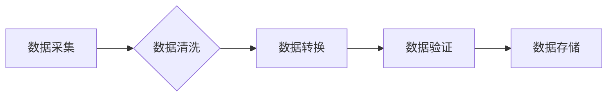

> 数据集标准化,软件工程,数据质量,机器学习,人工智能,数据治理,数据可信度

## 1. 背景介绍

在当今数据爆炸的时代，数据已成为企业和组织的核心资产。然而，海量的原始数据往往杂乱无章，格式不统一，质量参差不齐，这严重阻碍了数据价值的挖掘和应用。数据标准化作为解决这一问题的关键技术，已成为软件2.0时代不可或缺的基石工程。

软件2.0时代，人工智能、机器学习等技术蓬勃发展，对数据质量提出了更高的要求。传统的软件开发模式难以满足数据驱动决策的需求，需要一种全新的数据处理和管理体系。数据标准化正是为了解决这一问题而诞生的。

## 2. 核心概念与联系

数据标准化是指对数据进行统一规范处理，使其符合预设的格式、结构和语义，从而提高数据质量、一致性和可信度。

**数据标准化流程:**



**数据标准化与软件工程的关系:**

数据标准化是软件工程的重要组成部分，它与软件开发、数据管理、人工智能等领域密切相关。

* **软件开发:** 数据标准化可以提高软件开发效率，减少代码冗余，增强软件的可维护性和可扩展性。
* **数据管理:** 数据标准化可以提高数据质量，便于数据分析和决策支持。
* **人工智能:** 数据标准化是机器学习和人工智能算法训练的基础，可以提高模型的准确性和可靠性。

## 3. 核心算法原理 & 具体操作步骤

### 3.1  算法原理概述

数据标准化算法主要包括数据清洗、数据转换和数据验证三个步骤。

* **数据清洗:** 针对数据中的缺失值、重复值、错误值等问题进行处理，确保数据完整性和准确性。
* **数据转换:** 将数据转换为统一的格式和结构，例如将不同日期格式的数据转换为统一的日期格式。
* **数据验证:** 对数据进行校验，确保数据符合预设的规则和规范。

### 3.2  算法步骤详解

**数据清洗:**

1. **缺失值处理:** 可以采用删除、填充、预测等方法处理缺失值。
2. **重复值处理:** 可以采用删除、合并等方法处理重复值。
3. **错误值处理:** 可以采用修正、删除等方法处理错误值。

**数据转换:**

1. **格式转换:** 将数据转换为统一的格式，例如将文本数据转换为数字数据。
2. **结构转换:** 将数据转换为统一的结构，例如将关系型数据转换为非关系型数据。
3. **单位转换:** 将数据转换为统一的单位，例如将温度数据从摄氏度转换为华氏度。

**数据验证:**

1. **格式验证:** 检查数据是否符合预设的格式规则。
2. **值域验证:** 检查数据是否在预设的范围内。
3. **逻辑验证:** 检查数据之间的逻辑关系是否合理。

### 3.3  算法优缺点

**优点:**

* 提高数据质量和一致性
* 增强数据可信度和可靠性
* 提高数据分析和决策效率

**缺点:**

* 需要投入一定的成本和时间
* 需要专业的技术人员进行操作
* 可能导致数据丢失或变形

### 3.4  算法应用领域

数据标准化技术广泛应用于各个领域，例如：

* **金融行业:** 银行、保险公司等机构利用数据标准化技术进行风险管理、客户分析等。
* **医疗行业:** 医院、药企等机构利用数据标准化技术进行疾病诊断、药物研发等。
* **电商行业:** 电商平台利用数据标准化技术进行商品推荐、用户画像等。

## 4. 数学模型和公式 & 详细讲解 & 举例说明

### 4.1  数学模型构建

数据标准化可以抽象为一个数学模型，其中数据被视为一个向量，标准化操作可以看作是将数据向量映射到一个新的空间，使得数据在新的空间中具有统一的分布和尺度。

### 4.2  公式推导过程

常用的数据标准化方法之一是**Z-score标准化**，其公式如下：

$$z = \frac{x - \mu}{\sigma}$$

其中：

* $z$ 是标准化后的数据值
* $x$ 是原始数据值
* $\mu$ 是原始数据值的均值
* $\sigma$ 是原始数据值的标准差

### 4.3  案例分析与讲解

假设我们有一组原始数据：

[1, 2, 3, 4, 5]

计算其均值和标准差：

* $\mu = \frac{1+2+3+4+5}{5} = 3$
* $\sigma = \sqrt{\frac{(1-3)^2 + (2-3)^2 + (3-3)^2 + (4-3)^2 + (5-3)^2}{5}} = \sqrt{2}$

将原始数据进行Z-score标准化：

* $z_1 = \frac{1-3}{\sqrt{2}} = -\sqrt{2}$
* $z_2 = \frac{2-3}{\sqrt{2}} = -\frac{1}{\sqrt{2}}$
* $z_3 = \frac{3-3}{\sqrt{2}} = 0$
* $z_4 = \frac{4-3}{\sqrt{2}} = \frac{1}{\sqrt{2}}$
* $z_5 = \frac{5-3}{\sqrt{2}} = \sqrt{2}$

经过标准化后，数据分布在均值为0，标准差为1的范围内。

## 5. 项目实践：代码实例和详细解释说明

### 5.1  开发环境搭建

* 操作系统：Windows/Linux/macOS
* 编程语言：Python
* 库依赖：pandas, numpy

### 5.2  源代码详细实现

```python
import pandas as pd
import numpy as np

# 加载数据
data = pd.read_csv('data.csv')

# 数据清洗
# 处理缺失值，重复值，错误值

# 数据转换
# 格式转换，结构转换，单位转换

# 数据验证
# 格式验证，值域验证，逻辑验证

# Z-score标准化
data_z = (data - data.mean()) / data.std()

# 保存标准化数据
data_z.to_csv('data_z.csv', index=False)
```

### 5.3  代码解读与分析

* 使用pandas库加载数据，并进行数据清洗、转换和验证。
* 使用numpy库计算数据均值和标准差。
* 使用Z-score公式对数据进行标准化。
* 使用pandas库保存标准化数据。

### 5.4  运行结果展示

运行代码后，将生成一个名为`data_z.csv`的文件，其中包含标准化后的数据。

## 6. 实际应用场景

### 6.1  金融行业

* 风险管理：通过标准化金融数据，可以更准确地评估风险，制定有效的风险控制策略。
* 客户分析：通过标准化客户数据，可以更深入地了解客户需求，提供个性化的服务。

### 6.2  医疗行业

* 疾病诊断：通过标准化医疗数据，可以提高疾病诊断的准确率，帮助医生做出更明智的治疗决策。
* 药物研发：通过标准化药物数据，可以加速药物研发过程，开发出更有效的药物。

### 6.3  电商行业

* 商品推荐：通过标准化商品数据，可以更精准地推荐商品，提高用户购物体验。
* 用户画像：通过标准化用户数据，可以构建用户画像，更好地了解用户需求，提供个性化的服务。

### 6.4  未来应用展望

随着人工智能、机器学习等技术的不断发展，数据标准化将发挥越来越重要的作用。未来，数据标准化技术将应用于更多领域，例如：

* 智能制造：通过标准化生产数据，可以提高生产效率，降低生产成本。
* 智能交通：通过标准化交通数据，可以优化交通流量，提高交通安全。
* 智能城市：通过标准化城市数据，可以提高城市管理效率，提升城市生活品质。

## 7. 工具和资源推荐

### 7.1  学习资源推荐

* 书籍：《数据标准化》
* 在线课程：Coursera、edX等平台上的数据标准化课程

### 7.2  开发工具推荐

* pandas：Python数据分析库
* numpy：Python数值计算库
* scikit-learn：Python机器学习库

### 7.3  相关论文推荐

* 《数据标准化在机器学习中的应用》
* 《数据标准化技术综述》

## 8. 总结：未来发展趋势与挑战

### 8.1  研究成果总结

数据标准化技术已取得了显著的成果，在各个领域得到了广泛应用。

### 8.2  未来发展趋势

未来，数据标准化技术将朝着以下方向发展：

* **自动化:** 利用人工智能技术，实现数据标准化的自动化。
* **智能化:** 基于机器学习算法，实现数据标准化的智能化。
* **可扩展性:** 构建可扩展的数据标准化平台，适应海量数据的处理需求。

### 8.3  面临的挑战

数据标准化技术也面临着一些挑战：

* 数据异构性: 不同来源的数据格式、结构和语义不一致。
* 数据质量问题: 数据中存在缺失值、重复值、错误值等问题。
* 数据安全问题: 数据标准化过程中需要保护数据隐私和安全。

### 8.4  研究展望

未来，需要进一步研究数据标准化技术，解决数据异构性、数据质量问题和数据安全问题，推动数据标准化技术的发展和应用。

## 9. 附录：常见问题与解答

**常见问题:**

* 数据标准化需要投入多少成本？
* 数据标准化需要多少时间？
* 数据标准化有哪些风险？

**解答:**

* 数据标准化成本取决于数据规模、复杂度和项目需求。
* 数据标准化时间取决于数据规模、复杂度和项目进度。
* 数据标准化风险包括数据丢失、数据变形和数据安全风险。


作者：禅与计算机程序设计艺术 / Zen and the Art of Computer Programming 
<end_of_turn>