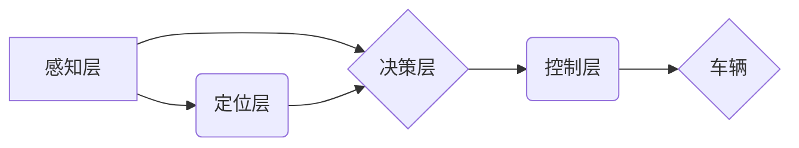

> 无人驾驶, 自动驾驶, 交通物流, 深度学习, 计算机视觉, 算法,  人工智能,  创业

## 1. 背景介绍

交通运输是现代社会不可或缺的基石，然而，传统的交通模式面临着诸多挑战：交通拥堵、交通事故、能源消耗等问题日益突出。无人驾驶技术作为一项颠覆性的创新，被视为解决这些问题的关键。它利用人工智能、传感器、机器学习等先进技术，赋予车辆自主驾驶的能力，有望重塑交通与物流的未来。

近年来，无人驾驶技术取得了长足的进步，从最初的实验室研究到现实世界的应用场景，无人驾驶汽车已经逐渐走进人们的视野。各大科技巨头、汽车制造商和创业公司纷纷投入巨资进行研发，无人驾驶技术也成为全球范围内竞争的焦点。

## 2. 核心概念与联系

**2.1 无人驾驶技术体系**

无人驾驶技术是一个复杂的系统工程，涉及多个关键领域：

* **感知:** 通过摄像头、雷达、激光雷达等传感器获取车辆周围环境的信息。
* **定位:** 利用GPS、惯性导航等技术确定车辆的位置和姿态。
* **决策:** 基于感知和定位信息，制定驾驶策略，控制车辆的转向、加速、制动等动作。
* **控制:** 将决策转化为实际的车辆控制指令，实现车辆的自主行驶。

**2.2 架构图**



**2.3 核心概念关系**

* **感知层:** 负责收集车辆周围环境的信息，包括道路状况、交通标志、其他车辆等。
* **定位层:** 确定车辆的当前位置和姿态，为决策层提供准确的地理信息。
* **决策层:** 基于感知和定位信息，分析周围环境，制定驾驶策略，例如选择行驶路线、控制车速、进行避障等。
* **控制层:** 将决策层生成的指令转化为车辆的实际动作，例如转向、加速、制动等。

## 3. 核心算法原理 & 具体操作步骤

**3.1 算法原理概述**

无人驾驶的核心算法主要包括：

* **计算机视觉:** 用于识别道路、交通标志、行人、车辆等物体。
* **机器学习:** 用于训练模型，使车辆能够学习驾驶规则和做出决策。
* **路径规划:** 用于规划车辆行驶路线，避免碰撞和提高效率。
* **控制算法:** 用于控制车辆的运动，实现稳定和安全的驾驶。

**3.2 算法步骤详解**

1. **数据采集:** 收集大量道路场景数据，包括图像、视频、传感器数据等。
2. **数据预处理:** 对采集到的数据进行清洗、格式化、标注等处理，使其适合算法训练。
3. **模型训练:** 利用机器学习算法，训练模型，使其能够识别物体、预测道路状况、规划路径等。
4. **模型评估:** 对训练好的模型进行评估，测试其准确率、鲁棒性等性能指标。
5. **模型部署:** 将训练好的模型部署到车辆上，使其能够实时感知环境、做出决策并控制车辆行驶。

**3.3 算法优缺点**

* **优点:** 能够实现车辆的自主驾驶，提高交通效率、安全性。
* **缺点:** 算法训练需要大量数据，模型的准确率和鲁棒性还有待提高，存在安全风险。

**3.4 算法应用领域**

* **自动驾驶汽车:** 
* **无人配送:** 
* **无人货运:** 
* **智能交通管理:** 

## 4. 数学模型和公式 & 详细讲解 & 举例说明

**4.1 数学模型构建**

无人驾驶算法的构建需要建立数学模型来描述车辆运动、环境感知、决策控制等过程。常见的数学模型包括：

* **运动模型:** 描述车辆在空间中的运动轨迹，通常使用动力学方程来表示。
* **感知模型:** 描述传感器获取环境信息的数学关系，例如相机模型、雷达模型等。
* **决策模型:** 描述车辆根据感知信息做出驾驶决策的逻辑关系，通常使用概率论、博弈论等方法建模。

**4.2 公式推导过程**

以车辆运动模型为例，其基本方程为：

$$
\dot{x} = v \cos(\theta)
$$

$$
\dot{y} = v \sin(\theta)
$$

$$
\dot{\theta} = \omega
$$

其中：

* $x$, $y$ 为车辆坐标
* $v$ 为车辆速度
* $\theta$ 为车辆方向角
* $\omega$ 为车辆转角速度

**4.3 案例分析与讲解**

假设车辆初始位置为 $(0, 0)$, 初始速度为 $10 m/s$, 初始方向角为 $0^\circ$, 转角速度为 $0.1 rad/s$. 利用上述运动模型，可以计算车辆在不同时间点的坐标和方向角。

## 5. 项目实践：代码实例和详细解释说明

**5.1 开发环境搭建**

* 操作系统: Ubuntu 20.04
* 编程语言: Python 3.8
* 深度学习框架: TensorFlow 2.0
* 计算机视觉库: OpenCV

**5.2 源代码详细实现**

```python
import tensorflow as tf
from tensorflow.keras.models import Sequential
from tensorflow.keras.layers import Conv2D, MaxPooling2D, Flatten, Dense

# 定义模型结构
model = Sequential()
model.add(Conv2D(32, (3, 3), activation='relu', input_shape=(64, 64, 3)))
model.add(MaxPooling2D((2, 2)))
model.add(Conv2D(64, (3, 3), activation='relu'))
model.add(MaxPooling2D((2, 2)))
model.add(Flatten())
model.add(Dense(10, activation='softmax'))

# 编译模型
model.compile(optimizer='adam',
              loss='sparse_categorical_crossentropy',
              metrics=['accuracy'])

# 训练模型
model.fit(x_train, y_train, epochs=10)

# 评估模型
loss, accuracy = model.evaluate(x_test, y_test)
print('Loss:', loss)
print('Accuracy:', accuracy)
```

**5.3 代码解读与分析**

这段代码定义了一个简单的卷积神经网络模型，用于图像分类任务。

* `Conv2D` 层用于提取图像特征。
* `MaxPooling2D` 层用于降维，提高模型的鲁棒性。
* `Flatten` 层将多维特征转换为一维向量。
* `Dense` 层用于分类，输出10个类别的概率分布。

**5.4 运行结果展示**

训练完成后，模型可以用于预测新的图像类别。

## 6. 实际应用场景

**6.1 自动驾驶汽车**

无人驾驶汽车是无人驾驶技术的典型应用场景，它利用传感器、算法和软件系统，实现车辆的自主驾驶，例如自动加速、转向、制动、泊车等功能。

**6.2 无人配送**

无人配送利用无人驾驶技术，实现货物自动配送，例如无人配送车、无人配送机器人等，可以提高配送效率、降低成本，并解决人员短缺问题。

**6.3 无人货运**

无人货运利用无人驾驶技术，实现货物自动运输，例如无人驾驶卡车、无人驾驶货船等，可以提高运输效率、降低运输成本，并减少交通拥堵。

**6.4 未来应用展望**

无人驾驶技术的发展将带来更多新的应用场景，例如：

* **智能交通管理:** 利用无人驾驶技术，实现交通信号灯的智能控制、交通流量的优化调度等，提高交通效率和安全性。
* **城市规划:** 利用无人驾驶技术，模拟城市交通状况，优化城市规划，建设更加智能、便捷的城市交通系统。
* **医疗救护:** 利用无人驾驶技术，实现紧急医疗救护的快速响应，提高医疗救助效率。

## 7. 工具和资源推荐

**7.1 学习资源推荐**

* **书籍:**
    * 《深度学习》
    * 《计算机视觉:算法与应用》
    * 《无人驾驶汽车》
* **在线课程:**
    * Coursera: 深度学习
    * Udacity: 自动驾驶工程师
    * edX: 计算机视觉

**7.2 开发工具推荐**

* **ROS (Robot Operating System):** 用于机器人开发的开源软件框架。
* **Gazebo:** 用于机器人仿真和测试的开源软件。
* **Autoware:** 用于自动驾驶开发的开源软件平台。

**7.3 相关论文推荐**

* **Deep Learning for Autonomous Driving**
* **End-to-End Learning for Self-Driving Cars**
* **A Survey of Deep Learning for Autonomous Driving**

## 8. 总结：未来发展趋势与挑战

**8.1 研究成果总结**

近年来，无人驾驶技术取得了长足的进步，算法模型、传感器技术、计算能力等方面都取得了突破性进展。

**8.2 未来发展趋势**

* **更强的感知能力:** 开发更先进的传感器和感知算法，提高车辆对环境的感知精度和范围。
* **更智能的决策能力:** 利用更强大的机器学习算法，训练更智能的决策模型，使车辆能够做出更安全、更合理的驾驶决策。
* **更安全的驾驶系统:** 加强安全冗余设计，提高车辆的安全性，并制定完善的法律法规，保障无人驾驶技术的安全应用。

**8.3 面临的挑战**

* **技术挑战:** 
* **安全挑战:** 
* **法律法规挑战:** 

**8.4 研究展望**

未来，无人驾驶技术将继续朝着更智能、更安全、更可靠的方向发展，并将在交通运输、物流、城市规划等领域发挥越来越重要的作用。


## 9. 附录：常见问题与解答

**9.1  无人驾驶技术是否安全可靠？**

无人驾驶技术目前仍处于发展阶段，安全性仍然是一个重要的挑战。

**9.2  无人驾驶汽车何时能够普及？**

无人驾驶汽车的普及时间取决于技术发展、政策法规、公众接受度等多方面因素。

**9.3  无人驾驶技术对就业市场有什么影响？**

无人驾驶技术可能会导致部分驾驶员岗位的减少，但也将创造新的就业机会。


作者：禅与计算机程序设计艺术 / Zen and the Art of Computer Programming 
<end_of_turn>