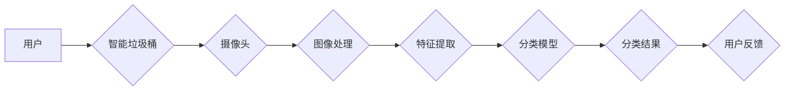

> 智能家居，废物分类，机器学习，计算机视觉，深度学习，环保解决方案

## 1. 背景介绍

随着全球环境问题的日益严峻，垃圾分类已成为解决环境污染的重要途径。然而，传统的垃圾分类方式往往依赖于人工操作，效率低下，且容易出现分类错误。智能家居的兴起为废物分类带来了新的机遇。通过结合计算机视觉、机器学习等先进技术，可以实现自动化、智能化的废物分类，提高分类效率，降低人工成本，并促进环保意识的提升。

## 2. 核心概念与联系

**2.1 核心概念**

* **智能家居:** 指通过网络连接和智能化控制，实现家居环境自动化、智能化管理的系统。
* **废物分类:** 将不同类型的废物进行分类，以便进行回收利用或处理。
* **计算机视觉:** 使计算机能够“看”和理解图像的技术。
* **机器学习:** 使计算机能够从数据中学习并进行预测的技术。
* **深度学习:** 一种机器学习的子集，利用多层神经网络进行特征提取和学习。

**2.2 架构图**



**2.3 核心联系**

智能家居废物分类系统通过摄像头采集废物图像，利用计算机视觉技术进行图像处理，提取废物特征，并通过机器学习模型进行分类识别。最终，系统将分类结果反馈给用户，并根据用户反馈进行模型优化。

## 3. 核心算法原理 & 具体操作步骤

**3.1 算法原理概述**

本系统采用深度学习算法进行废物分类。深度学习模型能够自动学习废物特征，并进行分类识别。常用的深度学习算法包括卷积神经网络（CNN）和循环神经网络（RNN）。

**3.2 算法步骤详解**

1. **数据采集:** 收集不同类型废物的图像数据，并进行标注，形成训练数据集。
2. **数据预处理:** 对图像数据进行预处理，例如尺寸调整、数据增强等，提高模型训练效果。
3. **模型训练:** 使用深度学习框架（例如TensorFlow、PyTorch）训练深度学习模型，并根据训练结果进行模型优化。
4. **模型评估:** 使用测试数据集评估模型的分类准确率、召回率等指标。
5. **模型部署:** 将训练好的模型部署到智能垃圾桶中，实现废物分类功能。

**3.3 算法优缺点**

* **优点:**
    * 分类精度高，能够识别多种类型的废物。
    * 自动学习特征，无需人工特征提取。
    * 可持续学习，随着数据量的增加，模型性能不断提升。
* **缺点:**
    * 训练数据量大，需要大量标注数据。
    * 模型训练时间长，需要强大的计算资源。
    * 对硬件要求高，需要配备高性能的摄像头和处理器。

**3.4 算法应用领域**

* 智能垃圾桶
* 自动化回收站
* 垃圾分类教育
* 环境监测

## 4. 数学模型和公式 & 详细讲解 & 举例说明

**4.1 数学模型构建**

深度学习模型的数学模型通常基于神经网络结构。神经网络由多个层组成，每层包含多个神经元。神经元之间通过权重连接，并进行加权求和和激活函数处理。

**4.2 公式推导过程**

神经网络的输出结果可以通过以下公式计算：

$$
y = f(W^L x^L + b^L)
$$

其中：

* $y$ 是神经网络的输出结果。
* $f$ 是激活函数。
* $W^L$ 是第 $L$ 层的权重矩阵。
* $x^L$ 是第 $L$ 层的输入向量。
* $b^L$ 是第 $L$ 层的偏置向量。

**4.3 案例分析与讲解**

假设我们训练一个分类废物类型的深度学习模型，模型输入是废物图像，输出是废物类别标签。

* 训练数据：包含不同类型废物的图像数据，每个图像都标注了对应的类别标签。
* 模型结构：可以使用卷积神经网络（CNN）作为模型架构，CNN能够自动学习图像特征。
* 训练过程：通过反向传播算法，不断调整模型参数，使模型的输出结果与真实标签尽可能接近。
* 评估指标：可以使用准确率、召回率等指标评估模型的分类性能。

## 5. 项目实践：代码实例和详细解释说明

**5.1 开发环境搭建**

* 操作系统：Windows/Linux/macOS
* Python 版本：3.6+
* 深度学习框架：TensorFlow/PyTorch
* 其他依赖库：OpenCV、NumPy、pandas等

**5.2 源代码详细实现**

```python
# 使用 TensorFlow 框架实现废物分类模型

import tensorflow as tf

# 定义模型结构
model = tf.keras.models.Sequential([
    tf.keras.layers.Conv2D(32, (3, 3), activation='relu', input_shape=(224, 224, 3)),
    tf.keras.layers.MaxPooling2D((2, 2)),
    tf.keras.layers.Conv2D(64, (3, 3), activation='relu'),
    tf.keras.layers.MaxPooling2D((2, 2)),
    tf.keras.layers.Flatten(),
    tf.keras.layers.Dense(10, activation='softmax')
])

# 编译模型
model.compile(optimizer='adam',
              loss='sparse_categorical_crossentropy',
              metrics=['accuracy'])

# 训练模型
model.fit(x_train, y_train, epochs=10)

# 评估模型
loss, accuracy = model.evaluate(x_test, y_test)
print('Loss:', loss)
print('Accuracy:', accuracy)
```

**5.3 代码解读与分析**

* 代码首先定义了模型结构，使用卷积神经网络（CNN）作为模型架构。
* 然后编译模型，指定优化器、损失函数和评估指标。
* 接着训练模型，使用训练数据进行模型训练。
* 最后评估模型，使用测试数据评估模型的性能。

**5.4 运行结果展示**

训练完成后，可以将模型部署到智能垃圾桶中，实现废物分类功能。运行结果展示可以包括分类准确率、分类速度等指标。

## 6. 实际应用场景

**6.1 智能垃圾桶**

智能垃圾桶可以根据废物类型自动分类，提高垃圾分类效率，并减少环境污染。

**6.2 自动化回收站**

自动化回收站可以根据废物类型自动分类，并进行相应的处理，例如回收、焚烧等。

**6.3 垃圾分类教育**

智能家居废物分类系统可以作为垃圾分类教育工具，帮助人们了解不同类型的废物，并养成良好的垃圾分类习惯。

**6.4 未来应用展望**

未来，智能家居废物分类系统将更加智能化、自动化，并应用于更广泛的场景，例如：

* 智能社区：实现社区级垃圾分类管理。
* 智能城市：构建智慧城市垃圾管理系统。
* 工业生产：实现工业废物分类和回收利用。

## 7. 工具和资源推荐

**7.1 学习资源推荐**

* TensorFlow 官方文档：https://www.tensorflow.org/
* PyTorch 官方文档：https://pytorch.org/
* 深度学习书籍：
    * 深度学习
    * 深度学习实践
    * 深度学习入门

**7.2 开发工具推荐**

* Anaconda：Python 数据科学发行版
* Jupyter Notebook：交互式编程环境
* TensorFlow/PyTorch IDE：深度学习开发环境

**7.3 相关论文推荐**

* 深度学习在图像分类中的应用
* 智能垃圾桶的设计与实现
* 智能家居废物分类系统的研究

## 8. 总结：未来发展趋势与挑战

**8.1 研究成果总结**

智能家居废物分类系统是利用人工智能技术解决环境问题的有效途径。通过深度学习算法，可以实现自动化、智能化的废物分类，提高分类效率，降低人工成本，并促进环保意识的提升。

**8.2 未来发展趋势**

* 模型精度提升：通过更先进的深度学习算法和更大的训练数据集，进一步提高模型的分类精度。
* 场景应用扩展：将智能家居废物分类系统应用于更广泛的场景，例如智能社区、智能城市等。
* 人机交互优化：设计更人性化的用户界面，方便用户操作和反馈。

**8.3 面临的挑战**

* 数据标注成本高：深度学习模型需要大量标注数据，数据标注成本较高。
* 模型训练时间长：深度学习模型训练时间长，需要强大的计算资源。
* 硬件成本高：深度学习模型部署需要配备高性能的硬件设备，成本较高。

**8.4 研究展望**

未来，我们将继续致力于智能家居废物分类系统的研究，探索更先进的算法、更有效的训练方法和更低成本的硬件方案，为构建更加环保、可持续的未来贡献力量。

## 9. 附录：常见问题与解答

**9.1 如何训练废物分类模型？**

需要收集大量废物图像数据，并进行标注，形成训练数据集。然后使用深度学习框架（例如TensorFlow、PyTorch）训练模型，并根据训练结果进行模型优化。

**9.2 如何部署废物分类模型？**

将训练好的模型部署到智能垃圾桶中，并连接摄像头和处理单元。

**9.3 模型的分类精度如何？**

模型的分类精度取决于训练数据质量和模型结构。经过充分训练的模型可以达到较高的分类精度。

**9.4 模型需要多少计算资源？**

模型训练需要强大的计算资源，例如GPU。模型部署则需要配备高性能的摄像头和处理器。

**9.5 未来智能家居废物分类系统的发展趋势？**

未来，智能家居废物分类系统将更加智能化、自动化，并应用于更广泛的场景，例如智能社区、智能城市等。


作者：禅与计算机程序设计艺术 / Zen and the Art of Computer Programming 
<end_of_turn>