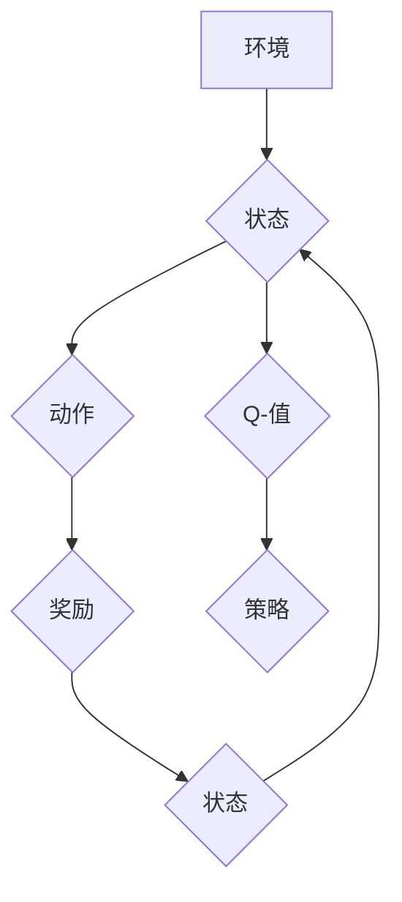

> 深度学习, Q-learning, 强化学习, 软件模拟环境, 算法原理, 代码实现, 应用场景

## 1. 背景介绍

在人工智能领域，强化学习 (Reinforcement Learning, RL) 作为一种学习方法，近年来取得了显著进展。它通过让智能体与环境交互，学习最优策略来最大化累积奖励，在机器人控制、游戏 AI、推荐系统等领域展现出强大的应用潜力。

深度 Q-learning 作为强化学习的一种重要变体，将深度神经网络引入 Q-learning 算法，能够学习复杂环境下的策略。它克服了传统 Q-learning 算法在高维状态空间中的不足，并能够处理连续动作空间的问题。

## 2. 核心概念与联系

**2.1 强化学习的基本概念**

强化学习的核心在于智能体与环境的交互过程。智能体通过与环境交互，获得奖励或惩罚，并根据这些反馈调整其行为策略，最终学习到最优策略，以最大化累积奖励。

* **智能体 (Agent):**  学习和决策的实体。
* **环境 (Environment):** 智能体所处的外部世界。
* **状态 (State):** 环境的当前状态。
* **动作 (Action):** 智能体可以采取的行动。
* **奖励 (Reward):** 环境对智能体动作的反馈，可以是正向奖励或负向惩罚。
* **策略 (Policy):** 智能体在不同状态下采取动作的概率分布。

**2.2 Q-learning 算法原理**

Q-learning 是一种基于价值函数的强化学习算法。其核心思想是学习一个 Q-表，其中 Q(s, a) 表示在状态 s 下采取动作 a 的期望累积奖励。

Q-learning 算法通过迭代更新 Q-表，最终学习到最优策略。更新规则如下：

$$Q(s, a) \leftarrow Q(s, a) + \alpha [r + \gamma \max_{a'} Q(s', a') - Q(s, a)]$$

其中：

* $\alpha$ 是学习率，控制着学习速度。
* $\gamma$ 是折扣因子，控制着未来奖励的权重。
* $r$ 是当前状态下获得的奖励。
* $s'$ 是采取动作 a 后进入的下一个状态。
* $a'$ 是在下一个状态 $s'$ 下采取的动作。

**2.3 深度 Q-learning 的优势**

深度 Q-learning 将深度神经网络引入 Q-learning 算法，能够处理高维状态空间和连续动作空间的问题。

* **高维状态空间:** 深度神经网络能够学习复杂状态表示，处理高维状态空间中的问题。
* **连续动作空间:** 深度神经网络能够输出连续的动作值，处理连续动作空间的问题。
* **函数逼近:** 深度神经网络可以逼近任意连续函数，能够学习更复杂的价值函数。

**2.4 深度 Q-learning 的架构**

深度 Q-learning 的架构通常包含以下部分：

* **状态输入层:** 将环境状态输入到神经网络。
* **隐藏层:** 学习复杂状态表示。
* **输出层:** 输出 Q-值，表示在当前状态下采取不同动作的期望累积奖励。

**Mermaid 流程图**



## 3. 核心算法原理 & 具体操作步骤

**3.1 算法原理概述**

深度 Q-learning 算法的核心是学习一个深度神经网络，该网络能够估计在给定状态下采取不同动作的期望累积奖励。

算法通过迭代更新神经网络的权重，最终学习到最优策略。

**3.2 算法步骤详解**

1. **初始化:** 初始化深度神经网络的权重。
2. **环境交互:** 智能体与环境交互，获得当前状态、动作和奖励。
3. **Q-值估计:** 使用深度神经网络估计在当前状态下采取不同动作的 Q-值。
4. **目标 Q-值计算:** 计算目标 Q-值，即当前状态下采取最优动作的期望累积奖励。
5. **损失函数计算:** 计算深度神经网络的损失函数，该函数衡量 Q-值估计与目标 Q-值之间的差异。
6. **反向传播:** 使用反向传播算法更新深度神经网络的权重，以最小化损失函数。
7. **策略更新:** 根据更新后的 Q-值，更新智能体的策略，选择最优动作。
8. **重复步骤 2-7:** 重复上述步骤，直到智能体学习到最优策略。

**3.3 算法优缺点**

**优点:**

* 可以处理高维状态空间和连续动作空间的问题。
* 可以学习更复杂的价值函数。

**缺点:**

* 训练过程可能需要大量的时间和计算资源。
* 容易陷入局部最优解。

**3.4 算法应用领域**

深度 Q-learning 算法在以下领域具有广泛的应用:

* **机器人控制:** 训练机器人学习控制策略，完成复杂的任务。
* **游戏 AI:** 训练游戏 AI 玩家，提高游戏水平。
* **推荐系统:** 训练推荐系统，推荐用户感兴趣的内容。
* **金融交易:** 训练交易策略，进行自动交易。

## 4. 数学模型和公式 & 详细讲解 & 举例说明

**4.1 数学模型构建**

深度 Q-learning 的数学模型可以概括为以下几个方面：

* **状态空间:**  $S = \{s_1, s_2, ..., s_n\}$，表示环境可能的状态集合。
* **动作空间:** $A = \{a_1, a_2, ..., a_m\}$，表示智能体可以采取的动作集合。
* **奖励函数:** $R: S \times A \rightarrow R$，表示在状态 $s$ 下采取动作 $a$ 得到的奖励。
* **价值函数:** $Q: S \times A \rightarrow R$，表示在状态 $s$ 下采取动作 $a$ 的期望累积奖励。
* **策略:** $\pi: S \rightarrow A$，表示智能体在状态 $s$ 下采取动作 $a$ 的概率分布。

**4.2 公式推导过程**

深度 Q-learning 算法的目标是学习最优价值函数 $Q^*$, 满足以下 Bellman 方程:

$$Q^*(s, a) = R(s, a) + \gamma \max_{a'} Q^*(s', a')$$

其中:

* $R(s, a)$ 是在状态 $s$ 下采取动作 $a$ 得到的奖励。
* $\gamma$ 是折扣因子，控制着未来奖励的权重。
* $s'$ 是采取动作 $a$ 后进入的下一个状态。

深度 Q-learning 算法使用深度神经网络逼近价值函数 $Q(s, a)$，并通过迭代更新神经网络的权重来最小化损失函数。

损失函数通常定义为目标 Q-值与估计 Q-值之间的均方差:

$$L = \frac{1}{N} \sum_{i=1}^{N} (y_i - Q(s_i, a_i))^2$$

其中:

* $N$ 是训练样本的数量。
* $y_i$ 是目标 Q-值。
* $Q(s_i, a_i)$ 是估计 Q-值。

**4.3 案例分析与讲解**

假设我们有一个简单的环境，智能体可以采取向上、向下、向左、向右四个动作。环境中的奖励函数如下:

* 在目标位置获得奖励 10。
* 在障碍物上获得惩罚 -1。
* 其他位置获得奖励 0。

深度 Q-learning 算法可以学习到在不同状态下采取最优动作的策略，最终使智能体到达目标位置。

## 5. 项目实践：代码实例和详细解释说明

**5.1 开发环境搭建**

* Python 3.x
* TensorFlow 或 PyTorch 深度学习框架
* NumPy 科学计算库
* Matplotlib 数据可视化库

**5.2 源代码详细实现**

```python
import tensorflow as tf

# 定义深度神经网络模型
model = tf.keras.models.Sequential([
    tf.keras.layers.Dense(64, activation='relu', input_shape=(state_size,)),
    tf.keras.layers.Dense(64, activation='relu'),
    tf.keras.layers.Dense(action_size)
])

# 定义损失函数和优化器
optimizer = tf.keras.optimizers.Adam()
loss_fn = tf.keras.losses.MeanSquaredError()

# 训练循环
for episode in range(num_episodes):
    state = env.reset()
    done = False
    total_reward = 0

    while not done:
        # 选择动作
        action = tf.argmax(model(tf.expand_dims(state, axis=0))).numpy()[0]

        # 执行动作并获得奖励和下一个状态
        next_state, reward, done, _ = env.step(action)

        # 更新目标 Q-值
        target_q = reward + gamma * tf.reduce_max(model(tf.expand_dims(next_state, axis=0)))

        # 计算损失
        with tf.GradientTape() as tape:
            q_values = model(tf.expand_dims(state, axis=0))
            loss = loss_fn(target_q, q_values[0, action])

        # 反向传播并更新权重
        gradients = tape.gradient(loss, model.trainable_variables)
        optimizer.apply_gradients(zip(gradients, model.trainable_variables))

        # 更新状态
        state = next_state

        # 更新总奖励
        total_reward += reward

    print(f"Episode {episode+1}, Total Reward: {total_reward}")

# 保存模型
model.save('deep_q_learning_model.h5')
```

**5.3 代码解读与分析**

* 代码首先定义了深度神经网络模型，该模型包含多个全连接层。
* 然后定义了损失函数和优化器，用于训练神经网络。
* 训练循环中，智能体与环境交互，根据神经网络的输出选择动作，并更新目标 Q-值。
* 使用反向传播算法更新神经网络的权重，以最小化损失函数。
* 最后，保存训练好的模型。

**5.4 运行结果展示**

训练完成后，可以将训练好的模型应用于新的环境中，观察智能体的行为。

## 6. 实际应用场景

**6.1 游戏 AI**

深度 Q-learning 算法可以训练游戏 AI 玩家，提高游戏水平。例如，AlphaGo 使用深度 Q-learning 算法战胜了世界围棋冠军。

**6.2 机器人控制**

深度 Q-learning 算法可以训练机器人学习控制策略，完成复杂的任务。例如，机器人可以学习如何导航、抓取物体、进行手术等。

**6.3 推荐系统**

深度 Q-learning 算法可以训练推荐系统，推荐用户感兴趣的内容。例如，Netflix 使用深度 Q-learning 算法推荐电影和电视剧。

**6.4 金融交易**

深度 Q-learning 算法可以训练交易策略，进行自动交易。例如，可以训练一个智能体学习如何买卖股票，以最大化收益。

**6.5 未来应用展望**

深度 Q-learning 算法在未来将有更广泛的应用，例如：

* 自动驾驶
* 医疗诊断
* 科学研究

## 7. 工具和资源推荐

**7.1 学习资源推荐**

* **书籍:**
    * Reinforcement Learning: An Introduction by Richard S. Sutton and Andrew G. Barto
    * Deep Reinforcement Learning Hands-On by Maxim Lapan
* **在线课程:**
    * Deep Reinforcement Learning Specialization by DeepLearning.AI
    * Reinforcement Learning by David Silver (University of DeepMind)

**7.2 开发