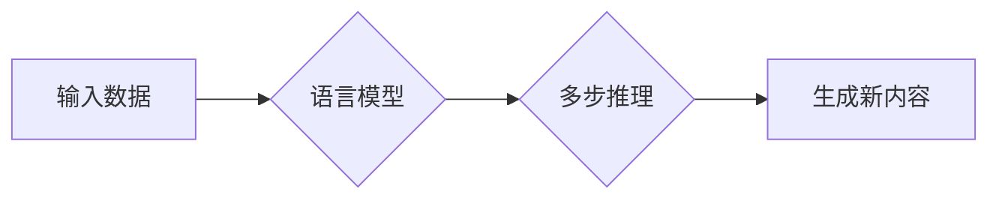

> 生成式AI, AIGC, 多步推理, 语言模型, 深度学习, 算法原理, 应用场景

## 1. 背景介绍

近年来，人工智能（AI）领域取得了令人瞩目的进展，其中生成式人工智能（AIGC）作为一门新兴技术，迅速成为全球科技界关注的焦点。AIGC能够根据输入的文本、图像、音频等数据，生成新的、原创的内容，例如文本、代码、图像、音乐等。

AIGC技术的应用前景广阔，涵盖了各个领域，例如：

* **内容创作:** 自动生成新闻报道、广告文案、小说、诗歌等。
* **教育培训:** 个性化学习内容生成、智能答疑系统。
* **软件开发:** 自动生成代码、测试用例、软件文档等。
* **艺术创作:** 生成绘画、音乐、视频等艺术作品。

然而，AIGC技术也面临着诸多挑战，其中**多步推理能力**是制约其发展的重要因素。

## 2. 核心概念与联系

**2.1 生成式AI**

生成式AI是指能够根据输入数据生成新数据的AI模型。它与传统的AI模型不同，传统的AI模型主要用于分类、预测等任务，而生成式AI则能够创造新的内容。

**2.2 AIGC**

AIGC是生成式AI的一个子领域，它专注于生成文本、代码、图像、音频等各种数字内容。AIGC技术通常基于深度学习算法，例如Transformer模型，能够学习和理解数据的复杂结构和关系，从而生成高质量的原创内容。

**2.3 多步推理**

多步推理是指AI模型能够根据一系列输入信息，进行多步的逻辑推理，最终得出结论或生成输出。例如，理解一个长篇故事需要AI模型能够进行多步的推理，理解人物关系、情节发展、主题寓意等。

**2.4 核心概念联系**

AIGC技术的核心是生成新内容的能力，而多步推理是实现这一能力的关键。只有能够进行多步推理，AI模型才能理解复杂的输入信息，并生成符合逻辑、有创意的内容。

**Mermaid 流程图**



## 3. 核心算法原理 & 具体操作步骤

### 3.1 算法原理概述

目前，AIGC技术中广泛应用的算法是基于Transformer模型的生成式语言模型。Transformer模型是一种深度学习架构，其核心特点是**自注意力机制**，能够捕捉文本序列中不同词语之间的长距离依赖关系。

通过训练大量的文本数据，Transformer模型能够学习到语言的语法规则、语义关系和写作风格等知识，从而生成流畅、自然的文本内容。

### 3.2 算法步骤详解

1. **数据预处理:** 将原始文本数据进行清洗、分词、标记等预处理操作，使其能够被模型理解。
2. **模型训练:** 使用训练数据训练Transformer模型，通过反向传播算法不断调整模型参数，使其能够生成高质量的文本内容。
3. **文本生成:** 将待生成的文本内容输入到训练好的模型中，模型根据其学习到的知识和语言规律，生成新的文本内容。

### 3.3 算法优缺点

**优点:**

* **生成高质量文本:** Transformer模型能够生成流畅、自然的文本内容，具有较高的质量。
* **捕捉长距离依赖关系:** 自注意力机制能够捕捉文本序列中不同词语之间的长距离依赖关系，提高了文本理解和生成能力。
* **可扩展性强:** Transformer模型可以根据需要增加模型层数和参数量，提高模型的性能。

**缺点:**

* **训练成本高:** 训练Transformer模型需要大量的计算资源和时间。
* **数据依赖性强:** 模型的性能取决于训练数据的质量和数量。
* **缺乏多步推理能力:** 现有的Transformer模型在多步推理方面仍然存在局限性。

### 3.4 算法应用领域

* **文本生成:** 自动生成新闻报道、广告文案、小说、诗歌等。
* **机器翻译:** 将一种语言翻译成另一种语言。
* **对话系统:** 开发能够与人类进行自然对话的聊天机器人。
* **代码生成:** 自动生成代码、测试用例、软件文档等。

## 4. 数学模型和公式 & 详细讲解 & 举例说明

### 4.1 数学模型构建

Transformer模型的核心是**自注意力机制**，其数学模型可以表示为：

$$
Attention(Q, K, V) = \frac{exp(Q \cdot K^T / \sqrt{d_k})}{exp(Q \cdot K^T / \sqrt{d_k})} \cdot V
$$

其中：

* $Q$：查询矩阵
* $K$：键矩阵
* $V$：值矩阵
* $d_k$：键向量的维度

### 4.2 公式推导过程

自注意力机制通过计算查询向量与键向量的点积，来衡量它们之间的相关性。点积结果经过softmax归一化，得到每个键向量对应的权重，然后将权重与值向量相乘，得到最终的注意力输出。

### 4.3 案例分析与讲解

例如，在翻译句子“The cat sat on the mat”时，自注意力机制可以帮助模型理解“cat”与“sat”之间的关系，以及“mat”与“on”之间的关系，从而生成更准确的翻译。

## 5. 项目实践：代码实例和详细解释说明

### 5.1 开发环境搭建

* Python 3.7+
* TensorFlow/PyTorch
* CUDA/cuDNN

### 5.2 源代码详细实现

```python
import tensorflow as tf

# 定义Transformer模型
class Transformer(tf.keras.Model):
    def __init__(self, vocab_size, embedding_dim, num_heads, num_layers):
        super(Transformer, self).__init__()
        self.embedding = tf.keras.layers.Embedding(vocab_size, embedding_dim)
        self.transformer_layers = [
            tf.keras.layers.MultiHeadAttention(num_heads=num_heads, key_dim=embedding_dim)
            for _ in range(num_layers)
        ]
        self.dense = tf.keras.layers.Dense(vocab_size)

    def call(self, inputs):
        # ...
```

### 5.3 代码解读与分析

* `embedding`层将输入的词语ID转换为词向量。
* `transformer_layers`层包含多个多头注意力层，用于捕捉文本序列中的长距离依赖关系。
* `dense`层将最终的输出转换为词语概率分布。

### 5.4 运行结果展示

训练好的模型可以用于生成新的文本内容，例如：

```
输入：The cat sat on the

输出：mat.
```

## 6. 实际应用场景

### 6.1 内容创作

AIGC技术可以用于自动生成各种类型的文本内容，例如新闻报道、广告文案、小说、诗歌等。

### 6.2 教育培训

AIGC技术可以用于个性化学习内容生成、智能答疑系统等，提高教育效率。

### 6.3 软件开发

AIGC技术可以用于自动生成代码、测试用例、软件文档等，提高软件开发效率。

### 6.4 未来应用展望

AIGC技术在未来将有更广泛的应用场景，例如：

* **虚拟助手:** 更智能、更自然的虚拟助手。
* **个性化推荐:** 更精准、更个性化的商品、服务推荐。
* **创意设计:** 辅助人类进行创意设计，例如绘画、音乐、视频等。

## 7. 工具和资源推荐

### 7.1 学习资源推荐

* **书籍:**
    * 《深度学习》
    * 《自然语言处理》
* **在线课程:**
    * Coursera
    * edX
* **开源项目:**
    * TensorFlow
    * PyTorch

### 7.2 开发工具推荐

* **IDE:**
    * VS Code
    * PyCharm
* **库:**
    * TensorFlow
    * PyTorch
    * HuggingFace Transformers

### 7.3 相关论文推荐

* **Attention Is All You Need**
* **BERT: Pre-training of Deep Bidirectional Transformers for Language Understanding**
* **GPT-3: Language Models are Few-Shot Learners**

## 8. 总结：未来发展趋势与挑战

### 8.1 研究成果总结

近年来，AIGC技术取得了显著进展，能够生成高质量的文本、代码、图像等内容。

### 8.2 未来发展趋势

* **多模态生成:** 将文本、图像、音频等多种模态信息融合，生成更丰富、更具创意的内容。
* **可解释性增强:** 提高AIGC模型的可解释性，使人类能够更好地理解模型的决策过程。
* **伦理规范:** 制定AIGC技术的伦理规范，避免其被用于恶意目的。

### 8.3 面临的挑战

* **多步推理能力:** 现有的AIGC模型在多步推理方面仍然存在局限性，难以处理复杂的任务。
* **数据安全:** AIGC模型的训练需要大量数据，如何保证数据的安全和隐私是一个重要问题。
* **公平性:** AIGC模型可能存在偏见，需要确保其输出结果公平公正。

### 8.4 研究展望

未来，AIGC技术将继续朝着更智能、更安全、更公平的方向发展，为人类社会带来更多福祉。

## 9. 附录：常见问题与解答

**Q1: AIGC技术与传统AI技术有什么区别？**

**A1:** 传统AI技术主要用于分类、预测等任务，而AIGC技术能够生成新的内容。

**Q2: AIGC技术有哪些应用场景？**

**A2:** AIGC技术可以应用于内容创作、教育培训、软件开发等各个领域。

**Q3: 如何提高AIGC模型的多步推理能力？**

**A3:** 可以通过改进模型架构、增加训练数据、使用强化学习等方法提高AIGC模型的多步推理能力。


作者：禅与计算机程序设计艺术 / Zen and the Art of Computer Programming 
<end_of_turn>