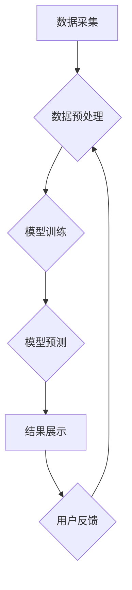

> 生成式AI, AIGC, 商业智能, 自然语言处理, 深度学习, 图像生成, 文本生成, 代码生成

## 1. 背景介绍

近年来，人工智能（AI）技术取得了飞速发展，特别是生成式人工智能（Generative AI）的兴起，为商业智能（Business Intelligence，BI）领域带来了革命性的变革。生成式AI是指能够根据输入数据生成新内容的AI模型，例如文本、图像、音频、视频等。与传统的AI模型相比，生成式AI更加注重创造性和创新性，能够帮助企业从海量数据中挖掘出更有价值的洞察和知识。

传统的BI系统主要依赖于数据分析和可视化工具，能够帮助企业了解历史数据趋势和模式。然而，传统的BI系统往往难以应对复杂的数据场景和用户个性化需求。生成式AIGC则能够突破这些局限，通过学习和理解数据背后的结构和规律，生成更具洞察力和创造性的结果，为企业提供更智能化、更个性化的BI体验。

## 2. 核心概念与联系

**2.1 生成式AI的核心概念**

生成式AI的核心是利用深度学习算法，例如生成对抗网络（GAN）、变分自编码器（VAE）和Transformer等，从训练数据中学习数据分布，并生成新的数据样本。

**2.2 AIGC与商业智能的联系**

AIGC能够为商业智能提供以下方面的支持：

* **数据分析和洞察：** AIGC可以自动分析海量数据，识别出隐藏的模式和趋势，并生成可读性强的报告和图表，帮助企业更深入地了解业务状况。
* **预测和预警：** AIGC可以基于历史数据和当前趋势，预测未来的业务发展趋势，并及时预警潜在的风险和机会。
* **个性化体验：** AIGC可以根据用户的需求和偏好，生成个性化的报表、分析报告和建议，提供更贴心的BI体验。
* **自动化决策支持：** AIGC可以帮助企业自动化决策过程，例如生成销售预测、客户分层和营销策略建议等。

**2.3 AIGC与商业智能的架构**



## 3. 核心算法原理 & 具体操作步骤

### 3.1 算法原理概述

生成式AIGC的核心算法主要包括：

* **生成对抗网络（GAN）：** GAN由两个网络组成：生成器和鉴别器。生成器试图生成逼真的数据样本，而鉴别器试图区分真实数据和生成数据。两者在对抗博弈中相互学习，最终生成器能够生成与真实数据相似的样本。
* **变分自编码器（VAE）：** VAE通过编码器将数据压缩成低维表示，然后通过解码器将低维表示恢复成原始数据。VAE能够学习数据的潜在结构，并生成新的数据样本。
* **Transformer：** Transformer是一种基于注意力机制的深度学习模型，能够处理序列数据，例如文本和音频。Transformer在自然语言处理领域取得了突破性的进展，也应用于生成式AIGC中，例如文本生成和机器翻译。

### 3.2 算法步骤详解

以文本生成为例，使用Transformer模型进行文本生成，具体步骤如下：

1. **数据预处理：** 将文本数据进行清洗、分词、词嵌入等预处理操作，以便模型能够理解和处理数据。
2. **模型训练：** 使用训练数据训练Transformer模型，模型会学习文本数据的语法结构、语义关系和上下文信息。
3. **文本生成：** 在训练完成后，输入一个文本提示，模型会根据训练数据和提示信息，生成新的文本内容。

### 3.3 算法优缺点

**优点：**

* 生成结果逼真、多样性强。
* 可以处理各种类型的数据，例如文本、图像、音频等。
* 能够学习数据背后的复杂结构和规律。

**缺点：**

* 训练数据量大，训练成本高。
* 模型容易受到训练数据偏差的影响。
* 生成结果可能存在逻辑错误或不合理之处。

### 3.4 算法应用领域

生成式AIGC在各个领域都有广泛的应用，例如：

* **自然语言处理：** 文本生成、机器翻译、聊天机器人、文本摘要等。
* **图像生成：** 图像合成、图像修复、图像风格迁移等。
* **音频生成：** 音频合成、音乐创作、语音识别等。
* **代码生成：** 代码自动完成、代码翻译、代码修复等。

## 4. 数学模型和公式 & 详细讲解 & 举例说明

### 4.1 数学模型构建

**4.1.1 生成对抗网络（GAN）**

GAN由两个神经网络组成：生成器（G）和鉴别器（D）。

* **生成器（G）：** 接收随机噪声作为输入，生成逼真的数据样本。
* **鉴别器（D）：** 接收真实数据和生成数据作为输入，判断数据是否真实。

**4.1.2 损失函数**

GAN的训练目标是让生成器生成逼真的数据样本，以欺骗鉴别器。

* **鉴别器损失函数：**

$$
L_D = - \frac{1}{m} \sum_{i=1}^{m} \left[ \log D(x_i) + \log (1 - D(G(z_i))) \right]
$$

* **生成器损失函数：**

$$
L_G = - \frac{1}{m} \sum_{i=1}^{m} \log D(G(z_i))
$$

其中：

* $x_i$ 是真实数据样本。
* $z_i$ 是随机噪声。
* $G(z_i)$ 是生成器生成的样本。
* $D(x)$ 是鉴别器对数据 $x$ 的预测概率。
* $m$ 是样本数量。

**4.1.3 训练过程**

GAN的训练过程是一个对抗博弈的过程。

1. 鉴别器先训练，学习区分真实数据和生成数据。
2. 生成器训练，试图生成能够欺骗鉴别器的样本。
3. 循环上述步骤，直到生成器能够生成逼真的数据样本。

### 4.2 公式推导过程

**4.2.1 鉴别器损失函数推导**

鉴别器损失函数的目的是让鉴别器能够准确区分真实数据和生成数据。

* 对于真实数据，鉴别器应该预测概率为1。
* 对于生成数据，鉴别器应该预测概率为0。

因此，鉴别器损失函数可以定义为真实数据和生成数据的预测概率的负对数的平均值。

**4.2.2 生成器损失函数推导**

生成器损失函数的目的是让生成器能够生成能够欺骗鉴别器的样本。

* 生成器希望鉴别器预测生成数据的概率为1。

因此，生成器损失函数可以定义为鉴别器对生成数据的预测概率的负对数的平均值。

### 4.3 案例分析与讲解

**4.3.1 图像生成案例**

使用GAN模型可以生成逼真的图像，例如人脸、风景、物体等。

**4.3.2 文本生成案例**

使用Transformer模型可以生成逼真的文本，例如新闻报道、小说、诗歌等。

## 5. 项目实践：代码实例和详细解释说明

### 5.1 开发环境搭建

* **操作系统：** Linux/macOS
* **编程语言：** Python
* **深度学习框架：** TensorFlow/PyTorch
* **其他工具：** Git、Jupyter Notebook

### 5.2 源代码详细实现

以下是一个使用TensorFlow生成文本的简单代码示例：

```python
import tensorflow as tf

# 定义模型
model = tf.keras.Sequential([
    tf.keras.layers.Embedding(input_dim=vocab_size, output_dim=embedding_dim),
    tf.keras.layers.LSTM(units=lstm_units),
    tf.keras.layers.Dense(units=vocab_size, activation='softmax')
])

# 编译模型
model.compile(optimizer='adam', loss='sparse_categorical_crossentropy', metrics=['accuracy'])

# 训练模型
model.fit(x_train, y_train, epochs=epochs)

# 生成文本
text = 'The quick brown fox'
for _ in range(max_length):
    predictions = model.predict(tf.expand_dims(text, 0))
    predicted_index = tf.argmax(predictions[0]).numpy()
    text += words[predicted_index]
print(text)
```

### 5.3 代码解读与分析

* **模型定义：** 使用了Embedding层将单词转换为向量表示，LSTM层捕捉文本序列的上下文信息，Dense层输出每个单词的概率分布。
* **模型编译：** 使用Adam优化器、交叉熵损失函数和准确率作为评估指标。
* **模型训练：** 使用训练数据训练模型，训练epochs轮次。
* **文本生成：** 将初始文本输入模型，根据模型输出的概率分布预测下一个单词，并将其添加到文本中，重复该过程直到达到最大长度。

### 5.4 运行结果展示

运行上述代码后，会输出一个基于初始文本生成的新的文本序列。

## 6. 实际应用场景

### 6.1 商业智能分析

* **客户画像分析：** 使用生成式AIGC分析客户数据，生成客户画像，帮助企业更好地了解客户需求和行为。
* **市场趋势预测：** 使用生成式AIGC分析市场数据，预测未来的市场趋势，帮助企业制定更有效的营销策略。
* **风险预警：** 使用生成式AIGC分析企业数据，识别潜在的风险和机会，帮助企业及时采取措施。

### 6.2 内容创作

* **自动生成营销文案：** 使用生成式AIGC自动生成广告文案、社交媒体内容等营销材料。
* **创作个性化内容：** 使用生成式AIGC根据用户的喜好和需求，生成个性化的新闻、文章、视频等内容。
* **辅助写作：** 使用生成式AIGC辅助作家、记者等撰写文章、剧本等内容。

### 6.3 其他应用场景

* **代码生成：** 使用生成式AIGC自动生成代码，提高开发效率。
* **音乐创作：** 使用生成式AIGC创作新的音乐作品。
* **游戏开发：** 使用生成式AIGC生成游戏场景、人物、道具等内容。

### 6.4 未来应用展望

随着生成式AIGC技术的不断发展，其应用场景将更加广泛，例如：

* **虚拟助手：** 更智能、更人性化的虚拟助手，能够理解用户的自然语言指令，并提供更精准的帮助。
* **个性化教育：** 根据学生的学习进度和需求，生成个性化的学习内容和辅导。
* **医疗诊断：** 辅助医生进行疾病诊断，提高诊断准确率。

## 7. 工具和资源推荐

### 7.1 学习资源推荐

* **书籍：**
    * 《Deep Learning》 by Ian Goodfellow, Yoshua Bengio, and Aaron Courville
    * 《Generative Deep Learning》 by David Foster
* **在线课程：**
    * Coursera: Deep Learning Specialization
    * Udacity: Deep Learning Nanodegree
* **博客和网站：**
    * TensorFlow Blog: https://blog.tensorflow.org/
    * PyTorch Blog: https://pytorch.org/blog/

### 7.2 开发工具推荐

* **深度学习框架：** TensorFlow, PyTorch
* **编程语言：** Python
* **数据处理工具：** Pandas, NumPy
* **可视化工具：** Matplotlib, Seaborn

### 7.3 相关论文推荐

* **Generative Adversarial Networks** by Ian Goodfellow et al. (2014)
* **Attention Is All You Need** by