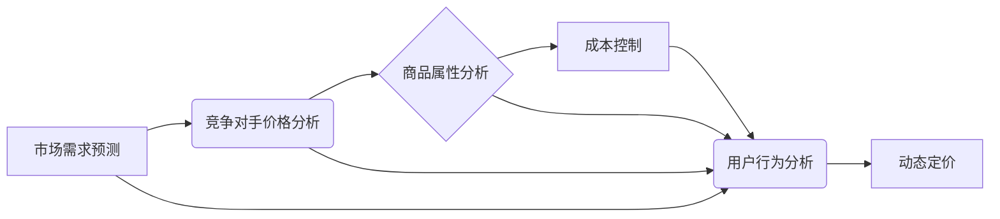

> 电商价格优化,机器学习,深度学习,预测模型,A/B测试,动态定价,市场分析,数据挖掘

## 1. 背景介绍

在当今激烈的电商市场竞争中，价格策略扮演着至关重要的角色。如何制定合理的定价策略，既能最大化利润，又能保持竞争力，是电商企业面临的重大挑战。传统的定价方法往往依赖于经验和主观判断，难以适应市场变化的快速节奏。随着人工智能技术的快速发展，机器学习和深度学习等算法为电商价格优化提供了强大的工具。

电商价格优化是指利用数据分析和机器学习算法，根据市场需求、竞争对手价格、商品属性等因素，动态调整商品价格，以实现利润最大化和销售额提升的目标。

## 2. 核心概念与联系

电商价格优化的核心概念包括：

* **市场需求预测:** 利用历史销售数据、市场趋势等信息，预测未来商品的需求量。
* **竞争对手价格分析:** 监控竞争对手的商品价格，了解市场价格水平和竞争态势。
* **商品属性分析:** 分析商品的属性、特征和价值，为定价提供参考依据。
* **成本控制:** 了解商品的生产成本、物流成本等，确保定价能够覆盖成本并实现利润。
* **用户行为分析:** 分析用户的购买行为、偏好和价格敏感度，为定价提供个性化参考。

**核心概念架构图:**



## 3. 核心算法原理 & 具体操作步骤

### 3.1  算法原理概述

电商价格优化的核心算法主要包括：

* **回归算法:** 用于预测商品价格与其他因素之间的关系，例如需求量、竞争对手价格等。常见的回归算法包括线性回归、逻辑回归、支持向量机等。
* **分类算法:** 用于将商品分类到不同的价格区间，例如低价、中价、高价等。常见的分类算法包括决策树、随机森林、神经网络等。
* **强化学习算法:** 用于训练智能代理，使其能够在不断变化的市场环境中学习最优的定价策略。

### 3.2  算法步骤详解

**以回归算法为例，电商价格优化的具体操作步骤如下：**

1. **数据收集:** 收集商品历史销售数据、市场价格数据、商品属性数据、用户行为数据等。
2. **数据预处理:** 对收集到的数据进行清洗、转换、特征工程等处理，使其适合算法训练。
3. **模型训练:** 选择合适的回归算法，并利用训练数据训练模型。
4. **模型评估:** 利用测试数据评估模型的性能，例如预测精度、平均绝对误差等。
5. **模型部署:** 将训练好的模型部署到线上系统，用于实时预测商品价格。
6. **结果分析:** 定期分析模型的预测结果，并根据实际情况进行模型调整和优化。

### 3.3  算法优缺点

**回归算法的优缺点:**

* **优点:** 
    * 能够准确预测商品价格与其他因素之间的关系。
    * 算法相对简单，易于理解和实现。
* **缺点:** 
    * 难以处理非线性关系。
    * 对异常数据敏感。

### 3.4  算法应用领域

回归算法广泛应用于电商价格优化、市场预测、风险评估等领域。

## 4. 数学模型和公式 & 详细讲解 & 举例说明

### 4.1  数学模型构建

电商价格优化的数学模型通常基于回归分析，目标是找到一个最佳的线性或非线性函数，将商品价格与其他因素之间的关系进行建模。

**线性回归模型:**

$$
P = \beta_0 + \beta_1 * D + \beta_2 * C + \beta_3 * R
$$

其中：

* $P$：商品价格
* $D$：市场需求量
* $C$：竞争对手价格
* $R$：商品属性评分
* $\beta_0$, $\beta_1$, $\beta_2$, $\beta_3$：回归系数

### 4.2  公式推导过程

回归系数的计算可以通过最小二乘法进行。最小二乘法旨在找到一个函数，使得预测值与实际值之间的误差平方和最小。

### 4.3  案例分析与讲解

假设我们有一个电商平台，销售一种商品。通过收集历史数据，我们发现以下关系：

* 当市场需求量增加 10% 时，商品价格平均上涨 5%。
* 当竞争对手价格上涨 10% 时，商品价格平均上涨 3%。
* 商品属性评分越高，商品价格越高。

我们可以利用上述关系构建一个线性回归模型，并通过最小二乘法计算回归系数。

## 5. 项目实践：代码实例和详细解释说明

### 5.1  开发环境搭建

* Python 3.x
* scikit-learn
* pandas
* matplotlib

### 5.2  源代码详细实现

```python
import pandas as pd
from sklearn.linear_model import LinearRegression

# 加载数据
data = pd.read_csv('price_data.csv')

# 特征工程
X = data[['demand', 'competitor_price', 'attribute_score']]
y = data['price']

# 训练模型
model = LinearRegression()
model.fit(X, y)

# 预测价格
new_data = pd.DataFrame({'demand': [1.1], 'competitor_price': [100], 'attribute_score': [8]})
predicted_price = model.predict(new_data)

# 打印预测结果
print(predicted_price)
```

### 5.3  代码解读与分析

* 代码首先加载数据，并进行特征工程，将需要预测价格的特征提取出来。
* 然后，使用 scikit-learn 库中的 LinearRegression 类创建线性回归模型，并使用 fit() 方法训练模型。
* 训练完成后，可以使用 predict() 方法预测新的数据点的价格。

### 5.4  运行结果展示

运行上述代码后，会输出预测的价格值。

## 6. 实际应用场景

电商价格优化在以下场景中具有广泛的应用：

* **动态定价:** 根据实时市场需求、竞争对手价格等因素，动态调整商品价格，以实现利润最大化。
* **促销活动:** 利用价格优惠策略，吸引用户购买商品，提高销售额。
* **个性化定价:** 根据用户的购买历史、偏好和价格敏感度，提供个性化的价格优惠。
* **库存管理:** 利用价格策略，促进滞销商品的销售，优化库存管理。

### 6.4  未来应用展望

随着人工智能技术的不断发展，电商价格优化将更加智能化、个性化和自动化。未来，我们可以期待以下应用场景：

* **基于深度学习的预测模型:** 利用深度学习算法，构建更精准的预测模型，更好地预测市场需求和用户行为。
* **实时动态定价:** 利用云计算和大数据技术，实现实时动态定价，更加灵活地应对市场变化。
* **个性化价格推荐:** 利用机器学习算法，为每个用户提供个性化的价格推荐，提升用户体验。

## 7. 工具和资源推荐

### 7.1  学习资源推荐

* **书籍:**
    * 《机器学习》 - 周志华
    * 《深度学习》 - Ian Goodfellow
* **在线课程:**
    * Coursera: Machine Learning
    * Udacity: Deep Learning Nanodegree

### 7.2  开发工具推荐

* **Python:** 
    * scikit-learn
    * pandas
    * TensorFlow
    * PyTorch

### 7.3  相关论文推荐

* **《电商价格优化研究综述》**
* **《基于深度学习的电商价格预测模型》**

## 8. 总结：未来发展趋势与挑战

### 8.1  研究成果总结

电商价格优化研究取得了显著进展，机器学习和深度学习算法为电商定价提供了强大的工具。

### 8.2  未来发展趋势

未来，电商价格优化将更加智能化、个性化和自动化，并与其他技术，例如大数据分析、云计算、物联网等深度融合。

### 8.3  面临的挑战

电商价格优化仍然面临一些挑战，例如：

* 数据质量问题
* 模型解释性问题
* 伦理道德问题

### 8.4  研究展望

未来，需要进一步研究更精准的预测模型、更有效的优化算法以及更合理的定价策略，以更好地解决电商价格优化的挑战。

## 9. 附录：常见问题与解答

* **Q1: 电商价格优化需要哪些数据？**

* **A1:** 电商价格优化需要收集以下数据：
    * 商品历史销售数据
    * 市场价格数据
    * 商品属性数据
    * 用户行为数据

* **Q2: 电商价格优化有哪些算法？**

* **A2:** 电商价格优化常用的算法包括：
    * 回归算法
    * 分类算法
    * 强化学习算法

* **Q3: 电商价格优化有哪些应用场景？**

* **A3:** 电商价格优化的应用场景包括：
    * 动态定价
    * 促销活动
    * 个性化定价
    * 库存管理

作者：禅与计算机程序设计艺术 / Zen and the Art of Computer Programming


<end_of_turn>