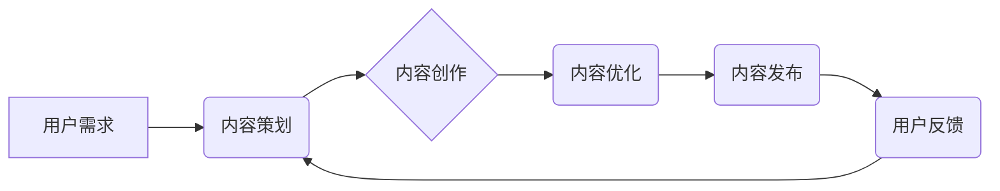

> 知识付费、内容创新、在线教育、人工智能、用户体验、商业模式

## 1. 背景介绍

知识付费行业近年来发展迅速，成为互联网经济的重要组成部分。随着人们对知识的需求不断增长，以及互联网技术的不断发展，知识付费模式也呈现出多元化、个性化的趋势。然而，在激烈的市场竞争中，内容创新成为知识付费创业的关键。

传统知识付费模式往往依赖于权威专家、海量资料和线下课程等资源，但随着市场饱和，这种模式面临着新的挑战。用户对内容质量、形式和体验的要求越来越高，知识付费平台需要不断探索新的内容创新模式，才能在竞争中脱颖而出。

## 2. 核心概念与联系

**2.1 知识付费的核心概念**

知识付费是指通过付费的方式获取知识、技能和服务的商业模式。它涵盖了各种形式的知识产品，例如在线课程、电子书、付费咨询、会员服务等。

**2.2 内容创新的核心概念**

内容创新是指在现有知识基础上，通过新的思维方式、技术手段和表达形式，创造出具有独特价值和吸引力的知识产品。

**2.3 知识付费与内容创新的联系**

知识付费和内容创新是相互促进、相互依存的关系。优质的内容是知识付费的核心驱动力，而内容创新则是知识付费持续发展的关键。

**2.4 内容创新模式**

* **个性化定制:** 根据用户的学习目标、兴趣和需求，提供个性化的学习路径和内容。
* **互动式学习:** 通过直播、问答、讨论等方式，增强用户参与度和学习效果。
* **沉浸式体验:** 利用虚拟现实、增强现实等技术，打造沉浸式的学习环境。
* **跨界融合:** 将知识付费与其他行业，例如游戏、娱乐、社交等进行融合，创造新的学习体验。

**2.5 内容创新架构**



## 3. 核心算法原理 & 具体操作步骤

**3.1 算法原理概述**

内容推荐算法是知识付费平台的核心技术之一，其目的是根据用户的学习行为、兴趣偏好等信息，推荐用户可能感兴趣的知识产品。常见的推荐算法包括协同过滤、内容过滤、基于知识图谱的推荐等。

**3.2 算法步骤详解**

1. **数据收集:** 收集用户的学习行为数据，例如浏览记录、购买记录、评价记录等。
2. **数据预处理:** 对收集到的数据进行清洗、转换和特征提取。
3. **模型训练:** 选择合适的推荐算法，并利用训练数据训练模型。
4. **推荐结果生成:** 将训练好的模型应用于新的用户数据，生成推荐结果。
5. **结果评估:** 对推荐结果进行评估，并根据评估结果进行模型优化。

**3.3 算法优缺点**

* **协同过滤:** 优点：能够发现用户之间的隐性关联，推荐个性化内容。缺点：数据稀疏性问题，冷启动问题。
* **内容过滤:** 优点：能够根据内容特征进行推荐，避免数据稀疏性问题。缺点：推荐结果可能缺乏个性化。
* **基于知识图谱的推荐:** 优点：能够利用知识关系进行推荐，推荐结果更精准。缺点：知识图谱构建成本高。

**3.4 算法应用领域**

* **在线教育平台:** 推荐课程、学习资源、学习计划等。
* **电商平台:** 推荐商品、优惠活动、品牌等。
* **社交媒体平台:** 推荐好友、话题、内容等。

## 4. 数学模型和公式 & 详细讲解 & 举例说明

**4.1 数学模型构建**

协同过滤算法的核心是计算用户之间或物品之间的相似度。常用的相似度度量方法包括余弦相似度、皮尔逊相关系数等。

**4.2 公式推导过程**

* **余弦相似度:**

$$
\text{相似度} = \frac{\mathbf{u} \cdot \mathbf{v}}{\|\mathbf{u}\| \|\mathbf{v}\|}
$$

其中，$\mathbf{u}$ 和 $\mathbf{v}$ 分别表示两个用户的特征向量，$\cdot$ 表示点积，$\|\mathbf{u}\|$ 和 $\|\mathbf{v}\|$ 分别表示两个特征向量的模长。

* **皮尔逊相关系数:**

$$
\text{相似度} = \frac{\sum_{i=1}^{n}(u_i - \bar{u})(v_i - \bar{v})}{\sqrt{\sum_{i=1}^{n}(u_i - \bar{u})^2} \sqrt{\sum_{i=1}^{n}(v_i - \bar{v})^2}}
$$

其中，$u_i$ 和 $v_i$ 分别表示两个用户在第 $i$ 个物品上的评分，$\bar{u}$ 和 $\bar{v}$ 分别表示两个用户的平均评分。

**4.3 案例分析与讲解**

假设有两个用户 A 和 B，他们在以下三个电影上的评分如下：

| 电影 | 用户 A | 用户 B |
|---|---|---|
| 电影 1 | 5 | 4 |
| 电影 2 | 3 | 5 |
| 电影 3 | 4 | 3 |

我们可以使用余弦相似度或皮尔逊相关系数计算用户 A 和 B 的相似度。

## 5. 项目实践：代码实例和详细解释说明

**5.1 开发环境搭建**

* Python 3.x
* TensorFlow 或 PyTorch
* Jupyter Notebook

**5.2 源代码详细实现**

```python
import numpy as np
from sklearn.metrics.pairwise import cosine_similarity

# 用户评分数据
ratings = np.array([
    [5, 3, 4],
    [4, 5, 3]
])

# 计算余弦相似度
similarity = cosine_similarity(ratings)

# 打印相似度矩阵
print(similarity)
```

**5.3 代码解读与分析**

* `ratings` 变量存储了用户评分数据，其中每一行代表一个用户，每一列代表一个电影。
* `cosine_similarity()` 函数计算了用户之间的余弦相似度。
* `print(similarity)` 打印了用户之间的相似度矩阵。

**5.4 运行结果展示**

```
[[1.         0.8660254 ]
 [0.8660254 1.        ]]
```

结果表明，两个用户之间的相似度为 0.866，说明他们具有较高的相似度。

## 6. 实际应用场景

**6.1 在线教育平台**

* 推荐个性化学习路径和课程
* 推广相关课程和学习资源
* 预测用户学习进度和完成率

**6.2 电商平台**

* 推荐个性化商品和优惠活动
* 推广相关商品和品牌
* 预测用户购买意愿和消费行为

**6.3 社交媒体平台**

* 推荐好友和话题
* 推广相关内容和活动
* 预测用户兴趣和行为

**6.4 未来应用展望**

* 基于人工智能的个性化学习
* 虚拟现实和增强现实的沉浸式学习体验
* 内容创作和推荐的自动化

## 7. 工具和资源推荐

**7.1 学习资源推荐**

* 《推荐系统》
* 《机器学习》
* TensorFlow 官方文档
* PyTorch 官方文档

**7.2 开发工具推荐**

* TensorFlow
* PyTorch
* Scikit-learn
* Pandas

**7.3 相关论文推荐**

* 《Collaborative Filtering for Implicit Feedback Datasets》
* 《Matrix Factorization Techniques for Recommender Systems》
* 《Deep Learning for Recommender Systems》

## 8. 总结：未来发展趋势与挑战

**8.1 研究成果总结**

知识付费创业中的内容创新取得了显著成果，例如个性化推荐、互动式学习、沉浸式体验等。这些创新模式提高了用户体验，促进了知识付费行业的发展。

**8.2 未来发展趋势**

* 人工智能技术的应用将进一步推动内容创新的发展。
* 虚拟现实和增强现实技术将为用户提供更沉浸式的学习体验。
* 内容创作和推荐将更加自动化和智能化。

**8.3 面临的挑战**

* 内容质量的保证
* 用户隐私保护
* 平台商业模式的创新

**8.4 研究展望**

未来研究将重点关注以下几个方面：

* 如何利用人工智能技术提高内容质量和个性化程度
* 如何保障用户隐私和数据安全
* 如何探索新的商业模式，实现可持续发展


## 9. 附录：常见问题与解答

**9.1 如何提高内容的质量？**

* 邀请权威专家进行内容创作
* 采用多媒体形式，增强内容的吸引力
* 进行内容审核和优化，确保内容的准确性和实用性

**9.2 如何保护用户的隐私？**

* 明确用户隐私政策，获得用户的同意
* 加强数据加密和安全防护
* 不泄露用户的个人信息

**9.3 如何实现平台的商业化？**

* 推广会员服务，提供更多优质内容
* 推广广告，但要避免过度广告化
* 开发新的商业模式，例如知识付费社区


作者：禅与计算机程序设计艺术 / Zen and the Art of Computer Programming 
<end_of_turn>