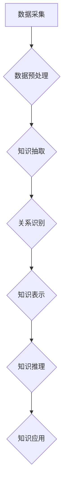

> 知识体系、构建、基本元素、复杂结构、知识图谱、机器学习、深度学习、自然语言处理、人工智能

## 1. 背景介绍

在当今数据爆炸的时代，知识已成为最宝贵的资源。如何有效地构建、存储、检索和利用知识，是人工智能领域面临的重大挑战。知识体系的构建，旨在将分散的知识片段整合为一个统一、结构化的知识网络，从而赋予机器理解和推理的能力。

传统的知识表示方法，如概念图和规则库，虽然能够表达一些知识关系，但难以处理复杂、动态的知识。随着机器学习和深度学习技术的飞速发展，基于数据驱动的知识体系构建方法逐渐成为主流。这些方法利用海量数据训练模型，自动学习知识结构和关系，能够更好地应对复杂知识的表达和推理。

## 2. 核心概念与联系

**2.1 知识图谱**

知识图谱 (Knowledge Graph, KG) 是一个基于知识表示的数据库，它以实体和关系为基本单元，将知识表示为一个图结构。实体代表现实世界中的事物，关系代表实体之间的连接。知识图谱能够有效地捕捉知识之间的复杂关系，并支持基于知识的查询和推理。

**2.2 机器学习**

机器学习 (Machine Learning, ML) 是人工智能的一个分支，它通过算法学习数据中的模式，从而提高预测和决策能力。在知识体系构建中，机器学习算法可以用于知识抽取、关系识别、知识推理等任务。

**2.3 深度学习**

深度学习 (Deep Learning, DL) 是机器学习的一个子领域，它利用多层神经网络模拟人类大脑的学习过程。深度学习算法能够从海量数据中自动学习复杂的特征和表示，在知识体系构建中具有强大的能力。

**2.4 自然语言处理**

自然语言处理 (Natural Language Processing, NLP) 是计算机科学的一个分支，它致力于使计算机能够理解和处理人类语言。在知识体系构建中，NLP技术可以用于文本挖掘、知识抽取、关系识别等任务。

**2.5 人工智能**

人工智能 (Artificial Intelligence, AI) 是一个跨学科领域，它致力于创建能够像人类一样思考、学习和解决问题的智能系统。知识体系构建是人工智能的重要组成部分，它为人工智能系统提供知识基础，使其能够更好地理解和交互于世界。

**Mermaid 流程图**



## 3. 核心算法原理 & 具体操作步骤

### 3.1 算法原理概述

知识体系构建的核心算法主要包括知识抽取、关系识别、知识表示和知识推理等。

* **知识抽取:** 从文本数据中提取实体和关系，构建知识图谱的基本单元。
* **关系识别:** 识别实体之间的关系类型，例如“人-工作”、“地点-事件”等。
* **知识表示:** 将提取的实体和关系表示为一种标准的格式，例如RDF、OWL等。
* **知识推理:** 基于知识图谱中的已知知识，推断出新的知识或关系。

### 3.2 算法步骤详解

**3.2.1 知识抽取**

1. **文本预处理:** 对文本数据进行清洗、分词、词性标注等预处理操作，以便于后续的知识抽取。
2. **实体识别:** 利用自然语言处理技术识别文本中的实体，例如人名、地名、机构名等。
3. **关系识别:** 利用机器学习算法识别实体之间的关系，例如“工作于”、“居住在”等。

**3.2.2 关系识别**

1. **特征提取:** 从文本中提取实体和关系之间的特征，例如词语距离、语法结构、语义相似度等。
2. **模型训练:** 利用机器学习算法训练关系识别模型，例如支持向量机、神经网络等。
3. **关系预测:** 将提取的特征输入到训练好的模型中，预测实体之间的关系类型。

**3.2.3 知识表示**

1. **选择知识表示语言:** 选择一种标准的知识表示语言，例如RDF、OWL等。
2. **实体和关系映射:** 将提取的实体和关系映射到知识表示语言中的概念和语法。
3. **知识图谱构建:** 将映射后的实体和关系连接起来，构建知识图谱。

**3.2.4 知识推理**

1. **规则定义:** 定义一些规则，描述知识图谱中实体和关系之间的逻辑关系。
2. **推理引擎:** 使用推理引擎执行规则，推断出新的知识或关系。
3. **结果输出:** 将推理结果输出到用户界面或其他系统。

### 3.3 算法优缺点

**优点:**

* 能够处理复杂、动态的知识。
* 自动学习知识结构和关系。
* 支持基于知识的查询和推理。

**缺点:**

* 需要海量数据进行训练。
* 算法复杂度较高。
* 知识图谱的构建和维护需要专业知识。

### 3.4 算法应用领域

* **搜索引擎:** 构建知识图谱可以提高搜索引擎的准确性和相关性。
* **问答系统:** 知识图谱可以为问答系统提供知识背景，提高回答的准确性和完整性。
* **推荐系统:** 知识图谱可以帮助推荐系统理解用户的兴趣和需求，提供更精准的推荐。
* **医疗诊断:** 知识图谱可以帮助医生诊断疾病，并提供个性化的治疗方案。

## 4. 数学模型和公式 & 详细讲解 & 举例说明

### 4.1 数学模型构建

知识体系构建可以利用图论、概率论和统计学等数学模型进行建模。

* **图论:** 知识图谱可以表示为一个图结构，其中实体为节点，关系为边。图论可以用于分析知识图谱的结构和性质，例如连通性、中心性等。
* **概率论:** 知识抽取和关系识别可以利用概率模型进行建模，例如贝叶斯网络、马尔可夫链等。这些模型可以用于计算实体和关系出现的概率，并进行预测。
* **统计学:** 知识体系构建可以利用统计学方法进行数据分析和模型评估，例如信息熵、互信息等。这些方法可以用于衡量知识图谱的质量和覆盖范围。

### 4.2 公式推导过程

**4.2.1 贝叶斯网络**

贝叶斯网络是一种概率图模型，它可以表示变量之间的依赖关系。

假设我们有一个知识图谱，其中包含实体A和实体B，以及关系R(A,B)。我们可以使用贝叶斯网络来计算关系R(A,B)出现的概率。

$$P(R(A,B)) = \frac{P(R(A,B)|A,B)P(A)P(B)}{P(R(A,B))}$$

其中：

* $P(R(A,B))$ 是关系R(A,B)出现的概率。
* $P(R(A,B)|A,B)$ 是给定实体A和B的情况下，关系R(A,B)出现的条件概率。
* $P(A)$ 和 $P(B)$ 分别是实体A和B出现的概率。

**4.2.2 信息熵**

信息熵可以用来衡量知识图谱的复杂性和不确定性。

$$H(X) = - \sum_{x \in X} P(x) \log_2 P(x)$$

其中：

* $H(X)$ 是随机变量X的信息熵。
* $P(x)$ 是随机变量X取值x的概率。

### 4.3 案例分析与讲解

**4.3.1 医疗知识图谱**

医疗知识图谱可以包含疾病、症状、药物、治疗方法等信息。通过构建医疗知识图谱，可以帮助医生诊断疾病、制定治疗方案，并进行药物相互作用的预测。

**4.3.2 商业知识图谱**

商业知识图谱可以包含产品、客户、市场趋势等信息。通过构建商业知识图谱，可以帮助企业进行市场分析、产品推荐、客户关系管理等。

## 5. 项目实践：代码实例和详细解释说明

### 5.1 开发环境搭建

* **操作系统:** Ubuntu 20.04 LTS
* **编程语言:** Python 3.8
* **开发工具:** Jupyter Notebook
* **库依赖:**

```python
pip install rdflib networkx numpy pandas matplotlib
```

### 5.2 源代码详细实现

```python
# 知识图谱构建示例代码

from rdflib import Graph, Literal, Namespace
from networkx import Graph as nxGraph

# 定义命名空间
RDF = Namespace("http://www.w3.org/1999/02/22-rdf-syntax-ns#")
RDFS = Namespace("http://www.w3.org/2000/01/rdf-schema#")
FOAF = Namespace("http://xmlns.com/foaf/0.1/")

# 创建知识图谱
g = Graph()

# 添加实体
g.add((FOAF.Person("张三"), RDF.type, FOAF.Person))
g.add((FOAF.Person("李四"), RDF.type, FOAF.Person))

# 添加关系
g.add((FOAF.Person("张三"), FOAF.knows, FOAF.Person("李四")))

# 构建网络图
nx_graph = nxGraph()
for s, p, o in g.triples((None, None, None)):
    nx_graph.add_edge(s, o, relation=p)

# 绘制网络图
nx.draw(nx_graph, with_labels=True)
plt.show()
```

### 5.3 代码解读与分析

* 代码首先定义了命名空间，用于标识知识图谱中的实体和关系。
* 然后创建了一个知识图谱对象，并添加了实体和关系。
* 接着将知识图谱转换为网络图，并使用NetworkX库绘制网络图。

### 5.4 运行结果展示

运行代码后，将生成一个网络图，其中实体表示为节点，关系表示为边。

## 6. 实际应用场景

### 6.1 搜索引擎

知识图谱可以帮助搜索引擎理解用户查询的意图，并提供更准确、更相关的搜索结果。例如，当用户搜索“苹果公司”时，搜索引擎可以利用知识图谱找到苹果公司的相关信息，包括公司简介、产品列表、新闻报道等。

### 6.2 问答系统

知识图谱可以为问答系统提供知识背景，提高回答的准确性和完整性。例如，当用户问“苹果公司的创始人是谁？”时，问答系统可以利用知识图谱找到苹果公司的创始人信息，并给出准确的答案。

### 6.3 推荐系统

知识图谱可以帮助推荐系统理解用户的兴趣和需求，提供更精准的推荐。例如，当用户浏览了某个产品的页面时，推荐系统可以利用知识图谱找到与该产品相关的其他产品，并进行推荐。

### 6.4 未来应用展望

随着人工智能技术的不断发展，知识体系构建将在更多领域得到应用，例如：

* **个性化教育:** 根据学生的学习情况和兴趣，构建个性化的学习知识体系。
* **智能医疗:** 利用知识图谱辅助医生诊断疾病、制定治疗方案。
* **智慧城市:** 利用知识图谱管理城市资源、优化城市服务。

## 7. 工具和资源推荐

### 7.1 学习资源推荐

* **书籍:**
    * 《知识图谱：构建、应用与未来》
    * 《深度学习》
    * 《自然语言处理》
* **在线课程:**
    * Coursera: 知识图谱构建
    * edX: 深度学习
    * Udacity: 自然语言处理

### 7.2 开发工具推荐

* **知识图谱构建工具:**
    * Apache Jena
    * RDF4J
    * Neo4j
* **机器学习库:**
