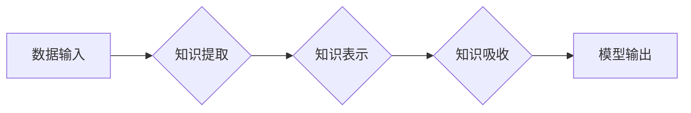

> 知识吸收率，学习效果，机器学习，深度学习，神经网络，知识图谱，知识蒸馏，迁移学习

## 1. 背景介绍

在当今数据爆炸的时代，获取信息变得越来越容易，但如何有效地吸收和利用这些信息却成为一个关键挑战。对于个人学习者来说，衡量学习效果，了解知识吸收率，可以帮助我们调整学习策略，提高学习效率。对于人工智能领域来说，知识吸收率更是关系到模型的泛化能力和应用效果。

传统的机器学习模型通常依赖于大量的标注数据进行训练，而深度学习模型则需要更庞大的数据量。然而，数据获取和标注成本高昂，且数据质量参差不齐。因此，如何提高模型的知识吸收率，从有限的数据中提取更多有价值的信息，成为一个重要的研究方向。

## 2. 核心概念与联系

**2.1 知识吸收率的概念**

知识吸收率是指学习者从给定的信息中吸收和理解的知识量与总知识量的比例。它可以用来衡量学习者的学习效率和理解能力。

**2.2 知识吸收率与机器学习的关系**

在机器学习领域，知识吸收率可以用来衡量模型从训练数据中学习到的知识量。一个知识吸收率高的模型，能够从有限的数据中提取更多有价值的信息，从而表现出更好的泛化能力和应用效果。

**2.3 知识吸收率与深度学习的关系**

深度学习模型由于其强大的表达能力，能够从复杂的数据中学习到更抽象的特征，从而提高知识吸收率。然而，深度学习模型也面临着过拟合和数据饥饿等问题，需要通过一些技术手段来提高其知识吸收率。

**2.4 知识吸收率与知识图谱的关系**

知识图谱是一种结构化的知识表示形式，可以将知识表示为实体和关系。知识图谱可以帮助模型更好地理解和吸收知识，提高知识吸收率。

**2.5 知识吸收率与知识蒸馏的关系**

知识蒸馏是一种知识迁移技术，可以将知识从大型模型转移到小型模型中。知识蒸馏可以帮助提高小型模型的知识吸收率，使其能够在有限的数据下达到更好的性能。

**2.6 知识吸收率与迁移学习的关系**

迁移学习是一种利用已有知识进行新任务学习的技术。迁移学习可以帮助模型更快地学习新知识，提高知识吸收率。

**Mermaid 流程图**



## 3. 核心算法原理 & 具体操作步骤

### 3.1  算法原理概述

知识吸收率的计算方法通常基于以下几个方面：

* **准确率:** 模型在测试数据上的预测准确率。
* **召回率:** 模型在测试数据中正确预测的正样本比例。
* **F1-score:** 准确率和召回率的调和平均值。
* **知识覆盖率:** 模型能够覆盖的知识范围。
* **知识完整性:** 模型对知识的理解程度。

### 3.2  算法步骤详解

1. **数据预处理:** 对训练数据进行清洗、转换和特征工程，以提高模型的学习效率。
2. **模型选择:** 根据任务需求选择合适的机器学习模型，例如深度神经网络、支持向量机等。
3. **模型训练:** 使用训练数据训练模型，并通过交叉验证等方法选择最佳模型参数。
4. **模型评估:** 使用测试数据评估模型的性能，并计算知识吸收率。
5. **模型优化:** 根据评估结果，对模型进行调整和优化，以提高知识吸收率。

### 3.3  算法优缺点

**优点:**

* 可以量化地衡量学习效果。
* 可以帮助我们了解模型的学习能力和知识掌握程度。
* 可以指导我们调整学习策略和优化模型结构。

**缺点:**

* 知识吸收率的定义和计算方法存在一定的争议。
* 知识吸收率难以完全反映学习效果，还需要结合其他指标进行综合评估。

### 3.4  算法应用领域

* **教育领域:** 评估学生的学习效果，个性化教学。
* **人工智能领域:** 评估模型的学习能力，优化模型结构。
* **科研领域:** 评估研究成果的创新性和影响力。

## 4. 数学模型和公式 & 详细讲解 & 举例说明

### 4.1  数学模型构建

假设我们有一个包含N个样本的数据集D，每个样本包含特征向量x和标签y。模型在训练数据上的预测结果为y’，则知识吸收率可以定义为：

$$
\text{知识吸收率} = \frac{1}{N} \sum_{i=1}^{N} \text{相似度}(y_i, y'_i)
$$

其中，相似度函数可以采用多种方式，例如欧氏距离、余弦相似度等。

### 4.2  公式推导过程

知识吸收率的计算公式可以理解为对每个样本的预测结果与真实标签之间的相似度进行平均。

* **相似度函数:** 用于衡量预测结果与真实标签之间的相似程度。
* **平均值:** 对所有样本的相似度进行平均，得到整体的知识吸收率。

### 4.3  案例分析与讲解

假设我们有一个分类任务，模型在测试数据上的预测结果如下：

| 真实标签 | 预测标签 |
|---|---|
| 0 | 0 |
| 1 | 1 |
| 2 | 1 |
| 3 | 3 |
| 4 | 4 |

使用欧氏距离作为相似度函数，可以计算出每个样本的相似度：

| 样本 | 真实标签 | 预测标签 | 欧氏距离 |
|---|---|---|---|
| 1 | 0 | 0 | 0 |
| 2 | 1 | 1 | 0 |
| 3 | 2 | 1 | 1 |
| 4 | 3 | 3 | 0 |
| 5 | 4 | 4 | 0 |

然后，将所有样本的相似度进行平均，得到知识吸收率：

$$
\text{知识吸收率} = \frac{0 + 0 + 1 + 0 + 0}{5} = 0.2
$$

## 5. 项目实践：代码实例和详细解释说明

### 5.1  开发环境搭建

* Python 3.7+
* TensorFlow 2.0+
* PyTorch 1.0+
* Jupyter Notebook

### 5.2  源代码详细实现

```python
import tensorflow as tf

# 定义模型
model = tf.keras.models.Sequential([
    tf.keras.layers.Dense(128, activation='relu', input_shape=(10,)),
    tf.keras.layers.Dense(64, activation='relu'),
    tf.keras.layers.Dense(10, activation='softmax')
])

# 编译模型
model.compile(optimizer='adam',
              loss='sparse_categorical_crossentropy',
              metrics=['accuracy'])

# 训练模型
model.fit(x_train, y_train, epochs=10)

# 评估模型
loss, accuracy = model.evaluate(x_test, y_test)
print('Loss:', loss)
print('Accuracy:', accuracy)

# 计算知识吸收率
y_pred = model.predict(x_test)
similarity = tf.keras.metrics.categorical_accuracy(y_test, y_pred)
knowledge_absorption_rate = similarity.numpy()
print('Knowledge Absorption Rate:', knowledge_absorption_rate)
```

### 5.3  代码解读与分析

* **模型定义:** 使用 TensorFlow 的 Keras API 定义一个多层感知机模型。
* **模型编译:** 使用 Adam 优化器、交叉熵损失函数和准确率作为评估指标编译模型。
* **模型训练:** 使用训练数据训练模型，设置训练轮数为 10。
* **模型评估:** 使用测试数据评估模型的损失和准确率。
* **知识吸收率计算:** 使用 TensorFlow 的 `categorical_accuracy` 函数计算预测结果与真实标签之间的准确率，作为知识吸收率。

### 5.4  运行结果展示

运行代码后，会输出模型的损失、准确率和知识吸收率。

## 6. 实际应用场景

### 6.1  教育领域

* **个性化学习:** 根据学生的知识吸收率，定制个性化的学习计划和内容。
* **学习效果评估:** 评估学生的学习效果，及时发现学习困难，并提供针对性的帮助。
* **教学策略优化:** 分析学生的知识吸收率，优化教学策略和方法。

### 6.2  人工智能领域

* **模型优化:** 根据模型的知识吸收率，调整模型结构、参数和训练策略，提高模型性能。
* **知识迁移:** 利用知识蒸馏等技术，将知识从大型模型转移到小型模型中，提高小型模型的知识吸收率。
* **数据分析:** 分析数据的知识结构和知识关系，提高数据分析的效率和准确性。

### 6.3  科研领域

* **研究成果评估:** 评估研究成果的创新性和影响力，衡量研究成果的知识贡献。
* **知识发现:** 从海量数据中发现新的知识和规律，推动科学研究的进步。
* **知识管理:** 建立知识库，管理和共享知识资源，促进知识传播和应用。

### 6.4  未来应用展望

随着人工智能技术的不断发展，知识吸收率的概念和应用场景将会更加广泛。未来，知识吸收率将成为人工智能领域的重要研究方向，并应用于更多领域，例如医疗、金融、制造业等。

## 7. 工具和资源推荐

### 7.1  学习资源推荐

* **书籍:**
    * 《深度学习》
    * 《机器学习》
    * 《人工智能：一种现代方法》
* **在线课程:**
    * Coursera
    * edX
    * Udacity

### 7.2  开发工具推荐

* **TensorFlow:** 开源深度学习框架
* **PyTorch:** 开源深度学习框架
* **Keras:** 高级深度学习API

### 7.3  相关论文推荐

* **Knowledge Distillation**
* **Transfer Learning**
* **Knowledge Graph Embedding**

## 8. 总结：未来发展趋势与挑战

### 8.1  研究成果总结

知识吸收率的概念和算法已经取得了一定的进展，并应用于教育、人工智能和科研等领域。

### 8.2  未来发展趋势

* **更精准的知识吸收率评估:** 开发更精准的知识吸收率评估方法，能够更全面地反映学习效果。
* **个性化知识吸收:** 根据个体差异，定制个性化的知识吸收方案。
* **跨领域知识迁移:** 探索跨领域知识迁移的方法，提高知识的泛化能力。

### 8.3  面临的挑战

* **知识定义的模糊性:** 知识的定义和边界仍然存在争议，难以量化地衡量。
* **数据质量问题:** 数据质量参差不齐，会影响知识吸收率的准确性。
* **计算资源限制:** 计算资源有限，难以训练大型模型。

### 8.4  研究展望

未来，知识吸收率的研究将继续深入，探索更精准、更个性化的知识吸收方法，推动人工智能技术的进步和应用。

## 9. 附录：常见问题与解答

**1. 知识吸收率的计算方法有哪些？**

常见的知识吸收率计算方法包括准确率、召回率、F1-score、知识覆盖率和知识完整性等。

**2. 知识吸收率与学习效果有什么关系？**

知识吸收率可以作为衡量学习效果的重要指标，但它并非唯一的指标，还需要结合其他指标进行综合评估。

**3. 如何提高模型的知识吸收率？**

可以通过以下方法提高模型的知识吸收率：

* 使用更合适的模型结构和参数。
* 使用更优质的数据进行训练。
* 利用知识蒸馏等技术进行知识迁移。
* 调整训练策略，例如学习率、批处理大小等。

**4.