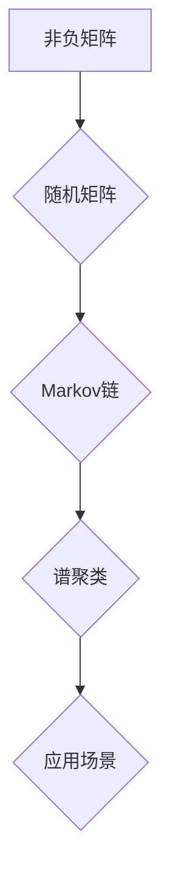

> 矩阵理论，非负矩阵，Markov链，谱聚类，图论，应用场景，算法实现

## 1. 背景介绍

矩阵理论作为数学领域的重要分支，在计算机科学、数据科学、经济学、物理学等众多领域有着广泛的应用。其中，非负矩阵作为一种特殊的矩阵类型，在许多实际问题中扮演着重要的角色。

非负矩阵是指所有元素都是非负数的矩阵。这类矩阵在描述许多现实世界现象时具有独特的优势，例如：

* **人口动态模型:**  可以用来模拟人口增长、迁移等现象。
* **网络流量分析:**  可以用来分析网络流量的分配和路由。
* **推荐系统:**  可以用来构建用户兴趣和商品推荐模型。
* **生物信息学:**  可以用来分析基因表达数据和蛋白质相互作用网络。

## 2. 核心概念与联系

非负矩阵理论的核心概念包括：

* **非负矩阵:** 所有元素都是非负数的矩阵。
* **随机矩阵:** 行和列的元素之和都为1的非负矩阵，通常用于描述概率分布。
* **Markov链:** 一种随机过程，其未来状态只依赖于当前状态，可以用非负矩阵来表示转移概率。
* **谱聚类:** 一种基于矩阵特征值和特征向量的聚类算法，可以用于将数据点分组。

**Mermaid 流程图:**



## 3. 核心算法原理 & 具体操作步骤

### 3.1  算法原理概述

非负矩阵理论中的核心算法主要包括：

* **矩阵分解:** 将一个非负矩阵分解成多个更简单的矩阵，例如奇异值分解 (SVD) 和非负矩阵分解 (NMF)。
* **特征值和特征向量:**  计算非负矩阵的特征值和特征向量，可以用于谱聚类和其他分析。
* **迭代算法:**  例如幂法和迭代谱聚类算法，用于求解非负矩阵的稳定状态和聚类结果。

### 3.2  算法步骤详解

**举例说明：非负矩阵分解 (NMF)**

1. **初始化:**  随机初始化两个非负矩阵，其乘积接近原始矩阵。
2. **迭代更新:**  根据一定的更新规则，迭代更新两个非负矩阵，直到收敛。
3. **收敛判断:**  判断更新后的矩阵是否满足收敛条件，例如误差小于某个阈值。
4. **输出结果:**  输出最终的两个非负矩阵，它们分别代表原始矩阵的低秩表示。

### 3.3  算法优缺点

**优点:**

* **可解释性强:**  非负矩阵分解可以将数据表示成更易于理解的成分。
* **鲁棒性好:**  对噪声和异常值有一定的鲁棒性。
* **应用广泛:**  在图像处理、文本挖掘、推荐系统等领域都有广泛的应用。

**缺点:**

* **计算复杂度高:**  对于大型矩阵，计算复杂度较高。
* **收敛性问题:**  某些情况下，算法可能无法收敛到最优解。

### 3.4  算法应用领域

* **图像处理:**  图像压缩、降噪、特征提取。
* **文本挖掘:**  文本聚类、主题建模、情感分析。
* **推荐系统:**  用户兴趣建模、商品推荐。
* **生物信息学:**  基因表达数据分析、蛋白质相互作用网络分析。

## 4. 数学模型和公式 & 详细讲解 & 举例说明

### 4.1  数学模型构建

**非负矩阵分解 (NMF)**

设 $X$ 为一个 $m \times n$ 的非负矩阵，将其分解成两个非负矩阵 $W$ 和 $H$，其中 $W$ 为 $m \times k$，$H$ 为 $k \times n$，则有：

$$X \approx WH$$

其中 $k$ 为隐变量维度，通常小于 $m$ 和 $n$。

### 4.2  公式推导过程

NMF的目标是找到最优的 $W$ 和 $H$，使得 $WH$ 最接近 $X$。常用的损失函数为：

$$L(W, H) = ||X - WH||_F^2$$

其中 $||\cdot||_F$ 表示Frobenius范数。

通过梯度下降法等优化算法，迭代更新 $W$ 和 $H$，直到损失函数最小化。

### 4.3  案例分析与讲解

**图像压缩:**

将图像表示为一个矩阵，使用NMF将其分解成低秩表示，可以有效地压缩图像数据。

**举例:**

假设一张图像可以表示为一个 $100 \times 100$ 的矩阵，使用NMF将其分解成 $k=10$ 个隐变量，可以将图像数据压缩到 $100 \times 10$ 的矩阵，从而节省存储空间。

## 5. 项目实践：代码实例和详细解释说明

### 5.1  开发环境搭建

* Python 3.x
* NumPy
* Scikit-learn

### 5.2  源代码详细实现

```python
import numpy as np
from sklearn.decomposition import NMF

# 生成一个随机的非负矩阵
X = np.random.rand(100, 100)

# 使用NMF进行分解
n_components = 10
nmf = NMF(n_components=n_components, init='random', random_state=0)
W = nmf.fit_transform(X)
H = nmf.components_

# 恢复原始矩阵
X_reconstructed = np.dot(W, H)

# 打印结果
print("原始矩阵:")
print(X)
print("分解后的W矩阵:")
print(W)
print("分解后的H矩阵:")
print(H)
print("恢复后的矩阵:")
print(X_reconstructed)
```

### 5.3  代码解读与分析

* 使用 `numpy` 生成一个随机的非负矩阵 `X`。
* 使用 `sklearn.decomposition.NMF` 类进行非负矩阵分解，指定分解后的维度 `n_components`。
* `fit_transform` 方法同时训练模型并对数据进行分解，得到分解后的矩阵 `W` 和 `H`。
* `components_` 属性返回分解后的基矩阵 `H`。
* 使用 `np.dot` 函数将 `W` 和 `H` 相乘，得到恢复后的矩阵 `X_reconstructed`。

### 5.4  运行结果展示

运行代码后，会输出原始矩阵、分解后的 `W` 和 `H` 矩阵以及恢复后的矩阵。

## 6. 实际应用场景

### 6.1  推荐系统

非负矩阵分解可以用于构建用户兴趣和商品推荐模型。

* 将用户行为数据表示为一个非负矩阵，例如用户对商品的评分或购买记录。
* 使用NMF将用户行为矩阵分解成用户特征矩阵和商品特征矩阵。
* 根据用户特征和商品特征，推荐用户可能感兴趣的商品。

### 6.2  图像处理

非负矩阵分解可以用于图像压缩、降噪和特征提取。

* 将图像表示为一个非负矩阵。
* 使用NMF将图像矩阵分解成低秩表示。
* 可以使用低秩表示进行图像压缩，或者提取图像的特征进行识别和分类。

### 6.3  文本挖掘

非负矩阵分解可以用于文本聚类、主题建模和情感分析。

* 将文本数据表示为一个非负矩阵，例如词频矩阵。
* 使用NMF将词频矩阵分解成主题矩阵和文档矩阵。
* 可以根据主题矩阵进行文本聚类，或者根据文档矩阵分析文本的情感倾向。

### 6.4  未来应用展望

非负矩阵理论和算法在未来将有更广泛的应用，例如：

* **人工智能:**  用于构建更智能的推荐系统、图像识别系统和自然语言处理系统。
* **生物医学:**  用于分析基因表达数据、蛋白质相互作用网络和疾病诊断。
* **社会科学:**  用于分析社交网络、舆情监测和市场预测。

## 7. 工具和资源推荐

### 7.1  学习资源推荐

* **书籍:**
    * "Matrix Analysis" by Roger A. Horn and Charles R. Johnson
    * "Nonnegative Matrix Factorization" by  D. D. Lee and H. S. Seung
* **在线课程:**
    * Coursera: "Matrix Analysis" by Stanford University
    * edX: "Linear Algebra" by MIT

### 7.2  开发工具推荐

* **Python:**  NumPy, Scikit-learn, TensorFlow
* **R:**  Matrix, NMF

### 7.3  相关论文推荐

* "Non-negative Matrix Factorization" by D. D. Lee and H. S. Seung (1999)
* "Algorithms for Nonnegative Matrix Factorization" by  C. Ding and W. Li (2003)
* "Applications of Nonnegative Matrix Factorization in Bioinformatics" by  Y. Wang and J. Zhang (2010)

## 8. 总结：未来发展趋势与挑战

### 8.1  研究成果总结

非负矩阵理论和算法在过去几十年取得了显著的进展，并得到了广泛的应用。

* **算法发展:**  提出了许多新的非负矩阵分解算法，例如贪婪算法、迭代算法和谱聚类算法。
* **应用扩展:**  在图像处理、文本挖掘、推荐系统等领域取得了成功应用。

### 8.2  未来发展趋势

* **高效算法:**  研究更有效率的非负矩阵分解算法，能够处理更大规模的数据。
* **鲁棒性增强:**  开发更鲁棒的算法，能够应对噪声和异常值的影响。
* **理论深入:**  深入研究非负矩阵的性质和应用，探索新的应用领域。

### 8.3  面临的挑战

* **计算复杂度:**  对于大型矩阵，非负矩阵分解的计算复杂度仍然是一个挑战。
* **收敛性问题:**  某些情况下，算法可能无法收敛到最优解。
* **解释性:**  非负矩阵分解的结果有时难以解释，需要进一步的研究。

### 8.4  研究展望

未来，非负矩阵理论和算法将继续发展，并为人工智能、生物医学、社会科学等领域提供新的工具和方法。


## 9. 附录：常见问题与解答

**Q1: 非负矩阵分解的应用场景有哪些？**

**A1:** 非负矩阵分解的应用场景非常广泛，包括图像处理、文本挖掘、推荐系统、生物信息学等领域。

**Q2: 非负矩阵分解的优缺点是什么？**

**A2:**

* **优点:** 可解释性强、鲁棒性好、应用广泛。
* **缺点:** 计算复杂度高、收敛性问题。

**Q3: 如何选择合适的非负矩阵分解算法？**

**A3:**  选择合适的算法需要根据具体应用场景和数据特点进行考虑。例如，对于图像压缩，可以使用贪婪算法；对于文本挖掘，可以使用迭代算法。

**Q4: 如何解释非负矩阵分解的结果？**

**A4:**  非负矩阵分解的结果可以解释为数据的一种低秩表示，其中每个基矩阵代表一种特征或主题。

**Q5:  非负矩阵分解的计算复杂度如何？**

**A5:**  非负矩阵分解的计算复杂度取决于数据规模和算法选择。对于大型矩阵，计算复杂度较高。


作者：禅与计算机程序设计艺术 / Zen and the Art of Computer Programming 
<end_of_turn>