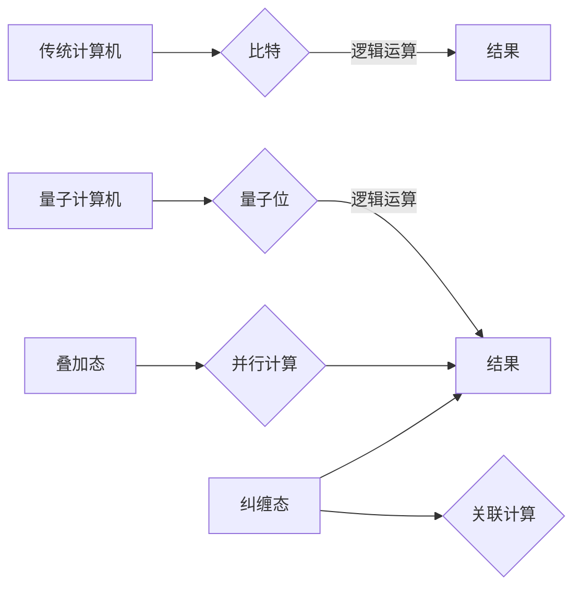

> 量子计算，量子位，叠加态，纠缠态，量子算法，量子计算机，量子力学，超导量子计算，光子量子计算

## 1. 背景介绍

计算，作为人类文明的基石之一，一直以来都以其强大的能力推动着科技的进步。从古老的算盘到现代的超级计算机，我们不断地探索着计算的极限。然而，随着传统计算机技术的发展逐渐趋于饱和，人们开始寻求新的计算 paradigms，以突破计算瓶颈，解决传统计算机难以处理的复杂问题。

量子计算，作为一种全新的计算模式，正逐渐成为人们关注的焦点。它利用量子力学的原理，如叠加态和纠缠态，构建了一种全新的计算模型，拥有着超越传统计算机的强大计算能力。

## 2. 核心概念与联系

量子计算的核心概念是量子位（qubit）。与传统计算机中的比特不同，量子位可以处于0、1或两者叠加态。这种叠加态使得量子计算机能够同时处理多个计算可能性，从而大大提高了计算效率。

此外，量子位之间还可以存在纠缠态，这意味着两个或多个量子位相互关联，即使相隔很远，它们的状态也相互影响。这种纠缠态使得量子计算机能够进行高度并行计算，进一步提升了计算能力。

**核心概念与联系流程图:**



## 3. 核心算法原理 & 具体操作步骤

### 3.1  算法原理概述

量子算法与传统算法不同，它利用量子力学的原理，例如叠加态和纠缠态，来实现计算。量子算法通常需要将问题转化为量子形式，然后使用量子门操作量子位，最终得到量子结果。

### 3.2  算法步骤详解

1. **问题转化:** 将经典问题转化为量子问题，并将其表示为量子电路。
2. **量子初始化:** 将量子位初始化为特定的状态。
3. **量子门操作:** 使用量子门操作量子位，实现对问题的计算。
4. **量子测量:** 对量子位进行测量，得到经典结果。

### 3.3  算法优缺点

**优点:**

* **并行计算能力:** 量子叠加态允许量子计算机同时处理多个计算可能性，从而实现并行计算，大大提高计算效率。
* **指数级加速:** 一些量子算法可以对特定问题提供指数级加速，例如 Shor 算法可以高效地分解大数。

**缺点:**

* **技术挑战:** 量子计算机的构建和操作面临着巨大的技术挑战，例如量子位易受环境影响，需要保持低温环境。
* **算法开发:** 量子算法的开发难度较高，需要深入理解量子力学和量子计算原理。

### 3.4  算法应用领域

* **药物研发:** 模拟分子结构，加速药物设计。
* **材料科学:** 探索新材料的性质和性能。
* **金融建模:** 优化投资策略，降低风险。
* **密码学:** 破解现有的加密算法，设计新的量子密码算法。

## 4. 数学模型和公式 & 详细讲解 & 举例说明

### 4.1  数学模型构建

量子计算的数学模型基于线性代数和量子力学。量子态可以用一个复数向量来表示，称为量子态向量。量子门操作可以用矩阵来表示，这些矩阵作用于量子态向量，改变其状态。

### 4.2  公式推导过程

例如，一个简单的量子门操作是 Hadamard 门。Hadamard 门的作用是将量子位从 |0⟩ 状态变换到 |+⟩ 状态，其中 |+⟩ = (|0⟩ + |1⟩)/√2。

Hadamard 门的矩阵表示为：

$$
H = \frac{1}{\sqrt{2}} \begin{pmatrix} 1 & 1 \\ 1 & -1 \end{pmatrix}
$$

### 4.3  案例分析与讲解

假设有一个量子位处于 |0⟩ 状态，经过 Hadamard 门操作后，其状态将变为 |+⟩ 状态。

$$
H |0⟩ = \frac{1}{\sqrt{2}} \begin{pmatrix} 1 & 1 \\ 1 & -1 \end{pmatrix} \begin{pmatrix} 1 \\ 0 \end{pmatrix} = \frac{1}{\sqrt{2}} \begin{pmatrix} 1 \\ 1 \end{pmatrix} = |+⟩
$$

## 5. 项目实践：代码实例和详细解释说明

### 5.1  开发环境搭建

量子计算开发环境通常需要安装量子计算软件库和模拟器或真实量子计算机的访问权限。例如，可以使用 Qiskit 或 Cirq 等软件库进行开发。

### 5.2  源代码详细实现

```python
from qiskit import QuantumCircuit, Aer, execute

# 创建一个量子电路
qc = QuantumCircuit(1)

# 应用 Hadamard 门
qc.h(0)

# 测量量子位
qc.measure(0, 0)

# 模拟运行量子电路
simulator = Aer.get_backend('qasm_simulator')
job = execute(qc, simulator, shots=1024)
result = job.result()
counts = result.get_counts(qc)

# 打印测量结果
print(counts)
```

### 5.3  代码解读与分析

这段代码演示了如何使用 Qiskit 库实现一个简单的量子计算程序。

1. 创建一个量子电路，包含一个量子位。
2. 应用 Hadamard 门操作量子位，将量子位从 |0⟩ 状态变换到 |+⟩ 状态。
3. 测量量子位，并将结果存储在经典位中。
4. 使用模拟器运行量子电路，并获取测量结果。
5. 打印测量结果，观察量子叠加态的特性。

### 5.4  运行结果展示

运行结果显示，测量结果以 50% 的概率为 0，以 50% 的概率为 1，这验证了量子叠加态的特性。

## 6. 实际应用场景

### 6.1  药物研发

量子计算可以模拟分子结构和化学反应，加速药物研发过程。例如，可以利用量子算法优化药物分子设计，提高药物疗效和安全性。

### 6.2  材料科学

量子计算可以模拟材料的性质和性能，帮助科学家探索新材料。例如，可以利用量子算法设计具有特定功能的材料，例如超导材料、轻质材料等。

### 6.3  金融建模

量子计算可以优化金融建模，提高投资策略的准确性和效率。例如，可以利用量子算法进行风险管理、投资组合优化等。

### 6.4  未来应用展望

量子计算的应用前景广阔，未来将应用于更多领域，例如人工智能、密码学、天气预报等。随着量子计算技术的不断发展，量子计算机将成为解决复杂问题的强大工具，推动科技进步和社会发展。

## 7. 工具和资源推荐

### 7.1  学习资源推荐

* **Qiskit:** https://qiskit.org/
* **Cirq:** https://quantumai.google/cirq
* **PennyLane:** https://pennylane.ai/

### 7.2  开发工具推荐

* **IBM Quantum Experience:** https://quantum-computing.ibm.com/
* **Google Quantum AI:** https://quantumai.google/
* **Rigetti Computing:** https://rigetti.com/

### 7.3  相关论文推荐

* **Shor's Algorithm:** https://arxiv.org/abs/quant-ph/9407005
* **Grover's Algorithm:** https://arxiv.org/abs/quant-ph/9605043
* **Quantum Supremacy:** https://arxiv.org/abs/1907.01293

## 8. 总结：未来发展趋势与挑战

### 8.1  研究成果总结

量子计算是一个充满挑战和机遇的领域。近年来，量子计算研究取得了显著进展，例如量子位技术的突破、量子算法的开发、量子模拟器的构建等。

### 8.2  未来发展趋势

未来量子计算的发展趋势包括：

* **量子硬件的升级:** 提高量子位数量、稳定性和操作精度。
* **量子算法的创新:** 开发更多高效的量子算法，解决更复杂的问题。
* **量子软件的完善:** 建立完善的量子软件开发平台和工具。
* **量子计算的应用扩展:** 将量子计算应用于更多领域，例如人工智能、材料科学、金融等。

### 8.3  面临的挑战

量子计算还面临着许多挑战，例如：

* **量子位易受环境影响:** 需要保持低温环境，提高量子位的稳定性。
* **量子算法的开发难度:** 需要深入理解量子力学和量子计算原理。
* **量子计算的成本:** 量子计算机的构建和操作成本较高。

### 8.4  研究展望

尽管面临挑战，但量子计算的未来充满希望。随着技术的不断发展，量子计算将成为解决复杂问题的强大工具，推动科技进步和社会发展。

## 9. 附录：常见问题与解答

### 9.1  什么是量子位？

量子位（qubit）是量子计算的基本单位，它可以处于0、1或两者叠加态。与传统计算机中的比特不同，量子位可以同时表示多个状态，从而实现并行计算。

### 9.2  什么是量子叠加态？

量子叠加态是指量子位可以同时处于多个状态的特性。例如，一个量子位可以处于 |0⟩ 和 |1⟩ 的叠加态，即 |ψ⟩ = α|0⟩ + β|1⟩，其中 α 和 β 是复数系数。

### 9.3  什么是量子纠缠？

量子纠缠是指两个或多个量子位之间相互关联的特性。即使相隔很远，它们的状态也相互影响。当一个量子位被测量时，另一个量子位的状态也会瞬间确定。

### 9.4  量子计算有什么优势？

量子计算的优势在于：

* **并行计算能力:** 量子叠加态允许量子计算机同时处理多个计算可能性，从而实现并行计算，大大提高计算效率。
* **指数级加速:** 一些量子算法可以对特定问题提供指数级加速，例如 Shor 算法可以高效地分解大数。

### 9.5  量子计算有哪些应用？

量子计算的应用领域包括：

* **药物研发:** 模拟分子结构，加速药物设计。
* **材料科学:** 探索新材料的性质和性能。
* **金融建模:** 优化投资策略，降低风险。
* **密码学:** 破解现有的加密算法，设计新的量子密码算法。


作者：禅与计算机程序设计艺术 / Zen and the Art of Computer Programming 
<end_of_turn>