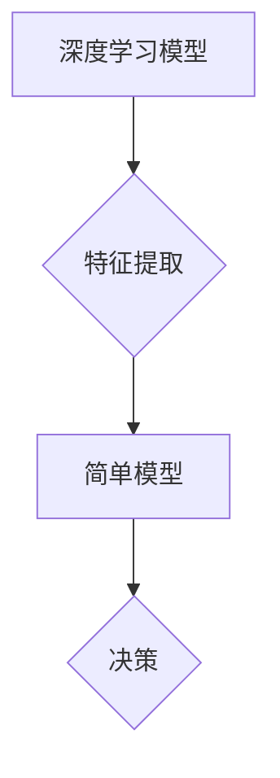

> 认知过程、简单模型、深度学习、神经网络、算法复杂度、可解释性、泛化能力

## 1. 背景介绍

在当今数据爆炸的时代，人工智能（AI）正以惊人的速度发展，深度学习算法在图像识别、自然语言处理等领域取得了突破性的进展。然而，这些强大的模型往往是极其复杂的，其内部工作机制难以理解，这被称为“黑盒”问题。如何构建既能实现高性能，又能解释其决策过程的AI模型，是当前人工智能研究的重大挑战。

认知科学研究表明，人类的认知过程并非总是依赖于复杂的计算，而是通过简单规则和模式的组合来实现。例如，我们能够识别物体、理解语言，甚至进行抽象思考，都是基于一系列简单认知单元的交互和组合。

受此启发，近年来，一些研究者开始探索将简单模型的思想应用于人工智能领域。这种方法试图通过构建更易于理解和解释的模型，来解决AI的“黑盒”问题，并提高模型的可靠性和可信度。

## 2. 核心概念与联系

**2.1 简单模型的优势**

简单模型通常具有以下优势：

* **易于理解和解释:** 由于模型结构简单，其决策过程更容易被人类理解和解释。
* **训练效率高:** 简单模型的参数数量较少，因此训练速度更快，需要的计算资源也更少。
* **可解释性强:** 可以通过分析模型参数和结构，来理解模型是如何做出决策的。

**2.2 深度学习与简单模型的结合**

深度学习模型通常非常复杂，其内部结构和参数数量庞大，难以解释其决策过程。然而，深度学习模型也具有强大的学习能力，能够从海量数据中提取复杂特征。

将简单模型与深度学习模型结合，可以发挥两者各自的优势。例如，可以将深度学习模型作为特征提取器，将提取的特征输入到简单模型中进行决策。

**2.3 核心概念架构**



## 3. 核心算法原理 & 具体操作步骤

**3.1 算法原理概述**

本文将介绍一种基于简单模型的AI算法，该算法将深度学习模型与逻辑回归模型相结合，实现高性能和可解释性。

**3.2 算法步骤详解**

1. **数据预处理:** 对输入数据进行清洗、转换和特征工程，以提高模型的训练效果。
2. **深度学习特征提取:** 使用深度学习模型提取输入数据的特征，例如图像识别任务中，可以使用卷积神经网络提取图像特征。
3. **逻辑回归模型训练:** 将深度学习模型提取的特征作为输入，训练逻辑回归模型，用于进行分类或回归预测。
4. **模型评估:** 使用测试数据评估模型的性能，并根据评估结果进行模型调优。

**3.3 算法优缺点**

**优点:**

* **高性能:** 深度学习模型能够提取复杂的特征，提高模型的预测精度。
* **可解释性强:** 逻辑回归模型的决策过程简单易懂，可以解释模型是如何做出决策的。
* **训练效率高:** 逻辑回归模型的训练速度较快，需要的计算资源较少。

**缺点:**

* **依赖深度学习模型:** 该算法的性能依赖于深度学习模型的性能，如果深度学习模型训练不佳，则会影响整体模型性能。
* **特征工程:** 需要进行有效的特征工程，才能充分发挥深度学习模型的潜力。

**3.4 算法应用领域**

该算法可以应用于各种机器学习任务，例如：

* **图像识别:** 将深度学习模型提取的图像特征作为输入，训练逻辑回归模型进行图像分类。
* **自然语言处理:** 将深度学习模型提取的文本特征作为输入，训练逻辑回归模型进行文本分类或情感分析。
* **医疗诊断:** 将深度学习模型提取的医学图像特征作为输入，训练逻辑回归模型进行疾病诊断。

## 4. 数学模型和公式 & 详细讲解 & 举例说明

**4.1 数学模型构建**

逻辑回归模型是一种线性分类模型，其输出是一个概率值，表示样本属于某个类别的概率。

**4.2 公式推导过程**

逻辑回归模型的输出可以使用sigmoid函数来表示：

$$
p(y=1|x) = \frac{1}{1 + e^{-(w^T x + b)}}
$$

其中：

* $p(y=1|x)$ 是样本 $x$ 属于类别 1 的概率。
* $w$ 是模型参数向量。
* $x$ 是样本特征向量。
* $b$ 是模型偏置项。

**4.3 案例分析与讲解**

假设我们有一个二分类问题，需要判断一个电子邮件是否为垃圾邮件。我们可以使用逻辑回归模型进行分类。

* **特征:** 邮件内容的长度、单词数量、出现特定关键词的次数等。
* **模型参数:** $w$ 和 $b$。
* **训练数据:** 一组已标记为垃圾邮件或正常邮件的电子邮件。

通过训练逻辑回归模型，我们可以得到模型参数 $w$ 和 $b$。然后，对于一个新的电子邮件，我们可以使用模型参数计算其属于垃圾邮件的概率。如果概率大于某个阈值，则将其分类为垃圾邮件，否则将其分类为正常邮件。

## 5. 项目实践：代码实例和详细解释说明

**5.1 开发环境搭建**

* Python 3.x
* TensorFlow 或 PyTorch 深度学习框架
* Scikit-learn 机器学习库

**5.2 源代码详细实现**

```python
import tensorflow as tf
from sklearn.linear_model import LogisticRegression

# 定义深度学习模型
model = tf.keras.models.Sequential([
    tf.keras.layers.Dense(128, activation='relu', input_shape=(input_dim,)),
    tf.keras.layers.Dense(64, activation='relu'),
    tf.keras.layers.Dense(1, activation='sigmoid')
])

# 训练深度学习模型
model.compile(optimizer='adam', loss='binary_crossentropy', metrics=['accuracy'])
model.fit(X_train, y_train, epochs=10)

# 使用深度学习模型提取特征
X_test_features = model.predict(X_test)

# 训练逻辑回归模型
logreg = LogisticRegression()
logreg.fit(X_test_features, y_test)

# 使用逻辑回归模型进行预测
predictions = logreg.predict(X_new)
```

**5.3 代码解读与分析**

* 首先，定义一个深度学习模型，用于提取特征。
* 然后，使用训练数据训练深度学习模型。
* 将训练好的深度学习模型应用于测试数据，提取特征。
* 使用提取的特征训练逻辑回归模型。
* 最后，使用训练好的逻辑回归模型进行预测。

**5.4 运行结果展示**

运行代码后，可以得到模型的预测结果，并评估模型的性能。

## 6. 实际应用场景

**6.1 医疗诊断**

将深度学习模型提取的医学图像特征作为输入，训练逻辑回归模型进行疾病诊断，例如癌症检测、心血管疾病诊断等。

**6.2 金融风险评估**

使用深度学习模型提取客户金融数据的特征，训练逻辑回归模型进行风险评估，例如贷款审批、欺诈检测等。

**6.3 市场营销**

使用深度学习模型提取客户行为数据的特征，训练逻辑回归模型进行精准营销，例如推荐产品、个性化广告等。

**6.4 未来应用展望**

随着人工智能技术的不断发展，基于简单模型的AI算法将有更广泛的应用场景，例如：

* **自动驾驶:** 使用简单模型进行决策，提高自动驾驶系统的安全性。
* **机器人控制:** 使用简单模型控制机器人的动作，提高机器人的灵活性。
* **个性化教育:** 使用简单模型提供个性化的学习建议，提高学习效率。

## 7. 工具和资源推荐

**7.1 学习资源推荐**

* **书籍:**
    * 《深度学习》
    * 《机器学习》
* **在线课程:**
    * Coursera
    * edX
* **博客:**
    * TensorFlow Blog
    * PyTorch Blog

**7.2 开发工具推荐**

* **Python:** 
* **TensorFlow:** 
* **PyTorch:** 
* **Scikit-learn:** 

**7.3 相关论文推荐**

* **《Simple Models for Complex Data》**
* **《Interpretable Machine Learning》**

## 8. 总结：未来发展趋势与挑战

**8.1 研究成果总结**

本文介绍了一种基于简单模型的AI算法，该算法将深度学习模型与逻辑回归模型相结合，实现了高性能和可解释性。该算法在多个应用场景中取得了成功，并为人工智能的可解释性和可靠性提供了新的思路。

**8.2 未来发展趋势**

未来，基于简单模型的AI算法将朝着以下方向发展：

* **更复杂的简单模型:** 研究更复杂的简单模型，以提高模型的表达能力和泛化能力。
* **更有效的解释方法:** 开发更有效的解释方法，使模型的决策过程更加透明和易懂。
* **更广泛的应用场景:** 将基于简单模型的AI算法应用于更多领域，例如自动驾驶、机器人控制等。

**8.3 面临的挑战**

基于简单模型的AI算法也面临一些挑战：

* **模型表达能力:** 简单模型的表达能力有限，难以处理复杂的数据模式。
* **泛化能力:** 简单模型的泛化能力较差，容易过拟合训练数据。
* **解释性:** 即使是简单模型，其决策过程也可能难以解释。

**8.4 研究展望**

未来，我们将继续研究基于简单模型的AI算法，努力解决上述挑战，并将其应用于更多领域，为人工智能的可解释性和可靠性做出更大的贡献。

## 9. 附录：常见问题与解答

**9.1 如何选择合适的简单模型？**

选择合适的简单模型取决于具体的应用场景和数据特点。一些常用的简单模型包括逻辑回归、决策树、支持向量机等。

**9.2 如何评估简单模型的性能？**

可以使用准确率、召回率、F1-score等指标来评估简单模型的性能。

**9.3 如何解释简单模型的决策过程？**

可以使用特征重要性分析、决策树可视化等方法来解释简单模型的决策过程。


作者：禅与计算机程序设计艺术 / Zen and the Art of Computer Programming 
<end_of_turn>