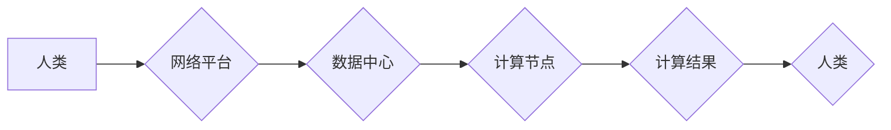

> 人类计算、分布式计算、协同智能、数据共享、全球网络、人工智能、智慧城市、未来趋势

## 1. 背景介绍

在信息时代，数据爆炸式增长，传统计算模式面临着巨大的挑战。人类计算，作为一种新型的计算模式，正逐渐成为解决这一挑战的关键。它打破了传统计算的局限性，将人类的智慧和计算能力相结合，形成一种全新的计算生态系统。

人类计算的核心思想是将人类的智慧融入到计算过程中，利用人类的创造力、洞察力和判断能力，共同解决复杂问题。它通过构建全球化的网络平台，连接世界各地的专家、学者、工程师和普通用户，形成一个庞大的智慧网络，共同参与计算任务。

## 2. 核心概念与联系

**2.1 人类计算的本质**

人类计算是一种基于网络和协作的计算模式，它将人类的智慧和计算能力相结合，通过分布式计算和协同智能，解决复杂问题。

**2.2 核心概念**

* **分布式计算:** 将计算任务分解成多个子任务，并分别在不同的计算节点上执行，最终将结果汇总。
* **协同智能:** 多个智能体（包括人类和机器）协同工作，共同完成复杂任务。
* **数据共享:** 人类计算平台鼓励数据共享，以便不同参与者可以共同利用数据，提高计算效率。

**2.3 架构图**



**2.4 联系**

人类计算将分布式计算和协同智能相结合，通过网络平台连接人类和计算节点，实现数据共享和协同计算。

## 3. 核心算法原理 & 具体操作步骤

**3.1 算法原理概述**

人类计算的核心算法原理是基于马尔可夫决策过程（MDP）和强化学习（RL）。MDP模型可以描述一个智能体在不同状态下做出决策，并根据决策获得奖励或惩罚。RL算法可以训练智能体，使其在MDP环境中学习最优策略。

**3.2 算法步骤详解**

1. **构建MDP模型:** 将人类计算任务转化为MDP模型，定义状态空间、动作空间、奖励函数和转移概率。
2. **训练RL代理:** 使用RL算法训练智能体代理，使其在MDP环境中学习最优策略。
3. **部署智能体代理:** 将训练好的智能体代理部署到计算节点上，使其参与计算任务。
4. **收集反馈信息:** 收集智能体代理执行任务的反馈信息，并将其反馈到训练过程中，不断优化智能体代理的策略。

**3.3 算法优缺点**

* **优点:**
    * 可以有效解决复杂问题，提高计算效率。
    * 可以利用人类的智慧和创造力，获得更优的解决方案。
    * 可以实现数据共享和协同计算，促进知识共享和创新。
* **缺点:**
    * 需要大量的计算资源和数据支持。
    * 需要设计合理的奖励函数和训练策略，才能保证算法的有效性。
    * 需要解决数据安全和隐私保护问题。

**3.4 算法应用领域**

* **科学研究:** 药物研发、材料科学、天体物理学等领域。
* **工程设计:** 建筑设计、交通规划、能源管理等领域。
* **金融分析:** 风险管理、投资决策、欺诈检测等领域。
* **医疗诊断:** 疾病诊断、个性化治疗、药物研发等领域。

## 4. 数学模型和公式 & 详细讲解 & 举例说明

**4.1 数学模型构建**

人类计算可以抽象为一个马尔可夫决策过程（MDP）模型，其中：

* **状态空间:** 表示计算任务的当前状态，例如数据处理进度、计算结果等。
* **动作空间:** 表示智能体可以执行的动作，例如选择计算算法、分配计算资源等。
* **奖励函数:** 表示智能体在不同状态下执行不同动作获得的奖励或惩罚。
* **转移概率:** 表示在当前状态下执行某个动作后，转移到下一个状态的概率。

**4.2 公式推导过程**

MDP模型的价值函数 $V(s)$ 表示在状态 $s$ 下获得的期望奖励总和。价值函数可以通过Bellman方程进行迭代更新：

$$V(s) = \max_{\alpha} \sum_{s'} P(s' | s, \alpha) [R(s, \alpha, s') + \gamma V(s')]$$

其中：

* $\alpha$ 表示智能体在状态 $s$ 下执行的动作。
* $P(s' | s, \alpha)$ 表示在状态 $s$ 下执行动作 $\alpha$ 后转移到状态 $s'$ 的概率。
* $R(s, \alpha, s')$ 表示在状态 $s$ 下执行动作 $\alpha$ 后转移到状态 $s'$ 获得的奖励。
* $\gamma$ 表示折扣因子，控制未来奖励的权重。

**4.3 案例分析与讲解**

例如，在药物研发领域，人类计算可以用于筛选潜在的药物候选物。

* 状态空间可以表示药物候选物的结构和性质。
* 动作空间可以表示对药物候选物的筛选和优化操作。
* 奖励函数可以表示药物候选物对疾病的治疗效果。

通过训练RL代理，可以学习到最优的药物筛选策略，提高药物研发效率。

## 5. 项目实践：代码实例和详细解释说明

**5.1 开发环境搭建**

* 操作系统：Ubuntu 20.04
* 编程语言：Python 3.8
* 库依赖：TensorFlow、PyTorch、NumPy、Pandas

**5.2 源代码详细实现**

```python
import tensorflow as tf

# 定义神经网络模型
model = tf.keras.models.Sequential([
    tf.keras.layers.Dense(128, activation='relu', input_shape=(input_dim,)),
    tf.keras.layers.Dense(64, activation='relu'),
    tf.keras.layers.Dense(1, activation='sigmoid')
])

# 编译模型
model.compile(optimizer='adam', loss='binary_crossentropy', metrics=['accuracy'])

# 训练模型
model.fit(X_train, y_train, epochs=10, batch_size=32)

# 评估模型
loss, accuracy = model.evaluate(X_test, y_test)
print('Loss:', loss)
print('Accuracy:', accuracy)
```

**5.3 代码解读与分析**

* 代码首先定义了一个简单的多层感知机模型。
* 模型输入层维度为 `input_dim`，表示输入数据的维度。
* 模型输出层只有一个神经元，激活函数为 sigmoid，用于二分类任务。
* 模型使用 Adam 优化器，损失函数为二分类交叉熵，评估指标为准确率。
* 代码使用 `model.fit()` 函数训练模型，使用 `model.evaluate()` 函数评估模型性能。

**5.4 运行结果展示**

训练完成后，可以查看模型的损失值和准确率。

## 6. 实际应用场景

**6.1 智慧城市建设**

人类计算可以用于智慧城市建设，例如：

* **交通管理:** 利用人类计算平台，收集和分析交通数据，优化交通流量，缓解交通拥堵。
* **环境监测:** 利用人类计算平台，收集和分析环境数据，监测空气质量、水质等，及时预警环境问题。
* **公共安全:** 利用人类计算平台，收集和分析公共安全数据，提高城市安全水平。

**6.2 医疗健康服务**

人类计算可以用于医疗健康服务，例如：

* **疾病诊断:** 利用人类计算平台，收集和分析患者数据，辅助医生进行疾病诊断。
* **个性化治疗:** 利用人类计算平台，根据患者的基因信息和生活习惯，制定个性化的治疗方案。
* **药物研发:** 利用人类计算平台，加速药物研发，开发新的治疗方法。

**6.3 教育教学改革**

人类计算可以用于教育教学改革，例如：

* **个性化学习:** 利用人类计算平台，根据学生的学习进度和能力，提供个性化的学习内容和教学方式。
* **在线教育:** 利用人类计算平台，构建在线教育平台，提供高质量的在线课程和学习资源。
* **智慧课堂:** 利用人类计算平台，构建智慧课堂，提高课堂效率和教学质量。

**6.4 未来应用展望**

人类计算的应用前景广阔，未来将应用于更多领域，例如：

* **金融科技:** 利用人类计算平台，提高金融风险管理水平，优化金融服务。
* **工业互联网:** 利用人类计算平台，实现工业生产的智能化和自动化。
* **农业科技:** 利用人类计算平台，提高农业生产效率，实现精准农业。

## 7. 工具和资源推荐

**7.1 学习资源推荐**

* **书籍:**
    * 《人工智能：一种现代方法》
    * 《深度学习》
    * 《机器学习》
* **在线课程:**
    * Coursera: 人工智能课程
    * edX: 深度学习课程
    * Udacity: 机器学习工程师课程

**7.2 开发工具推荐**

* **TensorFlow:** 开源深度学习框架
* **PyTorch:** 开源深度学习框架
* **Keras:** 高级深度学习API

**7.3 相关论文推荐**

* 《人类计算：一种新的计算范式》
* 《分布式人工智能：挑战和机遇》
* 《协同智能：理论和应用》

## 8. 总结：未来发展趋势与挑战

**8.1 研究成果总结**

人类计算作为一种新型的计算模式，在解决复杂问题、提高计算效率、促进知识共享等方面具有巨大潜力。近年来，人类计算的研究取得了显著进展，涌现出许多优秀的算法和应用案例。

**8.2 未来发展趋势**

* **更强大的计算能力:** 人类计算需要更强大的计算能力来支持更复杂的任务。
* **更智能的算法:** 需要开发更智能的算法，能够更好地利用人类的智慧和创造力。
* **更广泛的应用场景:** 人类计算将应用于更多领域，例如金融科技、工业互联网、农业科技等。

**8.3 面临的挑战**

* **数据安全和隐私保护:** 人类计算需要处理大量的数据，因此数据安全和隐私保护是一个重要的挑战。
* **算法公平性和可解释性:** 人类计算算法需要保证公平性和可解释性，避免算法偏见和歧视。
* **伦理问题:** 人类计算的应用可能会带来一些伦理问题，例如人工智能的责任和义务。

**8.4 研究展望**

未来，人类计算的研究将继续深入，探索更有效的算法、更广泛的应用场景，并解决相关挑战，推动人类社会进步。

## 9. 附录：常见问题与解答

**9.1 如何参与人类计算平台？**

您可以通过注册平台账号，参与平台提供的任务和项目。

**9.2 人类计算平台的数据安全如何保障？**

平台采用严格的数据加密和安全协议，保障数据安全。

**9.3 人类计算平台的算法是否公平？**

平台致力于开发公平、透明、可解释的算法，并定期进行评估和改进。

**9.4 人类计算平台的未来发展方向？**

平台将继续探索更有效的算法、更广泛的应用场景，并与更多合作伙伴合作，推动人类计算的发展。


作者：禅与计算机程序设计艺术 / Zen and the Art of Computer Programming 
<end_of_turn>