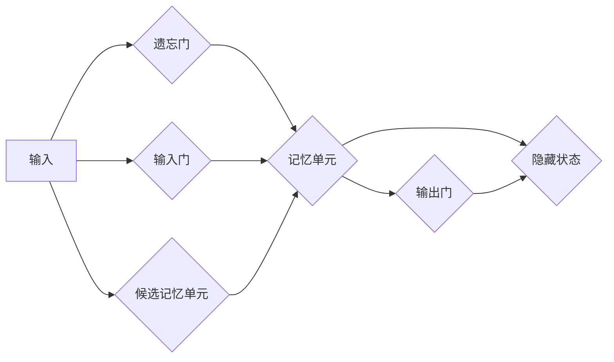

> 长短时记忆网络 (LSTM),循环神经网络 (RNN),序列数据,自然语言处理,机器学习,深度学习,代码实例

## 1. 背景介绍

在深度学习领域，处理序列数据一直是一个重要的挑战。传统的循环神经网络 (RNN) 由于梯度消失和梯度爆炸问题，难以有效地学习长序列中的依赖关系。为了解决这个问题，长短时记忆网络 (LSTM) 应运而生。LSTM 是一种特殊的 RNN 结构，它通过引入记忆单元和门控机制，能够更好地捕捉长序列中的信息，从而在自然语言处理、语音识别、机器翻译等领域取得了显著的成果。

## 2. 核心概念与联系

LSTM 的核心思想是通过记忆单元和门控机制来控制信息的流动，从而解决传统 RNN 的梯度消失问题。

**2.1 记忆单元**

记忆单元是 LSTM 的核心组成部分，它类似于一个容器，可以存储长期依赖信息。记忆单元的初始状态为零向量，在每个时间步长都会根据输入信息和隐藏状态进行更新。

**2.2 门控机制**

LSTM 使用三个门控机制来控制信息的流动：

* **遗忘门 (Forget Gate):** 决定哪些信息需要从记忆单元中遗忘。
* **输入门 (Input Gate):** 决定哪些新信息需要添加到记忆单元中。
* **输出门 (Output Gate):** 决定哪些信息从记忆单元中输出到隐藏状态。

**2.3 LSTM 架构**



## 3. 核心算法原理 & 具体操作步骤

### 3.1  算法原理概述

LSTM 的核心算法原理是通过门控机制控制信息的流动，从而实现对长序列数据的有效学习。

### 3.2  算法步骤详解

1. **初始化:** 初始化记忆单元的状态为零向量。
2. **遗忘门计算:** 计算遗忘门的值，决定哪些信息需要从记忆单元中遗忘。
3. **输入门计算:** 计算输入门的值，决定哪些新信息需要添加到记忆单元中。
4. **候选记忆单元计算:** 计算候选记忆单元的值，根据输入信息和隐藏状态进行更新。
5. **记忆单元更新:** 更新记忆单元的状态，根据遗忘门、输入门和候选记忆单元的值进行计算。
6. **输出门计算:** 计算输出门的值，决定哪些信息从记忆单元中输出到隐藏状态。
7. **隐藏状态计算:** 计算隐藏状态的值，根据输出门和记忆单元的状态进行计算。
8. **输出:** 将隐藏状态作为输出，用于后续的计算或预测。

### 3.3  算法优缺点

**优点:**

* 能够有效地捕捉长序列中的依赖关系。
* 解决了传统 RNN 的梯度消失问题。
* 在自然语言处理、语音识别、机器翻译等领域取得了显著的成果。

**缺点:**

* 计算复杂度较高。
* 训练时间较长。
* 参数量较大。

### 3.4  算法应用领域

LSTM 广泛应用于以下领域:

* **自然语言处理:** 文本分类、情感分析、机器翻译、文本生成等。
* **语音识别:** 语音转文本、语音合成等。
* **机器翻译:** 自动翻译文本。
* **时间序列预测:** 股票价格预测、天气预报等。

## 4. 数学模型和公式 & 详细讲解 & 举例说明

### 4.1  数学模型构建

LSTM 的数学模型构建基于门控机制和记忆单元。

**4.1.1 遗忘门:**

$$f_t = \sigma(W_f \cdot [h_{t-1}, x_t] + b_f)$$

**4.1.2 输入门:**

$$i_t = \sigma(W_i \cdot [h_{t-1}, x_t] + b_i)$$

**4.1.3 候选记忆单元:**

$$\tilde{C}_t = \tanh(W_c \cdot [h_{t-1}, x_t] + b_c)$$

**4.1.4 记忆单元更新:**

$$C_t = f_t \cdot C_{t-1} + i_t \cdot \tilde{C}_t$$

**4.1.5 输出门:**

$$o_t = \sigma(W_o \cdot [h_{t-1}, x_t] + b_o)$$

**4.1.6 隐藏状态:**

$$h_t = o_t \cdot \tanh(C_t)$$

其中:

* $f_t$, $i_t$, $o_t$ 分别为遗忘门、输入门和输出门的值。
* $C_t$, $C_{t-1}$ 分别为当前时间步和前一个时间步的记忆单元状态。
* $\tilde{C}_t$ 为候选记忆单元的值。
* $h_t$, $h_{t-1}$ 分别为当前时间步和前一个时间步的隐藏状态。
* $x_t$ 为当前时间步的输入信息。
* $W_f$, $W_i$, $W_c$, $W_o$ 分别为遗忘门、输入门、候选记忆单元和输出门的权重矩阵。
* $b_f$, $b_i$, $b_c$, $b_o$ 分别为遗忘门、输入门、候选记忆单元和输出门的偏置项。
* $\sigma$ 为 sigmoid 函数。
* $\tanh$ 为 hyperbolic tangent 函数。

### 4.2  公式推导过程

LSTM 的公式推导过程基于门控机制和记忆单元的更新规则。

### 4.3  案例分析与讲解

通过具体的案例分析，可以更好地理解 LSTM 的工作原理和应用场景。

## 5. 项目实践：代码实例和详细解释说明

### 5.1  开发环境搭建

使用 Python 语言和 TensorFlow 或 PyTorch 深度学习框架进行开发。

### 5.2  源代码详细实现

```python
import tensorflow as tf

# 定义 LSTM 模型
model = tf.keras.Sequential([
    tf.keras.layers.Embedding(input_dim=vocab_size, output_dim=embedding_dim),
    tf.keras.layers.LSTM(units=lstm_units),
    tf.keras.layers.Dense(units=output_dim, activation='softmax')
])

# 编译模型
model.compile(optimizer='adam', loss='categorical_crossentropy', metrics=['accuracy'])

# 训练模型
model.fit(x_train, y_train, epochs=epochs, batch_size=batch_size)

# 评估模型
loss, accuracy = model.evaluate(x_test, y_test)
print('Loss:', loss)
print('Accuracy:', accuracy)
```

### 5.3  代码解读与分析

* `Embedding`: 将单词转换为稠密的向量表示。
* `LSTM`: 长短时记忆网络层，用于学习序列数据中的依赖关系。
* `Dense`: 全连接层，用于将 LSTM 的输出映射到输出类别。
* `Adam`: 优化器，用于更新模型参数。
* `categorical_crossentropy`: 损失函数，用于计算模型预测结果与真实标签之间的差异。
* `accuracy`: 评估指标，用于衡量模型的预测准确率。

### 5.4  运行结果展示

训练完成后，可以将模型应用于新的数据进行预测。

## 6. 实际应用场景

### 6.1 自然语言处理

* **文本分类:** 使用 LSTM 对文本进行分类，例如情感分析、主题分类等。
* **机器翻译:** 使用 LSTM 将文本从一种语言翻译成另一种语言。
* **文本生成:** 使用 LSTM 生成文本，例如诗歌、小说、对话等。

### 6.2 语音识别

* **语音转文本:** 使用 LSTM 将语音信号转换为文本。
* **语音合成:** 使用 LSTM 将文本转换为语音信号。

### 6.3 其他应用场景

* **时间序列预测:** 使用 LSTM 对时间序列数据进行预测，例如股票价格预测、天气预报等。
* **图像识别:** 使用 LSTM 结合卷积神经网络进行图像识别。

### 6.4  未来应用展望

随着深度学习技术的不断发展，LSTM 在未来将有更广泛的应用场景。例如:

* **个性化推荐:** 使用 LSTM 建立用户行为模型，进行个性化推荐。
* **医疗诊断:** 使用 LSTM 分析患者的医疗数据，辅助医生进行诊断。
* **自动驾驶:** 使用 LSTM 训练自动驾驶汽车，使其能够更好地感知周围环境。

## 7. 工具和资源推荐

### 7.1  学习资源推荐

* **书籍:**
    * 《深度学习》
    * 《自然语言处理》
* **在线课程:**
    * Coursera: 深度学习
    * Udacity: 自然语言处理
* **博客:**
    * TensorFlow Blog
    * PyTorch Blog

### 7.2  开发工具推荐

* **TensorFlow:** 开源深度学习框架。
* **PyTorch:** 开源深度学习框架。
* **Keras:** 高级深度学习 API，可以用于 TensorFlow 和 Theano。

### 7.3  相关论文推荐

* **Hochreiter, S., & Schmidhuber, J. (1997). Long short-term memory.**
* **Graves, A., & Schmidhuber, J. (2005). Framewise phoneme classification with bidirectional LSTM and other neural network architectures.**

## 8. 总结：未来发展趋势与挑战

### 8.1  研究成果总结

LSTM 是一种强大的深度学习模型，在处理序列数据方面取得了显著的成果。

### 8.2  未来发展趋势

* **模型效率提升:** 研究更高效的 LSTM 变体，例如压缩 LSTM 和高效 LSTM。
* **应用场景拓展:** 将 LSTM 应用于更多新的领域，例如医疗诊断、自动驾驶等。
* **理论研究深入:** 深入研究 LSTM 的理论基础，例如记忆机制、梯度消失问题等。

### 8.3  面临的挑战

* **计算复杂度:** LSTM 的计算复杂度较高，难以在资源有限的设备上进行训练和部署。
* **参数量大:** LSTM 的参数量较大，需要大量的训练数据才能达到良好的性能。
* **可解释性差:** LSTM 的内部工作机制较为复杂，难以解释其决策过程。

### 8.4  研究展望

未来，LSTM 将继续是深度学习领域的重要研究方向。通过不断改进模型结构、优化训练方法和探索新的应用场景，LSTM 将在更多领域发挥重要作用。

## 9. 附录：常见问题与解答

### 9.1  LSTM 与 RNN 的区别

RNN 是一种循环神经网络，它能够处理序列数据，但由于梯度消失问题，难以学习长序列中的依赖关系。LSTM 是一种特殊的 RNN 结构，它通过引入记忆单元和门控机制，能够更好地捕捉长序列中的信息。

### 9.2  LSTM 的参数设置

LSTM 的参数设置包括 LSTM 层数、隐藏单元数、学习率等。这些参数需要根据具体任务和数据集进行调整。

### 9.3  LSTM 的训练方法

LSTM 的训练方法与其他深度学习模型类似，可以使用梯度下降算法进行训练。

### 9.4  LSTM 的应用领域

LSTM 广泛应用于自然语言处理、语音识别、机器翻译等领域。


作者：禅与计算机程序设计艺术 / Zen and the Art of Computer Programming 
<end_of_turn>