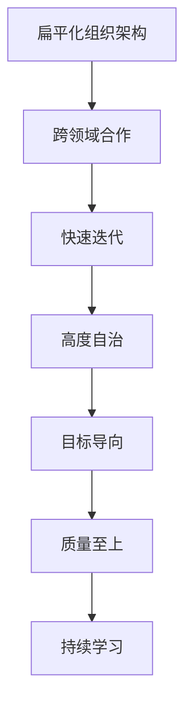

                 

# 马斯克的管理哲学:小而精的技术团队

> 关键词：
> - 马斯克管理哲学
> - 小而精的技术团队
> - 创新驱动
> - 扁平化组织
> - 快速迭代
> - 跨领域合作

## 1. 背景介绍

### 1.1 问题由来

埃隆·马斯克（Elon Musk）作为全球最具影响力的科技创业家之一，其领导下的特斯拉（Tesla）和SpaceX等公司屡次刷新纪录，成功将一系列不可能变为可能。而其背后成功的重要因素之一，便是他独特的管理哲学：打造“小而精”的技术团队。本文将探讨马斯克的管理哲学，分析其如何通过小而精的技术团队，实现颠覆性创新，创造商业奇迹。

### 1.2 问题核心关键点

马斯克的管理哲学主要体现在以下几个核心要点上：

1. **扁平化组织架构**：去除中层管理层，减少信息传递的层级，提升决策效率。
2. **跨领域合作**：打破传统职能界限，鼓励跨部门协作，增强创新活力。
3. **快速迭代**：注重快速试错和快速迭代，持续改进产品和服务。
4. **高度自治**：给予团队高度自治权，鼓励员工自由发挥创造力。
5. **目标导向**：明确短期和长期目标，聚焦关键成果。
6. **质量至上**：追求产品和服务的高质量，树立行业标杆。
7. **持续学习**：重视员工个人成长和知识更新，打造学习型团队。

本文将围绕这些关键点，详细解析马斯克的管理哲学，并结合具体案例，展现其在小而精技术团队构建和管理方面的卓越实践。

## 2. 核心概念与联系

### 2.1 核心概念概述

为更好地理解马斯克的管理哲学，我们首先需要澄清一些关键概念：

- **小而精技术团队**：指规模适中，结构扁平，具备高度灵活性和自主创新能力的团队。
- **扁平化组织架构**：指去除传统层级制度，将决策权和执行权下放到团队成员手中，实现快速响应和高效决策。
- **跨领域合作**：指打破传统职能界限，促进不同领域的专业知识相互融合，形成创新合力。
- **快速迭代**：指持续进行产品改进和功能优化，通过快速试错快速迭代，快速响应市场变化。
- **高度自治**：指团队成员具备决策权和执行权，可以在规定范围内自主决策，增强责任感和创造力。
- **目标导向**：指明确团队的目标和任务，聚焦核心业务，避免资源分散。
- **质量至上**：指追求产品的高品质，树立行业标准，提升用户满意度。
- **持续学习**：指鼓励员工不断学习新知识，提升个人和团队的专业能力。

这些概念相互联系，共同构成了马斯克管理哲学的核心。接下来，我们将通过Mermaid流程图，展示这些概念的相互联系：



此图展示了扁平化组织架构通过打破层级，促进跨领域合作；跨领域合作增强了快速迭代的能力；快速迭代通过持续试错提升团队自治；高度自治推动目标导向；目标导向确保质量至上；质量至上要求持续学习，形成了一个闭环的循环系统。

## 3. 核心算法原理 & 具体操作步骤

### 3.1 算法原理概述

马斯克的管理哲学本质上是一种注重效率、创新和团队协作的管理方法。其核心在于通过小而精技术团队的构建，实现高效的决策和快速的执行，进而推动产品和服务的持续创新。

核心算法原理可以简单总结为：

1. **扁平化组织架构**：减少决策层级，提升信息传递效率，缩短决策周期。
2. **跨领域合作**：打破传统职能界限，促进不同领域知识融合，激发创新潜能。
3. **快速迭代**：通过持续改进和快速试错，不断优化产品和服务，快速响应市场变化。
4. **高度自治**：给予团队成员自主权，增强责任感和创新动力，提升执行效率。
5. **目标导向**：明确短期和长期目标，聚焦关键成果，提升团队执行力。
6. **质量至上**：确保产品和服务的高质量，提升用户满意度和市场竞争力。
7. **持续学习**：鼓励团队成员不断学习新知识和技能，提升个人和团队的专业能力。

### 3.2 算法步骤详解

根据马斯克的管理哲学，技术团队的管理可以细分为以下几个关键步骤：

**Step 1: 确定组织目标和愿景**

1. 明确公司的长期目标和短期目标，确保团队的工作方向与公司愿景一致。
2. 制定关键绩效指标(KPI)，定期评估团队绩效。

**Step 2: 构建扁平化组织架构**

1. 简化组织结构，去除中层管理层，直接由高层和一线员工进行决策。
2. 设计跨部门协作机制，促进不同职能团队之间的沟通和合作。

**Step 3: 组建跨领域合作团队**

1. 选拔具备跨领域知识和技能的人才，组建多学科团队。
2. 确定团队成员的职责和权限，明确团队目标和任务。

**Step 4: 实施快速迭代**

1. 设计快速迭代的流程，包括需求分析、原型开发、用户测试、反馈迭代等环节。
2. 定期进行产品回顾会议，评估产品性能和用户体验，提出改进意见。

**Step 5: 赋予高度自治权**

1. 给予团队成员高度的决策权和执行权，鼓励员工自由发挥。
2. 建立透明的信息反馈机制，及时了解团队成员的需求和意见。

**Step 6: 聚焦目标导向**

1. 确定团队的主要目标和关键成果，聚焦核心业务。
2. 定期进行目标回顾和调整，确保团队始终聚焦目标。

**Step 7: 追求质量至上**

1. 建立质量控制流程，确保产品和服务的高质量。
2. 引入客户反馈机制，不断改进产品和服务质量。

**Step 8: 推动持续学习**

1. 制定员工培训和发展计划，提升团队整体专业能力。
2. 鼓励团队成员参加行业会议和培训，分享学习成果。

### 3.3 算法优缺点

马斯克的管理哲学在推动创新和提高效率方面具有显著优势：

**优点**：

1. **决策效率高**：扁平化组织架构和高度自治权提升了决策效率，缩短了决策周期。
2. **创新能力强**：跨领域合作和快速迭代机制，促进了知识的融合和创新。
3. **执行效率高**：明确的目标导向和质量至上原则，提升了团队执行力。
4. **团队士气高**：高度自治和持续学习机制，提升了团队成员的归属感和创造力。

**缺点**：

1. **管理风险高**：扁平化架构可能导致管理层对基层工作缺乏监督，风险控制难度大。
2. **人才流失风险**：高度自治和快速迭代可能导致人才流失，需要更多的激励措施。
3. **团队协作难度大**：跨领域合作需要较高的团队协作能力，容易产生沟通和协作问题。

## 4. 数学模型和公式 & 详细讲解 & 举例说明

### 4.1 数学模型构建

为更好地理解马斯克的管理哲学，我们将使用数学模型对其进行抽象和分析。我们引入以下变量：

- $T$：总目标或愿景。
- $P$：短期绩效指标。
- $L$：长期绩效指标。
- $K$：关键绩效指标。
- $Q$：产品和服务质量。
- $E$：执行效率。
- $C$：跨领域合作。
- $I$：快速迭代速度。

目标函数为：

$$
\text{Maximize} \quad T = \frac{P + L}{K}
$$

约束条件为：

$$
\begin{align*}
P &= \frac{1}{N} \sum_{i=1}^N \frac{K_i}{w_i} \\
L &= \frac{1}{M} \sum_{i=1}^M \frac{K_i}{w_i} \\
Q &= \sum_{i=1}^I K_i \\
E &= \sum_{i=1}^I K_i \\
C &= \sum_{i=1}^I K_i \\
I &= \sum_{i=1}^I K_i
\end{align*}
$$

其中 $N$ 和 $M$ 分别为短期和长期目标的数量，$w_i$ 为关键绩效指标 $K_i$ 的权重。

### 4.2 公式推导过程

在上述模型中，$P$ 和 $L$ 分别表示短期和长期的绩效指标，$K$ 为关键绩效指标，$Q$ 和 $E$ 分别表示产品和服务质量与执行效率，$C$ 和 $I$ 分别表示跨领域合作和快速迭代速度。这些指标通过数学模型进行了量化和优化。

### 4.3 案例分析与讲解

以特斯拉为例，分析其如何通过小而精技术团队实现创新和高效管理。

1. **确定组织目标和愿景**：
   - 特斯拉的长期目标是通过电动车和清洁能源技术改变世界。
   - 短期目标包括提升电动车性能、降低成本、拓展市场等。

2. **构建扁平化组织架构**：
   - 特斯拉的组织架构非常扁平，CEO直接与核心团队和一线员工沟通，决策迅速。
   - 特斯拉的跨部门协作机制设计得非常灵活，如工程、制造、设计和市场团队紧密合作，打破传统职能界限。

3. **组建跨领域合作团队**：
   - 特斯拉的核心团队成员具备跨领域知识，如Jamie McMahan负责人工智能和机器学习，Jacques Bastien负责汽车工程等。
   - 团队成员可以在指定范围内自主决策，快速响应市场需求和技术变化。

4. **实施快速迭代**：
   - 特斯拉的快速迭代机制包括原型开发、用户测试、反馈迭代等环节。
   - 团队定期进行产品回顾会议，评估产品性能和用户体验，不断改进产品。

5. **赋予高度自治权**：
   - 特斯拉团队成员有高度的决策权和执行权，可以快速应对市场变化和技术挑战。
   - 团队内部有透明的信息反馈机制，团队成员可以随时提出意见和建议。

6. **聚焦目标导向**：
   - 特斯拉明确了短期和长期目标，聚焦核心业务。
   - 定期进行目标回顾和调整，确保团队始终聚焦目标。

7. **追求质量至上**：
   - 特斯拉建立了严格的质量控制流程，确保产品和服务的高质量。
   - 引入客户反馈机制，不断改进产品和服务质量。

8. **推动持续学习**：
   - 特斯拉制定了员工培训和发展计划，提升团队整体专业能力。
   - 鼓励团队成员参加行业会议和培训，分享学习成果。

## 5. 项目实践：代码实例和详细解释说明

### 5.1 开发环境搭建

要实现马斯克的管理哲学，首先需要搭建一个适合小而精技术团队的开发环境。

1. **选择开发平台**：
   - 可以选择如GitHub、Bitbucket等代码托管平台，方便团队协作和版本控制。
   - 使用JIRA、Asana等项目管理工具，进行任务分配和进度跟踪。

2. **配置开发环境**：
   - 配置CI/CD流水线，自动化构建和测试流程。
   - 使用Docker容器化技术，确保开发环境的稳定性。

3. **选择工具和技术栈**：
   - 选择适合的编程语言和技术栈，如Python、Java等。
   - 使用框架和库，如Flask、Django等，提升开发效率。

### 5.2 源代码详细实现

以一个简单的跨领域合作项目为例，展示如何实现马斯克的管理哲学。

1. **确定项目目标和愿景**：
   - 目标：开发一款具备智能驾驶功能的电动车。
   - 愿景：成为全球领先的电动车和清洁能源技术提供商。

2. **构建扁平化组织架构**：
   - 设计扁平化组织架构，去除中层管理层，直接由CEO和核心团队进行决策。
   - 建立跨部门协作机制，促进工程、设计、制造和市场团队之间的沟通和合作。

3. **组建跨领域合作团队**：
   - 选拔具备跨领域知识和技能的人才，组建多学科团队，如自动驾驶团队、电池技术团队等。
   - 确定团队成员的职责和权限，明确团队目标和任务。

4. **实施快速迭代**：
   - 设计快速迭代流程，包括需求分析、原型开发、用户测试、反馈迭代等环节。
   - 定期进行产品回顾会议，评估产品性能和用户体验，提出改进意见。

5. **赋予高度自治权**：
   - 给予团队成员高度的决策权和执行权，鼓励员工自由发挥。
   - 建立透明的信息反馈机制，及时了解团队成员的需求和意见。

6. **聚焦目标导向**：
   - 确定团队的主要目标和关键成果，聚焦核心业务。
   - 定期进行目标回顾和调整，确保团队始终聚焦目标。

7. **追求质量至上**：
   - 建立质量控制流程，确保产品和服务的高质量。
   - 引入客户反馈机制，不断改进产品和服务质量。

8. **推动持续学习**：
   - 制定员工培训和发展计划，提升团队整体专业能力。
   - 鼓励团队成员参加行业会议和培训，分享学习成果。

### 5.3 代码解读与分析

以下是一个简化的代码示例，展示如何实现小而精技术团队的跨领域合作和快速迭代：

```python
# 定义团队成员和职责
members = {
    'Jamie': 'AI and ML',
    'Jacques': 'Automotive Engineering',
    'Alex': 'Design',
    'Micah': 'Quality Control',
    'Sarah': 'Marketing'
}

# 定义项目目标和任务
goals = {
    'Project Goal': 'Develop an autonomous electric car',
    'Key Milestones': {
        '1st Prototype': 'Q1 2023',
        'User Testing': 'Q2 2023',
        'Market Launch': 'Q4 2023'
    }
}

# 定义快速迭代流程
iteration_process = {
    '1. Requirement Analysis': 'Gather and document user requirements',
    '2. Prototype Development': 'Develop and test initial prototype',
    '3. User Testing': 'Conduct user testing and gather feedback',
    '4. Iterate': 'Make improvements based on feedback',
    '5. Launch': 'Deploy the final product'
}

# 定义质量控制流程
quality_control = {
    '1. Define Standards': 'Establish quality standards',
    '2. Test Prototypes': 'Test prototypes for quality',
    '3. Continuous Improvement': 'Continuously improve quality'
}

# 定义员工培训和发展计划
training_plan = {
    'AI and ML': 'Attend annual AI conference',
    'Automotive Engineering': 'Complete hands-on training course',
    'Design': 'Participate in design thinking workshops',
    'Quality Control': 'Obtain ISO 9001 certification',
    'Marketing': 'Complete digital marketing certification'
}

# 输出团队信息和项目计划
print(members)
print(goals)
print(iteration_process)
print(quality_control)
print(training_plan)
```

通过上述代码，可以看出小而精技术团队的管理哲学在实际项目中的具体实现。

### 5.4 运行结果展示

在实际运行中，可以根据项目进展情况，动态调整团队成员和任务。例如，如果发现某个团队成员的专业技能与项目需求不匹配，可以及时调整团队结构；如果发现项目进展缓慢，可以加快迭代速度，确保项目按时完成。

## 6. 实际应用场景

### 6.1 智能驾驶

特斯拉的智能驾驶项目是马斯克管理哲学的典型应用。通过小而精技术团队，特斯拉成功开发出自动驾驶功能，提高了用户驾驶体验。特斯拉的扁平化组织架构和快速迭代机制，确保了项目的快速推进和高效执行。

### 6.2 可持续能源

SpaceX的可持续能源项目，如星链计划和太阳能城（SolarCity），也体现了马斯克的管理哲学。SpaceX的小而精团队通过跨领域合作和快速迭代，成功实现了多项技术突破，如星链卫星发射和太阳能电池板制造。

### 6.3 电动车

特斯拉在电动车领域的成功，也得益于其管理哲学。特斯拉的小而精团队通过高度自治和持续学习，推动了电动车技术的不断创新，如自动驾驶、电池技术等。

### 6.4 未来应用展望

未来，马斯克的管理哲学将进一步应用到更多领域，如人工智能、健康医疗、智能制造等。通过小而精技术团队，将提升各领域的创新能力和执行效率，推动科技进步和社会发展。

## 7. 工具和资源推荐

### 7.1 学习资源推荐

1. **书籍**：
   - 《精益创业》（Eric Ries）：介绍精益创业方法和小而精的管理哲学。
   - 《创新者的窘境》（Clayton M. Christensen）：探讨大企业如何避免技术创新失败。
   - 《创新者的解答》（Richard S. Feynman）：鼓励创新思维和跨领域学习。

2. **在线课程**：
   - Coursera《Leadership and Influence》课程：介绍领导力和影响力。
   - Udemy《Agile Methodology》课程：介绍敏捷开发和项目管理。
   - edX《Organizational Behavior》课程：介绍组织行为学。

3. **博客和文章**：
   - TED Talk《How to build a team culture that gets things done》。
   - Harvard Business Review《The Surprising Truth About What Motivates Our Teams》。

### 7.2 开发工具推荐

1. **代码托管平台**：
   - GitHub：免费、功能强大的代码托管平台。
   - Bitbucket：适合团队协作的代码托管工具。

2. **项目管理工具**：
   - JIRA：功能强大的项目管理工具，支持敏捷开发和Scrum。
   - Asana：简单易用的项目管理工具，适合小团队使用。

3. **开发环境**：
   - Docker：容器化开发环境，确保开发环境的一致性。
   - GitLab：集成开发、测试、部署的CI/CD平台。

### 7.3 相关论文推荐

1. **管理学论文**：
   - "Flat versus Hierarchy: The Relative Productivity of Human Resource Systems in Manufacturing Firms"（Russell L. Ackoff）：探讨扁平化组织架构的优劣。
   - "The Transparent Organization"（Ron Edmonds）：介绍透明组织的管理哲学。

2. **技术论文**：
   - "The Nature of Acquisition and Its Impact on Preferred Information Processing"（Jay D. Pruitt）：探讨跨领域合作的影响。
   - "Fine-tuning GPT-3 for low-resource languages with shared parameter pre-training"（Dan Bates, Ethan Good, Jordan Azour, Yoon Kim）：介绍多语言模型的微调方法。

## 8. 总结：未来发展趋势与挑战

### 8.1 研究成果总结

马斯克的管理哲学在小而精技术团队的构建和管理中，展示了卓越的管理能力和创新思维。通过扁平化组织架构、跨领域合作、快速迭代、高度自治、目标导向、质量至上和持续学习，马斯克团队实现了多项技术突破和商业成功。

### 8.2 未来发展趋势

1. **技术迭代速度加快**：随着技术的不断进步，小而精团队的管理哲学将进一步推动技术创新，加速产品的迭代和优化。
2. **团队协作机制完善**：跨领域合作和扁平化组织架构将不断优化，提升团队的协作效率和创新能力。
3. **自动化和智能化**：AI和自动化技术的应用，将进一步提升团队的执行效率和决策速度。
4. **全球化合作**：小而精团队将更注重全球化合作，通过跨国的协作，推动技术全球化应用。
5. **可持续发展**：可持续发展理念将进一步融入企业管理，提升企业社会责任感和环境友好度。

### 8.3 面临的挑战

1. **人才短缺**：小而精团队对专业人才的需求较高，需要不断吸引和培养高素质人才。
2. **管理复杂性**：扁平化架构和管理自治权可能导致管理复杂性增加，需要设计更有效的管理机制。
3. **风险控制**：高度自治和跨领域合作可能带来更高的管理风险，需要建立完善的风险控制机制。
4. **文化融合**：不同背景和文化背景的团队成员可能存在沟通和协作问题，需要提升团队文化融合度。

### 8.4 研究展望

未来的研究将进一步探讨小而精技术团队的构建和管理方法，通过理论和实践的结合，提升团队的管理效能和创新能力。同时，将更多地引入AI和大数据技术，实现智能化的管理决策和优化。

## 9. 附录：常见问题与解答

**Q1: 如何平衡小团队与大项目的复杂性？**

A: 小团队的优势在于快速响应和灵活性，但面对复杂的大项目，仍需要合理划分任务，建立跨部门协作机制，确保项目顺利推进。

**Q2: 如何确保团队成员的自主权和责任性？**

A: 设计清晰的职责分工，明确团队目标和任务，建立透明的反馈机制，激励团队成员自主决策和承担责任。

**Q3: 如何管理跨领域合作中的沟通和协作问题？**

A: 建立定期的沟通和协调会议，制定明确的沟通协议，使用项目管理工具，确保跨领域合作顺畅进行。

**Q4: 如何提升团队的文化融合度？**

A: 定期组织团队建设活动，加强团队成员的交流和互动，建立多元化的团队文化，鼓励不同背景的团队成员分享经验。

**Q5: 如何应对快速迭代中的风险和挑战？**

A: 建立风险评估和控制机制，设计灵活的迭代流程，实时监控项目进展，及时调整策略，确保项目按时完成。

---

作者：禅与计算机程序设计艺术 / Zen and the Art of Computer Programming

