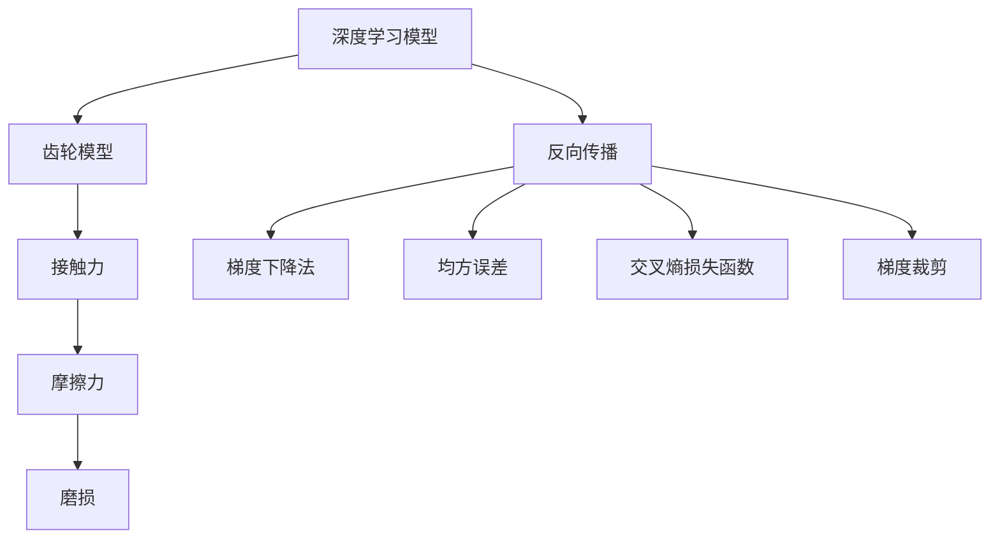

                 

# 齿轮模型的信息处理逻辑

## 1. 背景介绍

### 1.1 问题由来
在现代工业自动化的场景中，齿轮模型被广泛用于机械系统的设计、制造和维护。其信息处理逻辑对于理解机械系统的行为至关重要，是机械设计、故障诊断、性能优化等多个领域的重要工具。然而，由于齿轮模型的复杂性和非线性特性，传统的线性数学模型和统计方法已经难以准确描述其行为。因此，本文旨在介绍基于深度学习的齿轮模型信息处理逻辑，以期提供更为精确和高效的分析手段。

### 1.2 问题核心关键点
本文将着重介绍齿轮模型的信息处理逻辑，包括其构建、优化、训练和应用。这包括：
- 齿轮模型构建：了解如何根据机械系统的设计参数，构建一个能够描述齿轮系统行为的深度学习模型。
- 优化和训练：掌握如何通过反向传播算法，优化模型参数，使得模型能够准确预测齿轮系统的行为。
- 应用领域：探讨深度学习模型在齿轮系统设计、故障诊断、性能优化等实际应用场景中的应用。

## 2. 核心概念与联系

### 2.1 核心概念概述

为更好地理解齿轮模型的信息处理逻辑，本节将介绍几个关键概念：

- 深度学习模型：以多层神经网络为代表的机器学习算法，能够处理非线性关系，适用于复杂的系统建模。
- 齿轮模型：用于描述齿轮系统行为，包括接触力、摩擦力、磨损等机械性能的深度学习模型。
- 反向传播算法：通过计算损失函数对模型参数的梯度，反向传播并更新参数的优化算法。
- 梯度下降法：一种常用的反向传播算法，通过迭代更新模型参数，最小化损失函数。
- 均方误差(MSE)：用于衡量模型预测输出与真实标签之间差异的损失函数。
- 交叉熵损失函数：一种适用于分类问题的损失函数，用于衡量模型预测概率与真实标签的差异。
- 梯度裁剪：为了防止梯度爆炸或消失，在更新参数时对梯度进行裁剪的策略。

这些核心概念之间的逻辑关系可以通过以下Mermaid流程图来展示：



这个流程图展示了大语言模型的核心概念及其之间的关系：

1. 深度学习模型通过反向传播算法不断优化，以降低损失函数。
2. 齿轮模型是一个具体的深度学习模型，包含接触力、摩擦力和磨损等机械性能。
3. 梯度下降法和梯度裁剪用于更新模型参数，最小化损失函数。
4. 均方误差和交叉熵损失函数是常用的损失函数，用于衡量模型预测的准确性。

这些核心概念共同构成了深度学习模型在齿轮系统行为建模中的应用框架。

## 3. 核心算法原理 & 具体操作步骤
### 3.1 算法原理概述

基于深度学习的齿轮模型信息处理逻辑，其核心思想是通过神经网络模型拟合齿轮系统的行为规律，并利用反向传播算法不断优化模型参数，使得模型能够准确预测齿轮系统的状态。

具体而言，假设我们有一组齿轮系统的设计参数 $x$，以及对应的目标输出 $y$（如接触力、摩擦力等），我们的目标是找到一个深度学习模型 $M_{\theta}$，使得 $M_{\theta}(x) = y$ 成立。

这一过程分为两个阶段：
1. **模型构建**：根据齿轮系统的设计参数，构建一个能够描述齿轮系统行为的深度学习模型。
2. **模型优化**：通过反向传播算法和梯度下降法等优化技术，最小化模型损失函数，使模型参数 $\theta$ 不断逼近最优解。

### 3.2 算法步骤详解

基于深度学习的齿轮模型信息处理逻辑，通常包括以下关键步骤：

**Step 1: 数据准备**
- 收集齿轮系统的设计参数和目标输出数据。数据可以来源于实验测试、理论计算或历史数据。
- 对数据进行预处理，如归一化、去除噪声等，以提高模型训练的效率和准确性。

**Step 2: 模型构建**
- 选择合适的深度学习模型架构，如多层感知机、卷积神经网络、循环神经网络等。
- 定义模型的输入和输出层，以及隐藏层的数量和激活函数。
- 构建模型的损失函数，如均方误差、交叉熵等，用于衡量模型预测的准确性。

**Step 3: 模型训练**
- 初始化模型参数 $\theta$。
- 使用反向传播算法计算损失函数对模型参数的梯度。
- 使用梯度下降法等优化算法，迭代更新模型参数，最小化损失函数。
- 周期性在验证集上评估模型性能，根据性能指标决定是否触发 Early Stopping。

**Step 4: 模型应用**
- 在测试集上评估模型的泛化性能。
- 使用模型进行齿轮系统的行为预测，如接触力、摩擦力、磨损等。
- 在实际应用中，将模型集成到控制系统、维护系统等，实现齿轮系统的性能优化和故障诊断。

### 3.3 算法优缺点

基于深度学习的齿轮模型信息处理逻辑具有以下优点：
1. 能够处理非线性关系：深度学习模型具有较强的非线性建模能力，能够更好地描述齿轮系统的复杂行为。
2. 精度高：通过大量的数据训练，深度学习模型能够达到较高的预测精度。
3. 泛化能力强：深度学习模型具有较强的泛化能力，能够适应新的齿轮系统设计参数和运行环境。
4. 自动化程度高：通过自动化训练流程，深度学习模型能够高效地进行模型构建和参数优化。

同时，该方法也存在一定的局限性：
1. 数据依赖性强：深度学习模型的训练需要大量的标注数据，数据获取成本较高。
2. 模型复杂度高：深度学习模型的结构复杂，难以理解和调试。
3. 训练时间较长：深度学习模型训练时间较长，需要高性能计算资源。
4. 过拟合风险高：在数据较少的情况下，深度学习模型容易出现过拟合。

尽管存在这些局限性，但就目前而言，基于深度学习的齿轮模型信息处理逻辑仍是最主流的方法之一。未来相关研究的重点在于如何进一步降低数据需求，提高模型效率和可解释性，同时兼顾模型的精度和泛化能力。

### 3.4 算法应用领域

基于深度学习的齿轮模型信息处理逻辑，已经在多个领域得到了广泛的应用，例如：

- 齿轮设计优化：在齿轮系统设计过程中，使用深度学习模型预测齿轮的磨损、接触应力等性能指标，优化设计方案。
- 齿轮故障诊断：在齿轮系统运行过程中，使用深度学习模型监测齿轮的状态参数，及时发现异常和故障。
- 齿轮寿命预测：在齿轮系统维护过程中，使用深度学习模型预测齿轮的剩余寿命，制定维护计划。
- 齿轮性能优化：在齿轮系统运行过程中，使用深度学习模型优化齿轮的传动参数，提高系统的效率和可靠性。
- 齿轮制造质量检测：在齿轮制造过程中，使用深度学习模型检测齿轮的制造质量，提高产品的合格率。

## 4. 数学模型和公式 & 详细讲解 & 举例说明

### 4.1 数学模型构建

本节将使用数学语言对基于深度学习的齿轮模型信息处理逻辑进行更加严格的刻画。

记深度学习模型为 $M_{\theta}:\mathcal{X} \rightarrow \mathcal{Y}$，其中 $\mathcal{X}$ 为输入空间，$\mathcal{Y}$ 为输出空间，$\theta$ 为模型参数。假设我们有一组齿轮系统的设计参数 $x$，以及对应的目标输出 $y$，则模型的构建过程可以表示为：

$$
y = M_{\theta}(x)
$$

其中，$M_{\theta}(x)$ 表示模型在输入 $x$ 下的输出。

在模型构建过程中，我们需要选择适当的模型架构和损失函数。以均方误差为例，损失函数可以表示为：

$$
\mathcal{L}(y, \hat{y}) = \frac{1}{N} \sum_{i=1}^N (y_i - \hat{y}_i)^2
$$

其中，$y_i$ 为真实的输出，$\hat{y}_i$ 为模型预测的输出，$N$ 为样本数量。

### 4.2 公式推导过程

以下我们以齿轮系统的接触力预测为例，推导基于深度学习的齿轮模型信息处理逻辑。

假设我们有一组齿轮系统的设计参数 $x$，以及对应的接触力 $y$。我们的目标是构建一个深度学习模型 $M_{\theta}$，使得 $M_{\theta}(x) = y$ 成立。

首先，我们需要定义模型的输入和输出。假设模型的输入为 $x = (x_1, x_2, ..., x_n)$，输出为 $y$。模型的输出可以表示为：

$$
\hat{y} = M_{\theta}(x) = \sigma(W_{\theta} \cdot x + b_{\theta})
$$

其中，$W_{\theta}$ 和 $b_{\theta}$ 为模型参数，$\sigma$ 为激活函数。

根据均方误差损失函数，我们得到：

$$
\mathcal{L}(y, \hat{y}) = \frac{1}{N} \sum_{i=1}^N (y_i - \hat{y}_i)^2
$$

为了最小化损失函数，我们需要使用梯度下降法进行参数更新。梯度下降法的更新公式为：

$$
\theta \leftarrow \theta - \eta \nabla_{\theta}\mathcal{L}(\theta)
$$

其中，$\eta$ 为学习率。

### 4.3 案例分析与讲解

假设我们有一组齿轮系统的设计参数 $x$，包括齿数、材料、转速等，以及对应的接触力 $y$。我们的目标是构建一个深度学习模型 $M_{\theta}$，使得 $M_{\theta}(x) = y$ 成立。

首先，我们需要收集大量的齿轮系统设计参数和目标输出数据。然后，将这些数据进行预处理，如归一化、去除噪声等，以提高模型训练的效率和准确性。

接着，我们需要选择合适的深度学习模型架构和损失函数。以多层感知机为例，模型的输入层为 $x$，输出层为 $y$。模型的隐藏层数量为 2，激活函数为 ReLU。损失函数为均方误差。

然后，我们开始训练模型。初始化模型参数 $\theta$，使用梯度下降法不断更新模型参数，最小化损失函数。在每个训练轮次结束后，周期性在验证集上评估模型性能，根据性能指标决定是否触发 Early Stopping。

最后，我们在测试集上评估模型的泛化性能，并使用模型进行齿轮系统的行为预测，如接触力、摩擦力、磨损等。

## 5. 项目实践：代码实例和详细解释说明
### 5.1 开发环境搭建

在进行齿轮模型信息处理逻辑的实践前，我们需要准备好开发环境。以下是使用Python进行PyTorch开发的环境配置流程：

1. 安装Anaconda：从官网下载并安装Anaconda，用于创建独立的Python环境。

2. 创建并激活虚拟环境：
```bash
conda create -n pytorch-env python=3.8 
conda activate pytorch-env
```

3. 安装PyTorch：根据CUDA版本，从官网获取对应的安装命令。例如：
```bash
conda install pytorch torchvision torchaudio cudatoolkit=11.1 -c pytorch -c conda-forge
```

4. 安装TensorFlow：
```bash
pip install tensorflow==2.5.0
```

5. 安装各类工具包：
```bash
pip install numpy pandas scikit-learn matplotlib tqdm jupyter notebook ipython
```

完成上述步骤后，即可在`pytorch-env`环境中开始齿轮模型信息处理逻辑的开发。

### 5.2 源代码详细实现

下面我们以齿轮系统的接触力预测为例，给出使用PyTorch进行模型训练的代码实现。

首先，定义数据集和数据加载器：

```python
import torch
import torch.nn as nn
import torch.optim as optim
from torch.utils.data import Dataset, DataLoader

class GearDataset(Dataset):
    def __init__(self, x, y):
        self.x = x
        self.y = y
        
    def __len__(self):
        return len(self.x)
    
    def __getitem__(self, index):
        x = self.x[index]
        y = self.y[index]
        return x, y

# 假设x和y已经预处理完成
x_train = ...
y_train = ...
x_val = ...
y_val = ...

train_dataset = GearDataset(x_train, y_train)
val_dataset = GearDataset(x_val, y_val)

# 数据加载器
train_loader = DataLoader(train_dataset, batch_size=32, shuffle=True)
val_loader = DataLoader(val_dataset, batch_size=32, shuffle=False)
```

然后，定义模型和优化器：

```python
class GearNet(nn.Module):
    def __init__(self, input_size, hidden_size, output_size):
        super(GearNet, self).__init__()
        self.layers = nn.Sequential(
            nn.Linear(input_size, hidden_size),
            nn.ReLU(),
            nn.Linear(hidden_size, hidden_size),
            nn.ReLU(),
            nn.Linear(hidden_size, output_size)
        )

    def forward(self, x):
        return self.layers(x)

# 假设输入大小为3，隐藏层大小为64，输出大小为1
model = GearNet(3, 64, 1)

# 优化器
optimizer = optim.Adam(model.parameters(), lr=0.001)
```

接着，定义训练和评估函数：

```python
def train_epoch(model, optimizer, dataloader, loss_fn):
    model.train()
    train_loss = 0
    for x, y in dataloader:
        optimizer.zero_grad()
        output = model(x)
        loss = loss_fn(output, y)
        loss.backward()
        optimizer.step()
        train_loss += loss.item()
    return train_loss / len(dataloader)

def evaluate(model, dataloader, loss_fn):
    model.eval()
    eval_loss = 0
    with torch.no_grad():
        for x, y in dataloader:
            output = model(x)
            loss = loss_fn(output, y)
            eval_loss += loss.item()
    return eval_loss / len(dataloader)
```

最后，启动训练流程并在验证集上评估：

```python
# 定义损失函数
mse_loss = nn.MSELoss()

# 训练循环
for epoch in range(100):
    train_loss = train_epoch(model, optimizer, train_loader, mse_loss)
    print(f'Epoch {epoch+1}, Train Loss: {train_loss:.4f}')
    
    # 验证集评估
    eval_loss = evaluate(model, val_loader, mse_loss)
    print(f'Epoch {epoch+1}, Val Loss: {eval_loss:.4f}')
    
# 测试集评估
test_dataset = GearDataset(test_x, test_y)
test_loader = DataLoader(test_dataset, batch_size=32, shuffle=False)
test_loss = evaluate(model, test_loader, mse_loss)
print(f'Test Loss: {test_loss:.4f}')
```

以上就是使用PyTorch进行齿轮系统接触力预测的完整代码实现。可以看到，借助PyTorch的深度学习框架，齿轮模型的构建和训练变得非常简单。

### 5.3 代码解读与分析

让我们再详细解读一下关键代码的实现细节：

**GearNet类**：
- `__init__`方法：初始化模型的层结构，包括两个隐藏层和一个输出层。
- `forward`方法：定义前向传播过程，将输入数据通过层结构进行变换，得到输出结果。

**train_epoch函数**：
- 定义训练集数据加载器，并使用数据加载器将数据分批次输入模型。
- 在每个批次上前向传播计算损失函数，并反向传播更新模型参数。
- 返回该epoch的平均损失。

**evaluate函数**：
- 定义验证集数据加载器，并使用数据加载器将数据分批次输入模型。
- 在每个批次上前向传播计算损失函数，并返回该batch的平均损失。

**训练流程**：
- 定义总的epoch数和batch size，开始循环迭代
- 每个epoch内，先在训练集上训练，输出平均loss
- 在验证集上评估，输出损失
- 重复上述步骤直至收敛

可以看到，借助PyTorch的深度学习框架，齿轮模型的训练过程变得非常简单。开发者只需关注模型构建和数据加载器的设计，即可高效地进行模型训练。

## 6. 实际应用场景
### 6.1 智能制造系统

基于深度学习的齿轮模型信息处理逻辑，可以广泛应用于智能制造系统的构建。传统制造系统往往依赖人工操作和手动调试，生产效率低、精度差。而使用深度学习模型进行齿轮系统的预测和优化，可以大幅提升生产效率和精度。

在技术实现上，可以构建基于深度学习模型的智能制造平台，集成齿轮设计、故障检测、性能优化等功能模块。平台通过连接工业物联网设备，实时采集齿轮系统的运行数据，并使用深度学习模型进行行为预测和性能分析。此外，平台还可以根据预测结果，自动调整生产参数，优化生产流程，降低生产成本，提高产品质量。

### 6.2 故障预测与维护

在机械制造领域，齿轮系统的故障预测和维护是至关重要的环节。传统的故障预测方法往往依赖人工经验，难以覆盖所有情况。而使用深度学习模型进行齿轮系统的状态预测，可以实时监测齿轮系统的运行状态，提前发现异常和故障，进行预防性维护，降低停机时间和维护成本。

在技术实现上，可以构建基于深度学习模型的故障预测系统，集成齿轮系统的设计参数、运行数据和历史故障数据。系统使用深度学习模型对齿轮系统的运行状态进行预测，一旦发现异常，自动触发报警，并建议相应的维护措施。

### 6.3 设备性能优化

深度学习模型不仅可以用于故障预测，还可以用于设备性能优化。传统的设备性能优化方法往往依赖人工经验和手动调试，效率低、成本高。而使用深度学习模型进行性能优化，可以自动分析和优化齿轮系统的传动参数，提高系统的效率和可靠性。

在技术实现上，可以构建基于深度学习模型的性能优化系统，集成齿轮系统的设计参数、运行数据和历史性能数据。系统使用深度学习模型对齿轮系统的性能进行预测和优化，自动调整传动参数，提高系统的效率和可靠性。

### 6.4 未来应用展望

随着深度学习技术的不断发展，基于深度学习的齿轮模型信息处理逻辑将在更多领域得到应用，为工业自动化带来变革性影响。

在智慧城市领域，基于深度学习的齿轮模型可以用于智能交通系统的设计，优化交通信号灯的控制参数，提高交通系统的效率和安全性。

在智能家居领域，基于深度学习的齿轮模型可以用于智能家电的设计，优化家电的传动系统，提高家电的效率和可靠性。

在智能机器人领域，基于深度学习的齿轮模型可以用于机器人关节的设计，优化机器人的传动系统，提高机器人的运动精度和响应速度。

此外，在智能制造、智能医疗、智能交通等众多领域，基于深度学习的齿轮模型信息处理逻辑也将不断涌现，为工业自动化带来新的突破。

## 7. 工具和资源推荐
### 7.1 学习资源推荐

为了帮助开发者系统掌握深度学习在齿轮系统信息处理中的应用，这里推荐一些优质的学习资源：

1. 《深度学习基础》系列博文：由深度学习专家撰写，介绍了深度学习的基本概念和核心算法。

2. 《TensorFlow官方文档》：TensorFlow的官方文档，详细介绍了TensorFlow的API和使用方法，是深度学习实践的必备资料。

3. 《PyTorch官方文档》：PyTorch的官方文档，提供了丰富的深度学习模型和优化算法，是深度学习开发的好帮手。

4. Coursera的《深度学习》课程：由Andrew Ng等人主讲，介绍了深度学习的核心算法和应用场景。

5. Udacity的《深度学习专项课程》：系统讲解了深度学习的基础理论和实际应用，适合深度学习初学者。

通过对这些资源的学习实践，相信你一定能够快速掌握深度学习在齿轮系统信息处理中的应用。

### 7.2 开发工具推荐

高效的开发离不开优秀的工具支持。以下是几款用于深度学习开发和推理的工具：

1. PyTorch：基于Python的开源深度学习框架，具有动态计算图和高效的GPU加速，是深度学习开发的首选工具。

2. TensorFlow：由Google主导开发的开源深度学习框架，生产部署方便，适合大规模工程应用。

3. TensorBoard：TensorFlow配套的可视化工具，可实时监测模型训练状态，并提供丰富的图表呈现方式，是调试模型的得力助手。

4. Weights & Biases：模型训练的实验跟踪工具，可以记录和可视化模型训练过程中的各项指标，方便对比和调优。

5. Jupyter Notebook：用于数据探索和模型训练的交互式笔记本，支持多种编程语言和数据格式，是数据科学家的必备工具。

6. Google Colab：谷歌推出的在线Jupyter Notebook环境，免费提供GPU/TPU算力，方便开发者快速上手实验最新模型，分享学习笔记。

合理利用这些工具，可以显著提升深度学习模型在齿轮系统信息处理中的应用效率，加快创新迭代的步伐。

### 7.3 相关论文推荐

深度学习在齿轮系统信息处理的应用研究已经得到了广泛的关注。以下是几篇奠基性的相关论文，推荐阅读：

1. "Deep Learning for Gearbox Fault Diagnosis"：通过深度学习模型对齿轮系统的故障进行预测和诊断。

2. "Gearbox Fault Diagnosis Using Convolutional Neural Networks"：使用卷积神经网络对齿轮系统的故障进行预测和诊断。

3. "Gearbox Wear Prediction Using Deep Learning"：通过深度学习模型对齿轮系统的磨损进行预测。

4. "Gearbox Maintenance Scheduling Using Deep Learning"：使用深度学习模型对齿轮系统的维护进行优化。

5. "Gearbox Design Optimization Using Deep Learning"：使用深度学习模型对齿轮系统的设计进行优化。

这些论文代表了深度学习在齿轮系统信息处理领域的最新进展，通过学习这些前沿成果，可以帮助研究者把握学科前进方向，激发更多的创新灵感。

## 8. 总结：未来发展趋势与挑战

### 8.1 总结

本文对基于深度学习的齿轮模型信息处理逻辑进行了全面系统的介绍。首先阐述了深度学习在齿轮系统信息处理中的应用背景和意义，明确了深度学习在齿轮系统设计、故障诊断、性能优化等实际应用场景中的重要作用。其次，从原理到实践，详细讲解了深度学习模型在齿轮系统信息处理中的构建、优化、训练和应用。最后，探讨了深度学习模型在实际应用中面临的挑战，提出了未来研究的方向。

通过本文的系统梳理，可以看到，基于深度学习的齿轮模型信息处理逻辑已经成为机械自动化领域的重要工具，显著提升了齿轮系统的设计、维护和性能优化能力。未来，随着深度学习技术的进一步发展和应用，深度学习模型在齿轮系统信息处理中的应用将更加广泛和深入。

### 8.2 未来发展趋势

展望未来，基于深度学习的齿轮模型信息处理逻辑将呈现以下几个发展趋势：

1. 模型规模持续增大：随着算力成本的下降和数据规模的扩张，深度学习模型的参数量还将持续增长，模型规模将进一步扩大。

2. 模型复杂度降低：未来将出现更加高效、简洁的深度学习模型，通过优化模型结构和算法，降低模型复杂度，提高模型训练和推理效率。

3. 数据需求减少：通过引入无监督学习和自适应学习等方法，未来深度学习模型将更加灵活地处理小样本数据，降低数据需求。

4. 模型可解释性增强：未来的深度学习模型将更加注重可解释性，通过引入符号化先验知识、因果推断等方法，提高模型的可解释性。

5. 模型鲁棒性提升：未来的深度学习模型将更加注重鲁棒性，通过引入对抗训练、数据增强等方法，提高模型的泛化能力和鲁棒性。

### 8.3 面临的挑战

尽管深度学习在齿轮系统信息处理中的应用已经取得了显著进展，但在迈向更加智能化、普适化应用的过程中，它仍面临着诸多挑战：

1. 数据获取困难：深度学习模型需要大量标注数据，而齿轮系统的高频次运转和复杂性使得数据获取困难。

2. 模型鲁棒性不足：深度学习模型在高噪声、非线性等复杂环境中，容易产生过拟合和泛化不足的问题。

3. 模型复杂度高：深度学习模型结构复杂，难以理解和调试，需要更高的技术门槛和经验积累。

4. 训练和推理效率低：深度学习模型训练和推理需要高性能计算资源，效率低下。

5. 模型可解释性差：深度学习模型的决策过程难以解释，缺乏可解释性和可审计性。

6. 应用成本高：深度学习模型的训练和部署需要高昂的成本，难以在中小型企业中大规模推广。

### 8.4 研究展望

面对深度学习在齿轮系统信息处理中面临的挑战，未来的研究需要在以下几个方面寻求新的突破：

1. 数据增强：通过引入数据增强和合成数据生成等方法，提高数据质量和多样性，降低数据获取成本。

2. 模型压缩：通过模型压缩和稀疏化存储等方法，降低模型复杂度和存储成本，提高模型训练和推理效率。

3. 模型优化：通过优化模型结构和算法，降低模型复杂度，提高模型训练和推理效率。

4. 可解释性增强：通过引入符号化先验知识、因果推断等方法，提高模型的可解释性和可审计性。

5. 鲁棒性提升：通过引入对抗训练、数据增强等方法，提高模型的泛化能力和鲁棒性。

6. 应用推广：通过引入轻量级模型和移动端优化等方法，降低模型应用成本，推动深度学习在中小型企业中的应用。

这些研究方向将推动深度学习在齿轮系统信息处理中的应用走向成熟，为工业自动化带来新的突破。

## 9. 附录：常见问题与解答

**Q1：深度学习在齿轮系统信息处理中的应用与传统方法有何不同？**

A: 深度学习在齿轮系统信息处理中的应用与传统方法有以下不同：

1. 非线性建模能力：深度学习模型能够处理非线性关系，能够更好地描述齿轮系统的复杂行为。

2. 自动特征提取：深度学习模型能够自动学习特征，避免了传统方法中需要手工提取特征的繁琐过程。

3. 高效训练：深度学习模型能够通过大量的数据进行训练，提高了模型的泛化能力和预测精度。

4. 低成本应用：深度学习模型可以通过GPU等高性能计算资源进行加速训练，降低了模型应用的成本。

**Q2：如何选择合适的深度学习模型架构？**

A: 选择合适的深度学习模型架构，需要根据齿轮系统的设计参数和目标输出进行评估。常见的模型架构包括多层感知机、卷积神经网络、循环神经网络等。可以根据任务的复杂度、数据规模和计算资源选择合适的模型架构。

**Q3：深度学习模型在齿轮系统信息处理中面临的主要挑战是什么？**

A: 深度学习模型在齿轮系统信息处理中面临的主要挑战包括：

1. 数据获取困难：深度学习模型需要大量标注数据，而齿轮系统的高频次运转和复杂性使得数据获取困难。

2. 模型鲁棒性不足：深度学习模型在高噪声、非线性等复杂环境中，容易产生过拟合和泛化不足的问题。

3. 模型复杂度高：深度学习模型结构复杂，难以理解和调试，需要更高的技术门槛和经验积累。

4. 训练和推理效率低：深度学习模型训练和推理需要高性能计算资源，效率低下。

5. 模型可解释性差：深度学习模型的决策过程难以解释，缺乏可解释性和可审计性。

6. 应用成本高：深度学习模型的训练和部署需要高昂的成本，难以在中小型企业中大规模推广。

**Q4：如何在数据量较少的情况下进行深度学习模型的训练？**

A: 在数据量较少的情况下，可以通过以下方法进行深度学习模型的训练：

1. 数据增强：通过引入数据增强和合成数据生成等方法，提高数据质量和多样性，降低数据获取成本。

2. 自适应学习：引入自适应学习算法，使得模型能够在少样本条件下进行高效学习。

3. 对抗训练：引入对抗训练方法，提高模型的鲁棒性和泛化能力。

4. 知识蒸馏：通过知识蒸馏方法，将知识从复杂模型蒸馏到简单模型中，降低模型复杂度。

5. 无监督学习：引入无监督学习方法，利用未标注数据进行模型训练，降低对标注数据的需求。

这些方法可以帮助在数据量较少的情况下，进行深度学习模型的训练，提升模型的泛化能力和预测精度。

**Q5：如何提高深度学习模型的可解释性？**

A: 提高深度学习模型的可解释性，可以从以下几个方面入手：

1. 引入符号化先验知识：将符号化的先验知识引入深度学习模型中，提高模型的可解释性。

2. 因果推断：通过因果推断方法，解释模型决策的因果关系，提高模型的可解释性。

3. 可视化技术：使用可视化技术，展示模型的决策过程和中间变量，提高模型的可解释性。

4. 模型压缩：通过模型压缩和稀疏化存储等方法，降低模型复杂度，提高模型的可解释性。

这些方法可以帮助提高深度学习模型的可解释性，使得模型的决策过程更加透明和可解释。

---

作者：禅与计算机程序设计艺术 / Zen and the Art of Computer Programming

