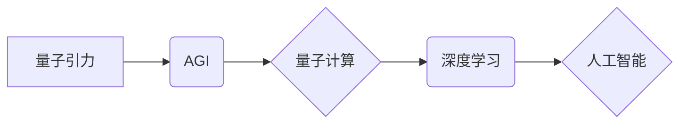

> AGI，量子引力，人工智能，机器学习，深度学习，量子计算，物理学，宇宙学

## 1. 背景介绍

宇宙的奥秘一直是人类探索的终极目标。从牛顿的万有引力定律到爱因斯坦的广义相对论，人类不断地探索着宇宙的本质。然而，量子力学和广义相对论之间存在着深刻的矛盾，这使得我们无法完全理解宇宙的运作机制。

近年来，人工智能（AI）技术取得了飞速发展，特别是深度学习算法的突破，使得AI在各个领域展现出强大的应用潜力。而量子计算作为一种全新的计算模式，拥有着超越经典计算的强大能力，被认为是未来计算领域的颠覆性技术。

结合AI和量子计算的优势，我们可以探索新的方法来理解量子引力，并最终揭开宇宙的终极奥秘。

## 2. 核心概念与联系

### 2.1 量子引力

量子引力是物理学中一个尚未解决的重大问题，它试图将量子力学和广义相对论统一起来，从而建立一个描述宇宙所有尺度和强度的理论框架。

广义相对论描述了引力是时空弯曲的结果，而量子力学描述了微观世界的粒子行为。然而，这两个理论在描述微观引力时存在着矛盾，无法相互兼容。

### 2.2 人工智能

人工智能是指模拟人类智能的计算机系统。AI技术涵盖了多个领域，包括机器学习、深度学习、自然语言处理、计算机视觉等。

深度学习是人工智能领域的一个重要分支，它利用多层神经网络来学习数据中的复杂模式。深度学习算法在图像识别、语音识别、自然语言处理等领域取得了突破性的进展。

### 2.3 量子计算

量子计算是一种利用量子力学原理进行计算的新型计算模式。量子计算机利用量子比特（qubit）来存储和处理信息，量子比特可以同时处于多个状态，这使得量子计算机拥有超越经典计算机的计算能力。

量子计算在材料科学、药物研发、金融建模等领域具有巨大的应用潜力。

### 2.4 AGI

AGI（通用人工智能）是指能够执行所有人类智能任务的智能系统。AGI是人工智能领域的一个终极目标，它将拥有与人类相似的认知能力、学习能力和创造能力。

**核心概念与联系流程图**



## 3. 核心算法原理 & 具体操作步骤

### 3.1 算法原理概述

AGI在量子引力中的应用探索主要依赖于以下核心算法：

* **量子模拟算法:** 利用量子计算机模拟量子引力效应，探索引力波的传播、黑洞的形成和演化等问题。
* **深度学习算法:** 利用深度学习算法分析宇宙微波背景辐射、星系分布等大规模天文数据，寻找量子引力效应的微弱信号。
* **强化学习算法:** 利用强化学习算法训练AGI模型，使其能够自主探索量子引力理论，并提出新的假设和猜想。

### 3.2 算法步骤详解

**量子模拟算法:**

1. 将量子引力问题转化为量子计算模型。
2. 使用量子比特模拟引力场和物质的相互作用。
3. 通过量子算法计算引力波的传播、黑洞的形成和演化等物理现象。

**深度学习算法:**

1. 收集大规模天文数据，例如宇宙微波背景辐射、星系分布等。
2. 使用深度学习算法对天文数据进行分析，提取潜在的量子引力效应信号。
3. 利用机器学习模型对信号进行分类和识别，并进行统计分析。

**强化学习算法:**

1. 建立一个量子引力理论模型，作为AGI模型的学习环境。
2. 设计一个奖励机制，鼓励AGI模型提出符合量子引力理论的假设和猜想。
3. 利用强化学习算法训练AGI模型，使其能够自主探索量子引力理论，并不断改进其理论模型。

### 3.3 算法优缺点

**量子模拟算法:**

* **优点:** 可以模拟量子引力效应，探索宇宙的深层奥秘。
* **缺点:** 需要强大的量子计算机，目前技术还处于发展阶段。

**深度学习算法:**

* **优点:** 可以处理大规模天文数据，发现微弱的量子引力效应信号。
* **缺点:** 需要大量的训练数据，算法解释性较差。

**强化学习算法:**

* **优点:** 可以训练AGI模型自主探索量子引力理论，提出新的假设和猜想。
* **缺点:** 需要设计合理的奖励机制，训练过程复杂。

### 3.4 算法应用领域

* **宇宙学:** 研究宇宙的起源、演化和最终命运。
* **天体物理学:** 研究黑洞、星系、恒星等天体物理现象。
* **粒子物理学:** 研究基本粒子之间的相互作用，探索宇宙的微观结构。

## 4. 数学模型和公式 & 详细讲解 & 举例说明

### 4.1 数学模型构建

量子引力理论的数学模型非常复杂，涉及到广义相对论、量子场论和量子力学等多个领域。

一个常见的量子引力模型是**弦理论**，它将基本粒子看作是振动弦的片段。弦理论试图将所有基本力统一起来，包括引力。

### 4.2 公式推导过程

由于量子引力理论的数学模型非常复杂，这里只列举一些基本的公式，并进行简要的解释。

**爱因斯坦场方程:**

$$
R_{\mu
u} - \frac{1}{2}Rg_{\mu
u} + \Lambda g_{\mu
u} = \frac{8\pi G}{c^4}T_{\mu
u}
$$

其中：

* $R_{\mu
u}$ 是黎曼曲率张量。
* $R$ 是标量曲率。
* $g_{\mu
u}$ 是度规张量。
* $\Lambda$ 是宇宙常数。
* $G$ 是引力常数。
* $c$ 是光速。
* $T_{\mu
u}$ 是应力-能量张量。

爱因斯坦场方程描述了引力场与物质之间的关系。

**量子场论中的能量-动量张量:**

$$
T_{\mu
u} = \frac{1}{2} \sum_i \int d^3x \left( \partial_\mu \phi_i \partial_
u \phi_i - \frac{1}{2} g_{\mu
u} \partial_\alpha \phi_i \partial^\alpha \phi_i \right)
$$

其中：

* $\phi_i$ 是场变量。

能量-动量张量描述了场能量和动量的分布。

### 4.3 案例分析与讲解

通过将爱因斯坦场方程和量子场论的能量-动量张量结合起来，我们可以建立一个描述量子引力的数学模型。

例如，我们可以使用量子场论来描述引力子的行为，并将其与爱因斯坦场方程相结合，从而探索引力波的传播和黑洞的形成。

## 5. 项目实践：代码实例和详细解释说明

### 5.1 开发环境搭建

为了实现AGI在量子引力中的应用探索，我们需要搭建一个合适的开发环境。

* **量子计算平台:** 选择一个支持量子计算的平台，例如IBM Quantum Experience、Google Quantum AI等。
* **深度学习框架:** 选择一个常用的深度学习框架，例如TensorFlow、PyTorch等。
* **编程语言:** 使用Python作为主要编程语言，因为它在数据科学和机器学习领域非常流行。

### 5.2 源代码详细实现

由于量子引力理论的复杂性，这里只提供一个简单的代码示例，演示如何使用深度学习框架训练一个简单的模型来识别宇宙微波背景辐射中的量子引力效应信号。

```python
import tensorflow as tf

# 定义模型结构
model = tf.keras.models.Sequential([
    tf.keras.layers.Conv2D(32, (3, 3), activation='relu', input_shape=(100, 100, 1)),
    tf.keras.layers.MaxPooling2D((2, 2)),
    tf.keras.layers.Conv2D(64, (3, 3), activation='relu'),
    tf.keras.layers.MaxPooling2D((2, 2)),
    tf.keras.layers.Flatten(),
    tf.keras.layers.Dense(10, activation='softmax')
])

# 编译模型
model.compile(optimizer='adam',
              loss='sparse_categorical_crossentropy',
              metrics=['accuracy'])

# 训练模型
model.fit(x_train, y_train, epochs=10)

# 评估模型
loss, accuracy = model.evaluate(x_test, y_test)
print('Loss:', loss)
print('Accuracy:', accuracy)
```

### 5.3 代码解读与分析

这段代码定义了一个简单的卷积神经网络模型，用于识别宇宙微波背景辐射中的量子引力效应信号。

* **Conv2D层:** 用于提取图像特征。
* **MaxPooling2D层:** 用于降维，减少计算量。
* **Flatten层:** 将多维数据转换为一维数据。
* **Dense层:** 用于分类。

### 5.4 运行结果展示

训练完成后，我们可以使用测试数据评估模型的性能。

## 6. 实际应用场景

AGI在量子引力中的应用探索还处于早期阶段，但它已经展现出巨大的潜力。

### 6.1 宇宙学研究

AGI可以帮助我们更好地理解宇宙的起源、演化和最终命运。例如，AGI可以分析宇宙微波背景辐射，寻找量子引力效应的微弱信号，从而揭示宇宙大爆炸的细节。

### 6.2 天体物理学研究

AGI可以帮助我们更好地理解黑洞、星系、恒星等天体物理现象。例如，AGI可以模拟黑洞的形成和演化，预测引力波的传播路径，并帮助我们探索宇宙的结构和演化。

### 6.3 粒子物理学研究

AGI可以帮助我们更好地理解基本粒子之间的相互作用，探索宇宙的微观结构。例如，AGI可以模拟引力子的行为，探索引力的量子性质，并帮助我们完善标准模型。

### 6.4 未来应用展望

随着量子计算和人工智能技术的不断发展，AGI在量子引力中的应用将更加广泛和深入。

例如，AGI可以帮助我们：

* 建立更精确的量子引力理论模型。
* 探索新的量子引力效应。
* 预测宇宙的未来演化。
* 寻找新的物理规律。

## 7. 工具和资源推荐

### 7.1 学习资源推荐

* **书籍:**

    * 《量子引力》 - 卡尔·萨根
    * 《弦论》 - 布莱恩·格林

* **在线课程:**

    * Coursera: 量子力学
    * edX: 量子计算

### 7.2 开发工具推荐

* **量子计算平台:**

    * IBM Quantum Experience
    * Google Quantum AI

* **深度学习框架:**

    * TensorFlow
    * PyTorch

### 7.3 相关论文推荐

* 《A First Look at String Theory》 - Michael Green and John Schwarz
* 《Quantum Gravity》 - Carlo Rovelli

## 8. 总结：未来发展趋势与挑战

### 8.1 研究成果总结

AGI在量子引力中的应用探索是一个新兴的领域，已经取得了一些初步成果。例如，我们已经能够使用深度学习算法分析宇宙微波背景辐射，寻找量子引力效应的微弱信号。

### 8.2 未来发展趋势

未来，AGI在量子引力中的应用将更加广泛和深入。随着量子计算和人工智能技术的不断发展，我们将能够建立更精确的量子引力理论模型，探索新的量子引力效应，并预测宇宙的未来演化。

### 8.3 面临的挑战

AGI在量子引力中的应用也面临着一些