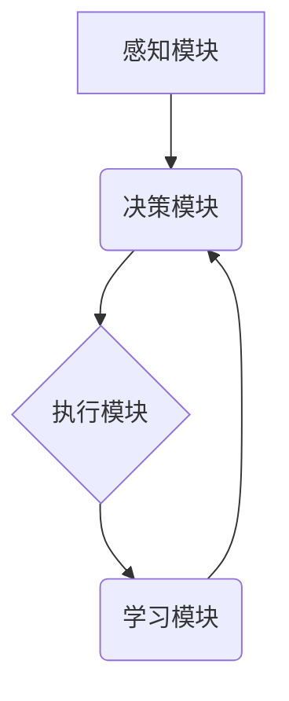

> AI Agent, 具身智能, 商业应用, 市场前景, 深度学习, 自然语言处理, 机器视觉

## 1. 背景介绍

人工智能（AI）技术近年来发展迅速，从语音识别、图像识别到自然语言处理等领域取得了突破性进展。然而，传统的AI模型大多局限于数字空间，缺乏与物理世界直接交互的能力。随着机器人技术、传感器技术和计算能力的不断提升，**具身智能（Embodied Intelligence）** 成为AI发展的新方向，并被认为是AI的下一个风口。

具身智能是指赋予AI实体形态，使其能够感知、理解和交互于物理世界的能力。与传统的AI模型相比，具身智能具有以下优势：

* **更强的感知能力:** 具身智能代理可以通过传感器感知物理世界的各种信息，例如视觉、听觉、触觉等，从而获得更丰富、更真实的感知。
* **更强的行动能力:** 具身智能代理可以执行物理动作，例如移动、抓取、manipulate等，从而与物理世界进行更直接的交互。
* **更强的学习能力:** 通过与物理世界的交互，具身智能代理可以学习更复杂的知识和技能，并能够更好地适应变化的环境。

## 2. 核心概念与联系

具身智能的核心概念包括：

* **AI Agent:** 智能代理是一个能够感知环境、做出决策并执行动作的系统。
* **Embodiment:** 具身是指AI代理拥有物理实体形态，并能够与物理世界进行交互。
* **Perception:** 感知是指AI代理通过传感器获取物理世界的信息。
* **Action:** 行动是指AI代理执行物理动作以影响物理世界。
* **Learning:** 学习是指AI代理通过经验积累和知识更新不断提高其能力。

具身智能的架构通常包括以下几个模块：

* **感知模块:** 收集物理世界的信息，例如视觉、听觉、触觉等。
* **决策模块:** 根据感知到的信息，做出决策并规划行动。
* **执行模块:** 执行决策，控制物理代理的动作。
* **学习模块:** 通过经验积累和知识更新，不断提高感知、决策和执行能力。



## 3. 核心算法原理 & 具体操作步骤

### 3.1  算法原理概述

具身智能的核心算法包括强化学习、深度学习和机器人控制等。

* **强化学习:** 强化学习是一种机器学习方法，通过奖励和惩罚机制，训练AI代理在特定环境中学习最优策略。
* **深度学习:** 深度学习是一种基于人工神经网络的机器学习方法，能够学习复杂的数据模式，例如图像、语音和文本。
* **机器人控制:** 机器人控制是指控制机器人运动和操作的算法，例如路径规划、运动控制和抓取控制。

### 3.2  算法步骤详解

**强化学习算法步骤:**

1. **环境建模:** 建立一个模拟物理世界的环境模型。
2. **状态定义:** 定义环境中的状态，例如机器人位置、目标位置等。
3. **动作空间:** 定义机器人可以执行的动作，例如移动、旋转、抓取等。
4. **奖励函数:** 定义一个奖励函数，根据机器人行为和环境状态分配奖励。
5. **策略学习:** 使用强化学习算法，例如Q学习或深度强化学习，训练机器人学习最优策略。

**深度学习算法步骤:**

1. **数据收集:** 收集大量与目标任务相关的训练数据。
2. **数据预处理:** 对训练数据进行预处理，例如图像增强、文本清洗等。
3. **模型构建:** 设计一个深度神经网络模型，例如卷积神经网络或循环神经网络。
4. **模型训练:** 使用训练数据训练深度神经网络模型。
5. **模型评估:** 使用测试数据评估模型性能。

**机器人控制算法步骤:**

1. **运动规划:** 规划机器人从起点到目标点的运动路径。
2. **运动控制:** 控制机器人关节运动，使机器人沿着规划路径运动。
3. **抓取控制:** 控制机器人抓取物体。

### 3.3  算法优缺点

**强化学习:**

* **优点:** 可以学习复杂的任务，并适应变化的环境。
* **缺点:** 训练时间长，需要大量的训练数据和计算资源。

**深度学习:**

* **优点:** 可以学习复杂的数据模式，并取得优异的性能。
* **缺点:** 需要大量的训练数据，容易过拟合。

**机器人控制:**

* **优点:** 可以控制机器人执行精确的动作。
* **缺点:** 需要复杂的算法和控制策略。

### 3.4  算法应用领域

* **机器人:** 自动驾驶、工业机器人、服务机器人等。
* **医疗:** 辅助手术、康复训练、药物研发等。
* **教育:** 智能教学、个性化学习等。
* **娱乐:** 游戏、虚拟现实等。

## 4. 数学模型和公式 & 详细讲解 & 举例说明

### 4.1  数学模型构建

强化学习的数学模型主要包括状态空间、动作空间、奖励函数和价值函数。

* **状态空间:** 环境中所有可能的狀態的集合。
* **动作空间:** 代理可以执行的动作的集合。
* **奖励函数:**  $R(s, a)$，描述代理在状态 $s$ 执行动作 $a$ 后获得的奖励。
* **价值函数:** $V(s)$，描述状态 $s$ 的期望累积奖励。

### 4.2  公式推导过程

Q学习算法的目标是学习一个Q函数，$Q(s, a)$，表示在状态 $s$ 执行动作 $a$ 后获得的期望累积奖励。

Q函数的更新公式为：

$$Q(s, a) \leftarrow Q(s, a) + \alpha [R(s, a) + \gamma \max_{a'} Q(s', a') - Q(s, a)]$$

其中：

* $\alpha$ 是学习率，控制着学习速度。
* $\gamma$ 是折扣因子，控制着未来奖励的权重。
* $s'$ 是执行动作 $a$ 后进入的下一个状态。

### 4.3  案例分析与讲解

例如，训练一个机器人学习玩游戏。

* 状态空间：游戏中的所有可能的场景。
* 动作空间：机器人可以执行的动作，例如向上移动、向下移动、向左移动、向右移动。
* 奖励函数：当机器人完成游戏目标时获得高奖励，否则获得低奖励。
* Q函数：学习每个状态下执行每个动作的期望累积奖励。

通过Q学习算法，机器人可以学习最优策略，即在每个状态下执行最优动作，从而获得最高的奖励。

## 5. 项目实践：代码实例和详细解释说明

### 5.1  开发环境搭建

* 操作系统：Ubuntu 20.04
* Python 版本：3.8
* 库依赖：OpenAI Gym, TensorFlow, PyTorch

### 5.2  源代码详细实现

```python
import gym
import numpy as np
from tensorflow.keras.models import Sequential
from tensorflow.keras.layers import Dense, Flatten

# 创建环境
env = gym.make('CartPole-v1')

# 定义神经网络模型
model = Sequential()
model.add(Flatten(input_shape=env.observation_space.shape))
model.add(Dense(128, activation='relu'))
model.add(Dense(env.action_space.n, activation='softmax'))

# 编译模型
model.compile(loss='sparse_categorical_crossentropy', optimizer='adam')

# 训练模型
for episode in range(1000):
    state = env.reset()
    done = False
    total_reward = 0

    while not done:
        # 选择动作
        action = np.argmax(model.predict(state[None, :]))

        # 执行动作
        next_state, reward, done, _ = env.step(action)

        # 更新状态
        state = next_state

        # 更新奖励
        total_reward += reward

    # 打印奖励
    print(f'Episode {episode+1}: Reward = {total_reward}')

# 保存模型
model.save('cartpole_model.h5')
```

### 5.3  代码解读与分析

* 代码首先创建了一个CartPole-v1环境，这是一个经典的强化学习环境。
* 然后定义了一个神经网络模型，用于学习策略。
* 模型使用softmax激活函数，输出每个动作的概率分布。
* 使用Q学习算法训练模型，并打印每个episode的奖励。
* 最后保存训练好的模型。

### 5.4  运行结果展示

训练完成后，模型能够在CartPole环境中保持平衡杆的时间越来越长。

## 6. 实际应用场景

### 6.1  自动驾驶

具身智能可以用于开发自动驾驶汽车，使汽车能够感知周围环境、做出决策并控制车辆行驶。

### 6.2  工业机器人

具身智能可以用于开发工业机器人，使机器人能够执行更复杂的任务，例如焊接、组装和搬运。

### 6.3  服务机器人

具身智能可以用于开发服务机器人，例如陪伴机器人、清洁机器人和医疗机器人，为人们提供更便捷的服务。

### 6.4  未来应用展望

具身智能的应用前景广阔，未来可能在以下领域得到更广泛的应用：

* **医疗保健:** 智能手术机器人、康复机器人、药物研发等。
* **教育:** 智能教学助手、个性化学习平台等。
* **娱乐:** 更逼真的虚拟现实体验、智能游戏角色等。
* **城市管理:** 智能交通系统、环境监测机器人等。

## 7. 工具和资源推荐

### 7.1  学习资源推荐

* **书籍:**
    * 《Reinforcement Learning: An Introduction》 by Richard S. Sutton and Andrew G. Barto
    * 《Deep Learning》 by Ian Goodfellow, Yoshua Bengio, and Aaron Courville
* **在线课程:**
    * Coursera: Reinforcement Learning Specialization
    * Udacity: Deep Learning Nanodegree

### 7.2  开发工具推荐

* **机器人操作系统 (ROS):** 一个开源的机器人软件框架。
* **TensorFlow:** 一个开源的机器学习框架。
* **PyTorch:** 另一个开源的机器学习框架。

### 7.3  相关论文推荐

* **Deep Reinforcement Learning with Double Q-learning**
* **Proximal Policy Optimization Algorithms**
* **Attention Is All You Need**

## 8. 总结：未来发展趋势与挑战

### 8.1  研究成果总结

近年来，具身智能领域取得了显著进展，例如：

* 强化学习算法取得了突破性进展，能够训练AI代理学习复杂的任务。
* 深度学习算法能够学习复杂的数据模式，例如图像、语音和文本。
* 机器人技术不断进步，机器人更加灵活、智能和可靠。

### 8.2  未来发展趋势

* **更强大的计算能力:** 更强大的计算能力将推动具身智能算法的开发和应用。
* **更丰富的传感器技术:** 更丰富的传感器技术将使AI代理能够感知更复杂的物理世界。
* **更先进的机器人技术:** 更先进的机器人技术将使AI代理能够执行更复杂的任务。
* **跨学科融合:** 具身智能将与其他领域，例如心理学、认知科学和社会科学，进行更深入的融合。

### 8.3  面临的挑战

* **数据获取和标注:** 具身智能需要大量的真实世界数据进行训练，数据获取和标注成本高昂。
* **安全性和可靠性:** 具身智能代理需要能够安全可靠地与人类和环境交互。
* **伦理问题:** 具身智能的开发和应用需要考虑伦理问题，例如隐私保护、责任归属等。

### 8.4  研究展望

未来，具身智能将继续朝着更智能、更安全、更可靠的方向发展，并将在更多领域发挥重要作用。


## 9. 附录：常见问题与