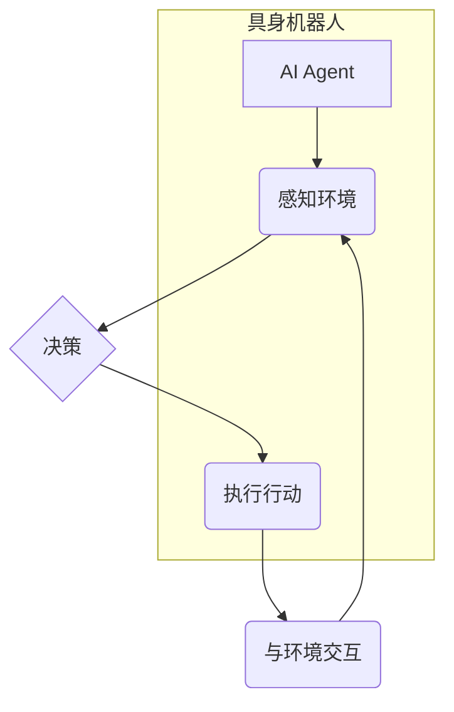

> AI Agent, 具身机器人, 强化学习, 深度学习, 自然语言处理, 计算机视觉, 人机交互, 智慧城市, 未来趋势

## 1. 背景介绍

人工智能（AI）技术近年来发展迅速，从语音识别、图像识别到自然语言处理等领域取得了突破性进展。然而，传统的AI模型大多局限于数字世界，缺乏与物理世界直接交互的能力。具身机器人作为AI技术的延伸，将AI与物理世界连接起来，使其能够感知、理解和操控物理环境，从而开辟了AI应用的新领域。

具身机器人是指具有物理实体、能够感知环境并与环境交互的机器人。与传统的软件AI不同，具身机器人需要具备以下关键能力：

* **感知能力:** 通过传感器收集环境信息，例如视觉、听觉、触觉等。
* **决策能力:** 基于感知信息，做出合理的行动决策。
* **执行能力:** 通过执行器控制身体运动，与环境进行交互。

## 2. 核心概念与联系

**2.1 AI Agent**

AI Agent是指能够感知环境、做出决策并执行行动的智能体。它是一个独立的实体，能够自主学习和适应环境变化。AI Agent的核心概念包括：

* **感知:** 收集环境信息。
* **推理:** 分析环境信息，做出决策。
* **行动:** 执行决策，改变环境状态。

**2.2 具身机器人**

具身机器人是具有物理实体的AI Agent。它通过传感器感知环境，并通过执行器控制身体运动，与环境进行交互。具身机器人的核心概念包括：

* **物理实体:** 具有的物理形态和结构。
* **传感器:** 收集环境信息。
* **执行器:** 控制身体运动。
* **控制系统:** 处理感知信息，做出决策并控制执行器。

**2.3 核心概念联系**

AI Agent是具身机器人的核心概念，它赋予了具身机器人自主学习和决策的能力。具身机器人通过传感器感知环境，并将感知信息传递给AI Agent进行处理。AI Agent根据环境信息做出决策，并通过执行器控制身体运动，与环境进行交互。



## 3. 核心算法原理 & 具体操作步骤

**3.1 算法原理概述**

具身机器人的核心算法主要包括强化学习、深度学习和自然语言处理等。

* **强化学习:** 是一种机器学习方法，通过奖励和惩罚机制，训练AI Agent在特定环境中学习最优策略。
* **深度学习:** 是一种基于多层神经网络的机器学习方法，能够学习复杂的数据模式，例如图像识别、语音识别等。
* **自然语言处理:** 是一种处理自然语言的计算机科学领域，能够理解和生成人类语言。

**3.2 算法步骤详解**

**3.2.1 强化学习**

1. **环境建模:** 建立一个模拟真实世界的环境模型。
2. **状态定义:** 定义环境中的状态，例如机器人位置、目标位置等。
3. **动作空间:** 定义机器人在每个状态下可以执行的动作，例如向前移动、向后移动等。
4. **奖励函数:** 定义一个奖励函数，根据机器人的行为和环境状态给予奖励或惩罚。
5. **策略学习:** 使用强化学习算法，例如Q学习或深度强化学习，训练AI Agent学习最优策略，即在每个状态下执行最优动作以获得最大奖励。

**3.2.2 深度学习**

1. **数据收集:** 收集大量相关数据，例如图像、语音等。
2. **数据预处理:** 对数据进行预处理，例如图像裁剪、语音降噪等。
3. **模型构建:** 使用深度学习框架，例如TensorFlow或PyTorch，构建深度神经网络模型。
4. **模型训练:** 使用训练数据训练深度神经网络模型，调整模型参数以最小化损失函数。
5. **模型评估:** 使用测试数据评估模型性能，例如准确率、召回率等。

**3.2.3 自然语言处理**

1. **文本预处理:** 对文本进行预处理，例如分词、词性标注等。
2. **词向量表示:** 将单词映射到向量空间，例如Word2Vec或GloVe。
3. **模型构建:** 使用自然语言处理模型，例如BERT或GPT-3，进行文本理解、生成等任务。
4. **模型训练:** 使用训练数据训练自然语言处理模型，调整模型参数以提高模型性能。
5. **模型评估:** 使用测试数据评估模型性能，例如准确率、BLEU分数等。

**3.3 算法优缺点**

* **强化学习:** 优点是能够学习复杂的行为策略，缺点是训练时间长，需要大量的训练数据。
* **深度学习:** 优点是能够学习复杂的数据模式，缺点是需要大量的计算资源和训练数据。
* **自然语言处理:** 优点是能够理解和生成人类语言，缺点是处理复杂语言场景仍然存在挑战。

**3.4 算法应用领域**

* **机器人控制:** 强化学习和深度学习可以用于训练机器人执行复杂的任务，例如导航、抓取、组装等。
* **人机交互:** 自然语言处理可以用于构建更自然的人机交互系统，例如语音助手、聊天机器人等。
* **智慧城市:** 具身机器人可以用于智慧城市建设，例如无人驾驶汽车、智能巡逻机器人等。

## 4. 数学模型和公式 & 详细讲解 & 举例说明

**4.1 数学模型构建**

强化学习中的核心数学模型是状态-动作-奖励（SARSA）模型。该模型将环境状态、动作和奖励表示为一个三元组（s, a, r）。

* **s:** 环境状态
* **a:** 机器人执行的动作
* **r:** 机器人执行动作后的奖励

**4.2 公式推导过程**

SARSA算法的目标是学习一个策略π(s)，该策略能够在每个状态s下选择最优动作a，以最大化累积奖励。

SARSA算法使用Bellman方程更新策略值函数Q(s, a)：

$$Q(s, a) = Q(s, a) + \alpha [r + \gamma \max_{a'} Q(s', a') - Q(s, a)]$$

其中：

* **α:** 学习率
* **γ:** 折扣因子
* **s':** 执行动作a后进入的下一个状态
* **a':** 在下一个状态s'下执行的最优动作

**4.3 案例分析与讲解**

假设一个机器人需要学习在迷宫中找到出口。

* **状态:** 机器人的位置
* **动作:** 向上、向下、向左、向右
* **奖励:** 找到出口时奖励1，其他情况下奖励0

使用SARSA算法，机器人可以学习一个策略，在每个位置选择最优方向移动，最终找到出口。

## 5. 项目实践：代码实例和详细解释说明

**5.1 开发环境搭建**

* 操作系统: Ubuntu 20.04
* Python 版本: 3.8
* 库依赖: TensorFlow, NumPy, OpenCV

**5.2 源代码详细实现**

```python
import tensorflow as tf
import numpy as np

# 定义状态空间和动作空间
state_space = 4  # 迷宫大小为4x4
action_space = 4  # 四个方向

# 定义Q网络
model = tf.keras.models.Sequential([
    tf.keras.layers.Dense(16, activation='relu', input_shape=(state_space,)),
    tf.keras.layers.Dense(action_space)
])

# 定义损失函数和优化器
loss_fn = tf.keras.losses.MeanSquaredError()
optimizer = tf.keras.optimizers.Adam(learning_rate=0.01)

# 训练Q网络
for episode in range(1000):
    state = np.random.randint(0, state_space, size=1)
    done = False
    while not done:
        # 选择动作
        action = tf.argmax(model(state)).numpy()

        # 执行动作并获取奖励和下一个状态
        reward = 0  # 奖励函数
        next_state = ...  # 根据动作更新状态

        # 更新Q值
        target = reward + 0.99 * tf.reduce_max(model(next_state))
        with tf.GradientTape() as tape:
            q_value = model(state)
            loss = loss_fn(target, q_value[0, action])
        gradients = tape.gradient(loss, model.trainable_variables)
        optimizer.apply_gradients(zip(gradients, model.trainable_variables))

        # 更新状态
        state = next_state

        # 检查是否完成
        done = ...

```

**5.3 代码解读与分析**

* 代码首先定义了状态空间和动作空间。
* 然后构建了一个Q网络，用于学习状态-动作对的价值函数。
* 使用SARSA算法训练Q网络，更新Q值以最大化累积奖励。
* 代码示例仅展示了基本框架，实际应用中需要根据具体场景进行调整。

**5.4 运行结果展示**

训练完成后，可以将训练好的Q网络应用于迷宫导航任务。通过观察机器人的行为，可以验证其是否能够找到出口。

## 6. 实际应用场景

**6.1 智能机器人**

* **服务机器人:** 用于酒店、餐厅、医院等场所提供服务，例如送餐、清洁、导览等。
* **工业机器人:** 用于工厂生产线进行自动化操作，例如焊接、喷漆、装配等。
* **医疗机器人:** 用于辅助医生进行手术、治疗、康复等。

**6.2 自动驾驶**

* **自动驾驶汽车:** 利用传感器感知环境信息，并通过算法控制车辆行驶。
* **无人机:** 用于物流运输、监控、农业等领域。

**6.3 智慧城市**

* **无人巡逻机器人:** 用于城市安全巡逻，例如监控公共场所、道路交通等。
* **智能垃圾车:** 自动识别垃圾类型，并进行分类收集。

**6.4 未来应用展望**

* **个人助理机器人:** 用于协助个人完成日常任务，例如家务、购物、陪伴等。
* **教育机器人:** 用于辅助教育教学，例如互动学习、实验演示等。
* **娱乐机器人:** 用于提供娱乐体验，例如游戏、表演等。

## 7. 工具和资源推荐

**7.1 学习资源推荐**

* **书籍:**
    * 《Reinforcement Learning: An Introduction》
    * 《Deep Learning》
    * 《Natural Language Processing with Python》
* **在线课程:**
    * Coursera: Reinforcement Learning Specialization
    * Udacity: Deep Learning Nanodegree
    * edX: Natural Language Processing

**7.2 开发工具推荐**

* **TensorFlow:** 深度学习框架
* **PyTorch:** 深度学习框架
* **ROS:** 机器人操作系统

**7.3 相关论文推荐**

* **AlphaGo:** DeepMind
* **GPT-3:** OpenAI
* **DALL-E:** OpenAI

## 8. 总结：未来发展趋势与挑战

**8.1 研究成果总结**

近年来，AI Agent和具身机器人的研究取得了显著进展，例如强化学习算法的改进、深度学习模型的突破、自然语言处理技术的进步等。这些成果为AI Agent和具身机器人的应用提供了强大的技术支撑。

**8.2 未来发展趋势**

* **更强大的AI算法:** 发展更强大的AI算法，例如迁移学习、联邦学习等，提高AI Agent的学习能力和泛化能力。
* **更丰富的感知能力:** 开发更先进的传感器技术，例如3D视觉、激光雷达等，增强AI Agent的感知能力。
* **更灵活的执行能力:** 研究更灵活的