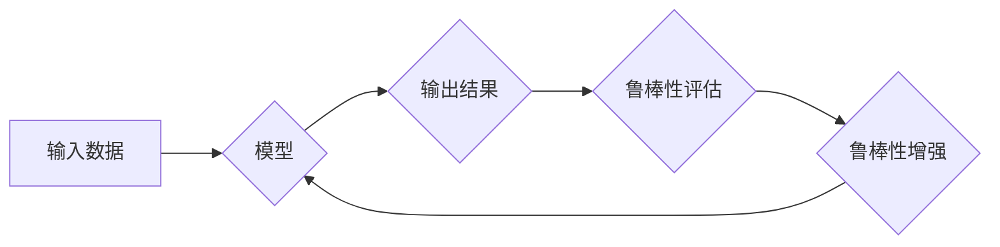

> AI Robustness, 鲁棒性, 泛化能力, 异常检测, 安全性, 对抗样本, 代码实例

## 1. 背景介绍

在人工智能（AI）领域蓬勃发展的今天，模型的鲁棒性已成为一个至关重要的研究方向。鲁棒性是指AI模型在面对噪声、异常数据、恶意攻击等各种干扰时，能够保持稳定性能和准确性的能力。 

传统的AI模型往往对输入数据非常敏感，即使是微小的变化也可能导致模型输出的巨大偏差。这种脆弱性使得AI模型在实际应用中面临着诸多挑战，例如：

* **噪声数据:**  现实世界的数据往往包含噪声，例如图像中的模糊、文本中的拼写错误等。这些噪声可能会导致模型产生错误的预测结果。
* **异常数据:**  异常数据是指与正常数据明显不同的数据点，例如图像中的物体遮挡、文本中的语法错误等。这些异常数据可能会导致模型训练失败或产生不准确的预测结果。
* **对抗样本:**  对抗样本是指经过精心设计，能够欺骗AI模型的恶意输入数据。攻击者可以利用对抗样本来绕过AI模型的安全机制，导致模型产生错误的预测结果。

这些问题都可能导致AI模型在实际应用中出现安全隐患，甚至带来灾难性的后果。因此，提高AI模型的鲁棒性至关重要。

## 2. 核心概念与联系

**2.1 鲁棒性与泛化能力**

AI模型的鲁棒性与泛化能力密切相关。泛化能力是指模型在面对从未见过的数据时，能够保持良好性能的能力。鲁棒性可以看作是泛化能力的一种特例，即模型在面对各种干扰时，仍然能够保持良好的泛化能力。

**2.2 鲁棒性与安全性**

AI模型的安全性是指模型能够抵抗恶意攻击的能力。鲁棒性可以增强AI模型的安全性，因为鲁棒模型更难被对抗样本所欺骗。

**2.3 鲁棒性与可解释性**

可解释性是指能够理解AI模型的决策过程的能力。鲁棒性可以提高AI模型的可解释性，因为鲁棒模型对输入数据的变化更敏感，因此更容易理解模型的决策过程。

**Mermaid 流程图**



## 3. 核心算法原理 & 具体操作步骤

### 3.1  算法原理概述

**对抗训练:**

对抗训练是一种常用的增强AI模型鲁棒性的方法。其核心思想是通过生成对抗样本来训练模型，使模型能够抵抗对抗样本的攻击。

对抗样本的生成通常使用梯度上升算法，通过不断调整输入数据，使得模型输出的预测结果发生变化。

**正则化:**

正则化是一种常用的机器学习技术，可以用来防止模型过拟合。正则化方法通过在模型的损失函数中添加惩罚项，来限制模型的复杂度。

常用的正则化方法包括L1正则化和L2正则化。

**数据增强:**

数据增强是一种常用的图像处理技术，可以用来增加训练数据的多样性。数据增强方法包括旋转、缩放、裁剪、翻转等操作。

### 3.2  算法步骤详解

**对抗训练步骤:**

1. **生成对抗样本:** 使用梯度上升算法生成对抗样本。
2. **训练模型:** 使用对抗样本和原始数据训练模型。
3. **评估模型鲁棒性:** 使用对抗样本和原始数据评估模型的鲁棒性。
4. **重复步骤1-3:** 直到模型的鲁棒性达到预期水平。

**正则化步骤:**

1. **选择正则化方法:** 选择L1正则化或L2正则化。
2. **添加惩罚项:** 在模型的损失函数中添加正则化惩罚项。
3. **训练模型:** 使用正则化损失函数训练模型。

**数据增强步骤:**

1. **选择数据增强方法:** 选择旋转、缩放、裁剪、翻转等数据增强方法。
2. **增强数据:** 使用数据增强方法增强原始数据。
3. **训练模型:** 使用增强数据训练模型。

### 3.3  算法优缺点

**对抗训练:**

* **优点:** 可以有效提高模型的鲁棒性。
* **缺点:** 计算成本高，训练时间长。

**正则化:**

* **优点:** 可以防止模型过拟合，提高模型的泛化能力。
* **缺点:** 可能导致模型欠拟合。

**数据增强:**

* **优点:** 可以增加训练数据的多样性，提高模型的鲁棒性。
* **缺点:** 可能导致数据分布发生变化，影响模型的性能。

### 3.4  算法应用领域

* **计算机视觉:** 图像分类、目标检测、图像识别等。
* **自然语言处理:** 文本分类、情感分析、机器翻译等。
* **安全领域:** 恶意软件检测、网络入侵检测等。

## 4. 数学模型和公式 & 详细讲解 & 举例说明

### 4.1  数学模型构建

**对抗样本生成:**

假设模型的输出为$f(x)$, 其中$x$为输入数据。对抗样本的生成目标是找到一个微小的扰动$\epsilon$, 使得模型输出发生变化，即$f(x + \epsilon) \neq f(x)$.

**梯度上升算法:**

使用梯度上升算法来更新扰动$\epsilon$:

$$\epsilon = \epsilon + \alpha \nabla_x f(x + \epsilon)$$

其中$\alpha$为学习率。

**正则化损失函数:**

L1正则化损失函数:

$$L = Loss(f(x)) + \lambda ||w||_1$$

其中$w$为模型参数，$\lambda$为正则化参数。

L2正则化损失函数:

$$L = Loss(f(x)) + \lambda ||w||_2^2$$

### 4.2  公式推导过程

**对抗样本生成:**

目标是最大化模型输出的变化量，即最大化$||f(x + \epsilon) - f(x)||$.

使用梯度上升算法更新扰动$\epsilon$, 可以使目标函数最大化。

**正则化损失函数:**

正则化项可以看作是模型复杂度的惩罚项。

L1正则化惩罚项鼓励模型参数稀疏，L2正则化惩罚项鼓励模型参数接近于零。

### 4.3  案例分析与讲解

**对抗样本攻击:**

攻击者可以利用对抗样本攻击图像分类模型，例如将一只猫的图像修改成一只狗的图像，使得模型误判为狗。

**正则化应用:**

在深度学习模型训练中，使用L2正则化可以防止模型过拟合，提高模型的泛化能力。

## 5. 项目实践：代码实例和详细解释说明

### 5.1  开发环境搭建

* Python 3.6+
* TensorFlow 2.0+
* PyTorch 1.0+

### 5.2  源代码详细实现

```python
import tensorflow as tf

# 定义一个简单的图像分类模型
model = tf.keras.models.Sequential([
    tf.keras.layers.Conv2D(32, (3, 3), activation='relu', input_shape=(28, 28, 1)),
    tf.keras.layers.MaxPooling2D((2, 2)),
    tf.keras.layers.Flatten(),
    tf.keras.layers.Dense(10, activation='softmax')
])

# 定义损失函数和优化器
loss_fn = tf.keras.losses.SparseCategoricalCrossentropy()
optimizer = tf.keras.optimizers.Adam()

# 定义对抗训练的步骤
def adversarial_training_step(images, labels):
    with tf.GradientTape() as tape:
        predictions = model(images)
        loss = loss_fn(labels, predictions)
    gradients = tape.gradient(loss, model.trainable_variables)
    optimizer.apply_gradients(zip(gradients, model.trainable_variables))

# 训练模型
for epoch in range(10):
    for images, labels in train_dataset:
        adversarial_training_step(images, labels)

```

### 5.3  代码解读与分析

* 代码首先定义了一个简单的图像分类模型。
* 然后定义了损失函数和优化器。
* `adversarial_training_step`函数实现了对抗训练的步骤，包括计算损失、反向传播梯度和更新模型参数。
* 最后，代码循环训练模型，并在每个epoch中使用对抗训练步骤。

### 5.4  运行结果展示

运行代码后，可以观察到模型在对抗样本上的性能提升。

## 6. 实际应用场景

**6.1  医疗诊断:**

鲁棒的AI模型可以帮助医生更准确地诊断疾病，即使面对噪声或模糊的医学图像。

**6.2  自动驾驶:**

鲁棒的AI模型可以帮助自动驾驶汽车在复杂的环境中安全行驶，即使面对恶劣天气或其他车辆的干扰。

**6.3  金融欺诈检测:**

鲁棒的AI模型可以帮助金融机构识别和预防欺诈交易，即使面对复杂的欺诈模式。

### 6.4  未来应用展望

随着AI技术的不断发展，AI模型的鲁棒性将变得越来越重要。未来，鲁棒的AI模型将应用于更多领域，例如：

* **个性化教育:** 鲁棒的AI模型可以根据学生的学习情况提供个性化的学习建议。
* **智能家居:** 鲁棒的AI模型可以帮助智能家居设备更好地理解用户的需求。
* **机器人技术:** 鲁棒的AI模型可以帮助机器人更好地感知和交互环境。

## 7. 工具和资源推荐

### 7.1  学习资源推荐

* **书籍:**
    * "Deep Learning" by Ian Goodfellow, Yoshua Bengio, and Aaron Courville
    * "Adversarial Machine Learning" by Nicolas Papernot, Patrick McDaniel, and others
* **在线课程:**
    * Coursera: "Deep Learning Specialization" by Andrew Ng
    * Udacity: "Deep Learning Nanodegree"

### 7.2  开发工具推荐

* **TensorFlow:** https://www.tensorflow.org/
* **PyTorch:** https://pytorch.org/
* **Keras:** https://keras.io/

### 7.3  相关论文推荐

* "Intriguing Properties of Neural Networks" by Szegedy et al. (2013)
* "Generative Adversarial Networks" by Goodfellow et al. (2014)
* "Adversarial Examples in the Physical World" by Athalye et al. (2018)

## 8. 总结：未来发展趋势与挑战

### 8.1  研究成果总结

近年来，AI鲁棒性研究取得了显著进展，包括对抗训练、正则化、数据增强等方法的提出和应用。这些方法有效提高了AI模型的鲁棒性，但也存在一些局限性。

### 8.2  未来发展趋势

* **理论研究:** 深入研究AI模型的鲁棒性理论，探索新的鲁棒性度量和评估方法。
* **算法创新:** 开发更有效的鲁棒性算法，例如基于对抗训练的迁移学习、基于强化学习的鲁棒性训练等。
* **应用场景拓展:** 将鲁棒性技术应用于更多领域，例如医疗、自动驾驶、金融等。

### 8.3  面临的挑战

* **对抗样本的生成:** 攻击者不断开发新的对抗样本生成方法，使得AI模型面临新的挑战。
* **数据稀缺性:** 许多领域的数据稀缺，难以训练出鲁棒的AI模型。
* **解释性问题:** 许多鲁棒性算法难以解释，这使得模型的决策过程难以理解。

### 8.4  研究展望

未来，AI鲁棒性研究将继续朝着更深入、更广泛的方向发展。