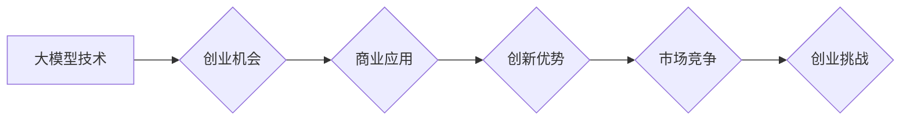

> AI大模型，创业，创新优势，商业应用，技术趋势，发展挑战

## 1. 背景介绍

人工智能（AI）技术近年来发展迅速，特别是大模型的涌现，为各行各业带来了前所未有的机遇。大模型是指参数规模庞大、训练数据海量的人工智能模型，具备强大的泛化能力和学习能力，能够在自然语言处理、计算机视觉、语音识别等领域取得突破性进展。

随着大模型技术的成熟，越来越多的创业者看到了其中的商机，纷纷涌入AI大模型领域。然而，仅仅拥有先进的技术并不能保证创业成功，如何将大模型的创新优势转化为商业价值，成为创业者面临的重大挑战。

## 2. 核心概念与联系

**2.1 AI大模型的定义与特点**

AI大模型是指参数规模庞大、训练数据海量的人工智能模型，其核心特点包括：

* **规模化：** 大模型拥有数亿甚至数十亿的参数，远超传统机器学习模型。
* **泛化能力强：** 由于训练数据量大，大模型能够更好地泛化到未知数据，表现出更强的适应性和鲁棒性。
* **多模态学习：** 一些大模型能够处理多种数据类型，例如文本、图像、音频等，实现跨模态的学习和理解。

**2.2 大模型的架构与训练**

大模型的架构通常基于Transformer网络，其特点是能够捕捉长距离依赖关系，并具有并行训练的优势。训练过程需要海量数据和强大的计算资源，通常采用分布式训练的方式。

**2.3 大模型的应用场景**

大模型在各个领域都有广泛的应用，例如：

* **自然语言处理：** 文本生成、机器翻译、问答系统、情感分析等。
* **计算机视觉：** 图像识别、物体检测、图像分割、视频分析等。
* **语音识别：** 语音转文本、语音合成、语音助手等。
* **其他领域：** 代码生成、药物研发、金融风险评估等。

**2.4 大模型创业的机遇与挑战**

大模型技术为创业者提供了巨大的机遇，但也面临着诸多挑战：

* **技术门槛高：** 大模型的开发和训练需要强大的技术实力和资源投入。
* **数据获取困难：** 大模型的训练需要海量高质量数据，而数据获取和标注成本高昂。
* **伦理风险：** 大模型可能存在偏见、歧视等伦理风险，需要谨慎对待。

**Mermaid 流程图**



## 3. 核心算法原理 & 具体操作步骤

**3.1 算法原理概述**

大模型的训练主要基于深度学习算法，其中Transformer网络是目前最主流的架构。Transformer网络的核心思想是利用注意力机制来捕捉文本序列中的长距离依赖关系，从而实现更准确的理解和生成。

**3.2 算法步骤详解**

大模型的训练过程可以概括为以下步骤：

1. **数据预处理：** 将原始数据进行清洗、格式化和编码，使其能够被模型理解。
2. **模型构建：** 根据任务需求选择合适的模型架构，并设置模型参数。
3. **模型训练：** 使用训练数据对模型进行训练，调整模型参数以最小化损失函数。
4. **模型评估：** 使用测试数据评估模型的性能，并根据评估结果进行模型调优。
5. **模型部署：** 将训练好的模型部署到实际应用场景中。

**3.3 算法优缺点**

**优点：**

* 泛化能力强：能够处理未知数据，表现出更强的适应性和鲁棒性。
* 准确率高：在许多任务中，大模型能够取得比传统模型更高的准确率。
* 多模态学习：一些大模型能够处理多种数据类型，实现跨模态的学习和理解。

**缺点：**

* 计算资源消耗大：训练大模型需要大量的计算资源和时间。
* 数据依赖性强：大模型的性能取决于训练数据的质量和数量。
* 训练成本高：训练大模型需要投入大量的资金和人力资源。

**3.4 算法应用领域**

大模型的应用领域非常广泛，包括：

* 自然语言处理：文本生成、机器翻译、问答系统、情感分析等。
* 计算机视觉：图像识别、物体检测、图像分割、视频分析等。
* 语音识别：语音转文本、语音合成、语音助手等。
* 其他领域：代码生成、药物研发、金融风险评估等。

## 4. 数学模型和公式 & 详细讲解 & 举例说明

**4.1 数学模型构建**

大模型的训练过程本质上是一个优化问题，目标是找到最优的模型参数，使得模型在训练数据上的损失函数最小。损失函数通常采用交叉熵损失函数或均方误差损失函数。

**4.2 公式推导过程**

交叉熵损失函数的公式如下：

$$
H(p, q) = -\sum_{i=1}^{n} p(i) \log q(i)
$$

其中：

* $p(i)$ 是真实标签的概率分布。
* $q(i)$ 是模型预测的概率分布。

**4.3 案例分析与讲解**

假设我们训练一个文本分类模型，目标是将文本分类为正类或负类。训练数据包含1000个文本样本，每个样本都有对应的标签。模型预测的概率分布为：

* 正类概率：0.7
* 负类概率：0.3

真实标签为正类，则交叉熵损失函数的值为：

$$
H(p, q) = -1 \log 0.7 = 0.3567
$$

**4.4 举例说明**

在图像识别任务中，大模型会将图像转换为特征向量，然后将特征向量输入到分类器中进行分类。分类器通常采用softmax函数将特征向量映射到各个类别的概率分布。

**4.5 数学模型的应用**

数学模型在AI大模型的开发和应用中扮演着至关重要的角色，例如：

* 模型架构设计：数学模型可以帮助我们设计更有效的模型架构，例如Transformer网络的注意力机制。
* 损失函数设计：数学模型可以帮助我们设计更合适的损失函数，例如交叉熵损失函数和均方误差损失函数。
* 模型优化：数学模型可以帮助我们设计更有效的模型优化算法，例如梯度下降算法。

## 5. 项目实践：代码实例和详细解释说明

**5.1 开发环境搭建**

* 操作系统：Linux
* Python版本：3.7+
* 深度学习框架：TensorFlow或PyTorch
* GPU：NVIDIA GeForce GTX 1080 Ti或更高

**5.2 源代码详细实现**

```python
import tensorflow as tf

# 定义模型架构
model = tf.keras.Sequential([
    tf.keras.layers.Embedding(input_dim=10000, output_dim=128),
    tf.keras.layers.LSTM(units=128),
    tf.keras.layers.Dense(units=2, activation='softmax')
])

# 编译模型
model.compile(optimizer='adam',
              loss='sparse_categorical_crossentropy',
              metrics=['accuracy'])

# 训练模型
model.fit(x_train, y_train, epochs=10)

# 评估模型
loss, accuracy = model.evaluate(x_test, y_test)
print('Loss:', loss)
print('Accuracy:', accuracy)
```

**5.3 代码解读与分析**

* 代码首先定义了一个简单的文本分类模型，模型架构包括嵌入层、LSTM层和全连接层。
* 嵌入层将单词转换为向量表示。
* LSTM层用于捕捉文本序列中的长距离依赖关系。
* 全连接层将LSTM层的输出映射到各个类别的概率分布。
* 模型使用Adam优化器、交叉熵损失函数和准确率作为评估指标。
* 训练模型后，可以使用测试数据评估模型的性能。

**5.4 运行结果展示**

训练完成后，可以查看模型的损失函数值和准确率。

## 6. 实际应用场景

**6.1 自然语言处理**

* **文本生成：** 大模型可以用于生成高质量的文本，例如小说、诗歌、新闻报道等。
* **机器翻译：** 大模型可以实现更准确、更流畅的机器翻译，例如英语到中文的翻译。
* **问答系统：** 大模型可以理解用户的问题，并从知识库中找到答案，构建智能问答系统。

**6.2 计算机视觉**

* **图像识别：** 大模型可以识别图像中的物体、场景和人物，例如自动驾驶汽车中的物体检测。
* **图像分割：** 大模型可以将图像分割成不同的区域，例如医学图像的器官分割。
* **视频分析：** 大模型可以分析视频内容，例如识别视频中的动作和事件。

**6.3 语音识别**

* **语音转文本：** 大模型可以将语音转换为文本，例如语音助手和实时字幕。
* **语音合成：** 大模型可以将文本转换为语音，例如语音播报和虚拟助手。

**6.4 其他领域**

* **代码生成：** 大模型可以根据自然语言描述生成代码，例如自动生成网页代码。
* **药物研发：** 大模型可以用于预测药物的活性，加速药物研发过程。
* **金融风险评估：** 大模型可以分析金融数据，识别潜在的风险。

**6.5 未来应用展望**

随着大模型技术的不断发展，其应用场景将更加广泛，例如：

* **个性化教育：** 根据学生的学习情况，提供个性化的学习内容和辅导。
* **智能医疗：** 辅助医生诊断疾病、制定治疗方案。
* **智慧城市：** 利用大模型分析城市数据，提高城市管理效率。

## 7. 工具和资源推荐

**7.1 学习资源推荐**

* **书籍：**
    * 《深度学习》
    * 《自然语言处理》
    * 《计算机视觉》
* **在线课程：**
    * Coursera
    * edX
    * Udacity

**7.2 开发工具推荐**

* **深度学习框架：** TensorFlow、PyTorch
* **编程语言：** Python
* **云计算平台：** AWS、Google Cloud、Azure

**7.3 相关论文推荐**

* **Transformer网络：** Attention Is All You Need
* **BERT模型：** BERT: Pre-training of Deep Bidirectional Transformers for Language Understanding
* **GPT模型：** Generative Pre-trained Transformer

## 8. 总结：未来发展趋势与挑战

**8.1 研究成果总结**

近年来，大模型技术取得了显著进展，在自然语言处理、计算机视觉、语音识别等领域取得了突破性进展。大模型的出现，标志着人工智能进入了一个新的时代。

**8.2 未来发展趋势**

* **模型规模化：** 大模型的规模将继续扩大，参数量将达到数千亿甚至万亿级别。
* **多模态学习：** 大模型将能够处理多种数据类型，实现跨模态的学习和理解。
* **可解释性：** 研究人员将致力于提高大模型的可解释性，使其决策过程更加透明。
* **安全性和隐私性：** 大模型的安全性和隐私性将成为研究的重点，确保大模型的负责任使用。

**8.3 面临的挑战**

* **计算资源需求：** 训练大模型需要大量的计算资源，这对于资源有限的机构和个人来说是一个挑战。
* **数据获取困难：** 大模型的训练需要海量高质量数据，而数据获取和标注成本高昂。
* **伦理风险：** 大模型可能存在偏见、歧视等伦理风险，需要谨慎对待。

**8.4 研究展望**

未来，大模型技术将继续发展，并应用于更多领域，为人类社会