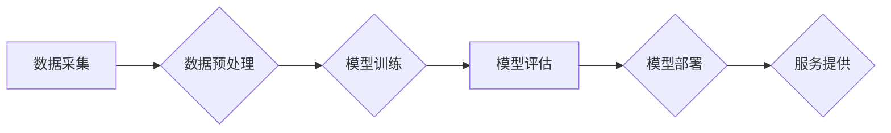

> AI大模型，创业，竞争优势，商业应用，技术趋势，市场机会

## 1. 背景介绍

近年来，人工智能（AI）技术取得了飞速发展，特别是大模型的涌现，为各行各业带来了前所未有的机遇。大模型是指参数规模庞大、训练数据海量的人工智能模型，具备强大的泛化能力和学习能力，能够在自然语言处理、计算机视觉、语音识别等领域取得突破性进展。

随着大模型技术的成熟，越来越多的创业者看到了其中的商机，纷纷涌入AI大模型领域。然而，AI大模型创业并非易事，需要具备强大的技术实力、丰富的行业经验以及敏锐的市场洞察力。

## 2. 核心概念与联系

**2.1 AI大模型的定义与特点**

AI大模型是指参数规模庞大、训练数据海量的人工智能模型，其核心特点包括：

* **规模化：** 大模型拥有数亿甚至数十亿的参数，使其能够学习更复杂的模式和关系。
* **泛化能力强：** 由于训练数据量大，大模型能够更好地泛化到未知的数据集，表现出更强的适应性和鲁棒性。
* **多任务学习：** 大模型可以同时学习多个任务，例如文本生成、图像识别、语音翻译等，提高了效率和灵活性。

**2.2 大模型的架构与训练**

大模型的架构通常基于深度学习，常见的有 Transformer、BERT、GPT 等。训练过程需要海量数据和强大的计算资源，通常采用分布式训练技术。

**2.3 大模型的商业价值**

大模型可以应用于各个领域，例如：

* **自然语言处理：** 文本生成、机器翻译、问答系统、情感分析等。
* **计算机视觉：** 图像识别、物体检测、图像分割、视频分析等。
* **语音识别：** 语音转文本、语音合成、语音助手等。
* **推荐系统：** 商品推荐、内容推荐、个性化服务等。

**2.4 大模型创业的机遇与挑战**

大模型创业机遇巨大，但也面临着诸多挑战：

* **技术门槛高：** 需要具备强大的AI技术实力和丰富的经验。
* **数据资源匮乏：** 训练大模型需要海量数据，获取高质量数据是一个难题。
* **计算资源成本高：** 训练大模型需要强大的计算资源，成本较高。
* **伦理风险：** 大模型可能存在偏见、歧视等伦理风险，需要谨慎对待。

**Mermaid 流程图**



## 3. 核心算法原理 & 具体操作步骤

**3.1 算法原理概述**

大模型的训练主要基于深度学习算法，其中 Transformer 架构是目前最流行的模型架构之一。Transformer 架构的核心是注意力机制，它能够学习文本中的长距离依赖关系，从而提高模型的理解能力和生成能力。

**3.2 算法步骤详解**

1. **数据预处理：** 将原始数据进行清洗、格式化、编码等操作，使其能够被模型理解。
2. **模型构建：** 根据任务需求选择合适的模型架构，例如 Transformer、BERT 等。
3. **模型训练：** 使用训练数据训练模型，调整模型参数，使其能够准确地完成任务。
4. **模型评估：** 使用测试数据评估模型的性能，例如准确率、召回率、F1-score 等。
5. **模型部署：** 将训练好的模型部署到生产环境中，提供服务。

**3.3 算法优缺点**

**优点：**

* 泛化能力强
* 能够学习长距离依赖关系
* 多任务学习能力强

**缺点：**

* 计算资源消耗大
* 训练时间长
* 数据依赖性强

**3.4 算法应用领域**

* 自然语言处理：文本生成、机器翻译、问答系统、情感分析等。
* 计算机视觉：图像识别、物体检测、图像分割、视频分析等。
* 语音识别：语音转文本、语音合成、语音助手等。
* 推荐系统：商品推荐、内容推荐、个性化服务等。

## 4. 数学模型和公式 & 详细讲解 & 举例说明

**4.1 数学模型构建**

大模型的训练过程可以看作是一个优化问题，目标是找到最优的参数，使得模型在训练数据上的损失函数最小。损失函数通常是模型预测值与真实值的差值，例如均方误差（MSE）或交叉熵损失（Cross-Entropy Loss）。

**4.2 公式推导过程**

假设模型的输出为 $y$，真实值是 $t$，损失函数为 $L(y,t)$，则模型的训练目标是：

$$
\min_{\theta} \mathcal{L}(\theta) = \frac{1}{N} \sum_{i=1}^{N} L(y_i, t_i)
$$

其中，$\theta$ 是模型的参数，$N$ 是训练数据的数量。

**4.3 案例分析与讲解**

例如，在文本生成任务中，可以使用交叉熵损失函数来衡量模型预测的文本与真实文本之间的差异。交叉熵损失函数的公式如下：

$$
L(y, t) = -\sum_{i=1}^{M} t_i \log(y_i)
$$

其中，$M$ 是文本的长度，$t_i$ 是真实文本的第 $i$ 个词的概率分布，$y_i$ 是模型预测的第 $i$ 个词的概率分布。

## 5. 项目实践：代码实例和详细解释说明

**5.1 开发环境搭建**

* 操作系统：Linux
* Python 版本：3.7+
* 深度学习框架：TensorFlow 或 PyTorch
* 其他依赖库：numpy、pandas、matplotlib 等

**5.2 源代码详细实现**

```python
import tensorflow as tf

# 定义模型架构
model = tf.keras.Sequential([
    tf.keras.layers.Embedding(input_dim=vocab_size, output_dim=embedding_dim),
    tf.keras.layers.LSTM(units=hidden_size),
    tf.keras.layers.Dense(units=vocab_size, activation='softmax')
])

# 编译模型
model.compile(optimizer='adam', loss='sparse_categorical_crossentropy', metrics=['accuracy'])

# 训练模型
model.fit(x_train, y_train, epochs=10, batch_size=32)

# 评估模型
loss, accuracy = model.evaluate(x_test, y_test)
print('Loss:', loss)
print('Accuracy:', accuracy)
```

**5.3 代码解读与分析**

* 代码首先定义了模型架构，使用 Embedding 层将词向量化，LSTM 层学习文本的上下文信息，Dense 层输出每个词的概率分布。
* 然后编译模型，使用 Adam 优化器、交叉熵损失函数和准确率作为评估指标。
* 最后训练模型，评估模型的性能。

**5.4 运行结果展示**

训练完成后，可以将模型部署到生产环境中，用于文本生成、机器翻译等任务。

## 6. 实际应用场景

**6.1 自然语言处理**

* **文本生成：** 大模型可以用于生成各种类型的文本，例如小说、诗歌、新闻报道等。
* **机器翻译：** 大模型可以实现高质量的机器翻译，跨越语言障碍。
* **问答系统：** 大模型可以理解自然语言问题，并给出准确的答案。
* **情感分析：** 大模型可以分析文本的情感倾向，例如正面、负面、中性等。

**6.2 计算机视觉**

* **图像识别：** 大模型可以识别图像中的物体、场景、人物等。
* **物体检测：** 大模型可以定位图像中的物体，并识别物体的类别。
* **图像分割：** 大模型可以将图像分割成不同的区域，例如前景和背景。
* **视频分析：** 大模型可以分析视频内容，例如识别动作、跟踪物体等。

**6.3 语音识别**

* **语音转文本：** 大模型可以将语音转换为文本，例如语音助手、会议记录等。
* **语音合成：** 大模型可以将文本转换为语音，例如语音播报、虚拟助手等。
* **语音助手：** 大模型可以理解用户的语音指令，并执行相应的操作。

**6.4 未来应用展望**

大模型的应用场景还在不断扩展，未来将应用于更多领域，例如：

* **医疗保健：** 辅助诊断、预测疾病风险、个性化治疗等。
* **教育：** 智能辅导、个性化学习、自动批改作业等。
* **金融：** 风险评估、欺诈检测、投资决策等。
* **制造业：** 自动化生产、质量控制、预测维护等。

## 7. 工具和资源推荐

**7.1 学习资源推荐**

* **书籍：**
    * 《深度学习》
    * 《自然语言处理》
    * 《机器学习》
* **在线课程：**
    * Coursera
    * edX
    * Udacity
* **博客和论坛：**
    * TensorFlow Blog
    * PyTorch Blog
    * Kaggle

**7.2 开发工具推荐**

* **深度学习框架：** TensorFlow、PyTorch
* **编程语言：** Python
* **云计算平台：** AWS、Azure、GCP

**7.3 相关论文推荐**

* Attention Is All You Need
* BERT: Pre-training of Deep Bidirectional Transformers for Language Understanding
* GPT-3: Language Models are Few-Shot Learners

## 8. 总结：未来发展趋势与挑战

**8.1 研究成果总结**

近年来，AI大模型取得了显著进展，在自然语言处理、计算机视觉等领域取得了突破性进展。大模型的泛化能力强、多任务学习能力强，为各行各业带来了新的机遇。

**8.2 未来发展趋势**

* **模型规模化：** 大模型的规模将继续扩大，参数数量将达到数万亿甚至更多。
* **多模态学习：** 大模型将学习多种模态数据，例如文本、图像、音频等，实现跨模态理解和生成。
* **可解释性增强：** 研究人员将致力于提高大模型的可解释性，使其决策过程更加透明和可理解。
* **边缘计算：** 大模型将部署到边缘设备，实现更低延迟、更高效率的应用。

**8.3 面临的挑战**

* **数据安全和隐私：** 大模型的训练需要海量数据，如何保证数据安全和隐私是一个重要挑战。
* **计算资源消耗：** 大模型的训练和部署需要大量的计算资源，如何降低计算成本是一个关键问题。
* **伦理风险：** 大模型可能存在偏见、歧视等伦理风险，需要谨慎对待。

**8.4 研究展望**

未来，AI大模型研究将继续深入，探索更强大的模型架构、更有效的训练方法、更广泛的应用场景。


## 9. 附录：常见问题与解答

**9.1 如何选择合适的AI大模型？**

选择合适的AI大模型需要根据具体的应用场景和需求进行评估。需要考虑模型的规模、性能、训练数据、部署环境等因素。

**9.2 如何训练自己的AI大模型？**

训练自己的AI大模型需要具备一定的技术能力和资源。需要准备海量数据、强大的计算资源、专业的开发工具和经验丰富的团队。

**9.3 如何部署AI大模型？**

部署AI大模型可以采用云计算、边缘计算等方式。需要根据模型的规模、性能和应用场景选择合适的部署方式。

**9.4 如何评估AI大模型的性能？**

评估AI大模型的性能需要使用相应的指标，例如准确率、召回率、F1-score等。需要根据具体的应用场景选择合适的评估指标。


作者：禅与计算机程序设计艺术 / Zen