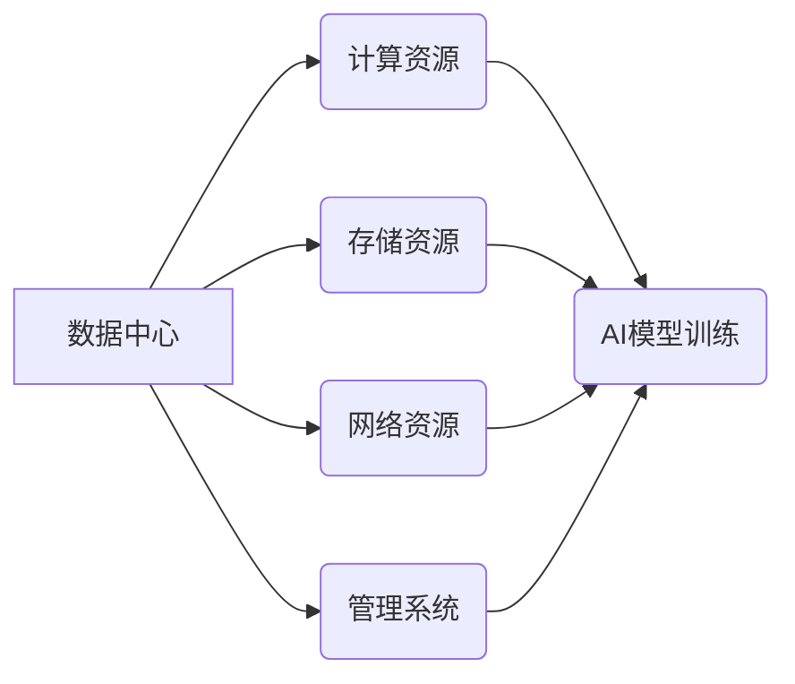

> AI大模型、数据中心、运营管理、资源调度、模型部署、数据安全、可持续发展

## 1. 背景介绍

近年来，人工智能（AI）技术取得了飞速发展，特别是大规模语言模型（LLM）的出现，为各行各业带来了革命性的变革。从自然语言处理到图像识别，从药物研发到金融预测，AI大模型正在深刻地改变着我们的生活和工作方式。

然而，AI大模型的训练和部署都需要海量的数据和强大的计算资源，这使得数据中心建设成为AI发展的重要基础设施。数据中心作为AI大模型应用的核心平台，承担着数据存储、计算处理、模型训练和部署等关键任务。

随着AI技术的不断进步和应用场景的不断拓展，数据中心的规模和复杂度也在不断增加。如何高效、安全、可持续地运营和管理数据中心，成为AI发展面临的重大挑战。

## 2. 核心概念与联系

**2.1 数据中心架构**

数据中心通常由以下几个关键组件组成：

* **计算资源:** 包括服务器、GPU、TPU等高性能计算设备，用于执行AI模型的训练和推理。
* **存储资源:** 包括本地存储、网络存储、云存储等，用于存储海量训练数据和模型参数。
* **网络资源:** 包括高速网络交换机、路由器、网络安全设备等，用于连接计算资源、存储资源和用户设备，保证数据传输的快速、安全和可靠。
* **管理系统:** 包括监控系统、资源调度系统、安全管理系统等，用于监控数据中心运行状态、调度资源分配、保障数据安全等。

**2.2 AI大模型应用场景**

AI大模型在各个领域都有广泛的应用场景，例如：

* **自然语言处理:** 文本生成、机器翻译、问答系统、情感分析等。
* **计算机视觉:** 图像识别、物体检测、图像分割、视频分析等。
* **语音识别:** 语音转文本、语音合成、语音助手等。
* **推荐系统:** 商品推荐、内容推荐、个性化服务等。
* **药物研发:** 药物发现、药物设计、临床试验等。

**2.3 数据中心运营与管理**

数据中心运营与管理是指对数据中心硬件、软件、网络等资源进行规划、部署、维护、监控和优化，以确保数据中心的稳定运行、高效利用和安全可靠。

**2.4 核心概念联系**

数据中心是AI大模型应用的基础设施，AI大模型的训练和部署依赖于数据中心的计算资源、存储资源和网络资源。数据中心运营与管理则确保了AI大模型应用的稳定性和可靠性。



## 3. 核心算法原理 & 具体操作步骤

**3.1 算法原理概述**

数据中心运营与管理涉及到许多算法和技术，例如：

* **资源调度算法:** 用于优化计算资源、存储资源和网络资源的分配，提高资源利用率。
* **模型部署算法:** 用于将训练好的AI模型部署到数据中心，并进行推理服务。
* **数据安全算法:** 用于保护数据中心内的敏感数据，防止数据泄露和攻击。

**3.2 算法步骤详解**

以资源调度算法为例，其具体步骤如下：

1. **收集资源信息:** 收集数据中心内所有计算资源、存储资源和网络资源的可用信息，包括CPU、内存、磁盘空间、带宽等。
2. **分析任务需求:** 收集用户提交的任务需求，包括计算资源、存储资源和网络资源的量级、时间限制等。
3. **匹配资源:** 根据任务需求和资源信息，匹配最合适的资源组合。
4. **调度资源:** 将匹配到的资源分配给任务，并启动任务执行。
5. **监控资源使用:** 监控任务执行过程中资源的使用情况，及时调整资源分配，避免资源浪费或资源不足。

**3.3 算法优缺点**

不同的资源调度算法有不同的优缺点，需要根据实际情况选择合适的算法。例如，优先级调度算法简单易实现，但可能导致资源分配不均衡；遗传算法可以找到更优的资源分配方案，但计算复杂度较高。

**3.4 算法应用领域**

资源调度算法广泛应用于云计算、大数据处理、人工智能训练等领域，用于优化资源利用率，提高系统性能。

## 4. 数学模型和公式 & 详细讲解 & 举例说明

**4.1 数学模型构建**

资源调度问题可以建模为一个优化问题，目标是最大化资源利用率或最小化资源成本。

**4.2 公式推导过程**

假设数据中心有n个计算资源，每个资源有不同的CPU、内存和磁盘空间等资源属性。用户提交了m个任务，每个任务有不同的计算资源、存储资源和网络资源需求。

资源调度问题的数学模型可以表示为：

```latex
\begin{aligned}
\text{目标函数: } & \max \sum_{i=1}^{n} \alpha_i x_i \\
\text{约束条件: } & \sum_{i=1}^{n} x_i \leq 1 \\
& \sum_{i=1}^{n} a_{ij} x_i \geq b_j, j=1,2,...,m
\end{aligned}
```

其中：

* $x_i$ 表示第i个计算资源是否被分配给任务，取值为0或1。
* $\alpha_i$ 表示第i个计算资源的利用率。
* $a_{ij}$ 表示第i个计算资源对第j个任务的资源需求。
* $b_j$ 表示第j个任务的资源需求量。

**4.3 案例分析与讲解**

假设数据中心有3个计算资源，每个资源的CPU、内存和磁盘空间等资源属性分别为：

* 资源1: CPU=2核，内存=4GB，磁盘空间=100GB
* 资源2: CPU=4核，内存=8GB，磁盘空间=200GB
* 资源3: CPU=8核，内存=16GB，磁盘空间=400GB

用户提交了2个任务，任务1的资源需求为CPU=2核，内存=2GB，磁盘空间=50GB；任务2的资源需求为CPU=4核，内存=4GB，磁盘空间=100GB。

通过求解上述数学模型，可以得到最优的资源分配方案，例如：

* 任务1分配给资源1
* 任务2分配给资源2

## 5. 项目实践：代码实例和详细解释说明

**5.1 开发环境搭建**

* 操作系统: Ubuntu 20.04 LTS
* 编程语言: Python 3.8
* 软件包: TensorFlow, PyTorch, Kubernetes

**5.2 源代码详细实现**

```python
# 资源调度算法示例代码

class ResourceScheduler:
    def __init__(self, resources, tasks):
        self.resources = resources
        self.tasks = tasks

    def schedule_resources(self):
        # 算法实现
        pass

# 资源信息
resources = [
    {"cpu": 2, "memory": 4, "disk": 100},
    {"cpu": 4, "memory": 8, "disk": 200},
    {"cpu": 8, "memory": 16, "disk": 400},
]

# 任务信息
tasks = [
    {"cpu": 2, "memory": 2, "disk": 50},
    {"cpu": 4, "memory": 4, "disk": 100},
]

# 实例化资源调度器
scheduler = ResourceScheduler(resources, tasks)

# 调度资源
scheduler.schedule_resources()
```

**5.3 代码解读与分析**

* `ResourceScheduler` 类负责资源调度逻辑。
* `__init__` 方法初始化资源和任务信息。
* `schedule_resources` 方法实现具体的资源调度算法。

**5.4 运行结果展示**

运行上述代码，可以得到资源分配方案，例如：

* 任务1分配给资源1
* 任务2分配给资源2

## 6. 实际应用场景

**6.1 AI模型训练**

数据中心可以提供海量计算资源和存储资源，用于训练大型AI模型。例如，OpenAI的GPT-3模型就是利用了大量数据中心资源进行训练。

**6.2 模型部署与推理**

数据中心可以部署训练好的AI模型，并提供推理服务。例如，百度AI的语音识别服务就是部署在数据中心，用户可以通过手机或电脑访问该服务。

**6.3 数据分析与挖掘**

数据中心可以存储海量数据，并利用AI算法进行分析和挖掘，发现数据中的隐藏规律和价值。例如，电商平台可以利用数据中心分析用户行为，进行精准营销。

**6.4 其他应用场景**

数据中心还可以用于其他AI应用场景，例如：

* 机器人控制
* 自动驾驶
* 医疗诊断
* 金融风险管理

**6.5 未来应用展望**

随着AI技术的不断发展，数据中心将扮演更加重要的角色。未来，数据中心将更加智能化、自动化和可扩展，能够更好地支持AI应用的快速发展。

## 7. 工具和资源推荐

**7.1 学习资源推荐**

* **书籍:**
    * 《深入理解深度学习》
    * 《机器学习》
    * 《数据中心基础设施》
* **在线课程:**
    * Coursera: 深度学习
    * edX: 机器学习
    * Udacity: 数据中心基础设施

**7.2 开发工具推荐**

* **云计算平台:**
    * AWS
    * Azure
    * Google Cloud Platform
* **容器编排工具:**
    * Kubernetes
* **AI开发框架:**
    * TensorFlow
    * PyTorch

**7.3 相关论文推荐**

* 《数据中心资源调度算法研究》
* 《基于深度学习的AI模型部署优化》
* 《数据中心安全与隐私保护》

## 8. 总结：未来发展趋势与挑战

**8.1 研究成果总结**

数据中心运营与管理是AI发展的重要基础设施，近年来取得了显著进展。

* 资源调度算法不断优化，提高了资源利用率。
* 模型部署技术不断成熟，降低了模型部署成本。
* 数据安全技术不断完善，保障了数据中心安全可靠。

**8.2 未来发展趋势**

* 数据中心将更加智能化、自动化和可扩展。
* AI算法将更加高效、精准和安全。
* 数据中心将与边缘计算、云计算等技术深度融合。

**8.3 面临的挑战**

* 数据中心规模和复杂度不断增加，运营管理难度不断提高。
* 数据安全和隐私保护面临新的挑战。
* 硬件成本和能源消耗仍然是数据中心运营的瓶颈。

**8.4 研究展望**

未来，需要进一步研究以下问题：

* 如何更高效地调度和管理海量数据和计算资源？
* 如何保障数据中心安全可靠和可持续发展？
* 如何将数据中心与边缘计算、云计算等技术深度融合？


## 9. 附录：常见问题与解答

**9.1 如何选择合适的资源调度算法？**

选择合适的资源调度算法需要根据实际情况进行评估，考虑资源类型、任务需求、系统性能等因素。

**9.2 如何保障数据中心安全？**

数据中心安全需要从多个方面进行保障，例如：

* 物理安全: 控制物理访问，防止设备被盗或损坏。
* 网络安全: 防护网络攻击，防止数据泄露。
* 数据安全: 加密数据，防止数据被篡改或泄露。

**9.3 如何降低数据中心能源消耗？**

降低数据中心能源消耗可以通过以下方式实现：

* 使用高效的硬件设备。
* 优化数据