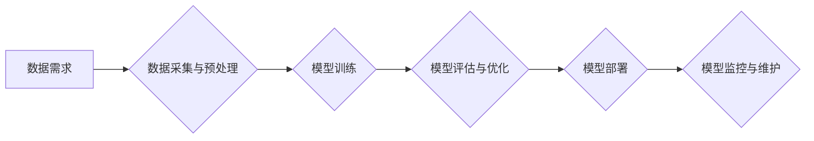

> AI大模型、数据中心、敏捷开发、云计算、容器化、微服务、自动化部署

## 1. 背景介绍

近年来，人工智能（AI）技术蓬勃发展，大规模语言模型（LLM）的出现更是掀起了AI应用的新浪潮。从ChatGPT的爆火到各种AI辅助工具的广泛应用，AI已经深刻地改变着我们的生活和工作方式。

然而，部署和管理这些庞大的AI模型也带来了新的挑战。传统的软件开发模式难以满足AI模型的特殊需求，例如海量数据处理、高并发计算和实时响应等。因此，我们需要一种新的开发模式来应对这些挑战，以加速AI模型的开发和部署。

敏捷开发是一种迭代式、增量式软件开发方法，强调快速反馈、持续改进和团队协作。它在传统软件开发领域取得了成功，也逐渐被应用于AI领域。

## 2. 核心概念与联系

**2.1 敏捷开发原则**

敏捷开发的核心原则包括：

* **个人与交互胜于流程与工具:** 强调团队合作和沟通的重要性。
* **工作软件胜于详尽文档:** 关注实际可用的软件产品，而不是冗长的文档。
* **客户合作胜于合同谈判:** 强调与客户紧密合作，根据客户需求不断迭代改进产品。
* **响应变化胜于遵循计划:** 适应变化是敏捷开发的关键，允许在开发过程中根据需求进行调整。

**2.2 AI大模型应用数据中心架构**

AI大模型应用数据中心通常由以下几个关键组件组成：

* **计算资源:** 包括CPU、GPU、TPU等高性能计算设备，用于训练和推理AI模型。
* **存储资源:** 用于存储海量训练数据、模型参数和中间结果。
* **网络资源:** 提供高带宽、低延迟的网络连接，支持数据传输和模型部署。
* **管理平台:** 用于监控、管理和调度数据中心资源，以及部署和管理AI模型。

**2.3 敏捷开发与AI大模型应用数据中心**

敏捷开发原则可以有效地应用于AI大模型应用数据中心的开发和部署。

* **强调团队协作:** AI模型的开发是一个跨学科的项目，需要数据科学家、软件工程师、系统管理员等多方协作。敏捷开发强调团队合作，可以促进不同团队成员之间的沟通和协作。
* **快速迭代:** AI模型的训练和测试是一个迭代的过程，需要不断地根据实验结果进行调整。敏捷开发的迭代开发模式可以加速这个过程，更快地获得可用的模型。
* **持续改进:** AI模型的性能可以不断地提升，敏捷开发的持续改进理念可以帮助我们不断优化模型，提高其准确性和效率。

**2.4  Mermaid 流程图**



## 3. 核心算法原理 & 具体操作步骤

### 3.1  算法原理概述

**3.1.1  深度学习算法**

深度学习算法是目前AI领域最主流的算法之一，它利用多层神经网络来模拟人类大脑的学习过程。

**3.1.2  Transformer模型**

Transformer模型是一种新型的深度学习架构，它通过自注意力机制来捕捉文本序列中的长距离依赖关系，在自然语言处理任务中取得了显著的成果。

### 3.2  算法步骤详解

**3.2.1  数据准备**

* 数据收集：收集相关领域的海量文本数据。
* 数据清洗：去除数据中的噪声、重复数据和错误数据。
* 数据预处理：将文本数据转换为模型可以理解的格式，例如词嵌入。

**3.2.2  模型训练**

* 选择合适的深度学习框架，例如TensorFlow或PyTorch。
* 定义模型结构，包括神经网络层数、节点数量和激活函数等。
* 使用训练数据训练模型，并根据损失函数进行参数更新。

**3.2.3  模型评估**

* 使用验证集评估模型的性能，例如准确率、召回率和F1-score。
* 根据评估结果调整模型参数和结构，进行模型优化。

**3.2.4  模型部署**

* 将训练好的模型部署到生产环境中，例如云服务器或边缘设备。
* 设计API接口，方便其他应用程序调用模型进行预测。

### 3.3  算法优缺点

**优点:**

* 能够处理海量文本数据，学习复杂的语言模式。
* 在自然语言处理任务中取得了显著的成果。

**缺点:**

* 训练成本高，需要大量的计算资源和时间。
* 模型解释性差，难以理解模型的决策过程。

### 3.4  算法应用领域

* 自然语言处理：文本分类、情感分析、机器翻译、问答系统等。
* 图像识别：物体检测、图像分类、图像分割等。
* 语音识别：语音转文本、语音合成等。
* 其他领域：医疗诊断、金融风险评估、推荐系统等。

## 4. 数学模型和公式 & 详细讲解 & 举例说明

### 4.1  数学模型构建

**4.1.1  损失函数**

损失函数用于衡量模型预测结果与真实值的差异。常用的损失函数包括交叉熵损失、均方误差损失等。

**4.1.2  优化算法**

优化算法用于更新模型参数，以最小化损失函数的值。常用的优化算法包括梯度下降、Adam优化器等。

**4.1.3  激活函数**

激活函数用于引入非线性，使神经网络能够学习复杂的模式。常用的激活函数包括ReLU、Sigmoid、Tanh等。

### 4.2  公式推导过程

**4.2.1  梯度下降算法**

梯度下降算法的基本思想是沿着损失函数的负梯度方向更新模型参数，以逐渐降低损失函数的值。

公式：

$$
\theta = \theta - \alpha \nabla L(\theta)
$$

其中：

* $\theta$：模型参数
* $\alpha$：学习率
* $\nabla L(\theta)$：损失函数对模型参数的梯度

**4.2.2  Adam优化器**

Adam优化器是一种基于梯度下降的优化算法，它结合了动量和自适应学习率的优点，能够更快地收敛到最优解。

公式：

$$
v_t = \beta_1 v_{t-1} + (1 - \beta_1) \nabla L(\theta)
$$

$$
s_t = \beta_2 s_{t-1} + (1 - \beta_2) (\nabla L(\theta))^2
$$

$$
\theta = \theta - \alpha \frac{v_t}{\sqrt{s_t} + \epsilon}
$$

其中：

* $v_t$：动量项
* $s_t$：自适应学习率项
* $\beta_1$、$\beta_2$：动量衰减系数
* $\epsilon$：一个小常数，用于避免分母为零

### 4.3  案例分析与讲解

**4.3.1  文本分类案例**

假设我们想要构建一个文本分类模型，用于将新闻文章分类为体育、财经、娱乐等类别。

我们可以使用深度学习框架训练一个Transformer模型，并使用交叉熵损失函数和Adam优化器进行模型训练。

**4.3.2  图像识别案例**

假设我们想要构建一个图像识别模型，用于识别图片中的物体。

我们可以使用深度学习框架训练一个卷积神经网络（CNN）模型，并使用均方误差损失函数和梯度下降算法进行模型训练。

## 5. 项目实践：代码实例和详细解释说明

### 5.1  开发环境搭建

* 安装Python3.x
* 安装深度学习框架，例如TensorFlow或PyTorch
* 安装必要的库，例如NumPy、Pandas、Scikit-learn等

### 5.2  源代码详细实现

```python
# 使用TensorFlow框架训练一个简单的文本分类模型

import tensorflow as tf

# 定义模型结构
model = tf.keras.Sequential([
    tf.keras.layers.Embedding(input_dim=10000, output_dim=128),
    tf.keras.layers.LSTM(units=128),
    tf.keras.layers.Dense(units=3, activation='softmax')
])

# 编译模型
model.compile(optimizer='adam',
              loss='sparse_categorical_crossentropy',
              metrics=['accuracy'])

# 训练模型
model.fit(x_train, y_train, epochs=10)

# 评估模型
loss, accuracy = model.evaluate(x_test, y_test)
print('Loss:', loss)
print('Accuracy:', accuracy)
```

### 5.3  代码解读与分析

* **Embedding层:** 将词向量转换为稠密的向量表示。
* **LSTM层:** 用于处理文本序列数据，捕捉文本中的长距离依赖关系。
* **Dense层:** 全连接层，用于将LSTM层的输出映射到类别标签。
* **softmax激活函数:** 将输出值转换为概率分布，用于预测类别。

### 5.4  运行结果展示

训练完成后，我们可以使用模型对测试数据进行预测，并计算模型的准确率等指标。

## 6. 实际应用场景

**6.1  智能客服**

AI大模型可以用于构建智能客服系统，自动回答用户常见问题，提高客户服务效率。

**6.2  个性化推荐**

AI大模型可以分析用户的行为数据，提供个性化的商品或内容推荐。

**6.3  机器翻译**

AI大模型可以实现高质量的机器翻译，打破语言障碍，促进国际交流。

**6.4  未来应用展望**

AI大模型的应用场景还在不断扩展，未来将应用于更多领域，例如医疗诊断、法律服务、教育等。

## 7. 工具和资源推荐

### 7.1  学习资源推荐

* **书籍:**
    * 深度学习
    * 自然语言处理
* **在线课程:**
    * Coursera
    * edX
    * fast.ai

### 7.2  开发工具推荐

* **深度学习框架:** TensorFlow, PyTorch, Keras
* **云计算平台:** AWS, Azure, Google Cloud
* **容器化平台:** Docker, Kubernetes

### 7.3  相关论文推荐

* Attention Is All You Need
* BERT: Pre-training of Deep Bidirectional Transformers for Language Understanding

## 8. 总结：未来发展趋势与挑战

### 8.1  研究成果总结

近年来，AI大模型取得了显著的成果，在自然语言处理、图像识别等领域取得了突破性进展。

### 8.2  未来发展趋势

* 模型规模的进一步扩大
* 模型训练效率的提升
* 模型解释性和可解释性的增强
* 模型的泛化能力和鲁棒性的提升

### 8.3  面临的挑战

* 计算资源需求巨大
* 数据标注成本高
* 模型安全性与可信度问题
* 伦理和社会影响问题

### 8.4  研究展望

未来，AI大模型研究将继续朝着更强大、更安全、更可解释的方向发展，并将深刻地改变我们的生活和工作方式。

## 9. 附录：常见问题与解答

**9.1  如何选择合适的AI大模型？**

选择合适的AI大模型需要根据具体的应用场景和需求进行考虑，例如模型规模、训练数据、性能指标等。

**9.2  如何部署AI大模型？**

AI大模型的部署方式多种多样，可以部署到云服务器、边缘设备或本地机器上。

**9.3  如何评估AI大模型的性能？**

AI大模型的性能可以通过准确率、召回率、F1-score等指标进行评估。

**9.4  如何保证AI大模型的安全性？**

需要采取相应的安全措施，例如数据加密、模型保护、攻击检测等，以保证AI大模型