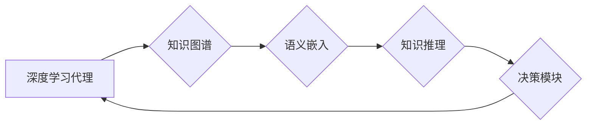

> 深度学习、知识图谱、代理、人工智能、推荐系统、自然语言处理、知识表示

## 1. 背景介绍

人工智能（AI）正以惊人的速度发展，深度学习作为其核心技术，在图像识别、自然语言处理等领域取得了突破性进展。然而，深度学习模型通常缺乏对知识的理解和推理能力，这限制了其在复杂场景下的应用。知识图谱（KG）作为一种结构化的知识表示形式，能够有效地存储和组织知识，为深度学习模型提供丰富的语义信息。

近年来，将知识图谱与深度学习相结合的研究日益受到关注。知识图谱在深度学习代理中的应用，能够赋予代理更强的知识推理能力、语义理解能力和决策能力，使其能够更好地应对复杂的任务。

## 2. 核心概念与联系

**2.1 知识图谱 (KG)**

知识图谱是一种基于三元组（实体、关系、实体）的知识表示形式，能够有效地存储和组织知识。

* **实体 (Entity):**  知识图谱中的基本单元，代表现实世界中的事物或概念。例如，“张三”、“北京”等。
* **关系 (Relation):**  描述实体之间相互联系的方式。例如，“居住在”、“工作于”等。
* **三元组 (Triple):**  由一个实体、一个关系和另一个实体组成的基本知识单元。例如，“张三 居住于 北京”。

**2.2 深度学习代理 (Deep Learning Agent)**

深度学习代理是一种利用深度学习算法进行决策和行动的智能体。它能够通过学习从环境中获取的经验，不断优化其行为策略，以达到预定的目标。

**2.3 知识图谱在深度学习代理中的应用**

将知识图谱与深度学习代理相结合，能够赋予代理更强的知识推理能力、语义理解能力和决策能力。

* **知识增强:**  知识图谱可以为深度学习代理提供丰富的语义信息，帮助其更好地理解环境和任务。
* **推理能力提升:**  基于知识图谱的推理算法可以帮助代理进行逻辑推理和知识推断，提高其决策的准确性和可靠性。
* **泛化能力增强:**  知识图谱中的通用知识可以帮助代理更好地泛化到新的场景和任务。

**2.4 架构图**



## 3. 核心算法原理 & 具体操作步骤

### 3.1  算法原理概述

知识图谱在深度学习代理中的应用主要涉及以下几个核心算法：

* **知识表示学习:** 将知识图谱中的实体和关系映射到低维向量空间，以便深度学习模型能够理解和处理。
* **知识推理:** 利用规则或机器学习模型从知识图谱中推导出新的知识或关系。
* **知识增强:** 将知识图谱中的信息融入到深度学习模型的训练过程中，提高模型的语义理解能力。

### 3.2  算法步骤详解

**3.2.1 知识表示学习**

1. **实体嵌入:** 将知识图谱中的实体映射到低维向量空间，每个实体对应一个向量。常用的实体嵌入方法包括TransE、TransR、RotatE等。
2. **关系嵌入:** 将知识图谱中的关系映射到低维向量空间，每个关系对应一个向量。常用的关系嵌入方法包括TransE、TransR、RotatE等。

**3.2.2 知识推理**

1. **规则推理:** 基于预定义的知识规则，从知识图谱中推导出新的知识或关系。
2. **机器学习推理:** 利用机器学习模型从知识图谱中学习推理规则，并进行新的知识推断。

**3.2.3 知识增强**

1. **知识注入:** 将知识图谱中的信息注入到深度学习模型的输入数据中，例如在文本分类任务中，将实体和关系信息注入到文本序列中。
2. **知识蒸馏:** 利用知识图谱中的知识指导深度学习模型的训练过程，例如利用知识图谱中的实体关系信息来指导模型的特征学习。

### 3.3  算法优缺点

**优点:**

* 能够有效地提高深度学习代理的知识推理能力和语义理解能力。
* 能够增强代理的泛化能力，使其能够更好地应对新的场景和任务。

**缺点:**

* 知识图谱的构建和维护需要大量的资源和时间。
* 知识表示学习和知识推理算法仍然存在一些挑战，例如如何处理不确定性和开放世界问题。

### 3.4  算法应用领域

* **推荐系统:** 基于用户兴趣和商品属性的知识图谱，可以提供更精准的商品推荐。
* **自然语言处理:** 利用知识图谱进行文本理解、问答系统和机器翻译等任务。
* **医疗诊断:** 基于疾病和症状的知识图谱，可以辅助医生进行诊断和治疗方案制定。
* **金融风险管理:** 基于金融机构和交易数据的知识图谱，可以帮助识别和预防金融风险。

## 4. 数学模型和公式 & 详细讲解 & 举例说明

### 4.1  数学模型构建

知识表示学习的目标是将知识图谱中的实体和关系映射到低维向量空间，以便深度学习模型能够理解和处理。常用的知识表示学习模型包括TransE、TransR、RotatE等。

**4.1.1 TransE模型**

TransE模型假设实体和关系可以表示为向量，并且实体的向量加上关系向量等于目标实体的向量。

* **公式:**

$$h + r \approx t$$

其中，h表示源实体的向量，r表示关系的向量，t表示目标实体的向量。

* **举例说明:**

假设知识图谱中包含以下三元组：

* 张三 居住于 北京

其中，“张三”是实体，“居住于”是关系，“北京”是实体。

TransE模型会将“张三”、“居住于”和“北京”分别映射到低维向量空间，并满足以下公式：

$$h_{张三} + r_{居住于} \approx h_{北京}$$

**4.1.2 TransR模型**

TransR模型扩展了TransE模型，引入了关系特定的嵌入矩阵，使得关系可以更好地表示不同的语义。

* **公式:**

$$h^r + r \approx t^r$$

其中，h^r和t^r分别表示源实体和目标实体在关系r下的嵌入向量。

### 4.2  公式推导过程

TransE和TransR模型的公式推导过程涉及到向量空间的运算和损失函数的定义。

* **损失函数:**

常用的损失函数是基于距离的，例如欧氏距离或马氏距离。

* **优化算法:**

常用的优化算法包括梯度下降法和Adam优化器。

### 4.3  案例分析与讲解

可以通过实际案例分析TransE和TransR模型的性能和效果。例如，可以利用知识图谱进行实体链接任务，评估模型的准确率和召回率。

## 5. 项目实践：代码实例和详细解释说明

### 5.1  开发环境搭建

* **操作系统:** Ubuntu 18.04
* **Python版本:** 3.7
* **深度学习框架:** TensorFlow 2.0
* **其他依赖库:** numpy, pandas, matplotlib

### 5.2  源代码详细实现

```python
import tensorflow as tf

# 定义TransE模型
class TransE(tf.keras.Model):
    def __init__(self, embedding_dim):
        super(TransE, self).__init__()
        self.embedding_dim = embedding_dim
        self.entity_embeddings = tf.keras.layers.Embedding(input_dim=num_entities, output_dim=embedding_dim)
        self.relation_embeddings = tf.keras.layers.Embedding(input_dim=num_relations, output_dim=embedding_dim)

    def call(self, inputs):
        h = self.entity_embeddings(inputs[:, 0])
        r = self.relation_embeddings(inputs[:, 1])
        t = self.entity_embeddings(inputs[:, 2])
        return h + r - t

# 定义损失函数
def transE_loss(y_true, y_pred):
    return tf.reduce_mean(tf.square(y_true - y_pred))

# 定义优化器
optimizer = tf.keras.optimizers.Adam(learning_rate=0.001)

# 训练模型
model.compile(loss=transE_loss, optimizer=optimizer)
model.fit(train_data, train_labels, epochs=10)

```

### 5.3  代码解读与分析

* **模型定义:** TransE模型定义了实体和关系的嵌入层，并通过向量加法计算预测目标实体的向量。
* **损失函数:** 使用平方误差损失函数来衡量预测结果与真实结果之间的差异。
* **优化器:** 使用Adam优化器来更新模型参数。
* **训练过程:** 使用训练数据训练模型，并通过评估指标来评估模型的性能。

### 5.4  运行结果展示

训练完成后，可以利用测试数据评估模型的性能，例如计算准确率和召回率。

## 6. 实际应用场景

### 6.1  推荐系统

知识图谱可以为推荐系统提供丰富的语义信息，例如用户兴趣、商品属性、用户关系等。

* **案例:** 利用用户兴趣和商品属性的知识图谱，可以推荐更精准的商品。

### 6.2  自然语言处理

知识图谱可以帮助自然语言处理模型更好地理解文本语义，例如文本分类、问答系统和机器翻译等。

* **案例:** 利用知识图谱进行文本分类，可以提高分类的准确率。

### 6.3  医疗诊断

知识图谱可以帮助医生进行疾病诊断和治疗方案制定，例如根据患者症状和病史，从知识图谱中推导出可能的疾病诊断。

* **案例:** 利用疾病和症状的知识图谱，可以辅助医生进行诊断。

### 6.4  未来应用展望

知识图谱在深度学习代理中的应用前景广阔，未来可能在以下领域得到更广泛的应用：

* **智能客服:** 基于知识图谱的智能客服能够更好地理解用户需求，并提供更准确的回复。
* **自动驾驶:** 基于知识图谱的自动驾驶系统能够更好地理解道路环境和交通规则，提高驾驶安全性。
* **个性化教育:** 基于知识图谱的个性化教育系统能够根据学生的学习情况和兴趣，提供个性化的学习内容和建议。

## 7. 工具和资源推荐

### 7.1  学习资源推荐

* **书籍:**
    * 《知识图谱》
    * 《深度学习》
* **在线课程:**
    * Coursera: 深度学习
    * edX: 知识图谱

### 7.2  开发工具推荐

* **知识图谱构建工具:**
    * Protégé
    * Apache Jena
* **深度学习框架:**
    * TensorFlow
    * PyTorch

### 7.3  相关论文推荐

* **TransE:** Bordes, A., Nickel, M., V. , &  Kriegel, H. P. (2013). Translating embeddings for modeling multi-relational data. In Proceedings of the 2013 ACM SIGKDD International Conference on Knowledge Discovery and Data Mining (pp. 1245-1254).
* **TransR:** Lin, Y., Liu, R., &  Zhou, M. (2015). Learning entity and relation representations with a relation-specific embedding space. In Proceedings of the 2015 Conference on Empirical Methods in Natural Language Processing (pp. 1-11).

## 8. 总结：未来发展趋势与挑战

### 8.1  研究成果总结

知识图谱在深度学习代理中的应用取得了显著的