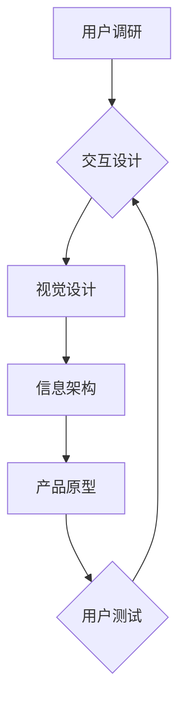

> AI创业公司,产品体验设计,用户调研,交互设计,视觉设计,用户研究,原型设计,用户测试

## 1. 背景介绍

在当今科技飞速发展的时代，人工智能（AI）技术正在各个领域掀起一场革命。AI创业公司层出不穷，涌现出许多具有颠覆性创新的产品和服务。然而，仅仅拥有先进的AI技术还不够，打造出用户体验优秀的产品至关重要。

产品体验设计（User Experience Design，简称UXD）是确保产品易用、美观、高效和令人愉悦的关键因素。对于AI创业公司来说，UXD尤为重要，因为它需要兼顾AI技术的复杂性和用户对简单易用产品的需求。

## 2. 核心概念与联系

产品体验设计是一个多学科交叉的领域，涉及用户研究、交互设计、视觉设计、信息架构等多个方面。

**2.1 用户研究**

用户研究是产品体验设计的基石，通过深入了解用户的需求、行为和痛点，为产品设计提供数据支持。

**2.2 交互设计**

交互设计关注用户与产品之间的交互方式，旨在设计出直观、易用、高效的交互流程。

**2.3 视觉设计**

视觉设计负责产品的整体外观和风格，包括色彩、排版、图标等，旨在打造出美观、易读、令人愉悦的用户界面。

**2.4 信息架构**

信息架构负责产品的组织结构和信息导航，旨在确保用户能够轻松找到所需信息。

**2.5 AI技术与UXD的融合**

AI技术可以为产品体验设计提供强大的支持，例如：

* **个性化推荐:** AI算法可以根据用户的行为和偏好，提供个性化的产品推荐。
* **智能客服:** AI聊天机器人可以提供24小时在线客服，帮助用户解决问题。
* **语音交互:** AI语音识别技术可以实现语音控制，提升用户体验。

**Mermaid 流程图**



## 3. 核心算法原理 & 具体操作步骤

### 3.1  算法原理概述

用户调研的核心算法原理是基于用户行为和反馈数据进行分析和建模，以洞察用户需求、偏好和痛点。常用的算法包括：

* **聚类算法:** 将用户群体划分为不同的类别，根据他们的共同特征进行分析。
* **关联规则挖掘:** 发现用户行为之间的关联关系，例如哪些产品经常一起购买。
* **预测模型:** 基于历史数据预测用户的未来行为，例如用户的购买意愿。

### 3.2  算法步骤详解

1. **数据收集:** 收集用户行为数据，例如用户访问记录、购买记录、反馈意见等。
2. **数据预处理:** 对收集到的数据进行清洗、转换和格式化，以便于算法分析。
3. **特征提取:** 从用户行为数据中提取有意义的特征，例如用户年龄、性别、购买频率、偏好类别等。
4. **模型训练:** 使用选定的算法对用户数据进行训练，建立用户行为模型。
5. **模型评估:** 使用测试数据评估模型的准确性和有效性。
6. **模型应用:** 将训练好的模型应用于实际场景，例如个性化推荐、用户画像分析等。

### 3.3  算法优缺点

**优点:**

* 可以深入了解用户需求和行为模式。
* 可以为产品设计提供数据支持，提高产品质量。
* 可以实现个性化推荐和用户画像分析等功能。

**缺点:**

* 需要大量的用户数据进行训练。
* 算法模型的准确性依赖于数据质量。
* 算法模型需要定期更新，以适应用户行为的变化。

### 3.4  算法应用领域

用户调研算法广泛应用于以下领域：

* **电商:** 个性化推荐、用户画像分析、精准营销。
* **社交媒体:** 用户行为分析、内容推荐、社区运营。
* **金融:** 风险评估、欺诈检测、客户服务。
* **教育:** 个性化学习、学生行为分析、教学评估。

## 4. 数学模型和公式 & 详细讲解 & 举例说明

### 4.1  数学模型构建

用户调研中常用的数学模型包括：

* **贝叶斯网络:** 用于表示用户行为之间的概率关系。
* **决策树:** 用于预测用户的决策结果。
* **支持向量机:** 用于分类用户群体。

### 4.2  公式推导过程

例如，贝叶斯网络中的概率公式：

$$P(A|B) = \frac{P(B|A)P(A)}{P(B)}$$

其中：

* $P(A|B)$ 是在已知事件 B 发生的情况下，事件 A 发生的概率。
* $P(B|A)$ 是在已知事件 A 发生的情况下，事件 B 发生的概率。
* $P(A)$ 是事件 A 发生的概率。
* $P(B)$ 是事件 B 发生的概率。

### 4.3  案例分析与讲解

假设我们想要预测用户是否会购买某个产品。我们可以使用决策树模型，根据用户的年龄、性别、收入等特征，构建决策树，预测用户的购买意愿。

## 5. 项目实践：代码实例和详细解释说明

### 5.1  开发环境搭建

* 操作系统: Windows/macOS/Linux
* Python版本: 3.6+
* 必要的库: pandas, numpy, scikit-learn

### 5.2  源代码详细实现

```python
import pandas as pd
from sklearn.tree import DecisionTreeClassifier
from sklearn.model_selection import train_test_split

# 加载用户数据
data = pd.read_csv('user_data.csv')

# 选择特征和目标变量
features = ['age', 'gender', 'income']
target = 'purchase'

# 将数据划分为训练集和测试集
X_train, X_test, y_train, y_test = train_test_split(data[features], data[target], test_size=0.2)

# 创建决策树模型
model = DecisionTreeClassifier()

# 训练模型
model.fit(X_train, y_train)

# 预测测试集结果
y_pred = model.predict(X_test)

# 评估模型性能
from sklearn.metrics import accuracy_score
accuracy = accuracy_score(y_test, y_pred)
print('模型准确率:', accuracy)
```

### 5.3  代码解读与分析

* 代码首先加载用户数据，并选择特征和目标变量。
* 然后使用 `train_test_split` 函数将数据划分为训练集和测试集。
* 创建决策树模型，并使用 `fit` 方法训练模型。
* 使用 `predict` 方法预测测试集结果，并使用 `accuracy_score` 函数评估模型性能。

### 5.4  运行结果展示

运行代码后，会输出模型的准确率。

## 6. 实际应用场景

### 6.1  电商平台

* **个性化推荐:** 根据用户的购买历史、浏览记录和兴趣偏好，推荐个性化的商品。
* **用户画像分析:** 分析用户的行为模式，构建用户画像，以便进行精准营销。

### 6.2  社交媒体平台

* **内容推荐:** 根据用户的兴趣和行为，推荐相关的文章、视频和图片。
* **社区运营:** 分析用户之间的互动关系，发现社区活跃度高的用户和话题，进行社区运营。

### 6.3  金融机构

* **风险评估:** 分析用户的信用记录和行为模式，评估用户的贷款风险。
* **欺诈检测:** 识别异常的交易行为，防止欺诈行为的发生。

### 6.4  未来应用展望

随着人工智能技术的不断发展，用户调研将更加智能化、个性化和自动化。

## 7. 工具和资源推荐

### 7.1  学习资源推荐

* **书籍:**
    * 《Don't Make Me Think》 by Steve Krug
    * 《The Design of Everyday Things》 by Don Norman
    * 《Lean UX》 by Jeff Gothelf and Josh Seiden
* **在线课程:**
    * Coursera: User Experience Design Specialization
    * Udemy: The Complete UX Design Course

### 7.2  开发工具推荐

* **原型设计工具:**
    * Figma
    * Sketch
    * Adobe XD
* **用户测试工具:**
    * UserTesting
    * TryMyUI
    * Hotjar

### 7.3  相关论文推荐

* **User Interface Design: A Practical Guide** by Jakob Nielsen
* **The Psychology of Everyday Things** by Don Norman
* **Designing for Emotion** by Aarron Walter

## 8. 总结：未来发展趋势与挑战

### 8.1  研究成果总结

用户调研是产品体验设计的基石，通过深入了解用户需求和行为模式，可以为产品设计提供数据支持，提升产品质量。

### 8.2  未来发展趋势

* **人工智能驱动的用户调研:** AI技术将更加广泛地应用于用户调研，例如自动生成用户画像、预测用户行为等。
* **沉浸式用户体验:** VR/AR技术将为用户调研提供更加沉浸式的体验，例如模拟真实场景，进行用户测试。
* **跨平台用户调研:** 用户调研将更加关注跨平台的用户体验，例如手机、平板电脑、电脑等。

### 8.3  面临的挑战

* **数据隐私保护:** 用户调研需要收集大量用户数据，如何保护用户隐私是一个重要的挑战。
* **算法偏见:** AI算法可能会存在偏见，导致用户调研结果不准确。
* **用户参与度:** 如何提高用户的参与度，获得高质量的用户反馈是一个持续的挑战。

### 8.4  研究展望

未来，用户调研将更加智能化、个性化和自动化，为产品设计提供更加精准的数据支持。


## 9. 附录：常见问题与解答

**Q1: 如何进行用户调研？**

A1: 用户调研的方法有很多，例如问卷调查、访谈、用户测试等。选择合适的调研方法需要根据具体情况进行判断。

**Q2: 如何分析用户调研数据？**

A2: 可以使用统计软件或数据可视化工具分析用户调研数据，例如Excel、SPSS、Tableau等。

**Q3: 如何提高用户调研的有效性？**

A3: 

* 明确调研目标。
* 设计科学的调研问卷。
* 选择合适的调研样本。
* 确保调研过程的客观性和公正性。
* 对调研结果进行深入分析和解读。

作者：禅与计算机程序设计艺术 / Zen and the Art of Computer Programming 


<end_of_turn>