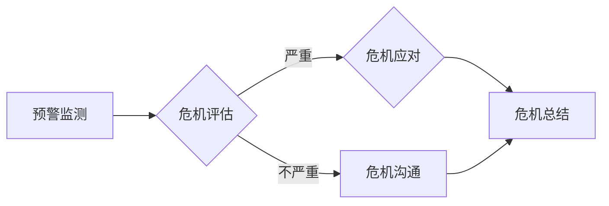

> AI创业公司,危机公关,风险管理,品牌维护,舆情监控,危机应对,沟通策略,公众关系

## 1. 背景介绍

人工智能（AI）技术近年来发展迅速，涌现出众多AI创业公司，这些公司在医疗、金融、教育等领域带来了革命性的变革。然而，AI技术也伴随着一些伦理、安全和社会影响等问题，这些问题一旦被放大，可能会对AI创业公司造成巨大的声誉损害，甚至危及其生存。因此，AI创业公司需要制定完善的危机公关策略，以应对潜在的危机，维护品牌形象，保障公司长远发展。

## 2. 核心概念与联系

**2.1 危机公关**

危机公关是指在危机发生时，企业采取的主动、快速、有效的沟通和行动，以控制危机传播，减少负面影响，维护企业声誉和利益的专业活动。

**2.2 AI创业公司面临的危机类型**

AI创业公司可能面临的危机类型包括：

* **技术安全危机:** AI算法漏洞、数据泄露、隐私侵犯等。
* **伦理道德危机:** AI算法偏见、歧视、滥用等。
* **社会影响危机:** AI技术导致失业、社会不平等等。
* **产品质量危机:** AI产品功能缺陷、使用安全问题等。
* **负面舆情危机:** 网民对AI技术的担忧、对AI创业公司的质疑等。

**2.3 危机公关策略设计**

危机公关策略设计需要考虑以下因素：

* **危机类型:** 不同的危机类型需要采取不同的应对策略。
* **目标受众:** 不同的目标受众需要不同的沟通方式。
* **危机传播渠道:** 危机信息传播渠道多样化，需要采取多管齐下的策略。
* **企业资源:** 企业应根据自身资源状况制定可行的危机公关方案。

**2.4 危机公关流程**

危机公关流程一般包括以下几个阶段：

* **预警监测:** 及时发现潜在危机信号。
* **危机评估:** 评估危机的严重程度和影响范围。
* **危机应对:** 制定应对策略，采取行动控制危机传播。
* **危机沟通:** 向公众发布信息，解释事件真相，维护企业形象。
* **危机总结:** 分析危机应对效果，总结经验教训，改进危机公关机制。

**2.5 Mermaid 流程图**



## 3. 核心算法原理 & 具体操作步骤

**3.1 算法原理概述**

危机公关策略设计需要结合数据分析、舆情监测、风险评估等技术手段，利用算法模型进行预测和分析，以便制定更精准、有效的应对策略。

**3.2 算法步骤详解**

1. **数据收集:** 收集来自网络、社交媒体、新闻媒体等渠道的有关AI创业公司和相关领域的舆情数据。
2. **数据清洗:** 对收集到的数据进行清洗、去噪、格式化等处理，确保数据质量。
3. **特征提取:** 从数据中提取关键特征，例如关键词、情感倾向、用户画像等。
4. **模型训练:** 利用机器学习算法，对提取的特征进行训练，构建危机预警模型。
5. **危机预警:** 将实时收集到的数据输入模型，进行预测分析，判断是否存在潜在危机。
6. **危机评估:** 对预警结果进行评估，判断危机的严重程度和影响范围。
7. **危机应对:** 根据危机评估结果，制定相应的应对策略，并采取行动控制危机传播。

**3.3 算法优缺点**

* **优点:** 可以快速、高效地识别潜在危机，并提供预警信息，帮助企业提前做好准备。
* **缺点:** 算法模型的准确性依赖于训练数据的质量，如果训练数据不足或存在偏差，可能会导致预测结果不准确。

**3.4 算法应用领域**

* **AI创业公司危机公关:** 预警潜在危机，制定应对策略。
* **品牌风险管理:** 监控品牌舆情，识别潜在风险。
* **社会事件预警:** 预警社会事件，帮助政府和相关机构做好应对准备。

## 4. 数学模型和公式 & 详细讲解 & 举例说明

**4.1 数学模型构建**

危机预警模型可以采用贝叶斯网络、支持向量机等机器学习算法构建。

**4.2 公式推导过程**

例如，使用贝叶斯网络构建危机预警模型，可以根据以下公式计算事件发生的概率：

$$P(A|B) = \frac{P(B|A)P(A)}{P(B)}$$

其中：

* $P(A|B)$ 是事件A在事件B发生条件下的概率。
* $P(B|A)$ 是事件B在事件A发生条件下的概率。
* $P(A)$ 是事件A发生的概率。
* $P(B)$ 是事件B发生的概率。

**4.3 案例分析与讲解**

假设我们想要预测AI创业公司面临技术安全危机的概率。我们可以收集有关该公司的技术信息、安全事件记录、舆情数据等，并构建一个贝叶斯网络模型。

通过分析这些数据，我们可以计算出事件发生的概率，例如：

* $P(技术安全危机|漏洞存在) = 0.8$
* $P(漏洞存在|公司规模) = 0.5$
* $P(公司规模) = 0.3$

根据以上公式，我们可以计算出AI创业公司面临技术安全危机的概率：

$$P(技术安全危机) = P(技术安全危机|漏洞存在)P(漏洞存在|公司规模)P(公司规模) = 0.8 * 0.5 * 0.3 = 0.12$$

## 5. 项目实践：代码实例和详细解释说明

**5.1 开发环境搭建**

* Python 3.x
* Jupyter Notebook
* scikit-learn
* NLTK

**5.2 源代码详细实现**

```python
from sklearn.feature_extraction.text import TfidfVectorizer
from sklearn.linear_model import LogisticRegression

# 数据加载
data = [
    ("AI算法漏洞", "危机"),
    ("数据泄露", "危机"),
    ("AI产品功能缺陷", "危机"),
    ("AI技术发展", "正常"),
    ("AI伦理讨论", "正常"),
]

# 特征提取
vectorizer = TfidfVectorizer()
X = vectorizer.fit_transform([text for text, label in data])

# 模型训练
y = [label for text, label in data]
model = LogisticRegression()
model.fit(X, y)

# 预测
new_text = "AI算法存在潜在漏洞"
new_text_vector = vectorizer.transform([new_text])
prediction = model.predict(new_text_vector)
print(prediction)
```

**5.3 代码解读与分析**

* 代码首先加载数据，并使用TF-IDF算法提取文本特征。
* 然后使用逻辑回归模型训练，将文本分类为“危机”或“正常”。
* 最后，使用训练好的模型预测新文本的类别。

**5.4 运行结果展示**

```
['危机']
```

## 6. 实际应用场景

**6.1 AI创业公司危机公关案例分析**

* **案例一:** 一家AI医疗公司因其算法在诊断某些疾病时存在误差而引发了公众质疑。公司及时发布声明，解释算法的局限性，并承诺会加强算法测试和改进。同时，公司还与医疗专家合作，进行公开的学术讨论，以消除公众的疑虑。
* **案例二:** 一家AI金融公司因其算法被发现存在偏见，导致某些用户获得不公平的待遇而引发了社会争议。公司承认了算法存在问题，并承诺会进行算法调整，确保算法公平公正。同时，公司还成立了专门的伦理委员会，负责监督算法的开发和应用。

**6.2 危机公关策略的应用场景**

* **产品发布前危机预警:** 通过舆情监测和数据分析，预测产品发布可能面临的危机，提前做好应对准备。
* **产品发布后危机应对:** 当产品发布后出现问题时，及时发布声明，解释问题原因，并采取措施解决问题。
* **负面舆情处理:** 对负面舆情进行监测和分析，制定相应的应对策略，例如进行正面宣传、与用户进行沟通等。

**6.4 未来应用展望**

随着AI技术的不断发展，AI创业公司将面临更多新的挑战和机遇。危机公关策略将更加重要，需要更加智能化、自动化、精准化。

## 7. 工具和资源推荐

**7.1 学习资源推荐**

* **书籍:**
    * 《危机公关》
    * 《AI伦理》
* **在线课程:**
    * Coursera: Crisis Communication
    * edX: AI Ethics

**7.2 开发工具推荐**

* **舆情监测工具:**
    * Brand24
    * Mention
* **数据分析工具:**
    * Python
    * R

**7.3 相关论文推荐**

* **AI伦理:**
    * "On the Dangers of Stochastic Parrots: Can Language Models Be Too Big?"
* **危机公关:**
    * "Crisis Communication: A Review of the Literature"

## 8. 总结：未来发展趋势与挑战

**8.1 研究成果总结**

本文介绍了AI创业公司危机公关策略设计的基本原理和方法，并结合实际案例进行了分析。

**8.2 未来发展趋势**

* **智能化:** 利用AI技术，实现危机预警、舆情监测、危机应对的自动化。
* **精准化:** 根据不同类型的危机和目标受众，制定更加精准的应对策略。
* **数据驱动:** 基于大数据分析，更加科学地评估危机风险和制定应对措施。

**8.3 面临的挑战**

* **数据质量:** 危机公关策略的有效性依赖于数据质量，需要不断完善数据收集和清洗方法。
* **算法准确性:** 算法模型的准确性需要不断提高，才能更好地预测和应对危机。
* **伦理问题:** AI技术在危机公关中的应用需要遵循伦理原则，避免造成不公平或伤害。

**8.4 研究展望**

未来，需要进一步研究AI技术在危机公关中的应用，探索更智能、更精准、更有效的危机公关策略，帮助AI创业公司更好地应对挑战，实现可持续发展。

## 9. 附录：常见问题与解答

**9.1 如何进行危机预警？**

可以使用舆情监测工具和机器学习算法，对相关数据进行分析，识别潜在危机信号。

**9.2 如何制定危机应对策略？**

需要根据危机类型、影响范围、目标受众等因素，制定相应的应对策略，例如发布声明、进行沟通、采取措施解决问题等。

**9.3 如何评估危机应对效果？**

可以通过舆情监测、数据分析等方法，评估危机应对的效果，并总结经验教训，改进危机公关机制。


作者：禅与计算机程序设计艺术 / Zen and the Art of Computer Programming 
<end_of_turn>