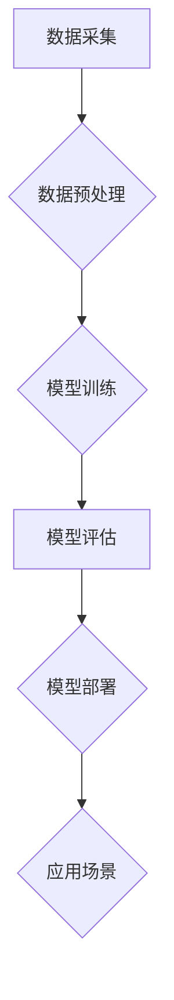

> 人工智能，考古学，计算机视觉，深度学习，文物识别，历史研究，数据分析，文物保护

## 1. 背景介绍

考古学，作为人类文明探索的基石，致力于通过挖掘和研究古代遗迹，揭示历史的真相。然而，传统的考古研究方法往往耗时费力，且存在着一定的局限性。随着人工智能技术的飞速发展，AI在考古学中的应用逐渐成为一个热门的研究方向，为加速历史研究提供了新的思路和方法。

近年来，人工智能技术在图像识别、自然语言处理、数据分析等领域取得了突破性进展，为考古学带来了前所未有的机遇。AI算法能够快速处理海量数据，识别和分类文物，分析遗址结构，甚至预测埋藏的遗迹位置，极大地提高了考古研究的效率和准确性。

## 2. 核心概念与联系

**2.1  人工智能 (AI) 在考古学中的应用**

人工智能技术在考古学中的应用主要体现在以下几个方面：

* **文物识别:** 利用计算机视觉技术，训练AI模型识别和分类不同类型的文物，例如陶器、兵器、玉器等，并根据其特征进行初步的年代和文化背景判断。
* **遗址分析:** 通过对遗址照片、三维模型等数据的分析，AI算法可以识别遗址的结构、布局、功能等信息，并帮助考古学家重建遗址的原貌。
* **数据挖掘:** AI算法能够从大量的考古数据中挖掘出隐藏的规律和模式，例如人口迁徙、文化交流、社会发展等，为历史研究提供新的视角和见解。
* **预测遗迹位置:** 基于地理信息系统 (GIS) 和机器学习算法，AI可以分析地形、地质、历史文献等数据，预测埋藏的遗迹位置，为考古发掘提供指导。

**2.2  核心概念原理和架构**



**数据采集:** 从各种来源收集考古数据，例如照片、三维模型、文献资料、地质勘探数据等。

**数据预处理:** 对收集到的数据进行清洗、格式转换、特征提取等处理，使其适合AI模型的训练和应用。

**模型训练:** 利用深度学习算法，训练AI模型，使其能够识别文物、分析遗址、挖掘数据等。

**模型评估:** 对训练好的模型进行评估，测试其准确率、效率等指标，并进行必要的调整和优化。

**模型部署:** 将训练好的模型部署到实际应用场景中，例如考古现场、博物馆、研究机构等。

**应用场景:** AI模型在考古研究、文物保护、历史教育等方面发挥作用。

## 3. 核心算法原理 & 具体操作步骤

**3.1  算法原理概述**

在AI驱动的考古学应用中，常用的算法包括：

* **卷积神经网络 (CNN):** 擅长图像识别和分类，可以用于识别文物类型、分析遗址结构等。
* **循环神经网络 (RNN):** 擅长处理序列数据，可以用于分析文字记录、解读古文字等。
* **支持向量机 (SVM):** 擅长分类和回归，可以用于预测遗迹位置、判断文物年代等。

**3.2  算法步骤详解**

以文物识别为例，使用CNN算法进行文物识别，具体步骤如下：

1. **数据收集:** 收集大量不同类型文物的照片，并进行标注，标记出每个物体的类别。
2. **数据预处理:** 对图像进行尺寸调整、数据增强等处理，使其更适合模型训练。
3. **模型构建:** 使用CNN架构搭建模型，并设置相应的层数、参数等。
4. **模型训练:** 利用训练数据，训练CNN模型，使其能够识别不同类型的文物。
5. **模型评估:** 使用测试数据评估模型的准确率、召回率等指标，并进行必要的调整和优化。
6. **模型部署:** 将训练好的模型部署到实际应用场景中，例如博物馆、考古现场等。

**3.3  算法优缺点**

**优点:**

* 识别速度快，能够处理海量数据。
* 识别精度高，能够识别出细微的特征。
* 可扩展性强，可以根据需要添加新的类别。

**缺点:**

* 需要大量的训练数据，数据质量对模型性能影响较大。
* 模型训练时间长，需要强大的计算资源。
* 对图像质量要求较高，噪声或模糊的图像识别效果较差。

**3.4  算法应用领域**

* 文物识别和分类
* 遗址结构分析
* 文物年代判断
* 遗迹预测
* 古文字解读
* 历史数据挖掘

## 4. 数学模型和公式 & 详细讲解 & 举例说明

**4.1  数学模型构建**

在AI驱动的考古学应用中，常用的数学模型包括：

* **概率模型:** 用于描述文物类型、遗址结构、历史事件等之间的概率关系。
* **统计模型:** 用于分析考古数据，例如文物数量分布、遗址面积分布等。
* **机器学习模型:** 用于训练AI模型，例如CNN、RNN、SVM等。

**4.2  公式推导过程**

以文物识别为例，使用CNN算法进行文物识别，其核心公式包括：

* **激活函数:** 用于引入非线性，例如ReLU函数:

$$f(x) = max(0, x)$$

* **损失函数:** 用于衡量模型预测结果与真实结果之间的差异，例如交叉熵损失函数:

$$L = -\sum_{i=1}^{N} y_i \log(p_i)$$

其中，$y_i$为真实标签，$p_i$为模型预测概率。

* **优化算法:** 用于更新模型参数，例如梯度下降算法:

$$\theta = \theta - \alpha \nabla L$$

其中，$\theta$为模型参数，$\alpha$为学习率，$\nabla L$为损失函数的梯度。

**4.3  案例分析与讲解**

例如，使用CNN模型识别古代陶器，可以将不同类型的陶器照片作为训练数据，训练模型识别出陶器的类别、年代、制作工艺等信息。

## 5. 项目实践：代码实例和详细解释说明

**5.1  开发环境搭建**

* 操作系统: Ubuntu 20.04
* Python 版本: 3.8
* 深度学习框架: TensorFlow 2.0

**5.2  源代码详细实现**

```python
import tensorflow as tf

# 定义CNN模型
model = tf.keras.models.Sequential([
    tf.keras.layers.Conv2D(32, (3, 3), activation='relu', input_shape=(128, 128, 3)),
    tf.keras.layers.MaxPooling2D((2, 2)),
    tf.keras.layers.Conv2D(64, (3, 3), activation='relu'),
    tf.keras.layers.MaxPooling2D((2, 2)),
    tf.keras.layers.Flatten(),
    tf.keras.layers.Dense(10, activation='softmax')
])

# 编译模型
model.compile(optimizer='adam',
              loss='sparse_categorical_crossentropy',
              metrics=['accuracy'])

# 训练模型
model.fit(train_images, train_labels, epochs=10)

# 评估模型
loss, accuracy = model.evaluate(test_images, test_labels)
print('Test loss:', loss)
print('Test accuracy:', accuracy)
```

**5.3  代码解读与分析**

* 代码首先定义了一个CNN模型，包含卷积层、池化层、全连接层等。
* 然后编译模型，设置优化器、损失函数和评价指标。
* 接着训练模型，使用训练数据进行模型训练。
* 最后评估模型，使用测试数据评估模型的性能。

**5.4  运行结果展示**

训练完成后，可以将模型应用于新的文物图像识别，并输出识别结果。

## 6. 实际应用场景

**6.1  文物识别与分类**

AI算法可以帮助博物馆和考古机构快速识别和分类文物，提高文物管理效率。例如，可以识别出不同类型的陶器、兵器、玉器等，并根据其特征进行初步的年代和文化背景判断。

**6.2  遗址分析与重建**

AI算法可以分析遗址照片、三维模型等数据，识别遗址的结构、布局、功能等信息，并帮助考古学家重建遗址的原貌。例如，可以识别出建筑物、道路、墓葬等，并根据其位置和形状进行重建。

**6.3  数据挖掘与历史研究**

AI算法可以从大量的考古数据中挖掘出隐藏的规律和模式，例如人口迁徙、文化交流、社会发展等，为历史研究提供新的视角和见解。例如，可以分析出不同时期文物分布的规律，推断出古代人口迁徙的路线和方向。

**6.4  未来应用展望**

随着人工智能技术的不断发展，AI在考古学中的应用将更加广泛和深入。例如，可以利用无人机和机器人进行考古发掘，提高发掘效率和安全性；可以利用虚拟现实技术重建古代遗址，为公众提供更加直观的体验；可以利用大数据分析技术，挖掘出更多历史信息。

## 7. 工具和资源推荐

**7.1  学习资源推荐**

* **在线课程:** Coursera、edX、Udacity等平台提供人工智能、计算机视觉、深度学习等方面的在线课程。
* **书籍:** 《深度学习》、《计算机视觉:算法与应用》等书籍可以帮助读者深入了解人工智能相关知识。
* **开源项目:** TensorFlow、PyTorch等开源深度学习框架可以帮助读者实践人工智能算法。

**7.2  开发工具推荐**

* **Python:** 作为人工智能开发的主要语言，Python拥有丰富的库和工具，例如NumPy、Pandas、Scikit-learn等。
* **TensorFlow:** Google开发的开源深度学习框架，支持多种硬件平台，并提供丰富的模型库和工具。
* **PyTorch:** Facebook开发的开源深度学习框架，以其灵活性和易用性而闻名。

**7.3  相关论文推荐**

* **Archaeological Applications of Deep Learning: A Review**
* **Using Convolutional Neural Networks for the Classification of Archaeological Artifacts**
* **Deep Learning for Site Detection and Analysis in Archaeological Remote Sensing**

## 8. 总结：未来发展趋势与挑战

**8.1  研究成果总结**

AI在考古学中的应用取得了显著的成果，例如文物识别、遗址分析、数据挖掘等方面都取得了突破性进展。AI算法能够帮助考古学家更高效、更准确地进行研究，并为历史研究提供新的视角和见解。

**8.2  未来发展趋势**

未来，AI在考古学中的应用将更加广泛和深入，例如：

* **无人化考古:** 利用无人机和机器人进行考古发掘，提高发掘效率和安全性。
* **虚拟现实考古:** 利用虚拟现实技术重建古代遗址，为公众提供更加直观的体验。
* **大数据考古:** 利用大数据分析技术，挖掘出更多历史信息。

**8.3  面临的挑战**

AI在考古学中的应用也面临着一些挑战，例如：

* **数据获取和标注:** AI算法需要大量的训练数据，而考古数据往往稀缺和难以标注。
* **算法解释性和可信度:** AI算法的决策过程往往难以解释，这可能会影响其在考古学中的应用。
* **伦理和社会影响:** AI技术的发展可能会对考古学研究和文物保护带来新的伦理和社会挑战。

**8.4  研究展望**

未来，需要加强AI与考古学之间的交叉研究，探索AI技术在考古学中的更多应用场景，并解决AI技术在考古学中的挑战，推动AI技术在考古学中的健康发展。

## 9. 附录：常见问题与解答

**9.1  AI是否会取代考古学家？**

AI技术可以帮助考古学家提高工作效率和准确性，但它不会取代考古学家。