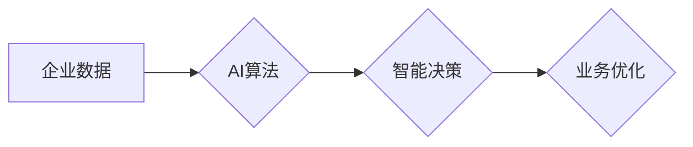

>  人工智能、企业应用、机器学习、深度学习、自然语言处理、计算机视觉、数据分析、自动化

## 1. 背景介绍

人工智能（AI）技术近年来发展迅速，已从实验室走向现实生活，并开始深刻地改变着各行各业。企业作为社会经济发展的重要组成部分，也面临着数字化转型和智能升级的挑战。AI技术为企业提供了强大的工具和手段，可以帮助企业提高效率、降低成本、提升客户体验，从而获得竞争优势。

随着AI技术的不断成熟，企业对AI应用的需求也日益增长。从传统的客服机器人到更复杂的预测分析和个性化推荐，AI技术正在被广泛应用于各个领域，例如：

* **客户服务:** AI驱动的聊天机器人可以提供24/7的客户服务，快速响应客户问题，提高客户满意度。
* **营销和销售:** AI可以分析客户数据，进行精准营销，预测客户需求，提高销售转化率。
* **运营管理:** AI可以优化生产流程，预测设备故障，降低运营成本。
* **人力资源:** AI可以辅助招聘、培训和绩效评估，提高人力资源管理效率。

## 2. 核心概念与联系

**2.1  人工智能 (AI)**

人工智能是指模拟人类智能行为的计算机系统。AI技术涵盖了多个领域，例如机器学习、深度学习、自然语言处理、计算机视觉等。

**2.2  机器学习 (ML)**

机器学习是AI的一个重要分支，它使计算机能够从数据中学习，并根据学习到的知识进行预测或决策。机器学习算法可以分为监督学习、无监督学习和强化学习三种类型。

**2.3  深度学习 (DL)**

深度学习是机器学习的一个子领域，它使用多层神经网络来模拟人类大脑的学习过程。深度学习算法在图像识别、语音识别、自然语言处理等领域取得了突破性的进展。

**2.4  自然语言处理 (NLP)**

自然语言处理是指使计算机能够理解、处理和生成人类语言的技术。NLP应用广泛，例如机器翻译、文本摘要、情感分析等。

**2.5  计算机视觉 (CV)**

计算机视觉是指使计算机能够“看”和理解图像的技术。计算机视觉应用广泛，例如图像识别、物体检测、图像分割等。

**2.6  数据分析**

数据分析是指从数据中提取有价值信息的技术。AI技术可以帮助企业进行大数据分析，发现隐藏的模式和趋势，从而做出更明智的决策。

**2.7  自动化**

自动化是指使用技术来代替人工完成重复性任务的技术。AI技术可以帮助企业自动化流程，提高效率，降低成本。

**2.8  企业应用场景**

AI技术可以应用于企业各个环节，例如：

* **客户关系管理 (CRM):** AI可以帮助企业更好地了解客户需求，提供个性化服务。
* **供应链管理 (SCM):** AI可以帮助企业优化物流配送，降低库存成本。
* **财务管理 (FM):** AI可以帮助企业进行财务分析，预测财务风险。
* **人力资源管理 (HRM):** AI可以帮助企业招聘、培训和评估员工。

**2.9  Mermaid 流程图**



## 3. 核心算法原理 & 具体操作步骤

### 3.1  算法原理概述

机器学习算法的核心原理是通过训练模型来学习数据中的模式和规律。训练模型的过程可以理解为一个参数调整的过程，通过不断调整模型参数，使模型的预测结果与实际结果之间的误差最小化。

常见的机器学习算法包括：

* **线性回归:** 用于预测连续数值的算法。
* **逻辑回归:** 用于预测分类结果的算法。
* **决策树:** 用于分类和回归的算法，通过树状结构来决策。
* **支持向量机 (SVM):** 用于分类和回归的算法，通过寻找最佳的分隔超平面来分类数据。
* **k近邻 (KNN):** 用于分类和回归的算法，通过寻找与待预测数据最相似的k个数据点来预测结果。
* **随机森林:** 结合多个决策树的算法，提高预测精度。
* **神经网络:** 仿照人类大脑结构的算法，具有强大的学习能力。

### 3.2  算法步骤详解

以下以线性回归算法为例，详细说明机器学习算法的步骤：

1. **数据收集和预处理:** 收集相关数据，并进行清洗、转换、特征工程等预处理操作。
2. **模型选择:** 根据具体问题选择合适的机器学习算法。
3. **模型训练:** 使用训练数据训练模型，调整模型参数，使模型的预测结果与实际结果之间的误差最小化。
4. **模型评估:** 使用测试数据评估模型的性能，例如准确率、召回率、F1-score等。
5. **模型调优:** 根据模型评估结果，调整模型参数或选择其他算法，提高模型性能。
6. **模型部署:** 将训练好的模型部署到实际应用场景中，用于预测或决策。

### 3.3  算法优缺点

不同的机器学习算法具有不同的优缺点，需要根据具体问题选择合适的算法。

例如，线性回归算法简单易懂，但对非线性关系的拟合能力较弱。决策树算法可以处理非线性关系，但容易过拟合。神经网络算法具有强大的学习能力，但训练时间长，参数较多。

### 3.4  算法应用领域

机器学习算法广泛应用于各个领域，例如：

* **图像识别:** 用于识别图像中的物体、场景、人脸等。
* **语音识别:** 用于将语音转换为文本。
* **自然语言处理:** 用于机器翻译、文本摘要、情感分析等。
* **推荐系统:** 用于推荐用户感兴趣的商品、服务或内容。
* **预测分析:** 用于预测未来趋势，例如销售预测、风险预测等。

## 4. 数学模型和公式 & 详细讲解 & 举例说明

### 4.1  数学模型构建

机器学习算法通常基于数学模型构建。例如，线性回归模型的数学表达式为：

$$y = w_0 + w_1x_1 + w_2x_2 + ... + w_nx_n + \epsilon$$

其中：

* $y$ 是预测结果
* $w_0, w_1, w_2, ..., w_n$ 是模型参数
* $x_1, x_2, ..., x_n$ 是输入特征
* $\epsilon$ 是误差项

### 4.2  公式推导过程

模型参数的学习过程通常使用梯度下降算法。梯度下降算法的目标是找到使模型预测结果与实际结果误差最小化的参数值。

梯度下降算法的迭代公式为：

$$w_i = w_i - \alpha \frac{\partial Loss}{\partial w_i}$$

其中：

* $w_i$ 是模型参数
* $\alpha$ 是学习率
* $\frac{\partial Loss}{\partial w_i}$ 是损失函数对参数 $w_i$ 的梯度

### 4.3  案例分析与讲解

例如，假设我们想要预测房价，输入特征包括房屋面积、房间数、地理位置等。我们可以使用线性回归模型来预测房价。

通过训练模型，我们可以得到模型参数，例如房屋面积每增加1平方米，房价会增加1000元。

## 5. 项目实践：代码实例和详细解释说明

### 5.1  开发环境搭建

* Python 3.x
* Jupyter Notebook
* scikit-learn

### 5.2  源代码详细实现

```python
from sklearn.linear_model import LinearRegression
from sklearn.model_selection import train_test_split
import pandas as pd

# 加载数据
data = pd.read_csv('house_price.csv')

# 划分训练集和测试集
X = data[['area', 'rooms']]
y = data['price']
X_train, X_test, y_train, y_test = train_test_split(X, y, test_size=0.2, random_state=42)

# 创建线性回归模型
model = LinearRegression()

# 训练模型
model.fit(X_train, y_train)

# 预测测试集结果
y_pred = model.predict(X_test)

# 评估模型性能
from sklearn.metrics import mean_squared_error
mse = mean_squared_error(y_test, y_pred)
print(f'Mean Squared Error: {mse}')
```

### 5.3  代码解读与分析

* 首先，我们加载数据并划分训练集和测试集。
* 然后，我们创建线性回归模型并训练模型。
* 训练完成后，我们使用模型预测测试集结果，并评估模型性能。

### 5.4  运行结果展示

运行代码后，会输出测试集的均方误差值。均方误差值越小，模型的预测精度越高。

## 6. 实际应用场景

### 6.1  金融领域

* **欺诈检测:** AI可以分析交易数据，识别异常行为，从而预防欺诈交易。
* **风险评估:** AI可以分析客户数据，评估客户的信用风险，帮助银行做出贷款决策。
* **投资决策:** AI可以分析市场数据，预测股票价格走势，帮助投资者做出投资决策。

### 6.2  医疗领域

* **疾病诊断:** AI可以分析患者的病历、影像数据等，辅助医生诊断疾病。
* **药物研发:** AI可以加速药物研发过程，例如预测药物的有效性、安全性等。
* **个性化医疗:** AI可以根据患者的基因信息、生活习惯等，提供个性化的医疗方案。

### 6.3  制造业

* **设备故障预测:** AI可以分析设备运行数据，预测设备故障，从而避免设备停机。
* **生产过程优化:** AI可以优化生产流程，提高生产效率，降低生产成本。
* **质量控制:** AI可以识别产品缺陷，提高产品质量。

### 6.4  未来应用展望

随着AI技术的不断发展，其应用场景将更加广泛，例如：

* **自动驾驶:** AI可以帮助汽车实现自动驾驶功能。
* **机器人:** AI可以赋予机器人更强的智能和自主性。
* **虚拟助手:** AI可以提供更智能、更个性化的虚拟助手服务。

## 7. 工具和资源推荐

### 7.1  学习资源推荐

* **在线课程:** Coursera, edX, Udacity 等平台提供丰富的AI课程。
* **书籍:** 《深度学习》、《机器学习实战》等书籍是学习AI的经典教材。
* **博客和论坛:** Kaggle, Towards Data Science 等平台提供大量的AI技术博客和论坛讨论。

### 7.2  开发工具推荐

* **Python:** Python 是AI开发最常用的编程语言。
* **TensorFlow:** TensorFlow 是一个开源的机器学习框架。
* **PyTorch:** PyTorch 是另一个流行的机器学习框架。
* **scikit-learn:** scikit-learn 是一个用于机器学习的Python库。

### 7.3  相关论文推荐

* **《ImageNet Classification with Deep Convolutional Neural Networks》**
* **《Attention Is All You Need》**
* **《BERT: Pre-training of Deep Bidirectional Transformers for Language Understanding》**

## 8. 总结：未来发展趋势与挑战

### 8.1  研究成果总结

近年来，AI技术取得了长足的进步，在各个领域都取得了突破性的应用。例如，图像识别、语音识别、自然语言处理等领域都取得了显著的进展。

### 8.2  未来发展趋势

* **更强大的计算能力:** 随着计算能力的不断提升，AI模型将变得更加复杂，能够处理更复杂的任务。
* **更丰富的算法:** 研究人员将继续开发新的AI算法，提高AI模型的性能和效率。
* **更广泛的应用场景:** AI技术将应用于更多领域，例如自动驾驶、机器人、医疗保健等。

### 8.3  面临的挑战

* **数据安全和隐私保护:** AI模型的训练需要大量数据，如何保证数据的安全和隐私是重要的挑战。
* **算法可