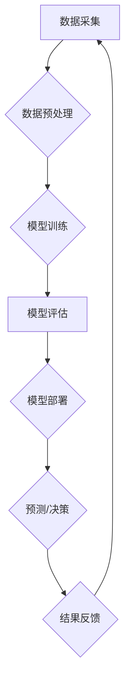

> 人工智能，深度学习，机器学习，自然语言处理，计算机视觉，应用场景，未来趋势

## 1. 背景介绍

人工智能（AI）作为一项前沿科技，近年来发展迅速，并开始在各个领域得到广泛应用。从智能语音助手到自动驾驶汽车，从医疗诊断到金融风险评估，AI技术正在深刻地改变着我们的生活和工作方式。

随着计算能力的提升、算法的不断改进以及海量数据的积累，AI技术正迈向一个新的发展阶段。未来，AI将更加智能化、个性化和普惠化，并将在更多领域发挥重要作用。

## 2. 核心概念与联系

**2.1  人工智能（AI）**

人工智能是指模拟人类智能行为的计算机系统。它涵盖了多个子领域，例如机器学习、深度学习、自然语言处理、计算机视觉等。

**2.2  机器学习（ML）**

机器学习是人工智能的一个重要分支，它通过算法训练模型，使模型能够从数据中学习并做出预测或决策。机器学习算法可以分为监督学习、无监督学习和强化学习三大类。

**2.3  深度学习（DL）**

深度学习是机器学习的一个子领域，它使用多层神经网络来模拟人类大脑的学习过程。深度学习算法能够处理复杂的数据，并取得了在图像识别、语音识别、自然语言处理等领域突破性的进展。

**2.4  自然语言处理（NLP）**

自然语言处理是指使计算机能够理解、处理和生成人类语言的技术。NLP应用广泛，例如机器翻译、文本摘要、情感分析等。

**2.5  计算机视觉（CV）**

计算机视觉是指使计算机能够“看”和理解图像的技术。计算机视觉应用广泛，例如图像识别、物体检测、场景理解等。

**2.6  AI应用场景**

AI技术已广泛应用于各个领域，例如：

* **医疗保健:** 疾病诊断、药物研发、个性化医疗
* **金融服务:** 风险评估、欺诈检测、投资决策
* **制造业:** 自动化生产、质量控制、 predictive maintenance
* **零售业:** 个性化推荐、库存管理、客户服务
* **交通运输:** 自动驾驶、交通管理、物流优化

**2.7  AI技术架构**



## 3. 核心算法原理 & 具体操作步骤

### 3.1  算法原理概述

**3.1.1  监督学习**

监督学习算法通过训练数据中的输入和输出对模型进行训练。训练数据包含了输入特征和对应的目标输出。模型的目标是学习一个映射关系，将输入特征映射到对应的目标输出。

**3.1.2  无监督学习**

无监督学习算法通过未标记的数据进行训练。模型的目标是发现数据中的潜在结构或模式。

**3.1.3  强化学习**

强化学习算法通过与环境交互学习。模型通过采取行动并观察环境的反馈，学习如何最大化奖励。

### 3.2  算法步骤详解

**3.2.1  监督学习算法步骤**

1. 数据收集和预处理
2. 特征工程
3. 模型选择
4. 模型训练
5. 模型评估
6. 模型部署

**3.2.2  无监督学习算法步骤**

1. 数据收集和预处理
2. 特征工程
3. 模型选择
4. 模型训练
5. 模型评估

**3.2.3  强化学习算法步骤**

1. 环境建模
2. 策略选择
3. 奖励设计
4. 训练过程
5. 策略评估

### 3.3  算法优缺点

**3.3.1  监督学习算法**

* 优点：准确率高，可解释性强
* 缺点：需要大量标记数据，容易过拟合

**3.3.2  无监督学习算法**

* 优点：不需要标记数据，可以发现数据中的潜在结构
* 缺点：准确率相对较低，可解释性弱

**3.3.3  强化学习算法**

* 优点：能够学习复杂的任务，适应性强
* 缺点：训练过程复杂，需要大量的试错

### 3.4  算法应用领域

**3.4.1  监督学习算法**

* 医疗诊断
* 欺诈检测
* 预测分析

**3.4.2  无监督学习算法**

* 数据聚类
* 异常检测
* 降维

**3.4.3  强化学习算法**

* 自动驾驶
* 游戏AI
* 机器人控制

## 4. 数学模型和公式 & 详细讲解 & 举例说明

### 4.1  数学模型构建

**4.1.1  线性回归模型**

线性回归模型假设数据之间存在线性关系。模型的目标是找到一条直线，使得这条直线与数据点之间的距离最小。

**4.1.2  逻辑回归模型**

逻辑回归模型用于二分类问题。模型将输入特征映射到一个概率值，该概率值表示输入属于某个类别的概率。

**4.1.3  神经网络模型**

神经网络模型由多个层组成，每层包含多个神经元。神经元之间通过权重连接，并使用激活函数进行非线性变换。

### 4.2  公式推导过程

**4.2.1  线性回归模型损失函数**

$$
J(\theta) = \frac{1}{2m} \sum_{i=1}^{m} (h_\theta(x^{(i)}) - y^{(i)})^2
$$

其中：

* $J(\theta)$ 是损失函数
* $\theta$ 是模型参数
* $m$ 是训练样本数量
* $h_\theta(x^{(i)})$ 是模型预测值
* $y^{(i)}$ 是真实值

**4.2.2  梯度下降算法**

梯度下降算法用于优化模型参数，使其最小化损失函数。

$$
\theta_j := \theta_j - \alpha \frac{\partial J(\theta)}{\partial \theta_j}
$$

其中：

* $\alpha$ 是学习率

### 4.3  案例分析与讲解

**4.3.1  线性回归模型案例**

假设我们有一个数据集，包含房屋面积和房屋价格的信息。我们可以使用线性回归模型来预测房屋价格。

**4.3.2  逻辑回归模型案例**

假设我们有一个数据集，包含客户的购买行为信息。我们可以使用逻辑回归模型来预测客户是否会购买某个产品。

## 5. 项目实践：代码实例和详细解释说明

### 5.1  开发环境搭建

* Python 3.x
* TensorFlow 或 PyTorch
* Jupyter Notebook

### 5.2  源代码详细实现

```python
# 使用 TensorFlow 实现线性回归模型

import tensorflow as tf

# 定义模型
model = tf.keras.models.Sequential([
    tf.keras.layers.Dense(units=1, input_shape=[1])
])

# 编译模型
model.compile(optimizer='sgd', loss='mean_squared_error')

# 训练模型
model.fit(x_train, y_train, epochs=100)

# 预测
predictions = model.predict(x_test)
```

### 5.3  代码解读与分析

* `tf.keras.models.Sequential` 创建一个顺序模型，即层级结构。
* `tf.keras.layers.Dense` 创建一个全连接层，输入维度为1，输出维度为1。
* `model.compile` 编译模型，指定优化器、损失函数和指标。
* `model.fit` 训练模型，输入训练数据和训练轮数。
* `model.predict` 使用训练好的模型预测测试数据。

### 5.4  运行结果展示

训练完成后，我们可以使用测试数据评估模型的性能，例如计算均方误差（MSE）。

## 6. 实际应用场景

### 6.1  医疗保健

* **疾病诊断:** AI算法可以分析患者的医疗影像、病历和基因信息，辅助医生诊断疾病。
* **药物研发:** AI可以加速药物研发过程，例如预测药物的有效性、安全性以及潜在的副作用。
* **个性化医疗:** AI可以根据患者的个体特征，提供个性化的治疗方案和健康建议。

### 6.2  金融服务

* **风险评估:** AI可以分析客户的财务数据和行为模式，评估其信用风险和投资风险。
* **欺诈检测:** AI可以识别异常交易行为，帮助金融机构防范欺诈。
* **投资决策:** AI可以分析市场数据和投资策略，为投资者提供投资建议。

### 6.3  制造业

* **自动化生产:** AI可以控制机器人和自动化设备，提高生产效率和产品质量。
* **质量控制:** AI可以识别产品缺陷，提高产品质量。
* **预测性维护:** AI可以分析设备运行数据，预测设备故障，并及时进行维护。

### 6.4  未来应用展望

AI技术的发展将带来更多新的应用场景，例如：

* **智能教育:** AI可以个性化教学，提高学习效率。
* **智能交通:** AI可以优化交通流量，提高交通安全。
* **智能城市:** AI可以帮助城市管理者提高城市效率和居民生活质量。

## 7. 工具和资源推荐

### 7.1  学习资源推荐

* **在线课程:** Coursera、edX、Udacity
* **书籍:** 《深度学习》、《机器学习实战》
* **博客:** Towards Data Science、Machine Learning Mastery

### 7.2  开发工具推荐

* **Python:** 编程语言
* **TensorFlow:** 深度学习框架
* **PyTorch:** 深度学习框架
* **Jupyter Notebook:** 数据分析和可视化工具

### 7.3  相关论文推荐

* **《ImageNet Classification with Deep Convolutional Neural Networks》**
* **《Attention Is All You Need》**
* **《Generative Adversarial Networks》**

## 8. 总结：未来发展趋势与挑战

### 8.1  研究成果总结

近年来，AI技术取得了显著进展，在多个领域取得了突破性的成果。例如，在图像识别、语音识别、自然语言处理等领域，AI算法的性能已经超过了人类水平。

### 8.2  未来发展趋势

* **模型规模和复杂度提升:** 未来，AI模型将更加大规模、更加复杂，能够处理更加复杂的数据和任务。
* **跨模态学习:** 未来，AI将能够跨越不同模态的数据，例如文本、图像、音频等，进行更深入的理解和分析。
* **边缘计算:** 未来，AI将更加靠近数据源，在边缘设备上进行计算，降低延迟和提高效率。

### 8.3  面临的挑战

* **数据隐私和安全:** AI算法依赖于大量数据，如何保护数据隐私和安全是一个重要的挑战。
* **算法可解释性:** 许多AI算法是黑箱模型，难以解释其决策过程，这可能会导致信任问题。
* **伦理问题:** AI技术的发展引发了一些伦理问题，例如算法偏见、工作岗位替代等，需要认真思考和解决。

### 8.4  研究展望

未来，AI研究将继续朝着更智能、更安全、更可解释的方向发展。我们需要加强基础研究，探索新的算法和模型，并制定相应的政策和规范，引导AI技术健康发展，造福人类社会。

## 9. 附录：常见问题与解答

**9.1  什么是AI？**

人工智能（AI）是指模拟人类智能行为的计算机系统。

**9.2  AI有哪些应用场景？**

AI已广泛应用于各个领域，例如医疗保健、金融服务、制造业、零售业等。

**9.3  如何学习AI？**

可以通过在线课程、书籍、博客等方式学习AI。

**9.4  AI技术有哪些挑战？**

AI技术面临着数据隐私和安全、算法可解释性和伦理问题等挑战。