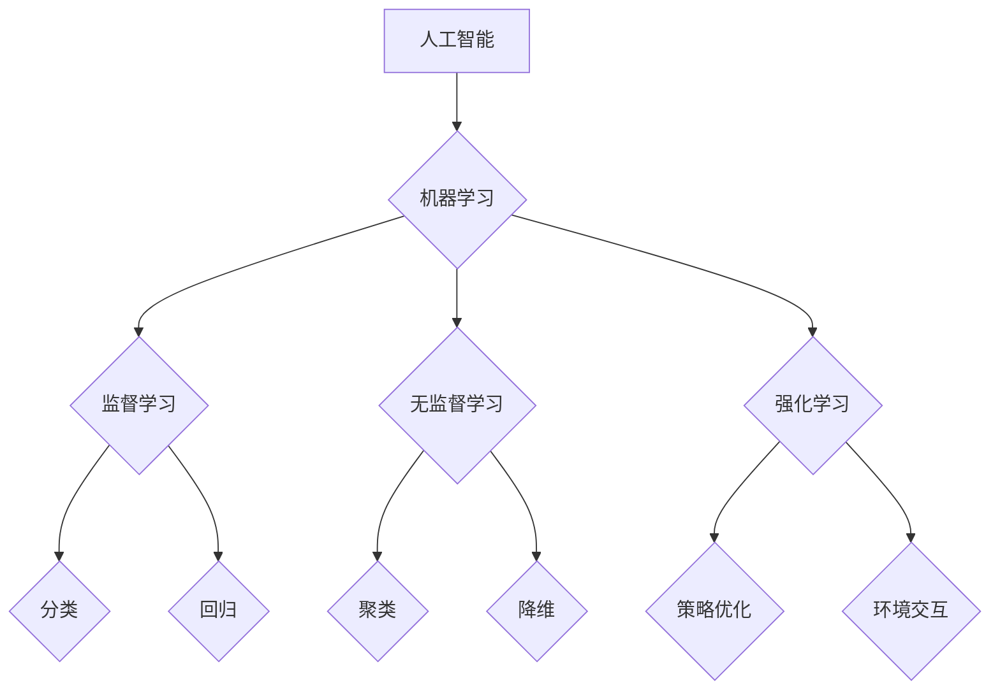

> 人工智能、机器学习、深度学习、自然语言处理、计算机视觉、伦理、未来趋势

## 1. 背景介绍

人工智能（Artificial Intelligence，简称AI）作为一项跨学科研究领域，旨在构建能够模拟人类智能的机器。自20世纪50年代诞生以来，AI研究经历了多次兴衰，并在近年来取得了显著进展。

**1.1 AI发展历程**

* **早期阶段（1950s-1970s）：** 
    * 诞生于20世纪50年代，早期AI研究主要集中于符号逻辑、规则系统和专家系统等领域。
    * 代表性成果包括：
        * 1950年，图灵提出著名的“图灵测试”，用于评估机器是否具有智能。
        * 1956年，达特茅斯会议被认为是人工智能的正式诞生日。
        * 1966年，ELIZA问世，这是第一个能够进行自然语言对话的聊天机器人。
* **AI冬天（1970s-1980s）：** 
    * 由于早期AI技术难以实现预期目标，以及计算资源的限制，AI研究经历了一段低谷期，被称为“AI冬天”。
* **专家系统时代（1980s-1990s）：** 
    * 随着专家系统技术的兴起，AI研究重新焕发生机。
    * 代表性成果包括：
        * MYCIN系统，用于诊断细菌感染。
        * XCON系统，用于配置计算机硬件。
* **机器学习时代（2000s-至今）：** 
    * 随着大数据和计算能力的飞速发展，机器学习技术取得了突破性进展，成为AI研究的热点领域。
    * 代表性成果包括：
        * 2011年，IBM的Watson系统在Jeopardy!问答比赛中战胜了人类选手。
        * 2016年，AlphaGo击败了世界围棋冠军李世石。
        * 2022年，ChatGPT的问世引发了全球对AI技术的关注。

**1.2 AI研究现状**

目前，AI研究涵盖了多个领域，包括：

* **机器学习：** 
    * 训练机器从数据中学习，并做出预测或决策。
    * 包括监督学习、无监督学习和强化学习等。
* **深度学习：** 
    * 使用多层神经网络进行特征提取和学习。
    * 在图像识别、语音识别、自然语言处理等领域取得了突破性进展。
* **自然语言处理：** 
    * 使计算机能够理解和处理人类语言。
    * 包括文本分类、机器翻译、对话系统等。
* **计算机视觉：** 
    * 使计算机能够“看”和理解图像和视频。
    * 包括图像识别、物体检测、图像分割等。
* **机器人学：** 
    * 设计和构建能够执行特定任务的机器人。
    * 包括移动机器人、工业机器人、服务机器人等。

## 2. 核心概念与联系

**2.1 核心概念**

* **人工智能（AI）：** 
    * 旨在构建能够模拟人类智能的机器。
* **机器学习（ML）：** 
    * 使机器从数据中学习，并做出预测或决策。
* **深度学习（DL）：** 
    * 使用多层神经网络进行特征提取和学习。
* **神经网络（NN）：** 
    * 仿照人脑神经元结构的计算模型。
* **算法：** 
    * 解决特定问题的步骤或规则。

**2.2 核心概念联系**

AI是机器学习、深度学习等技术的总称。机器学习是AI的核心技术之一，它通过算法训练机器从数据中学习。深度学习是机器学习的一种，它使用多层神经网络进行特征提取和学习，能够处理更复杂的数据。

**2.3 Mermaid 流程图**



## 3. 核心算法原理 & 具体操作步骤

**3.1 算法原理概述**

机器学习算法的核心是通过学习数据中的模式和规律，从而能够对新的数据进行预测或分类。常见的机器学习算法包括：

* **线性回归：** 
    * 用于预测连续数值。
* **逻辑回归：** 
    * 用于预测分类结果。
* **决策树：** 
    * 用于分类和回归。
* **支持向量机（SVM）：** 
    * 用于分类和回归。
* **k近邻（KNN）：** 
    * 用于分类和回归。
* **朴素贝叶斯：** 
    * 用于分类。
* **随机森林：** 
    * 用于分类和回归。
* **梯度提升树（GBDT）：** 
    * 用于分类和回归。

**3.2 算法步骤详解**

以线性回归为例，其步骤如下：

1. **数据准备：** 
    * 收集和预处理数据，包括清洗、转换和特征工程。
2. **模型训练：** 
    * 使用训练数据训练线性回归模型，找到最佳的模型参数。
3. **模型评估：** 
    * 使用测试数据评估模型的性能，例如使用均方误差（MSE）或R-squared。
4. **模型调优：** 
    * 根据评估结果，调整模型参数，以提高模型性能。
5. **模型部署：** 
    * 将训练好的模型部署到实际应用场景中，用于预测新的数据。

**3.3 算法优缺点**

不同的机器学习算法具有不同的优缺点，需要根据具体应用场景选择合适的算法。

**3.4 算法应用领域**

机器学习算法广泛应用于各个领域，例如：

* **金融：** 
    * 欺诈检测、信用评分、风险管理。
* **医疗：** 
    * 疾病诊断、药物研发、患者个性化治疗。
* **电商：** 
    * 商品推荐、用户画像、价格预测。
* **交通：** 
    * 自驾车、交通流量预测、路线规划。

## 4. 数学模型和公式 & 详细讲解 & 举例说明

**4.1 数学模型构建**

线性回归模型的数学模型如下：

$$
y = w_0 + w_1x_1 + w_2x_2 + ... + w_nx_n + \epsilon
$$

其中：

* $y$ 是预测值。
* $w_0, w_1, w_2, ..., w_n$ 是模型参数。
* $x_1, x_2, ..., x_n$ 是输入特征。
* $\epsilon$ 是误差项。

**4.2 公式推导过程**

线性回归模型的目标是找到最佳的模型参数，使得预测值与真实值之间的误差最小。常用的误差函数是均方误差（MSE）：

$$
MSE = \frac{1}{n} \sum_{i=1}^{n} (y_i - \hat{y}_i)^2
$$

其中：

* $n$ 是样本数量。
* $y_i$ 是真实值。
* $\hat{y}_i$ 是预测值。

通过最小化MSE，可以得到最佳的模型参数。

**4.3 案例分析与讲解**

假设我们想要预测房屋价格，输入特征包括房屋面积、房间数量、地理位置等。我们可以使用线性回归模型训练一个模型，并根据模型预测新的房屋价格。

## 5. 项目实践：代码实例和详细解释说明

**5.1 开发环境搭建**

* Python 3.x
* scikit-learn 库

**5.2 源代码详细实现**

```python
from sklearn.linear_model import LinearRegression
from sklearn.model_selection import train_test_split
import pandas as pd

# 加载数据
data = pd.read_csv('house_price.csv')

# 分割数据
X = data[['area', 'rooms', 'location']]
y = data['price']
X_train, X_test, y_train, y_test = train_test_split(X, y, test_size=0.2, random_state=42)

# 创建线性回归模型
model = LinearRegression()

# 训练模型
model.fit(X_train, y_train)

# 预测测试数据
y_pred = model.predict(X_test)

# 评估模型性能
from sklearn.metrics import mean_squared_error
mse = mean_squared_error(y_test, y_pred)
print(f'Mean Squared Error: {mse}')
```

**5.3 代码解读与分析**

* 首先，我们加载数据并将其分割成训练集和测试集。
* 然后，我们创建线性回归模型并使用训练集训练模型。
* 接下来，我们使用训练好的模型预测测试数据。
* 最后，我们使用均方误差（MSE）评估模型的性能。

**5.4 运行结果展示**

运行代码后，会输出模型的MSE值，该值越小，模型的性能越好。

## 6. 实际应用场景

**6.1 医疗诊断**

* 使用机器学习算法分析患者的医疗记录、影像数据等，辅助医生进行疾病诊断。

**6.2 金融风险评估**

* 使用机器学习算法分析客户的财务数据、信用记录等，评估客户的信用风险。

**6.3 欺诈检测**

* 使用机器学习算法分析交易数据、用户行为等，识别欺诈交易。

**6.4 个性化推荐**

* 使用机器学习算法分析用户的行为数据、偏好等，推荐个性化的商品、服务等。

**6.5 自动驾驶**

* 使用机器学习算法分析车辆传感器数据、道路环境等，实现自动驾驶功能。

**6.4 未来应用展望**

AI技术将继续在各个领域发挥越来越重要的作用，例如：

* **更智能的虚拟助手：** 能够更好地理解和响应用户的需求。
* **个性化教育：** 根据学生的学习进度和特点提供个性化的学习方案。
* **更精准的医疗诊断和治疗：** 帮助医生更快、更准确地诊断和治疗疾病。
* **更安全的交通系统：** 减少交通事故，提高交通效率。

## 7. 工具和资源推荐

**7.1 学习资源推荐**

* **在线课程：** Coursera、edX、Udacity 等平台提供丰富的AI课程。
* **书籍：** 《深度学习》、《机器学习实战》等书籍。
* **博客和论坛：** 机器学习社区、AI研究博客等。

**7.2 开发工具推荐**

* **Python：** 广泛用于AI开发的编程语言。
* **TensorFlow：** 开源深度学习框架。
* **PyTorch：** 开源深度学习框架。
* **scikit-learn：** 机器学习库。

**7.3 相关论文推荐**

* **《ImageNet Classification with Deep Convolutional Neural Networks》**
* **《Attention Is All You Need》**
* **《BERT: Pre-training of Deep Bidirectional Transformers for Language Understanding》**

## 8. 总结：未来发展趋势与挑战

**8.1 研究成果总结**

近年来，AI技术取得了显著进展，在图像识别、语音识别、自然语言处理等领域取得了突破性成果。

**8.2 未来发展趋势**

* **更强大的计算能力：** 随着计算能力的提升，AI模型将能够处理更复杂的数据，并取得更优的性能。
* **更丰富的算法：** 研究人员将继续开发新的AI算法，以解决更复杂的问题。
* **更广泛的应用场景：** AI技术将应用于更多领域，例如医疗、教育、金融等。

