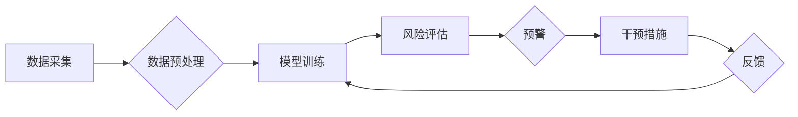

> 客户流失预警系统，人工智能，机器学习，预测模型，数据分析，客户关系管理

## 1. 背景介绍

在当今数据爆炸的时代，企业积累了海量客户数据，如何有效利用这些数据来预测和预防客户流失，成为了企业竞争力的关键因素。传统的客户流失预警系统主要依赖于规则引擎和历史数据分析，但这些方法往往难以捕捉到客户行为的复杂性和动态性。

随着人工智能（AI）技术的快速发展，特别是机器学习（ML）算法的进步，AI驱动的客户流失预警系统应运而生。这些系统能够利用机器学习算法从海量客户数据中挖掘出隐藏的模式和趋势，更准确地预测客户流失风险，并为企业提供个性化的干预措施。

## 2. 核心概念与联系

**2.1 客户流失预警系统概述**

客户流失预警系统旨在通过分析客户行为数据，识别潜在流失客户，并及时发出预警，以便企业采取措施挽留客户。

**2.2 人工智能与机器学习**

人工智能（AI）是指模拟人类智能的计算机系统，而机器学习（ML）则是人工智能的一个子领域，它使计算机能够从数据中学习，并根据学习到的知识进行预测或决策。

**2.3 核心架构**

AI驱动的客户流失预警系统通常包含以下核心组件：

* **数据采集与预处理:** 收集来自各种渠道的客户数据，并进行清洗、转换和特征工程等预处理操作。
* **模型训练:** 利用机器学习算法对预处理后的数据进行训练，构建客户流失预测模型。
* **风险评估与预警:** 将新客户数据输入到训练好的模型中，评估客户流失风险，并根据预警阈值发出预警。
* **干预措施与反馈:** 根据预警结果，企业可以采取个性化的干预措施，例如发送促销信息、提供客户服务等，并收集干预效果反馈，用于模型优化。

**2.4 Mermaid 流程图**



## 3. 核心算法原理 & 具体操作步骤

**3.1 算法原理概述**

常见的客户流失预测算法包括：

* **逻辑回归:** 用于二分类问题，预测客户是否流失的概率。
* **支持向量机 (SVM):** 通过寻找最佳的分隔超平面，将客户分为流失和非流失两类。
* **决策树:** 通过一系列的决策规则，将客户分类到不同的流失风险等级。
* **随机森林:** 结合多个决策树，提高预测精度。
* **梯度提升树 (GBDT):** 通过迭代训练多个弱学习器，构建强学习器，提高预测精度。

**3.2 算法步骤详解**

以逻辑回归为例，其训练步骤如下：

1. **数据准备:** 收集客户数据，并进行特征选择和编码。
2. **模型训练:** 使用训练数据训练逻辑回归模型，学习客户流失的特征和概率关系。
3. **模型评估:** 使用测试数据评估模型的预测精度，例如准确率、召回率、F1-score等。
4. **模型调参:** 根据评估结果，调整模型参数，提高预测精度。
5. **模型部署:** 将训练好的模型部署到生产环境中，用于预测新客户的流失风险。

**3.3 算法优缺点**

不同的算法具有不同的优缺点，需要根据实际情况选择合适的算法。

* **逻辑回归:** 优点：易于理解和实现，训练速度快；缺点：对非线性关系的拟合能力较弱。
* **支持向量机 (SVM):** 优点：对高维数据具有较好的泛化能力；缺点：训练时间较长，参数选择较复杂。
* **决策树:** 优点：易于理解和解释，可以处理非数值型特征；缺点：容易过拟合，预测精度较低。
* **随机森林:** 优点：提高了决策树的预测精度，具有较好的鲁棒性；缺点：训练时间较长，解释性较差。
* **梯度提升树 (GBDT):** 优点：预测精度高，可以处理复杂的数据关系；缺点：训练时间较长，容易过拟合。

**3.4 算法应用领域**

客户流失预测算法广泛应用于各个行业，例如：

* 电商：预测客户 churn，提高客户留存率。
* 金融：预测客户违约风险，降低贷款损失率。
* Telecom：预测客户流失，提高客户忠诚度。
* SaaS：预测客户续订率，提高收入增长。

## 4. 数学模型和公式 & 详细讲解 & 举例说明

**4.1 数学模型构建**

逻辑回归模型的数学模型如下：

$$
P(y=1|x) = \frac{1}{1 + e^{-(w^T x + b)}}
$$

其中：

* $P(y=1|x)$ 是给定特征向量 $x$ 时，客户流失的概率。
* $w$ 是模型参数向量，代表每个特征的权重。
* $b$ 是模型偏置项。
* $x$ 是客户特征向量。
* $e$ 是自然对数的底数。

**4.2 公式推导过程**

逻辑回归模型的损失函数是交叉熵损失函数，其目标是最小化模型预测结果与真实标签之间的差异。

$$
L(w,b) = -\frac{1}{n} \sum_{i=1}^{n} [y_i \log(P(y_i=1|x_i)) + (1-y_i) \log(1-P(y_i=1|x_i))]
$$

其中：

* $n$ 是样本数量。
* $y_i$ 是第 $i$ 个样本的真实标签 (0 或 1)。

通过梯度下降算法，可以迭代更新模型参数 $w$ 和 $b$，使损失函数最小化。

**4.3 案例分析与讲解**

假设我们有一个电商平台，想要预测客户流失风险。我们可以收集客户的购买历史、浏览记录、评价信息等数据，作为特征向量 $x$。

通过训练逻辑回归模型，我们可以得到每个特征的权重 $w$，以及偏置项 $b$。

例如，如果模型的输出结果为 0.8，则表示该客户流失的概率为 80%。

## 5. 项目实践：代码实例和详细解释说明

**5.1 开发环境搭建**

* 操作系统：Windows/macOS/Linux
* Python 版本：3.6+
* 必要的库：pandas, scikit-learn, matplotlib, seaborn

**5.2 源代码详细实现**

```python
import pandas as pd
from sklearn.model_selection import train_test_split
from sklearn.linear_model import LogisticRegression
from sklearn.metrics import accuracy_score

# 1. 数据加载和预处理
data = pd.read_csv('customer_data.csv')

# 特征选择和编码
features = ['purchase_frequency', 'average_order_value', 'customer_lifetime_value']
target = 'churn'

X = data[features]
y = data[target]

# 数据分割
X_train, X_test, y_train, y_test = train_test_split(X, y, test_size=0.2, random_state=42)

# 2. 模型训练
model = LogisticRegression()
model.fit(X_train, y_train)

# 3. 模型评估
y_pred = model.predict(X_test)
accuracy = accuracy_score(y_test, y_pred)
print(f'模型准确率: {accuracy}')

# 4. 预测新客户流失风险
new_customer_data = pd.DataFrame({'purchase_frequency': [2], 'average_order_value': [100], 'customer_lifetime_value': [500]})
new_customer_churn_probability = model.predict_proba(new_customer_data)[:, 1]
print(f'新客户流失概率: {new_customer_churn_probability}')
```

**5.3 代码解读与分析**

* 代码首先加载数据，并进行特征选择和编码。
* 然后将数据分割为训练集和测试集。
* 接着训练逻辑回归模型，并使用测试集评估模型的准确率。
* 最后，使用训练好的模型预测新客户的流失概率。

**5.4 运行结果展示**

运行代码后，会输出模型的准确率和新客户的流失概率。

## 6. 实际应用场景

**6.1 电商平台**

电商平台可以利用AI驱动的客户流失预警系统，识别即将流失的客户，并采取个性化的干预措施，例如发送优惠券、提供专属客服服务等，提高客户留存率和复购率。

**6.2 金融机构**

金融机构可以利用AI驱动的客户流失预警系统，预测客户违约风险，及时采取措施降低贷款损失率，并为高风险客户提供个性化的风险管理服务。

**6.3 Telecom运营商**

Telecom运营商可以利用AI驱动的客户流失预警系统，识别即将流失的客户，并采取措施挽留客户，例如提供优惠套餐、升级服务等，提高客户忠诚度和收入增长。

**6.4 SaaS企业**

SaaS企业可以利用AI驱动的客户流失预警系统，预测客户续订率，及时采取措施提高续订率，并为即将流失的客户提供个性化的服务，例如提供技术支持、培训等，降低流失率。

**6.5 未来应用展望**

随着人工智能技术的不断发展，AI驱动的客户流失预警系统将更加智能化、个性化和精准化。未来，我们可以期待以下应用场景：

* 基于行为分析的个性化预警：根据客户的具体行为模式，提供更精准的流失预警和干预措施。
* 多渠道数据融合：整合来自不同渠道的客户数据，构建更全面的客户画像，提高预测精度。
* 预测性维护：通过预测客户潜在的痛点和需求，提前提供解决方案，降低流失风险。

## 7. 工具和资源推荐

**7.1 学习资源推荐**

* **书籍:**
    * 《Python机器学习》
    * 《机器学习实战》
    * 《深入理解机器学习》
* **在线课程:**
    * Coursera: 机器学习
    * edX: 数据科学
    * Udacity: 机器学习工程师

**7.2 开发工具推荐**

* **Python:** 
    * scikit-learn: 机器学习库
    * pandas: 数据分析库
    * matplotlib: 数据可视化库
    * seaborn: 数据可视化库
* **云平台:**
    * AWS SageMaker
    * Azure Machine Learning
    * Google Cloud AI Platform

**7.3 相关论文推荐**

* 《Customer Churn Prediction Using Machine Learning》
* 《A Survey on Customer Churn Prediction》
* 《Deep Learning for Customer Churn Prediction》

## 8. 总结：未来发展趋势与挑战

**8.1 研究成果总结**

AI驱动的客户流失预警系统已经取得了显著的成果，能够有效提高客户留存率和收入增长。

**8.2 未来发展趋势**

未来，AI驱动的客户流失预警系统将朝着以下方向发展：

* 更智能化：利用深度学习等更先进的算法，提高预测精度和个性化程度。
* 更精准化：整合来自更多渠道的客户数据，构建更全面的客户画像，提供更精准的预警和干预措施。
* 更自动化：实现端到端的自动化流程，从数据采集到模型部署，降低人工成本和操作难度。

**8.3 面临的挑战**

AI驱动的客户流失预警系统