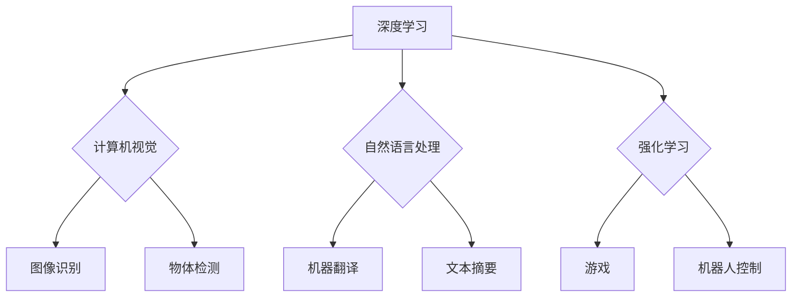

> 人工智能，深度学习，计算机视觉，自然语言处理，强化学习，伦理，未来趋势

## 1. 背景介绍

人工智能（AI）正以惊人的速度发展，深刻地改变着我们生活的方方面面。从自动驾驶汽车到智能语音助手，AI技术已经渗透到我们的日常生活中。作为AI领域的领军人物之一，Andrej Karpathy对AI的未来发展有着深刻的洞察和思考。

Andrej Karpathy是一位享誉世界的计算机科学家，曾担任特斯拉自动驾驶团队的负责人，现任OpenAI的总监。他是一位杰出的研究者和工程师，在深度学习、计算机视觉和强化学习等领域做出了重要贡献。他的研究成果被广泛应用于自动驾驶、图像识别、语音识别等领域。

## 2. 核心概念与联系

**2.1 深度学习**

深度学习是机器学习的一个子领域，它利用多层神经网络来模拟人类大脑的学习过程。深度学习模型能够从海量数据中自动提取特征，从而实现更准确的预测和决策。

**2.2 计算机视觉**

计算机视觉是让计算机“看”世界的一种技术，它旨在使计算机能够理解和解释图像和视频。计算机视觉技术广泛应用于图像识别、物体检测、场景理解等领域。

**2.3 自然语言处理**

自然语言处理（NLP）是让计算机“理解”人类语言的技术，它旨在使计算机能够理解、生成和处理自然语言文本。NLP技术广泛应用于机器翻译、文本摘要、聊天机器人等领域。

**2.4 强化学习**

强化学习是一种机器学习方法，它通过奖励和惩罚机制来训练智能体，使其在特定环境中做出最优决策。强化学习技术广泛应用于游戏、机器人控制、自动驾驶等领域。

**2.5 伦理问题**

随着AI技术的快速发展，其伦理问题也日益凸显。例如，AI算法的偏见、数据隐私保护、AI的责任归属等问题都需要认真思考和解决。

**Mermaid 流程图**



## 3. 核心算法原理 & 具体操作步骤

### 3.1 算法原理概述

深度学习算法的核心是多层神经网络。神经网络由多个层组成，每层包含多个神经元。每个神经元接收来自上一层的输入信号，并对其进行处理，然后将处理后的信号传递给下一层的输入。通过训练神经网络，使其能够从数据中学习特征，并进行预测或决策。

### 3.2 算法步骤详解

1. **数据预处理:** 将原始数据转换为深度学习模型可以理解的格式。
2. **网络结构设计:** 根据任务需求设计神经网络的结构，包括层数、神经元数量、激活函数等。
3. **参数初始化:** 为神经网络的参数进行随机初始化。
4. **前向传播:** 将输入数据通过神经网络进行前向传播，得到输出结果。
5. **损失函数计算:** 计算输出结果与真实值的差异，即损失函数值。
6. **反向传播:** 根据损失函数值，反向传播误差信号，更新神经网络的参数。
7. **迭代训练:** 重复步骤4-6，直到损失函数值达到预设阈值。

### 3.3 算法优缺点

**优点:**

* 能够自动提取特征，无需人工特征工程。
* 能够处理海量数据，学习复杂模式。
* 在图像识别、自然语言处理等领域取得了突破性进展。

**缺点:**

* 训练数据量大，计算资源消耗高。
* 模型解释性差，难以理解模型的决策过程。
* 容易受到数据偏差的影响，导致模型偏见。

### 3.4 算法应用领域

深度学习算法广泛应用于以下领域:

* **计算机视觉:** 图像识别、物体检测、场景理解、图像生成。
* **自然语言处理:** 机器翻译、文本摘要、问答系统、聊天机器人。
* **语音识别:** 语音转文本、语音合成。
* **推荐系统:** 商品推荐、内容推荐。
* **医疗诊断:** 病情诊断、疾病预测。

## 4. 数学模型和公式 & 详细讲解 & 举例说明

### 4.1 数学模型构建

深度学习模型的核心是神经网络，其数学模型可以表示为一系列的矩阵运算。

**神经元激活函数:**

$$
f(x) = \sigma(x)
$$

其中，$x$ 是神经元的输入，$\sigma(x)$ 是激活函数，例如 sigmoid 函数、ReLU 函数等。

**神经网络层:**

$$
y = W x + b
$$

其中，$y$ 是神经网络层的输出，$W$ 是权重矩阵，$x$ 是输入向量，$b$ 是偏置向量。

### 4.2 公式推导过程

深度学习模型的训练过程是通过反向传播算法来进行的。反向传播算法的核心是计算损失函数对模型参数的梯度，并根据梯度更新模型参数。

**损失函数:**

$$
L(y, \hat{y})
$$

其中，$y$ 是真实值，$\hat{y}$ 是模型预测值。

**梯度下降算法:**

$$
\theta = \theta - \alpha \nabla L(\theta)
$$

其中，$\theta$ 是模型参数，$\alpha$ 是学习率，$\nabla L(\theta)$ 是损失函数对模型参数的梯度。

### 4.3 案例分析与讲解

例如，在图像识别任务中，深度学习模型可以学习图像特征，并将其映射到类别标签。训练过程中，模型会根据图像标签的真实值和模型预测值计算损失函数，并通过反向传播算法更新模型参数。

## 5. 项目实践：代码实例和详细解释说明

### 5.1 开发环境搭建

深度学习项目开发通常需要以下环境：

* 操作系统: Linux, macOS, Windows
* Python: 3.6+
* 深度学习框架: TensorFlow, PyTorch, Keras
* GPU: 加速深度学习训练

### 5.2 源代码详细实现

以下是一个使用 TensorFlow 实现图像分类的简单代码示例：

```python
import tensorflow as tf

# 定义模型结构
model = tf.keras.models.Sequential([
    tf.keras.layers.Conv2D(32, (3, 3), activation='relu', input_shape=(28, 28, 1)),
    tf.keras.layers.MaxPooling2D((2, 2)),
    tf.keras.layers.Conv2D(64, (3, 3), activation='relu'),
    tf.keras.layers.MaxPooling2D((2, 2)),
    tf.keras.layers.Flatten(),
    tf.keras.layers.Dense(10, activation='softmax')
])

# 编译模型
model.compile(optimizer='adam',
              loss='sparse_categorical_crossentropy',
              metrics=['accuracy'])

# 训练模型
model.fit(x_train, y_train, epochs=5)

# 评估模型
loss, accuracy = model.evaluate(x_test, y_test)
print('Test loss:', loss)
print('Test accuracy:', accuracy)
```

### 5.3 代码解读与分析

这段代码定义了一个简单的卷积神经网络模型，用于图像分类任务。模型包含两层卷积层、两层最大池化层、一层全连接层和一层输出层。

* **Conv2D:** 卷积层，用于提取图像特征。
* **MaxPooling2D:** 最大池化层，用于降维和提高模型鲁棒性。
* **Flatten:** 将多维数据转换为一维向量。
* **Dense:** 全连接层，用于分类。
* **softmax:** 激活函数，用于将输出值映射到概率分布。

### 5.4 运行结果展示

训练完成后，模型可以用于预测新的图像类别。

## 6. 实际应用场景

### 6.1 自动驾驶

深度学习技术在自动驾驶领域发挥着重要作用，例如：

* **图像识别:** 识别道路标志、交通信号灯、行人、车辆等。
* **场景理解:** 理解道路环境、预测车辆运动轨迹。
* **路径规划:** 规划最优行驶路径。

### 6.2 医疗诊断

深度学习技术可以辅助医生进行疾病诊断，例如：

* **图像分析:** 分析X光片、CT扫描、MRI图像，识别肿瘤、骨折等异常。
* **病历分析:** 分析患者病历，预测疾病风险。

### 6.3 人工翻译

深度学习技术可以实现机器翻译，例如：

* **神经机器翻译:** 使用深度神经网络进行机器翻译，提高翻译质量和流畅度。

### 6.4 未来应用展望

深度学习技术在未来将应用于更多领域，例如：

* **个性化教育:** 根据学生的学习情况提供个性化学习方案。
* **金融风险管理:** 识别金融风险，降低投资损失。
* **科学研究:** 加速科学发现，推动科技进步。

## 7. 工具和资源推荐

### 7.1 学习资源推荐

* **书籍:**
    * 深度学习 (Deep Learning) - Ian Goodfellow, Yoshua Bengio, Aaron Courville
    * 构建深度学习模型 (Hands-On Machine Learning with Scikit-Learn, Keras & TensorFlow) - Aurélien Géron
* **在线课程:**
    * 深度学习 Specialization - Andrew Ng (Coursera)
    * fast.ai - Practical Deep Learning for Coders
* **博客和网站:**
    * Andrej Karpathy's Blog: https://karpathy.github.io/
    * OpenAI Blog: https://openai.com/blog/

### 7.2 开发工具推荐

* **深度学习框架:** TensorFlow, PyTorch, Keras
* **数据处理工具:** Pandas, NumPy
* **可视化工具:** Matplotlib, Seaborn

### 7.3 相关论文推荐

* **ImageNet Classification with Deep Convolutional Neural Networks** - Alex Krizhevsky, Ilya Sutskever, Geoffrey E. Hinton
* **Attention Is All You Need** - Ashish Vaswani, Noam Shazeer, Niki Parmar, Jakob Uszkoreit, Llion Jones, Aidan N Gomez, Łukasz Kaiser, Illia Polosukhin
* **Generative Adversarial Networks** - Ian Goodfellow, Jean Pouget-Abadie, Mehdi Mirza, Bing Xu, David Warde-Farley, Sherjil Ozair, Aaron Courville, Yoshua Bengio

## 8. 总结：未来发展趋势与挑战

### 8.1 研究成果总结

深度学习技术取得了令人瞩目的成就，在图像识别、自然语言处理、语音识别等领域取得了突破性进展。

### 8.2 未来发展趋势

* **模型规模和复杂度提升:** 模型参数数量和层数将继续增加，从而提高模型的表达能力和泛化能力。
* **数据增强和合成:** 利用数据增强和合成技术，生成更多高质量的训练数据，提高模型的鲁棒性和泛化能力。
* **模型解释性和可解释性:** 研究更可解释的深度学习模型，帮助人们理解模型的决策过程。
* **边缘计算和部署:** 将深度学习模型部署到边缘设备，实现更快速的推理速度和更低的延迟。

### 8.3 面临的挑战

* **数据偏见和公平性:** 深度学习模型容易受到训练数据中的偏见影响，导致模型输出不公平的结果。
* **模型安全性:** 深度学习模型容易受到攻击，例如对抗样本攻击，需要提高模型的安全性。
* **计算资源消耗:** 训练大型深度学习模型需要大量的计算资源，成本较高。

### 8.4 研究展望

未来，深度学习研究将继续朝着更安全、更可靠、更可解释的方向发展。


##