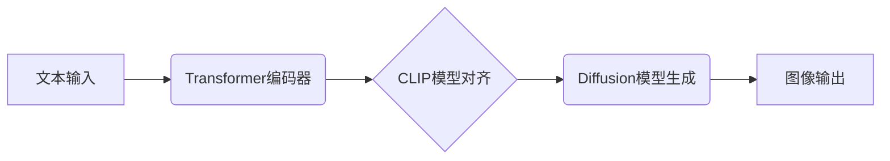

> DALL-E，文本到图像生成，深度学习，Transformer，CLIP，Diffusion模型，图像生成，代码实例

## 1. 背景介绍

近年来，人工智能领域取得了令人瞩目的进展，其中文本到图像生成技术尤为引人注目。DALL-E，由OpenAI开发的文本到图像生成模型，凭借其强大的生成能力和令人惊叹的视觉效果，迅速成为该领域的研究热点和应用焦点。DALL-E能够根据用户提供的文本描述生成逼真的图像，甚至可以根据复杂的指令生成具有特定风格和场景的图像。

DALL-E的出现，标志着人工智能技术迈向了一个新的里程碑，它不仅为艺术创作、设计领域带来了新的可能性，也为科学研究、教育教学等领域提供了全新的工具和资源。

## 2. 核心概念与联系

DALL-E的文本到图像生成过程，本质上是将文本信息映射到图像空间的过程。它融合了自然语言处理和计算机视觉领域的最新成果，主要依赖于以下核心概念：

* **Transformer模型**: Transformer模型是一种强大的深度学习架构，能够有效地处理序列数据，例如文本和图像。DALL-E采用了Transformer模型作为其文本编码器，能够准确地理解文本描述中的语义和结构。
* **CLIP模型**: CLIP（Contrastive Language-Image Pre-training）是一个预训练的文本-图像对齐模型，能够学习文本和图像之间的语义关联。DALL-E利用CLIP模型来指导图像生成的步骤，确保生成的图像与文本描述相符。
* **Diffusion模型**: Diffusion模型是一种生成模型，通过逐步添加噪声到图像中，然后学习逆向过程，从噪声中生成图像。DALL-E采用了Diffusion模型作为其图像生成器，能够生成高质量、逼真的图像。

**Mermaid 流程图**

## 3. 核心算法原理 & 具体操作步骤

### 3.1  算法原理概述

DALL-E的文本到图像生成过程可以概括为以下步骤：

1. **文本编码**: 将用户输入的文本描述输入到Transformer编码器中，将其转换为一个向量表示，该向量包含文本描述的语义和结构信息。
2. **CLIP对齐**: 将文本编码后的向量与CLIP模型进行对齐，得到与文本描述相匹配的图像特征。
3. **Diffusion模型生成**: 将CLIP模型得到的图像特征作为输入，输入到Diffusion模型中，通过逐步去除噪声的过程，生成最终的图像。

### 3.2  算法步骤详解

1. **文本编码**: Transformer编码器将文本描述逐个词语地处理，并通过多层注意力机制学习文本之间的上下文关系，最终将文本描述转换为一个固定长度的向量表示。
2. **CLIP对齐**: CLIP模型通过预训练的方式，学习了文本和图像之间的语义关联。在DALL-E中，CLIP模型将文本编码后的向量与图像特征进行比较，找到与文本描述最相似的图像特征。
3. **Diffusion模型生成**: Diffusion模型通过以下步骤生成图像：
    * **前向过程**: 将一张真实图像逐步添加噪声，直到变成纯噪声。
    * **反向过程**: 从纯噪声开始，通过学习到的逆向过程，逐步去除噪声，最终生成一张逼真的图像。

### 3.3  算法优缺点

**优点**:

* **生成质量高**: DALL-E能够生成高质量、逼真的图像，能够满足各种应用场景的需求。
* **文本理解能力强**: DALL-E采用了Transformer模型，能够准确地理解文本描述中的语义和结构信息。
* **可控性强**: DALL-E能够根据用户提供的指令生成具有特定风格和场景的图像。

**缺点**:

* **计算资源消耗大**: DALL-E的训练和推理过程都需要大量的计算资源。
* **生成速度慢**: DALL-E的生成速度相对较慢，尤其是在生成高分辨率图像时。
* **存在偏差**: DALL-E的训练数据可能存在偏差，导致生成的图像也存在偏差。

### 3.4  算法应用领域

DALL-E的文本到图像生成能力，在以下领域具有广泛的应用前景：

* **艺术创作**: DALL-E可以帮助艺术家快速生成创意构思，并探索新的艺术风格。
* **设计领域**: DALL-E可以帮助设计师快速生成产品原型，并进行视觉设计。
* **教育教学**: DALL-E可以帮助学生更好地理解文本内容，并激发他们的创造力。
* **科学研究**: DALL-E可以帮助科学家生成实验数据，并进行图像分析。

## 4. 数学模型和公式 & 详细讲解 & 举例说明

### 4.1  数学模型构建

DALL-E的数学模型主要包括以下几个部分：

* **Transformer编码器**: Transformer编码器采用多层注意力机制，将文本描述转换为一个向量表示。其数学模型基于矩阵运算和线性变换。
* **CLIP模型**: CLIP模型采用对比学习的方式，学习文本和图像之间的语义关联。其数学模型基于交叉熵损失函数和正负样本对的对比。
* **Diffusion模型**: Diffusion模型采用概率分布的方式，描述图像的生成过程。其数学模型基于马尔可夫链和概率密度函数。

### 4.2  公式推导过程

由于篇幅限制，这里只列举一些关键公式，并进行简要的解释：

* **Transformer注意力机制**:

$$
Attention(Q, K, V) = \frac{exp(Q \cdot K^T / \sqrt{d_k})}{exp(Q \cdot K^T / \sqrt{d_k})} \cdot V
$$

其中，Q、K、V分别代表查询矩阵、键矩阵和值矩阵，$d_k$代表键向量的维度。注意力机制能够学习文本中不同词语之间的关系，并赋予每个词语不同的权重。

* **CLIP对比损失**:

$$
L = -\log \frac{exp(s_t \cdot s_i)}{exp(s_t \cdot s_i) + \sum_{j \neq i} exp(s_t \cdot s_j)}
$$

其中，$s_t$代表文本编码后的向量，$s_i$代表图像特征向量。CLIP模型通过对比正负样本对，学习文本和图像之间的语义关联。

### 4.3  案例分析与讲解

假设用户输入文本描述“一只戴着眼镜的猫在玩钢琴”。DALL-E将首先将文本描述编码为一个向量表示，然后利用CLIP模型找到与文本描述相匹配的图像特征。最后，Diffusion模型将这些图像特征作为输入，生成一张一只戴着眼镜的猫在玩钢琴的图像。

## 5. 项目实践：代码实例和详细解释说明

### 5.1  开发环境搭建

DALL-E的开发环境需要满足以下条件：

* **操作系统**: Linux、macOS或Windows
* **CPU**: 多核CPU
* **GPU**: 支持CUDA的GPU
* **软件**: Python 3.7+、PyTorch 1.7+、transformers 4.0+

### 5.2  源代码详细实现

由于DALL-E是一个大型模型，其源代码公开发布。开发者可以从OpenAI的官方网站下载DALL-E的源代码，并根据自己的需求进行修改和部署。

### 5.3  代码解读与分析

DALL-E的源代码主要包含以下几个部分：

* **文本编码器**: Transformer编码器的实现代码，负责将文本描述转换为向量表示。
* **CLIP模型**: CLIP模型的实现代码，负责学习文本和图像之间的语义关联。
* **Diffusion模型**: Diffusion模型的实现代码，负责生成图像。

### 5.4  运行结果展示

运行DALL-E的代码，可以根据用户提供的文本描述生成逼真的图像。

## 6. 实际应用场景

### 6.1  艺术创作

DALL-E可以帮助艺术家快速生成创意构思，并探索新的艺术风格。例如，艺术家可以使用DALL-E生成一系列具有不同风格的肖像画，或者生成抽象艺术作品。

### 6.2  设计领域

DALL-E可以帮助设计师快速生成产品原型，并进行视觉设计。例如，设计师可以使用DALL-E生成不同形状和颜色的手机壳设计，或者生成家具的3D模型。

### 6.3  教育教学

DALL-E可以帮助学生更好地理解文本内容，并激发他们的创造力。例如，老师可以使用DALL-E生成与课本内容相关的图像，帮助学生更好地理解概念。

### 6.4  未来应用展望

DALL-E的文本到图像生成能力，在未来将有更广泛的应用前景，例如：

* **虚拟现实和增强现实**: DALL-E可以生成逼真的虚拟场景和增强现实内容，为用户提供更沉浸式的体验。
* **游戏开发**: DALL-E可以帮助游戏开发者生成游戏场景、角色和道具，提高游戏开发效率。
* **医学诊断**: DALL-E可以帮助医生生成医学图像，辅助诊断疾病。

## 7. 工具和资源推荐

### 7.1  学习资源推荐

* **OpenAI官方文档**: https://openai.com/blog/dall-e/
* **DALL-E GitHub仓库**: https://github.com/openai/dall-e
* **Transformer模型论文**: https://arxiv.org/abs/1706.03762
* **CLIP模型论文**: https://arxiv.org/abs/2103.00020

### 7.2  开发工具推荐

* **Python**: https://www.python.org/
* **PyTorch**: https://pytorch.org/
* **transformers**: https://huggingface.co/transformers/

### 7.3  相关论文推荐

* **DALL-E论文**: https://arxiv.org/abs/2102.12092
* **Diffusion模型论文**: https://arxiv.org/abs/2006.11239

## 8. 总结：未来发展趋势与挑战

### 8.1  研究成果总结

DALL-E的出现，标志着文本到图像生成技术取得了重大突破，其强大的生成能力和可控性，为人工智能领域带来了新的可能性。

### 8.2  未来发展趋势

未来，文本到图像生成技术将朝着以下方向发展：

* **生成质量提升**: 研究者将继续探索新的算法和模型，以提高图像生成质量和逼真度。
* **多模态生成**: 将文本到图像生成技术与其他模态，例如音频和视频，相结合，实现多模态生成。
* **个性化生成**: 研究者将探索如何根据用户的个人喜好和风格，生成个性化的图像。

### 8.3  面临的挑战

文本到图像生成技术也面临着一些挑战：

* **数据偏见**: 训练数据可能存在偏见，导致生成的图像也存在偏见。
* **伦理问题**: 文本到图像生成技术可能被用于生成虚假信息或进行恶意攻击，需要认真考虑其伦理问题。
* **计算资源消耗**: 训练和推理大型生成模型需要大量的计算资源，成本较高。

### 8.4  研究展望

未来，研究者将继续探索文本到图像生成技术的潜力，并致力于解决其面临的挑战，推动该技术朝着更安全、更可靠、更智能的方向发展。

## 9. 附录：常见问题与解答

**Q1: DALL-E的训练数据是什么？**

A1: DALL-E的训练数据包括大量的文本-图像对，这些数据来自互联网、书籍、杂志等多种来源。

**Q2: DALL-E可以生成任何类型的图像吗？**

A2: DALL-E可以生成各种类型的图像，但其生成能力受限于其训练数据。如果训练数据中没有包含某个类型的图像，DALL-E就无法生成该类型的图像。

**Q3: 如何使用DALL-E？**

A3: DALL-E可以通过OpenAI的API