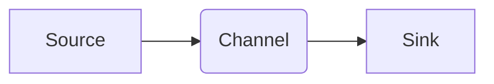

> Flume, Channel, 数据流, 缓冲, 存储, 性能优化, 代码实例

## 1. 背景介绍

Apache Flume是一个分布式、可靠的日志收集和传输工具，广泛应用于大数据平台的日志收集和数据传输环节。Flume系统由三个核心组件组成：**Source、Channel和Sink**。其中，Channel作为Flume数据流的中间环节，负责接收Source发送的数据并将其存储，等待Sink进行消费。

Flume Channel的类型多种多样，每种类型都有其独特的特点和适用场景。本文将深入探讨Flume Channel的原理和工作机制，并通过代码实例讲解Channel的具体实现和应用。

## 2. 核心概念与联系

Flume Channel的本质是一个数据缓冲区，它负责接收数据并将其存储，直到Sink能够消费这些数据。Channel与Source和Sink之间形成一个数据流的闭环，数据从Source产生，通过Channel传输，最终被Sink消费。

**Flume Channel架构图:**



**核心概念:**

* **Source:** 数据源，负责从各种数据源（例如文件、网络流等）收集数据。
* **Channel:** 数据缓冲区，负责接收数据并将其存储，直到Sink能够消费这些数据。
* **Sink:** 数据目的地，负责将Channel中的数据传输到最终存储位置（例如HDFS、Kafka等）。

## 3. 核心算法原理 & 具体操作步骤

### 3.1  算法原理概述

Flume Channel的实现基于先进先出（FIFO）的队列数据结构。数据从Channel的尾部添加，从头部读取，保证数据的顺序性和可靠性。

### 3.2  算法步骤详解

1. **数据写入Channel:** Source将收集到的数据发送到Channel。Channel会将数据添加到其尾部，形成一个FIFO队列。
2. **数据读取Channel:** Sink从Channel的头部读取数据，并将其消费。
3. **数据存储:** Channel会将数据存储在内存或磁盘中，根据Channel的类型和配置决定存储方式。
4. **数据传输:** Sink将从Channel读取的数据传输到最终存储位置。

### 3.3  算法优缺点

**优点:**

* **简单易懂:** FIFO队列的实现原理简单易懂，易于理解和维护。
* **可靠性高:** 数据按照顺序存储和读取，保证数据的完整性和可靠性。
* **可扩展性强:** 可以通过增加Channel的数量来提高吞吐量。

**缺点:**

* **内存占用:** 如果Channel存储大量数据，可能会占用较多的内存资源。
* **性能瓶颈:** 如果Sink的消费速度较慢，可能会导致Channel积压数据，影响性能。

### 3.4  算法应用领域

Flume Channel的FIFO队列算法广泛应用于各种数据流处理场景，例如：

* **日志收集:** 收集来自各种服务器和应用程序的日志数据。
* **数据传输:** 将数据从一个系统传输到另一个系统。
* **数据缓存:** 缓存数据，提高数据访问速度。

## 4. 数学模型和公式 & 详细讲解 & 举例说明

### 4.1  数学模型构建

Flume Channel的容量可以表示为一个整数 `C`，表示Channel可以存储的最大数据量。数据写入Channel的速率可以表示为一个实数 `R`，单位为数据量/时间。数据从Channel读取的速率可以表示为一个实数 `S`，单位为数据量/时间。

### 4.2  公式推导过程

Channel的当前数据量 `D` 可以通过以下公式计算：

$$D = D_{prev} + R \Delta t - S \Delta t$$

其中：

* `D_{prev}` 是Channel上一次的时间点的数据量。
* `R` 是数据写入Channel的速率。
* `S` 是数据从Channel读取的速率。
* `\Delta t` 是时间间隔。

### 4.3  案例分析与讲解

假设Flume Channel的容量为 `C = 1000` 个数据，数据写入Channel的速率为 `R = 100` 个数据/秒，数据从Channel读取的速率为 `S = 50` 个数据/秒。

如果时间间隔为 `\Delta t = 1` 秒，则Channel的当前数据量 `D` 可以计算为：

$$D = D_{prev} + 100 - 50$$

如果 `D_{prev} = 500`，则Channel的当前数据量为 `D = 550` 个数据。

## 5. 项目实践：代码实例和详细解释说明

### 5.1  开发环境搭建

* Java Development Kit (JDK) 8 或更高版本
* Apache Flume 1.9.0 或更高版本
* Maven 或 Gradle 构建工具

### 5.2  源代码详细实现

```java
import org.apache.flume.Channel;
import org.apache.flume.Context;
import org.apache.flume.Event;
import org.apache.flume.EventDeliveryException;
import org.apache.flume.Transaction;
import org.apache.flume.channel.MemoryChannel;

public class MyChannel extends MemoryChannel {

    public MyChannel(Context context) {
        super(context);
    }

    @Override
    public void put(Event event) throws EventDeliveryException {
        // 在这里添加自定义的逻辑，例如对事件进行处理或记录
        super.put(event);
    }

    @Override
    public Transaction begin() {
        // 在这里添加自定义的逻辑，例如事务管理
        return super.begin();
    }
}
```

### 5.3  代码解读与分析

* `MyChannel` 类继承自 `MemoryChannel`，实现自定义的Channel。
* `put()` 方法在将事件写入Channel之前添加自定义逻辑。
* `begin()` 方法在开始事务之前添加自定义逻辑。

### 5.4  运行结果展示

运行 Flume 应用，观察数据流经自定义 Channel 的过程。

## 6. 实际应用场景

Flume Channel在各种实际应用场景中发挥着重要作用，例如：

* **日志收集系统:** Flume可以收集来自各种服务器和应用程序的日志数据，并将数据存储在HDFS或其他存储系统中。
* **数据传输系统:** Flume可以将数据从一个系统传输到另一个系统，例如将数据从数据库传输到数据仓库。
* **实时数据处理系统:** Flume可以将实时数据流传输到Spark Streaming或其他实时数据处理引擎。

### 6.4  未来应用展望

随着大数据和云计算技术的不断发展，Flume Channel的应用场景将会更加广泛。例如：

* **微服务架构:** Flume可以用于微服务之间的消息传递和数据同步。
* **物联网:** Flume可以用于收集和处理来自物联网设备的数据。
* **边缘计算:** Flume可以用于边缘计算节点的数据收集和传输。

## 7. 工具和资源推荐

### 7.1  学习资源推荐

* Apache Flume 官方文档: https://flume.apache.org/
* Flume 入门教程: https://www.tutorialspoint.com/flume/index.htm

### 7.2  开发工具推荐

* Maven: https://maven.apache.org/
* Gradle: https://gradle.org/

### 7.3  相关论文推荐

* Flume: A Distributed, Reliable, and Available Service for Aggregating Log Data
* Building a Real-Time Data Pipeline with Apache Flume

## 8. 总结：未来发展趋势与挑战

### 8.1  研究成果总结

Flume Channel作为Flume系统的重要组成部分，其FIFO队列算法的实现原理简单易懂，可靠性高，可扩展性强，在数据流处理领域具有广泛的应用场景。

### 8.2  未来发展趋势

未来，Flume Channel将会朝着以下方向发展：

* **更强大的数据处理能力:** 支持更复杂的事件处理逻辑和数据转换功能。
* **更高的性能和吞吐量:** 通过优化算法和数据结构，提高Channel的性能和吞吐量。
* **更完善的监控和管理功能:** 提供更丰富的监控指标和管理工具，方便用户管理和维护Channel。

### 8.3  面临的挑战

Flume Channel也面临着一些挑战，例如：

* **内存占用:** 如果Channel存储大量数据，可能会占用较多的内存资源。
* **性能瓶颈:** 如果Sink的消费速度较慢，可能会导致Channel积压数据，影响性能。
* **数据一致性:** 在分布式环境下，保证Channel数据的原子性和一致性是一个挑战。

### 8.4  研究展望

未来，研究人员将继续探索新的算法和技术，以解决Flume Channel面临的挑战，提高其性能、可靠性和安全性，使其更好地满足大数据时代的数据流处理需求。

## 9. 附录：常见问题与解答

* **Flume Channel的类型有哪些？**

Flume提供多种类型的Channel，例如MemoryChannel、FileChannel、KafkaChannel等。

* **如何配置Flume Channel？**

可以通过Flume的配置文件来配置Channel的属性，例如容量、数据存储方式等。

* **如何监控Flume Channel的性能？**

可以通过Flume的监控工具来监控Channel的性能指标，例如数据吞吐量、延迟等。


作者：禅与计算机程序设计艺术 / Zen and the Art of Computer Programming 
<end_of_turn>